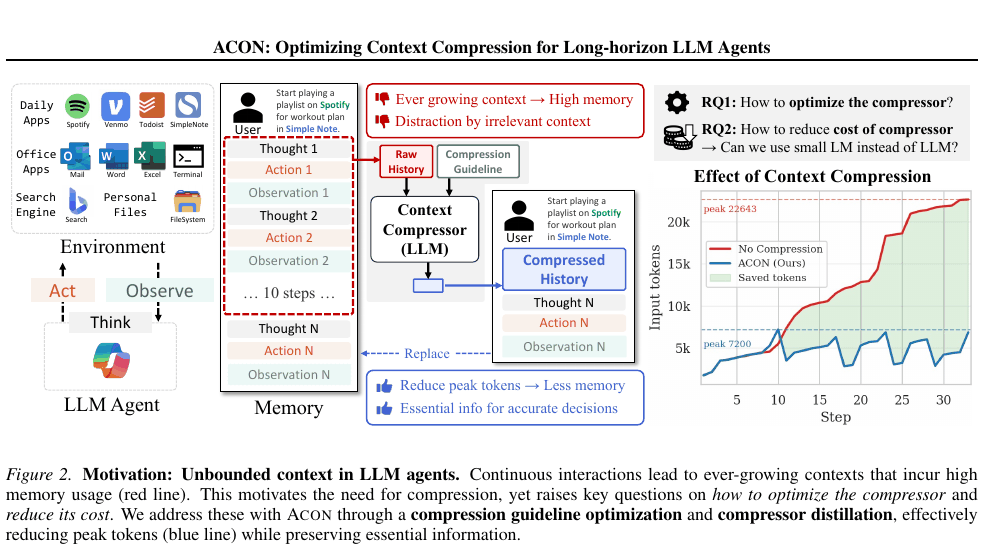
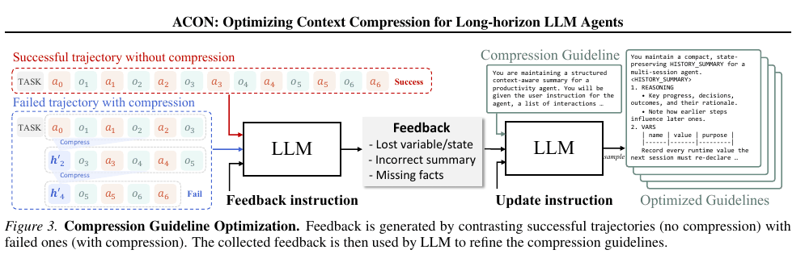
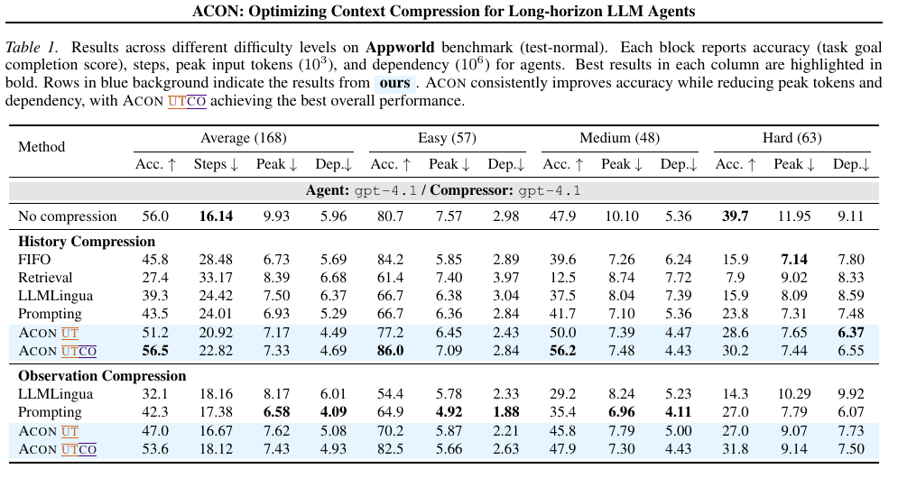
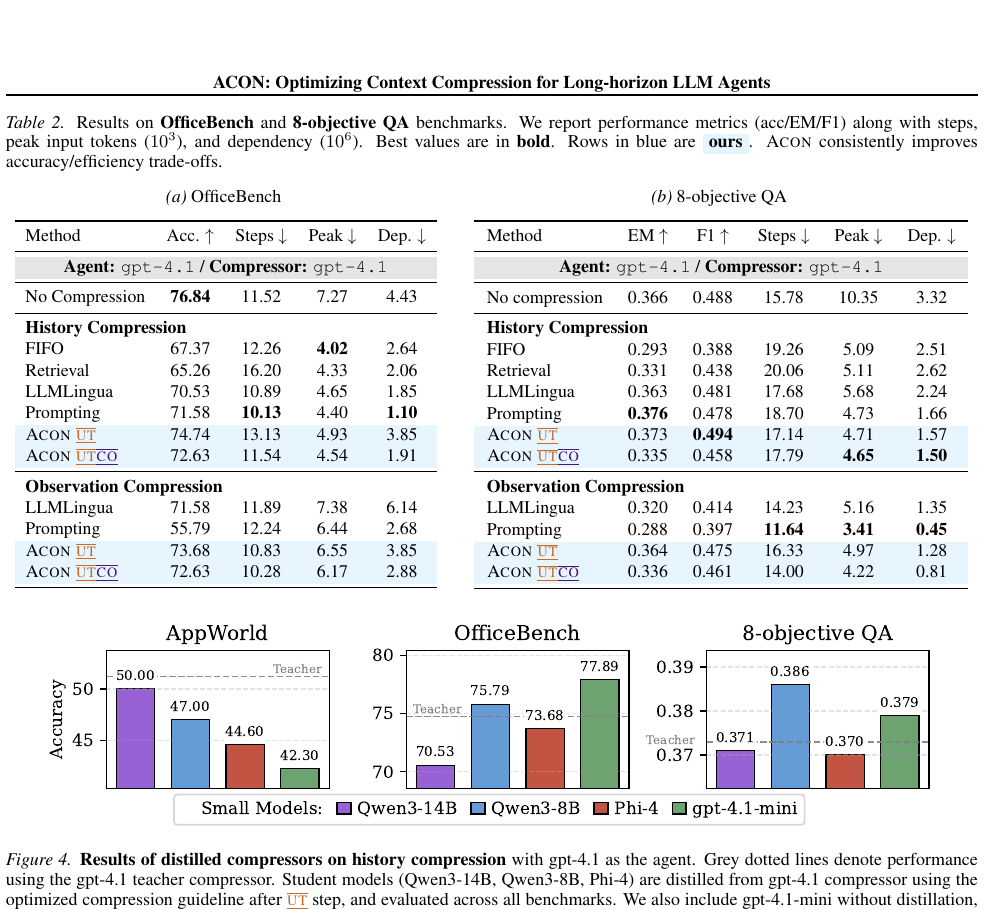

# ACON: Optimizing Context Compression for Long-horizon LLM Agents 论文解读

## 论文基本信息

| 字段 | 内容 |
| --- | --- |
| 论文 | ACON: Optimizing Context Compression for Long-horizon LLM Agents |
| 作者 | Minki Kang, Wei-Ning Chen, Dongge Han, Huseyin A. Inan, Lukas Wutschitz, Yanzhi Chen, Robert Sim, Saravan Rajmohan |
| 机构 | KAIST；Microsoft；University of Cambridge |
| 发布时间 | 2025-10-01；arXiv v3 修订于 2026-06-01 |
| Venue | ICML 2026 |
| 论文链接 | https://arxiv.org/abs/2510.00615 |
| 代码链接 | https://github.com/microsoft/acon |

## TL;DR

长程 LLM agent 的上下文会随着 Thought、Action、工具 Observation 不断增长。直接保留完整历史会抬高 KV cache 与推理成本，还会让模型被过时信息干扰；FIFO、检索、通用摘要等固定策略虽然省 token，却容易丢掉路径、参数、状态变化和因果关系。ACON 的核心判断是：agent context 不是普通文档，而是环境状态的近似 world model，因此压缩规则必须针对任务环境优化。

ACON 不更新 agent 权重，而是在自然语言空间里优化 compressor guideline。它对比“无压缩成功、压缩后失败”的轨迹，让一个 optimizer LLM 找出被压缩掉的关键变量、事实或状态，再更新压缩提示；随后可增加一个 compression maximization 阶段，在成功轨迹上进一步删去未被使用的信息。最后，作者用 LoRA 将优化后的大压缩器蒸馏到 Qwen3-14B、Qwen3-8B、Phi-4 等小模型，以减少额外调用成本。

在 AppWorld、OfficeBench 和 8-objective QA 上，ACON 相对 FIFO、Retrieval、LLMLingua 和通用 prompting 给出更好的准确率—成本折中。论文报告峰值 token 降低 26–54%；在 AppWorld 上，历史压缩的 ACON UTCO 以 7.33K peak tokens 达到 56.5% accuracy，而无压缩为 9.93K、56.0%。但它不是“无代价压缩”：生成式 compressor 会增加延迟，历史重写还可能让 KV cache 失效；高保真任务上过度压缩也会损伤准确率。

## 论文脑图

```markmap
# ACON

## 问题

### 长程 agent 历史无界增长

### KV cache 成本与上下文干扰

### 通用压缩会丢环境状态

## 方法

### 历史压缩与 Observation 压缩

### UT：失败对比驱动的 guideline 优化

### CO：成功轨迹驱动的进一步压缩

### 将优化压缩器蒸馏到小模型

## 实验

### AppWorld：168 个 test-normal 任务

### OfficeBench：95 个文本任务

### 8-objective QA：100 个测试任务

### 指标：准确率、步数、Peak Tokens、Dependency

## 结论

### 峰值 token 降低 26–54%

### 小 agent 的上下文干扰显著缓解

### 压缩规则可以在自然语言空间优化

## 局限

### 主要验证 GPT 系列 agent

### 生成式压缩增加延迟并破坏 KV cache 复用

### 自然语言优化没有形式化收敛保证

## 复现要点

### 固定 agent，仅替换 context policy

### 一轮 UT + 一轮 CO，各采样 5 个候选 guideline

### History / Observation 使用不同阈值

### LoRA rank 16，单张 A100 80GB
```

## 研究背景与问题定义

### 为什么 agent context 不能按普通长文档处理

普通长文档压缩常假设信息价值相对稳定，或者被读取一次后即可丢弃。长程 agent 轨迹却持续改变环境状态：一次 API 调用可能创建草稿、改变余额、生成文件路径，也可能暴露后续行动的前置条件。某段 Observation 当下看似冗余，数十步后却可能成为决定下一次工具参数的唯一依据。

作者把任务写成 POMDP。固定 agent 模型为 $M$，第 $t$ 步根据最新 Observation $o_t$ 与历史 $h_{t-1}$ 生成动作 $a_t$。动态 context 的总代价写为：

$$
C(H)=\sum_{t=1}^{T} C(h_{t-1}, o_t).
$$

这里的关键不是某一次 prompt 有多长，而是整条轨迹每一步都要重新依赖逐渐增长的上下文。论文因此同时报告 Peak Tokens，以及近似累计生成计算量的 Dependency 指标。



原文 Figure 2 把 agent、环境、Memory 与 compressor 放进同一条 loop：ACON 用压缩历史替换原始历史，使峰值输入从示例中的 22,643 降至 7,200 tokens。图的右上角也明确了论文的两个问题：如何优化 compressor，以及能否用小模型降低 compressor 自身成本。

### 历史压缩与 Observation 压缩

ACON 在 harness 层提供两种触发点。

- 历史压缩：当 $|h_t| > T_{hist}$ 时，compressor 将累积历史改写为短历史 $h'_t$，否则保持原历史。
- Observation 压缩：当最新工具结果 $|o_t| > T_{obs}$ 时，compressor 根据 $o_t$ 和已有历史生成 $o'_t$，并用它替换原始工具结果。

这种条件触发避免每一步都承担额外压缩调用，但也暴露出核心难题：LLM compressor 只能根据通用先验判断“什么重要”，无法保证保留某个环境中真正决定任务成败的状态。

论文把目标写成 reward 与 context cost 的权衡：

$$
\max_{\psi}\; \mathbb{E}[R(s_T(\psi))] - \lambda\,\mathbb{E}[C(H'(\psi))],
$$

其中 $\psi=(\phi, P)$ 包含 compressor 模型参数 $\phi$ 和自然语言 guideline $P$。ACON 固定模型参数，主要优化 $P$，从而绕开 proprietary API 模型无法做梯度更新的问题。

## 核心方法

### 第一步：用任务成败构造“自然语言梯度”

在训练集上，作者分别运行无压缩 agent 和带压缩 agent。若某个任务在完整 context 下成功、在压缩 context 下失败，就把它加入 contrastive subset。optimizer LLM 同时看到压缩前后的轨迹，分析失败是否来自变量丢失、错误摘要、状态遗漏或因果关系破坏，并输出自然语言反馈。

与只给一个二值 reward 相比，这种轨迹对比更接近可操作的 error analysis：它不只说“压缩错了”，还指出 guideline 应该额外保存哪类信息。



原文 Figure 3 展示了 UT 阶段的闭环。无压缩成功轨迹充当参照，压缩失败轨迹暴露信息损失；多个任务的反馈被聚合后，optimizer LLM 更新 guideline，并生成多份候选提示供实际 rollout 选择。

### 第二步：UT 与 CO 交替优化效用和压缩率

作者把 guideline 优化分为两个子步骤：

1. Utility maximization（UT）：聚合 contrastive failures，优先修复任务成功率。更新时采样 5 个候选 guideline，在训练子集上选择表现最佳者。
2. Compression maximization（CO）：只看压缩后仍成功的轨迹，询问哪些信息实际上没有被使用，再进一步缩短 context。

UT 对应优先增大目标中的 reward 项；CO 对应继续减小 context cost。主实验只做一轮 UT 和一轮 CO。这个设计简单，但也意味着 UTCO 并不总比 UT 更准：在 AppWorld 这类 API 输出冗余、噪声较多的环境中，CO 可能同时提升聚焦度和效率；在 OfficeBench、8-objective QA 这类事实保真度更重要的任务中，UT 往往更稳。

### 第三步：把压缩能力蒸馏到小模型

优化过的 gpt-4.1 compressor 充当 teacher，生成 history 或 Observation 的压缩目标；student 在这些 input-output pairs 上做交叉熵训练。论文使用 LoRA，rank 16、$\alpha=32$、学习率 $10^{-4}$、3 epochs、batch size 4、最大序列长度 10,000，并在一张 A100 80GB 上训练和推理。

这一步把“选择哪些信息保留”与“用多大模型执行压缩”解耦：昂贵模型负责离线发现 guideline 和生成监督数据，线上则由较小模型遵循同一 guideline。

### 从 harness 视角理解 ACON

ACON 的创新位置不在 agent policy 本体，而在上下文装配层：

- 监控 history 与最新 Observation 的 token 长度；
- 到阈值时调用不同 compressor；
- 以压缩结果替换原始 context；
- 用离线任务回放持续优化压缩 guideline；
- 在需要时将 compressor 下沉到本地小模型。

这使它可以包在 ReAct 或其他 agent loop 外部，对 proprietary agent LLM 也适用。不过，ACON 的压缩是有损改写，不提供原始 payload 的 handle 或按需恢复机制；一旦 compressor 删除了关键精确值，后续 agent 无法从压缩摘要中复原。

## 实验设置与主要结果

### Benchmark、数据划分与指标

论文选择三类平均需要 10 步以上交互的任务：

| Benchmark | 场景 | 训练 / 测试 | 主要指标 |
| --- | --- | --- | --- |
| AppWorld | 9 个模拟 app、457 个 API、约 100 个用户；平均每任务 42.5 次 API 调用 | 90 / 168 | task completion accuracy |
| OfficeBench | Word、Excel、Email、Shell 等跨应用办公任务；排除 OCR 任务 | 92 / 95 | accuracy |
| 8-objective QA | 一次任务同时回答 8 个 NaturalQuestions 问题，BM25 检索 2018 Wikipedia | 100 / 100 | EM、F1 |

效率指标包括平均交互步数、单步最大输入长度 Peak Tokens，以及累计依赖历史 token 的 Dependency。主实验使用 ReAct agent；gpt-4.1 同时作为 agent 和 teacher compressor。对比方法包括 No Compression、FIFO、embedding Retrieval、LLMLingua 和通用 Prompting。

### AppWorld：压缩后达到无压缩准确率，同时减少约 26% 峰值 token



原文 Table 1 显示，history compression 的 ACON UTCO 在 168 个任务上达到 56.5% accuracy，略高于 No Compression 的 56.0%，Peak Tokens 从 9.93K 降到 7.33K，降幅约 26.2%。同样做 history compression 时，通用 Prompting 只有 43.5%，FIFO 为 45.8%，说明差异不只是“有没有摘要”，而在于 guideline 是否用任务失败进行过环境特定优化。

难度分解也揭示了边界：ACON UTCO 在 Easy 和 Medium 上分别达到 86.0% 和 56.2%，但 Hard 为 30.2%，仍低于无压缩的 39.7%。平均分持平并不代表每个长任务都无损；越依赖早期精确状态，摘要错误的代价越大。

Observation compression 的 ACON UTCO 达到 53.6%，Peak Tokens 为 7.43K，显著优于 Observation Prompting 的 42.3%。这支持了作者的主张：同一套失败驱动优化可以同时改善历史摘要与原始工具输出压缩。

### OfficeBench 与 8-objective QA：UT 通常比 UTCO 更保真



原文 Table 2a 中，OfficeBench 无压缩 accuracy 为 76.84%、Peak 为 7.27K。History ACON UT 达到 74.74%、4.93K，Peak 降约 32.2%；UTCO 进一步降到 4.54K，但 accuracy 也降到 72.63%。这正是“事实保真优先时使用 UT”的依据。

在 8-objective QA 上，History ACON UT 的 F1 为 0.494，高于无压缩的 0.488，Peak 从 10.35K 降至 4.71K，降低 54.5%；Dependency 从 3.32M 降到 1.57M。UTCO 的 Peak 更低，为 4.65K，但 EM/F1 下降到 0.335/0.458。压缩率继续提高时，多个问题所需的分散事实更容易被误删。

### 蒸馏：小 compressor 保留大部分 teacher 能力

Figure 4 对比了 Qwen3-14B、Qwen3-8B、Phi-4 和未蒸馏的 gpt-4.1-mini compressor。作者报告 distilled compressor 保留超过 95% 的 teacher performance。更重要的是，Qwen3-14B agent 本身也受益于更短、更聚焦的 context：AppWorld accuracy 从 25.6% 升至 33.9%，相对提升 32.4%；8-objective QA 的 EM 从 0.158 升至 0.23，相对提升 45.6%。这表明压缩不仅省显存，还可能直接减轻小模型的 context distraction。

### 阈值、成本与延迟

AppWorld 的消融推荐 history threshold 4,096、Observation threshold 1,024。阈值太小会频繁调用 compressor，并因过度压缩降低准确率；阈值太大则无法显著削减峰值 context。其他任务采用不同阈值：8-objective QA 的 history threshold 为 2,048，OfficeBench / 8-objective QA 的 Observation threshold 分别为 512 / 400。

成本分析中，gpt-4.1 compressor 每例约 $0.045，gpt-4.1-mini 为 $0.014，distilled Qwen3-14B 约 $0.0004，相对 teacher 降低 99.1%。但端到端 wall-clock latency 会变差：AppWorld 上本地 Qwen3-14B agent + compressor 的 history compression 中位延迟为 87.68 秒，无压缩为 73.24 秒；Observation compression 为 101.92 秒。省 token 不等于更低时延。

## 当前工作 vs Related Work

| 方法 | 核心思路 | 主要假设 | 证据/表现 | 局限或代价 |
| --- | --- | --- | --- | --- |
| ACON | 通过失败对比优化自然语言 guideline，同时压缩 history 与 Observation，再蒸馏 compressor | 环境特定的信息保留规则可从成功 / 失败轨迹归纳 | AppWorld ACON UTCO 56.5%、7.33K Peak；8-objective QA ACON UT 0.494 F1、4.71K Peak | 有损摘要不可恢复；额外调用增加延迟；自然语言优化无收敛保证 |
| FIFO / observation clearing | 只保留最近若干轮或删除旧工具结果 | 新信息通常比旧信息重要 | AppWorld FIFO Peak 6.73K | 会删除早期仍然关键的变量和状态，Hard accuracy 仅 15.9% |
| Embedding Retrieval | 按当前 query 检索历史交互 | 语义相似度能代表未来决策价值 | AppWorld Peak 8.39K | 状态依赖和因果链不一定与当前 query 表面相似；AppWorld accuracy 27.4% |
| LLMLingua | 用 encoder-based 方法做抽取式 token 压缩 | token 级显著性足以保存任务状态 | 多数场景比 FIFO 更保真 | 不直接利用任务成败优化环境规则；AppWorld history accuracy 39.3% |
| Naive LLM Prompting | 用通用提示让 LLM 摘要历史或 Observation | 强 LLM 的通用先验足够判断重要性 | 实现简单，适配 API agent | 缺少失败反馈；AppWorld history accuracy 43.5% |
| Context-as-action / RL 方法 | 让 agent policy 学习何时、如何压缩 | 可访问权重并负担大量环境 rollout | 能联合学习 reasoning 与 compression | 与 agent 权重耦合，不易直接用于 proprietary API 模型 |
| ReSum | 用总结延长 search agent horizon，并训练 policy 利用摘要 | agent 可通过训练适应总结后的 context | 适合长程搜索 | 优化的是 policy 对摘要的使用；ACON 则固定 agent、优化 compressor |

## 启发、局限与可复现要点

- 启发：压缩策略应由真实任务 failure 驱动。静态“保留最近信息”“保留看起来重要的实体”很难覆盖不同环境的状态语义。
- 启发：history 和 Observation 应使用不同 guideline 与阈值。历史要保留因果链和已完成进度，Observation 更关注去除 API 模板、冗余字段与无关列表项。
- 启发：context compression 不只是资源优化，也是一种 attention shaping。对小模型而言，删除干扰信息可能比提供更大窗口更有价值。
- 局限：实验主要围绕 GPT 系列 agent；对 Claude、Gemini 和更大开源模型的跨模型泛化仍缺少系统验证。
- 局限：自然语言空间的 prompt optimization 没有形式化收敛保证。多候选选择能降低波动，但不能保证找到全局最优 guideline。
- 局限：三个 benchmark 仍是受控环境，尚未证明在随机失败、权限变化、多 agent 协作和真实企业数据中同样稳定。
- 局限：history compression 会使已有 KV cache 失效并触发重算；生成式 Observation compressor 虽可在入 cache 前缩短内容，仍会增加一次模型推理。
- 局限：蒸馏数据每个 domain 约 100 个例子，且只采样一个 teacher generation，student 与 teacher 之间仍有性能差距。
- 复现要点：保持 agent、工具、prompt assembly、任务划分和评分器不变，只替换 context policy；否则无法判断提升来自压缩还是 agent 能力变化。
- 复现要点：UT 只使用“无压缩成功、压缩失败”的任务，CO 只使用压缩后成功的任务；两类 feedback 不应混用。
- 复现要点：先复现 UT，再决定是否加入 CO。事实密集型任务应单独验证 CO 是否带来不可接受的准确率损失。
- 可能的下一步实验：将压缩摘要与无损 archive handle 结合，让 agent 在需要精确路径、ID、表格行时恢复原 Observation。
- 可能的下一步实验：把 guideline 优化接入线上 failure taxonomy，区分 state loss、entity loss、causal loss 和 stale-state hallucination，并按类型回归测试。

## 再读一遍路线

第一遍先读 Figure 2、Figure 3 和 Equation 7。Figure 2 解释工程动机，Figure 3 解释失败对比如何转成 guideline 更新，Equation 7 则把成功率与 context cost 放进同一目标。

第二遍读 §3.2–§3.4，重点区分 history compression、Observation compression、UT、CO 和 distillation。不要把 ACON 简化成“一个更好的摘要 prompt”：真正的方法是一套离线 rollout、失败分析、候选选择和小模型部署流程。

第三遍读 Table 1 和 Table 2，分别核对 Accuracy、Peak 和 Dependency。尤其看 AppWorld Hard、OfficeBench UT vs UTCO、8-objective QA UT vs UTCO，这些列最能说明有损压缩的收益与边界。

最后读 Appendix A、B.1–B.3。Appendix A 给出跨模型泛化、真实部署、收敛、蒸馏数据和 KV cache 的限制；B.3 提供阈值、候选数、LoRA 和硬件细节，是复现实验不可跳过的部分。

# 深度 Q&A

## Q1：ACON 与普通“让 LLM 总结历史”最本质的区别是什么？

普通 prompting 只给 compressor 一条人为编写的通用指令。ACON 把摘要 prompt 当作可优化参数，用真实 agent rollout 找出“完整 context 成功、压缩 context 失败”的任务，再从两条轨迹的差异中生成反馈。它优化的不是语言流畅度，而是压缩后 agent 是否还能完成环境任务。

## Q2：为什么需要同时压缩 history 和最新 Observation？

两者的增长模式不同。history 是多轮累积，包含动作、状态变化和已完成进度；Observation 可能单次就非常大，例如完整邮件列表、文件搜索结果或 API 返回。只压 history 无法阻止单个巨型 Observation 撑爆窗口，只压 Observation 又无法控制长期累积。

## Q3：UT 和 CO 为什么不能合成一步？

它们使用的训练信号不同。UT 从失败任务中恢复被误删的信息，优先保证 utility；CO 从成功任务中寻找没有真正用到的信息，继续提升 compression。分开做能更清楚地控制“先救回成功率，再减少冗余”的顺序，也允许高保真任务只部署 UT。

## Q4：为什么 AppWorld 上 UTCO 比 UT 好，OfficeBench 上却相反？

AppWorld 的 API Observation 包含较多模板化、重复和干扰字段，进一步删减可能让模型更聚焦。OfficeBench 和 8-objective QA 更依赖文件内容、表格值与分散事实，CO 更容易把尚未使用但最终需要的信息误判为冗余。Table 1/2 的差异说明 guideline 需要按环境验证，而不能全局套用。

## Q5：ACON 是否真的“优于无压缩”？

要按任务与指标回答。AppWorld history UTCO 的平均 accuracy 56.5%，略高于无压缩的 56.0%，同时 Peak 更低；8-objective QA history UT 的 F1 也略高于无压缩。但 OfficeBench 上最好 ACON 仍比无压缩低约 2 个百分点，AppWorld Hard 也有明显差距。因此更准确的结论是：ACON 显著优于其他压缩基线，并在部分场景接近或超过 full context。

## Q6：为什么压缩能让小 agent 反而更准？

小模型对长 context 中的干扰更敏感。完整历史不仅包含答案，也包含失败尝试、过时状态和大段无关工具输出。ACON 保留环境特定的关键状态，同时减少这些 distractors，使小模型把有限注意力集中在当前决策所需信息上。Qwen3-14B agent 在 AppWorld 和 8-objective QA 的相对提升分别为 32.4% 和 45.6%。

## Q7：蒸馏 compressor 会不会把 guideline 的作用混进模型权重，失去可解释性？

会部分发生。student 同时看到优化 guideline 和 teacher 输出，最终行为来自二者共同作用。好处是线上成本大幅下降；代价是 debug 时不能只检查 prompt，还要检查蒸馏数据覆盖和 student 的 imitation error。论文报告保留超过 95% teacher performance，但 Appendix A 也承认仍有 distillation gap。

## Q8：Peak Tokens 降低是否等于端到端成本和延迟都降低？

不等于。Peak Tokens 更接近最大 KV cache / 单步内存压力，Dependency 近似整条轨迹生成所依赖的累计 token；两者下降通常会降低 agent 主模型成本。但 compressor 是额外模型调用，生成式压缩还会增加 wall-clock latency，历史重写可能迫使 KV cache 重算。Table 4 中 ACON 的 API 成本下降，但本地中位延迟上升。

## Q9：ACON 最大的可靠性风险是什么？

有损且不可恢复。某个文件路径、API ID 或精确数字一旦没有进入摘要，后续就无法找回。失败驱动 guideline 能降低这种概率，却不能证明零遗漏。高风险部署更适合把 ACON 与外部 archive、stable handle 和按需 recovery 结合，而不是永久删除原 Observation。

## Q10：这套方法对 agent harness 的最直接落地建议是什么？

先把压缩做成独立、可回放的 context policy：记录每次压缩前后内容、触发阈值、guideline 版本、agent 结果和错误类型。用固定 benchmark 做 UT 式失败对比，先只上线 history 或 Observation 中风险较低的一侧。随后增加 shadow evaluation，确认 accuracy、Peak、Dependency、API 成本和 latency 的整体 Pareto 改善，再考虑蒸馏。

## Q11：为什么不直接用强化学习共同训练 agent 和 compressor？

RL 可以联合优化，但需要访问模型权重、进行大量昂贵环境 rollout，还会把 agent reasoning 与 compression policy 耦合。ACON 选择自然语言 prompt optimization，是为了让 API-only 的 proprietary LLM 也能使用，并用更少 rollout 获得可解释的失败反馈。代价是缺少数值优化那样的收敛理论。

## Q12：最值得补做的实验是什么？

一是对 Claude、Gemini 与大型开源 agent 做严格的跨模型迁移，检验同一 guideline 是否真的 model-agnostic；二是在代码、浏览器和企业办公 agent 中加入“有损摘要 + 无损恢复”混合策略，比较 ACON、纯 archive/retrieve 和二者结合的 Pareto frontier；三是构造专门测试精确值保留、过时状态更新和跨 50+ 步因果链的 adversarial benchmark。
