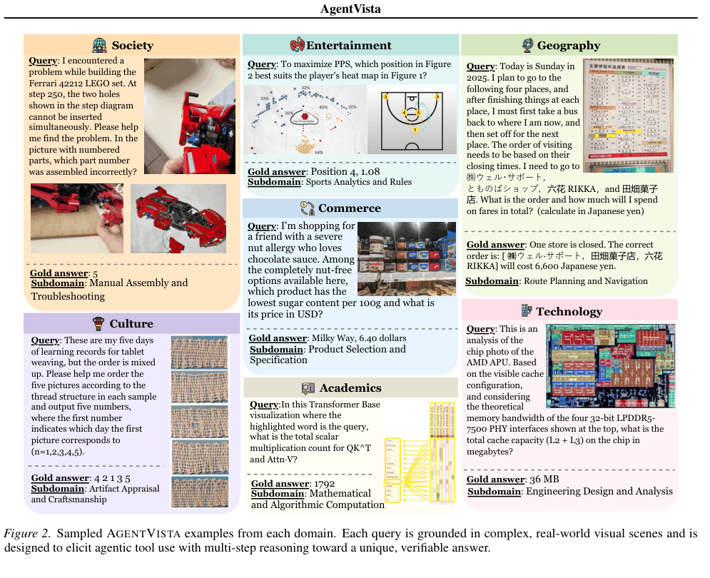
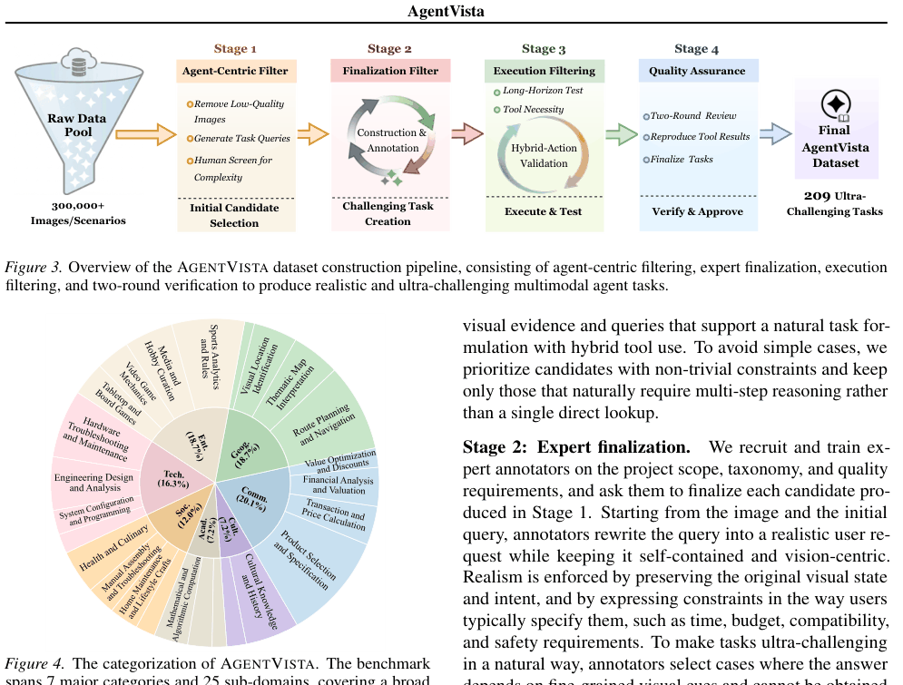
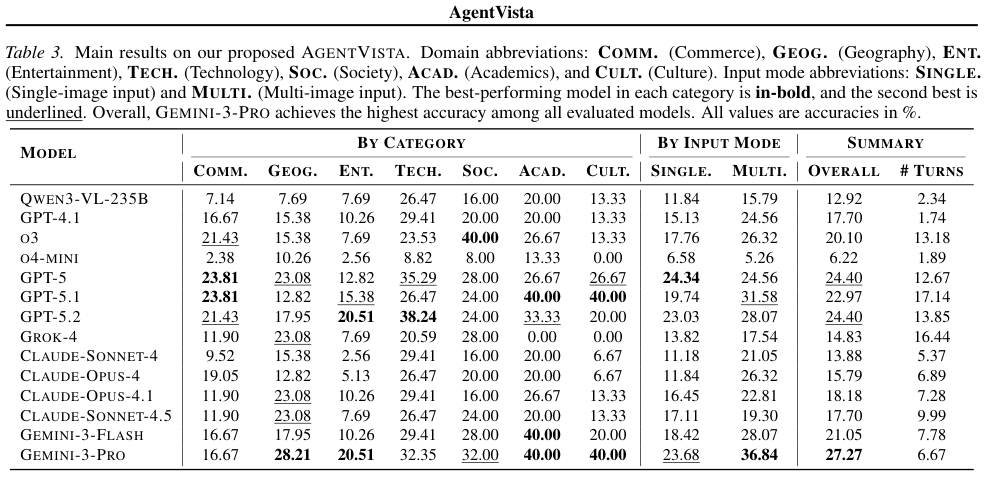
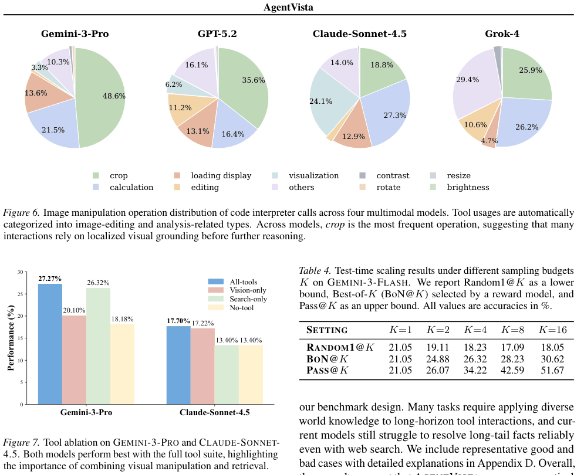
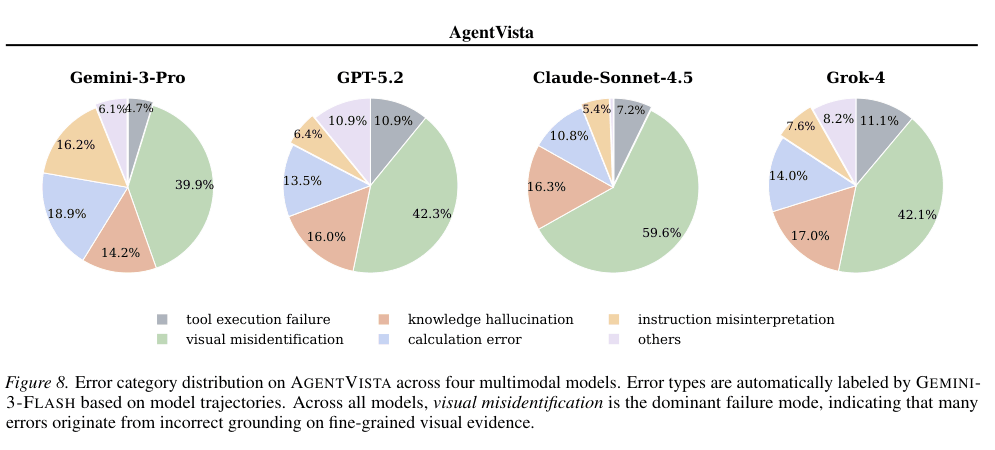

# AgentVista: Evaluating Multimodal Agents in Ultra-Challenging Realistic Visual Scenarios 论文解读

## 论文基本信息

| 字段 | 内容 |
| --- | --- |
| 论文 | AgentVista: Evaluating Multimodal Agents in Ultra-Challenging Realistic Visual Scenarios |
| 作者 | Zhaochen Su, Jincheng Gao, Hangyu Guo, Zhenhua Liu, Lueyang Zhang, Xinyu Geng, Shijue Huang, Peng Xia, Guanyu Jiang, Cheng Wang, Yue Zhang, Yi R. Fung, Junxian He |
| 机构 | HKUST、UNC Chapel Hill、Zhejiang University、NUS |
| 发布时间 | 2026-02-26；arXiv v2 修订于 2026-03-02 |
| Venue | arXiv |
| 论文链接 | [arXiv:2602.23166](https://arxiv.org/abs/2602.23166) |
| 项目主页 | [agentvista-bench.github.io](https://agentvista-bench.github.io/) |
| 代码与数据 | [hkust-nlp/AgentVista](https://github.com/hkust-nlp/AgentVista) |

## TL;DR

AgentVista 不是又一个“看图后直接答题”的多模态 benchmark。它把任务设置成真实用户会交给智能体的工作：先从复杂图片里找证据，再搜索网页、打开页面、操作图片或运行代码，经过多轮交错行动，最后给出一个简短且可核验的答案。

数据集只有 209 道题，却刻意追求难度和执行深度：任务覆盖 7 个大类、25 个子领域，使用 308 张真实图片；每题至少需要两类工具交错协作。GPT-5 在 AgentVista 上平均调用 12.67 轮工具，远高于若干既有 benchmark 的 2.92～4.60 轮。

结果相当冷峻：14 个前沿模型中，配备全部工具的 Gemini-3-Pro 最高也只有 **27.27%**。主要瓶颈并不只是知识不足，而是细粒度视觉证据识别失败、错误信息在长链路中传播，以及模型无法稳定选择和组合工具。

## 论文脑图

```markmap
# AgentVista

## 为什么做
### 现有评测交互轮次短
### 图片常退化为问答附件
### 工具使用与视觉推理彼此割裂

## 数据集
### 209 个任务
### 308 张真实图片
### 7 大类 / 25 子领域
### 单图 151 / 多图 58

## 构建流程
### Agent-centric filtering
### Expert finalization
### Execution filtering
### Two-round verification

## 智能体工具
### Web search
### Page visit
### Image search
### Code interpreter

## 核心结果
### 最优 Gemini-3-Pro 27.27%
### GPT-5 平均 12.67 工具轮次
### 多图不一定更难
### Pass@16 51.67%

## 关键瓶颈
### 视觉误识别
### 工具组合不稳定
### 候选答案选择能力不足
### 长尾知识幻觉
```

## 1. AgentVista 想测什么？

### 1.1 从“视觉问答”走向“视觉驱动的任务执行”

现有多模态评测常把图片当作一次性上下文：模型看图、推理、输出答案。真实智能体任务则更像一个闭环：图片中的局部信息决定搜索关键词，搜索结果又决定下一步要打开哪个页面或裁剪哪块区域，最终还要通过计算或交叉验证收敛到答案。

AgentVista 因此要求每个样本同时满足三点：

1. **视觉中心**：关键条件必须来自真实、复杂图片，而不是把文本问题配上一张可有可无的图。
2. **混合工具**：任务自然需要网页检索、页面访问、图片搜索、代码或图片操作中的至少两类工具交错使用。
3. **可验证**：最终答案应简短、确定，并尽量不随时间快速变化，便于自动评测与人工复核。



上图最能体现任务风格。模型可能要从乐高组装照片里定位错误零件，从商品货架中识别候选品并查询营养与价格，或从营业时间截图出发规划路线。视觉不是装饰，而是后续行动链的起点和约束。

### 1.2 数据规模不大，难度密度很高

AgentVista 包含 209 个任务、308 张图片，覆盖 Commerce、Geography、Entertainment、Technology、Society、Academics、Culture 七个大类和 25 个子领域。平均问题长度 401.4，平均答案长度仅 40.8：输入复杂、执行链长，但输出必须收敛。

其中单图任务 151 个，占 72.2%；多图任务 58 个，占 27.8%。这种设置不是为了穷举知识，而是用少量高强度样本检验模型能否把视觉理解、外部信息检索和可执行操作真正串起来。

## 2. 数据集如何构建？

### 2.1 四阶段漏斗



论文从 30 万余张真实图片或场景出发，来源包括公开模型竞技场中的真实需求、标注者日常拍摄场景以及私有社区论坛。涉及个人信息时会做隐私过滤或重写。最终只保留 209 题，约为初始池的 0.07%。

完整漏斗分四步：

| 阶段 | 数量变化 | 核心工作 |
| --- | ---: | --- |
| Agent-centric filtering | 300,000+ → 568 | Claude Opus 4 辅助筛选和提出候选问题，再由人工判断复杂度；保留比例仅 0.19% |
| Expert finalization | 568 → 315 | 专家把候选改写成真实、自包含、视觉中心的问题，并制作确定答案 |
| Execution filtering | 315 → 241 | 实际执行任务；要求至少两类工具交错调用，并过滤无需工具即可回答的样本 |
| Quality assurance | 241 → 209 | 两轮复核视觉证据、工具输出、可复现性与答案有效性 |

一条样本平均需要约 4 小时构建，专家完整求解约需 30 分钟。这解释了为什么数据量不大：作者优化的是每题的任务真实性、工具依赖和审核强度，而不是题目总数。

### 2.2 “必须用工具”不是口头要求

第三阶段尤其关键。作者先复现专家执行轨迹，确保任务确实需要长程行动；再用 Gemini-3-Flash 辅助检查工具多样性，并让 Gemini-2.5-Pro 在无工具条件下尝试作答，剔除仅凭模型参数知识就能完成的题目。

这种反向过滤降低了“模型猜对但并未解决任务”的概率。不过它仍依赖特定模型判断工具必要性：更强的未来模型可能无需相同工具链，因此“必要工具”不是永恒属性。

### 2.3 智能体可用的四类能力

评测环境提供：

- `web_search`：检索网页信息；
- `visit`：打开和阅读具体页面；
- `image_search`：寻找视觉参照物或候选对象；
- `code_interpreter`：运行程序，并进行裁剪、缩放、测量、对比、可视化和数值计算等图片操作。

这些工具的意义在于形成闭环。例如模型先裁剪铭牌，再搜索型号，访问产品页核对参数，最后计算兼容性。单次检索正确并不足以保证最终答案正确。

## 3. 实验设置

作者评测了 14 个闭源与开源前沿模型，包括 Qwen3-VL-235B-A22B、GPT-4.1、o3、o4-mini、GPT-5/5.1/5.2、Grok-4、四个 Claude 版本以及 Gemini-3-Flash/Pro。

主实验温度设为 0.6，每题最多 30 轮工具交互。最终答案由固定的 GPT-4.1 judge 判定正确性，指标是准确率。由于 gold answer 被设计为简洁、确定，自动判分相对可行，但评判模型仍可能带来偏差。

## 4. 主要结果：最强模型仍不到三成



Gemini-3-Pro 以 **27.27%** 居首；GPT-5 和 GPT-5.2 均为 **24.40%**，Gemini-3-Flash 为 **21.05%**，o3 为 **20.10%**。开源 Qwen3-VL-235B-A22B 为 **12.92%**。即便给最强模型完整工具，仍有超过七成任务失败。

| 模型 | Overall | 平均工具轮数 |
| --- | ---: | ---: |
| Gemini-3-Pro | **27.27** | 6.67 |
| GPT-5 / GPT-5.2 | 24.40 / 24.40 | 12.67 / 13.85 |
| GPT-5.1 | 22.97 | 17.14 |
| Gemini-3-Flash | 21.05 | 7.78 |
| o3 | 20.10 | 13.18 |
| Claude Opus 4.1 | 18.18 | 7.28 |
| Qwen3-VL-235B-A22B | 12.92 | 2.34 |

这里有两个容易误读的点。

第一，工具轮数多不等于能力强。GPT-5.1 平均执行 17.14 轮却低于只用 6.67 轮的 Gemini-3-Pro。真正重要的是每轮是否基于当前证据缩小搜索空间，而非盲目延长轨迹。

第二，多图任务没有普遍更难。Gemini-3-Pro 的单图准确率为 23.68%，多图反而达到 36.84%。论文解释，多张图片往往提供互补视角，能消除歧义；这只是该数据分布下的观察，不能推广成“多图天然更容易”。

### 4.1 长程性体现在哪里？

使用 GPT-5 统计时，AgentVista 平均需要 12.67 轮工具调用。对比之下，TIR-Bench、Agent-X、MMSearch-Plus、BrowseComp-VL、VisualToolBench 分别约为 2.92、3.40、4.60、4.30、4.46 轮。AgentVista 将难度从单点感知或一次检索，推进到跨工具的状态维护和验证。

但平均轮数也不是完美难度指标：失败模型可能因为迷路而调用更多工具。应把它与正确率、轨迹质量和任务最低必要步骤一起看。

## 5. 工具到底有没有用？



### 5.1 工具收益具有模型依赖性

Gemini-3-Pro 使用全部工具时为 27.27%，只保留视觉操作为 20.10%，只保留搜索为 26.32%，无工具为 18.18%。搜索贡献很大，但完整工具组合仍是最佳。

Claude Sonnet 4.5 的差异较小：全工具 17.70%，视觉操作 17.22%，仅搜索和无工具均为 13.40%。这说明 benchmark 测到的不只是“工具是否存在”，还测模型能否可靠决定何时以及如何使用工具。

在代码解释器的图片操作中，**crop** 是四个分析模型最常用的动作。细粒度视觉任务往往不是需要更宏大的场景理解，而是要先把正确局部放大、隔离，再读取或比较。

### 5.2 多采样能扩大上界，但选择器跟不上

作者在 Gemini-3-Flash 上做 test-time scaling：从同一道题采样 K 条轨迹，再比较随机选一个、奖励模型选最优和 oracle 式“只要有一条正确就算成功”。

| K | Random1@K | BoN@K | Pass@K |
| ---: | ---: | ---: | ---: |
| 1 | 21.05 | 21.05 | 21.05 |
| 2 | 19.11 | 24.88 | 26.07 |
| 4 | 18.23 | 26.32 | 34.22 |
| 8 | 17.09 | 28.23 | 42.59 |
| 16 | 18.05 | 30.62 | 51.67 |

K=16 时，Pass@K 达到 51.67%，但奖励模型选择后的 BoN@K 只有 30.62%。这说明生成多样轨迹确实能提高“至少做对一次”的机会，而**识别哪条轨迹真正正确**成为新的瓶颈。Pass@K 是使用 gold answer 才能得到的 oracle 上界，不是可直接部署的实际性能。

## 6. 错误分析：首先败在“看错”



四个模型最主要的错误都是 visual misidentification：Gemini-3-Pro 为 39.9%，GPT-5.2 为 42.3%，Claude Sonnet 4.5 为 59.6%，Grok-4 为 42.1%。知识幻觉分别占 14.2%、16.0%、16.3% 和 17.0%。

这揭示了一种典型的长程失败：模型在最早的视觉定位阶段认错零件、标签或区域，后续搜索与计算即使形式正确，也只是在沿错误前提继续执行。因此 agent harness 不能只检查工具是否成功返回，还要保留“证据来自图片哪里、这个识别有多确定、下一步如何验证”的 provenance。

需要注意，错误类别是 Gemini-3-Flash 根据模型轨迹自动生成的，并非人工逐条标注。比例适合观察趋势，不应被当作精确的因果统计。

## 7. 与相关 benchmark 的区别

| Benchmark | 主要关注点 | GPT-5 平均工具轮数 | 与 AgentVista 的差异 |
| --- | --- | ---: | --- |
| TIR-Bench | 工具集成推理 | 2.92 | 执行链更短，视觉真实场景不是同等核心 |
| Agent-X | 多模态智能体能力 | 3.40 | AgentVista 更强调复杂真实图片与多工具交错 |
| MMSearch-Plus | 多模态搜索 | 4.60 | 搜索是中心；AgentVista 还要求代码与图片操作协同 |
| BrowseComp-VL | 视觉条件下的网页浏览 | 4.30 | 更偏浏览检索；AgentVista 覆盖更广的实际任务动作 |
| VisualToolBench | 视觉工具使用 | 4.46 | 更偏工具调用本身；AgentVista 强调长程、可核验的用户目标 |
| AgentVista | 视觉中心的真实长程任务 | **12.67** | 209 个高难样本，至少两类工具交错使用 |

AgentVista 的贡献不是单独发明某种工具，而是把感知、检索、操作、计算和验证放进同一条真实任务链，并用严格筛选保证图片和工具都不是可绕过的装饰。

## 8. 对 Agent Harness 设计的启发

### 8.1 把视觉证据变成一等状态

Harness 应记录裁剪区域、OCR 文本、识别候选及其置信度，让后续搜索可以追溯到原始像素。只保存模型的一句自然语言观察，会让早期视觉误差很难被发现。

### 8.2 在长链中设置验证关卡

工具成功执行不代表子结论正确。可以在关键节点要求独立证据：型号是否被第二来源确认、数值单位是否一致、图片中的对象是否与搜索结果真正对应。验证预算应优先投向不可逆的分支决定。

### 8.3 把“候选生成”和“候选选择”分开优化

Pass@K 与 BoN@K 的差距表明，增加采样只是第一步。更实用的 harness 需要可执行验证器、来源一致性检查、数值复算，或让不同轨迹互相质询，而不是仅靠另一个语言模型读结论打分。

### 8.4 给工具循环明确的停止条件

更多轮数并不自动带来更高准确率。Harness 应围绕信息增益、证据覆盖和剩余不确定性决定继续、回退或停止，避免在错误假设下重复搜索。

## 9. 局限与复现注意事项

1. **样本规模小**：总计 209 题，细分类别更少，分领域百分比对少数题的成败非常敏感。
2. **构建和筛选存在模型依赖**：Claude、Gemini 等模型参与筛选，可能影响保留下来的任务形态。
3. **自动 judge 有偏差风险**：固定 GPT-4.1 判分提高了一致性，却不能完全替代人工复核。
4. **错误标签并非人工金标**：Figure 8 的错误类型由 Gemini-3-Flash 自动归类，只能视为诊断线索。
5. **时间稳定性有限**：作者尽量选择稳定答案，但网页、商品和现实事实仍会变化。
6. **版本依赖明显**：模型版本、搜索结果和工具实现都会改变复现结果；应固定运行日期、提示词、工具接口与最大轮数。
7. **真实图片带来隐私风险**：即使经过过滤和重写，部署此类 agent 时仍需最小化上传、留存和展示个人信息。

复现实验时，至少应报告模型精确版本、温度 0.6、30 轮上限、完整工具定义、运行日期、judge 配置和随机种子。除了最终准确率，最好额外保存工具调用轨迹、失败阶段和证据引用，才能解释结果波动。

## 10. 重读后的判断

AgentVista 的价值不在于又给模型排了一次名，而在于把 benchmark 的评价单位从“一个答案”推进为“完成一项视觉任务的过程”。27.27% 的最好成绩说明，当前多模态模型已经会调用工具，却还没有形成稳定的观察—行动—验证闭环。

论文也提醒我们不要把所有问题归咎于推理长度。真正困难的是在长链中持续绑定视觉证据、现实实体和工具返回值。一旦第一步看错，后面的检索越熟练，可能离正确答案越远。

对下一代 agent 来说，值得优先投入的不是无限扩大工具箱，而是三个基础能力：可靠的局部视觉定位、可追溯的中间状态，以及能够用外部证据否定自身轨迹的验证机制。

# 深度 Q&A

## Q1：AgentVista 与普通多模态问答最大的区别是什么？

普通 VQA 通常在一次模型调用内完成；AgentVista 要求从图片建立线索，跨网页、图片搜索和代码工具执行长程任务，并让每题至少涉及两类工具的交错调用。

## Q2：为什么只有 209 道题也值得作为 benchmark？

它追求的是单题强度而非覆盖数量。每题平均约 4 小时构建，经过实际执行和两轮审核；但小规模也意味着分领域排名不够稳定，不能替代大规模评测。

## Q3：27.27% 是否代表 Gemini-3-Pro 只能完成四分之一的真实任务？

不能这样泛化。该数字只对应 AgentVista 精选的超高难任务、指定工具和评测配置；它说明在这类任务上仍有巨大缺口，不代表所有现实多模态工作流的总体成功率。

## Q4：为什么多图任务反而可能得分更高？

数据中的多张图常提供互补视角，帮助消除单图歧义。它是样本构成造成的现象，而非“图片越多越简单”的一般规律。

## Q5：平均工具轮数越多，是否说明模型越 agentic？

不一定。更多轮可能来自有效分解，也可能来自重复搜索和迷路。GPT-5.1 的轮数明显更多，却没有超过 Gemini-3-Pro；应结合正确率、信息增益和轨迹质量判断。

## Q6：工具消融说明搜索比视觉操作更重要吗？

对 Gemini-3-Pro，这组数据里仅搜索与全工具的差距较小；但 Claude Sonnet 4.5 呈现不同模式。更稳妥的结论是工具收益依赖模型，完整工具箱只有在模型会选、会组合时才有价值。

## Q7：Pass@16 达到 51.67%，是否意味着性能可以直接翻倍？

不是。Pass@16 使用正确答案判断 16 条轨迹中是否至少一条成功，是 oracle 上界。实际奖励模型只能得到 30.62%，候选选择仍是主要障碍。

## Q8：为什么 visual misidentification 会如此致命？

图片中的型号、局部零件或标签常决定后续搜索词。一旦视觉锚点错误，网页检索和计算会在错误前提上继续，长链反而放大而不是修正误差。

## Q9：错误分析的百分比有多可信？

它们来自 Gemini-3-Flash 对轨迹的自动标注，适合比较总体趋势，但不是人工确认的因果标签。严谨研究应抽样人工复核并报告分类一致性。

## Q10：这个 benchmark 会不会很快过时？

会有一定风险。网页内容、商品信息、模型版本和搜索排序都会变化。作者尽量选择稳定答案，但复现者仍需记录时间，并定期检查 gold answer 与来源。

## Q11：AgentVista 对实际产品的直接启示是什么？

不要只监控 API 是否成功。产品级 harness 还应记录视觉证据来源、关键假设、交叉验证状态和停止原因，并允许在证据冲突时回退到较早步骤。

## Q12：下一步最值得研究的方向是什么？

一是让视觉定位可验证、可追溯；二是训练更可靠的轨迹选择器和过程验证器；三是建立对动态网页、隐私与工具故障更鲁棒的评测协议。它们比单纯增加推理长度更接近真实 agent 的瓶颈。
