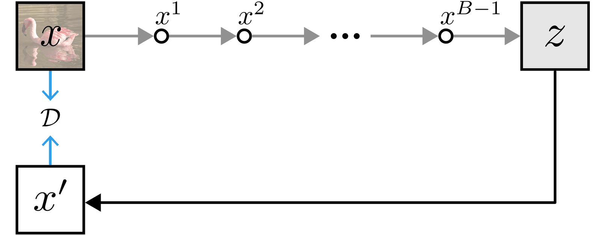
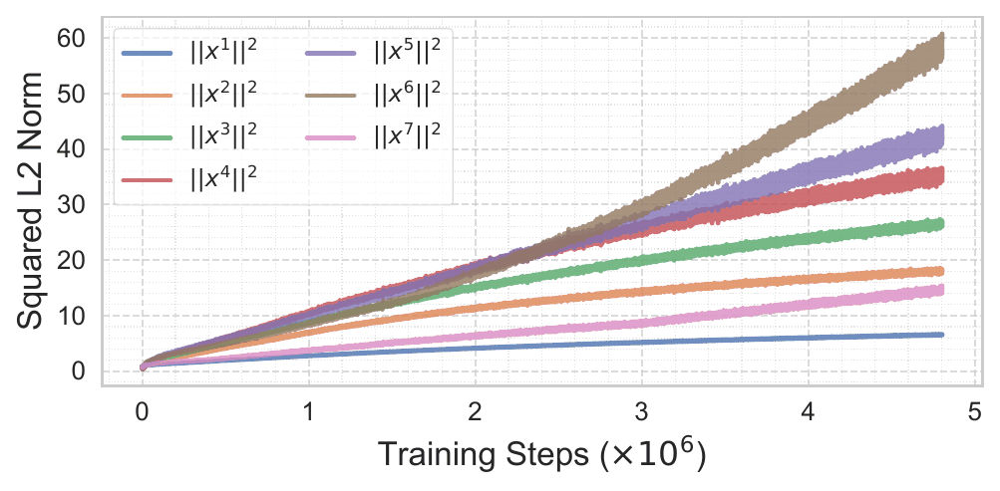
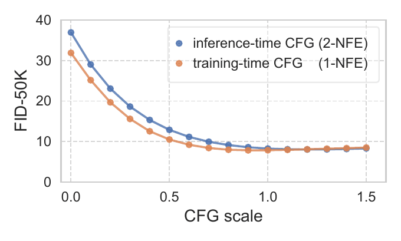

# Bidirectional Normalizing Flow: From Data to Noise and Back

BiFlow 训练可双向映射的数据-噪声变换，在保持 normalizing flow 可逆性的同时支持快速反向生成，并在 ImageNet 上显著加速。

## 论文信息

| 字段 | 内容 |
| --- | --- |
| 作者 | Yiyang Lu, Qiao Sun, Xianbang Wang, Zhicheng Jiang, Hanhong Zhao, Kaiming He |
| 机构 | MIT, Tsinghua University |
| 日期 | 2025-12-11 初版 |
| 代码 | 未见官方代码链接 |
| 链接 | https://arxiv.org/abs/2512.10953 |

## 一句话结论

BiFlow 的价值在于把 normalizing flow 的可逆建模和现代快速图像生成重新连接起来。

## 背景与问题

Normalizing flow 有精确可逆和密度建模优势，但传统设计在高维图像上常被认为质量或效率不如扩散模型。iTARFlow 等工作尝试改进可逆生成，但精确反向仍可能很慢。BiFlow 直接学习数据到噪声与噪声到数据两种方向。

## 方法拆解

BiFlow 把可逆变换拆解成适合双向训练的结构，并让反向生成不必完全依赖昂贵的精确逆过程。它仍保留 flow 的结构约束，同时引入更符合现代图像生成的训练和 guidance 机制。



BiFlow 同时学习数据到噪声、噪声到数据两个方向，使生成与似然相关能力更紧密结合。



论文通过规范化和双向训练缓解传统 flow 在表达力与采样效率上的冲突。



BiFlow 仍可结合 CFG 调节生成质量和条件一致性。


样本展示了 BiFlow 在视觉质量上的竞争力。

## 实验复盘

在 ImageNet 256、latent 32x32x4 设置下，BiFlow-B/2 约 133M 参数，1-NFE FID 为 2.39。论文报告其相对精确逆或 iTARFlow 最高可达 42x 加速，并且 BiFlow-B/2 可超过 iTARFlow-XL/2。

## 和相关工作的区别

相较扩散模型，BiFlow 更强调可逆映射；相较传统 flow，它吸收了现代生成模型在 Transformer、latent 和 CFG 上的经验。

## 局限与启发

反向近似与可逆约束之间的平衡仍复杂，似然、采样质量和速度之间可能需要取舍。启发是：flow 并没有过时，关键是用新架构重新定义其部署路径。

## 读论文脑图

```markmap
- Bidirectional Normalizing Flow: From Data to Noise and Back
  - 问题
    - flow 可逆但高质量图像生成效率不足
  - 方法
    - 双向训练数据-噪声映射
  - 实验
    - ImageNet 256 1-NFE FID 2.39，最高 42x 加速
  - 启发
    - 可逆建模可与快速生成并存
```

# 深度 Q&A

## Q1: BiFlow 和普通 normalizing flow 最大区别是什么？

它显式面向双向使用场景：既要从数据映射到噪声，也要从噪声快速回到数据。

## Q2: 为什么 flow 路线值得重新关注？

flow 有可逆性和密度建模优势，如果采样质量与速度被现代架构补齐，就可能成为扩散之外的重要选择。

## Q3: 1-NFE FID 2.39 说明什么？

说明 BiFlow 的反向生成已经具备强质量，不再只是理论上可逆、实际生成较弱的模型。

## Q4: 42x 加速来自哪里？

来自避免昂贵的精确逆过程，用训练好的快速反向路径完成生成。

## Q5: CFG 在 BiFlow 中为什么重要？

CFG 是现代条件生成的重要控制手段，保留它意味着 BiFlow 能进入主流图像生成工作流。

## Q6: 这篇和 iMF 有什么关系？

两者都追求少步生成，但 iMF 从平均流场出发，BiFlow 从可逆映射出发。

## Q7: 最大工程挑战是什么？

需要同时保证可逆结构、数值稳定、训练效率和视觉质量，这比单纯训练 denoiser 更受约束。

## Q8: 适合哪些后续研究？

适合研究可逆 latent 表示、可控生成、概率估计和低延迟图像生成的结合。

## Q9: 这篇论文最适合和哪类工作一起读？

适合和 diffusion / flow matching / consistency model / autoregressive generation 相关工作一起读。它的位置不是单点技巧，而是在采样步数、训练目标、表示空间和系统约束之间重新分配复杂度。

## Q10: 我复现时应该优先看哪些细节？

优先看数据预处理、token 或 latent 表示、训练步数、模型规模、采样步数、guidance 设置和评测协议。生成模型论文里，很多看似小的实现选择都会改变 FID、PPL、BLEU 或可视化质量。

## Q11: 这篇论文给 AIGC 系统设计的启发是什么？

它提醒我们不要只追求更大的模型，也要关心生成过程本身是否适合部署。一步或少步生成、可逆映射、视觉归纳偏置、离散语言流等方向，都在把 AIGC 从“能生成”推向“低延迟、可控、可组合”。
