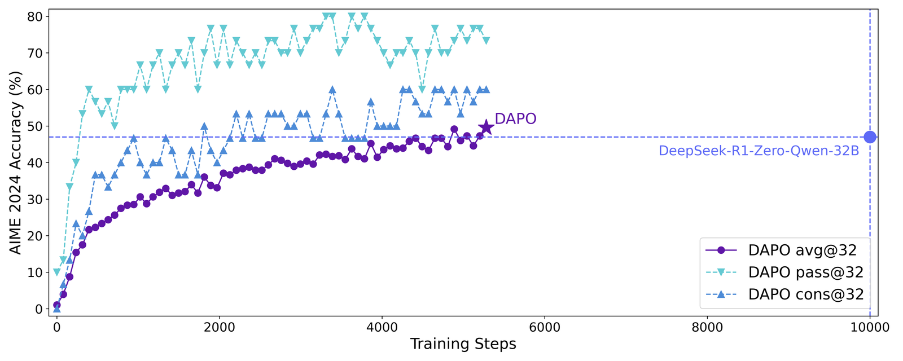
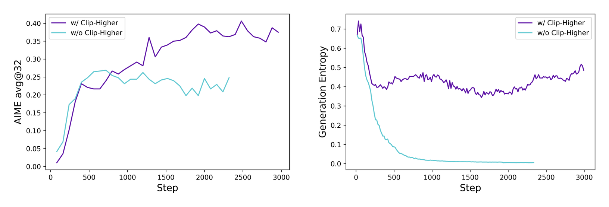
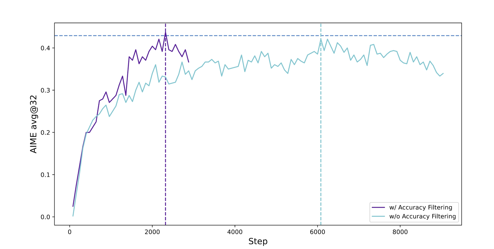
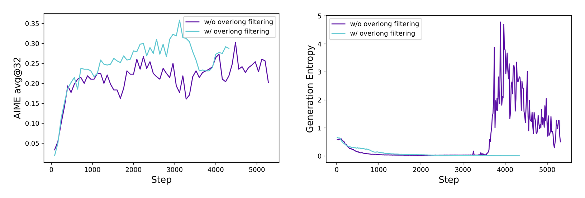
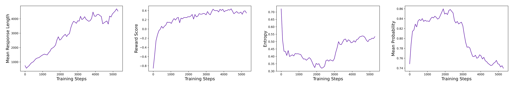

# DAPO: An Open-Source LLM Reinforcement Learning System at Scale 论文解读

## 论文基本信息

| 字段 | 内容 |
| --- | --- |
| 论文 | DAPO: An Open-Source LLM Reinforcement Learning System at Scale |
| 作者 | Qiying Yu, Zheng Zhang, Ruofei Zhu, Yufeng Yuan, Xiaochen Zuo, Yu Yue, Weinan Dai, Tiantian Fan, Gaohong Liu, Lingjun Liu, Xin Liu, Haibin Lin, Zhiqi Lin, Bole Ma, Guangming Sheng, Yuxuan Tong, Chi Zhang, Mofan Zhang, Ru Zhang, Wang Zhang, Hang Zhu, Jinhua Zhu, Jiaze Chen, Jiangjie Chen, Chengyi Wang, Hongli Yu, Yuxuan Song, Xiangpeng Wei, Hao Zhou, Jingjing Liu, Wei-Ying Ma, Ya-Qin Zhang, Lin Yan, Mu Qiao, Yonghui Wu, Mingxuan Wang |
| 机构 | ByteDance Seed; Institute for AI Industry Research (AIR), Tsinghua University; The University of Hong Kong; SIA-Lab of Tsinghua AIR and ByteDance Seed |
| 发布时间 | 2025-03-18；arXiv v2 修订于 2025-05-20 |
| Venue | arXiv |
| 论文链接 | https://arxiv.org/abs/2503.14476 |
| 项目链接 | https://dapo-sia.github.io/ |
| 代码链接 | https://github.com/volcengine/verl |

## TL;DR

DAPO 是一篇很“系统工程味”的 LLM 强化学习论文。它的目标不是重新发明一个完全陌生的 RL 算法，而是把大规模 reasoning model 的 RL 训练细节公开到足够可复现：用 Qwen2.5-32B base model、数学题数据和基于 verl 的训练系统，把 AIME 2024 avg@32 做到 50，超过论文中对比的 DeepSeek-R1-Zero-Qwen-32B 的 47，并且只用约一半训练步数。

论文的核心算法名是 Decoupled Clip and Dynamic sAmpling Policy Optimization，也就是 DAPO。它可以看成围绕 GRPO/PPO 类 objective 的四个关键补丁：Clip-Higher 放宽上裁剪边界以避免探索 token 被过早压死；Dynamic Sampling 过滤全对或全错的 prompt group，保证 batch 里有有效梯度；token-level policy gradient loss 让长 CoT 样本按 token 贡献梯度，而不是被 sample-level 平均稀释；Overlong Reward Shaping 用 soft punishment 处理超长截断，降低 reward noise。

这篇论文最有价值的地方在于，它把“reasoning RL 为什么经常训崩”的几个具体失效模式讲得很清楚：熵坍缩、零梯度 prompt 占比上升、长回答被错误加权、截断样本引入噪声。DAPO 的每个改动都对应一个可观测训练曲线和一个工程处方，因此比单纯报告 benchmark 分数更适合作为 LLM RL 系统复现指南。

## 论文脑图

```markmap
# DAPO

## 目标

### 开源大规模 LLM RL 系统

### 复现 reasoning model RL 训练

### Qwen2.5-32B base -> AIME 50

## 基线问题

### GRPO 只能到 AIME 30

### entropy collapse

### 全对/全错 group 产生零梯度

### 长 CoT loss 权重不健康

### overlong truncation 引入 reward noise

## 四个技术

### Clip-Higher

### Dynamic Sampling

### Token-level Policy Gradient Loss

### Overlong Reward Shaping

## 实验

### AIME 2024 avg@32

### progressive ablation

### training dynamics

### reflective behavior emergence

## 复现要点

### verl 框架

### DAPO-Math-17K

### prompt batch 512

### 16 responses per prompt

### max generation 20480 tokens
```

## 背景：为什么这篇论文重要

OpenAI o1、DeepSeek-R1 之后，大家基本形成了一个共识：推理模型的能力不只是靠预训练和 SFT，RL 在长链式推理上扮演了很关键的角色。但公开材料里经常缺少真正能复现的训练细节。论文开头直接点出这个问题：社区知道 RL 很重要，却很难复现 state-of-the-art reasoning LLM 的训练效果。

DAPO 的动机就是填这个缺口。它不是只给出一个最终模型分数，而是公开算法、训练代码框架和数据处理 recipe，并且把训练中观察到的故障模式逐项解释。论文使用 Qwen2.5-32B base model 做数学任务 RL，在 AIME 2024 上从接近 0 提升到 50。



上图是论文的主结果曲线。DAPO 在 Qwen2.5-32B base 上超过 DeepSeek-R1-Zero-Qwen-32B，同时论文强调它使用的训练步数约为后者的一半。这个结果的意义不只是“分数高”，而是说明如果把几个训练细节处理对，开源系统也可以把大模型 RL 做到很强。

## 方法总览：DAPO 其实改了什么

DAPO 的 objective 保留了 PPO/GRPO 类方法中的概率比和 clipping 结构。对每个问题 $q$，从旧策略 $\pi_{\theta_{\text{old}}}$ 采样 $G$ 个输出 $o_i$，再用 rule-based reward 得到每个输出的奖励，组内做归一化优势：

$$
\hat{A}_{i,t}=\frac{R_i-\mathrm{mean}(\{R_i\}_{i=1}^G)}{\mathrm{std}(\{R_i\}_{i=1}^G)}
$$

策略更新时使用 token-level probability ratio：

$$
r_{i,t}(\theta)=\frac{\pi_\theta(o_{i,t}\mid q,o_{i,<t})}{\pi_{\theta_{\text{old}}}(o_{i,t}\mid q,o_{i,<t})}
$$

和普通 PPO/GRPO 相比，DAPO 的关键差异不在“有没有 clipping”，而在下面四个工程化改动。

### 1. Clip-Higher：给低概率探索 token 更多上升空间

PPO-Clip 默认会把 probability ratio 限制在 $[1-\epsilon,1+\epsilon]$。论文指出，这个上界对 LLM reasoning RL 可能太保守：如果某个探索 token 原概率是 0.01，$\epsilon=0.2$ 时它最多只能涨到 0.012；而一个原概率 0.9 的 token 理论上能涨到 1.08，实际会饱和到接近 1。也就是说，上裁剪对低概率 token 的限制更强，可能让模型越来越不敢探索。

DAPO 把上下裁剪解耦成 $\epsilon_{\text{low}}$ 和 $\epsilon_{\text{high}}$，保留下裁剪不变，增大上裁剪：

$$
\mathrm{clip}(r_{i,t}, 1-\epsilon_{\text{low}}, 1+\epsilon_{\text{high}})
$$

实验设置里 $\epsilon_{\text{low}}=0.2$，$\epsilon_{\text{high}}=0.28$。这样做的直觉是：不要过度惩罚概率下降带来的不稳定，但要允许低概率、有正优势的探索 token 有更大的上升空间。



论文的诊断图显示，Clip-Higher 能缓解熵过快下降，并提高 AIME 上的训练表现。这里的重点不是“熵越高越好”，而是避免 policy 太早变得尖锐，失去探索复杂推理路径的机会。

### 2. Dynamic Sampling：只保留有梯度的 prompt group

GRPO 类方法常用组内 reward normalization。如果一个 prompt 采样出的 $G$ 个回答全对，或者全错，那么组内 reward 方差为 0，优势为 0，这个 prompt 对策略更新没有有效梯度。

训练进行到后期，全对 group 会越来越多；训练早期或难题上，全错 group 也会出现。它们都会占用 batch，却不贡献学习信号。DAPO 的做法是动态过采样：过滤掉 accuracy 等于 0 或 1 的 prompt group，只把 $0<\mathrm{accuracy}<1$ 的 group 放入 batch，直到凑满有效 batch。

形式上，DAPO 在目标里加入约束：

$$
0 < |\{o_i \mid \texttt{is\_equivalent}(a,o_i)\}| < G
$$

这相当于说：只训练那些“同一个问题下有的回答对、有的回答错”的样本，因为它们最能告诉模型哪些推理轨迹值得加强。



论文观察到，Dynamic Sampling 虽然会多采样一些候选，但同步 RL 系统的耗时往往被长尾生成样本主导，因此总训练时间没有明显变差，收敛步数反而减少。

### 3. Token-level policy gradient loss：长 CoT 不应该被 sample 平均稀释

原始 GRPO 常见做法是先对每个 sample 内的 token loss 求平均，再对 samples 求平均。这样每条 response 的权重相同，不管它是 200 token 还是 8000 token。

在 long-CoT 场景下，这会带来两个问题。第一，真正高质量的长推理链里包含大量有用 token，但它们在 sample-level 平均后贡献被稀释。第二，如果某些长样本出现重复、乱码或不健康模式，sample-level 平均也会让这些坏 token 的惩罚变弱。

DAPO 改成 token-level reduction：所有 response 的 token 放在一起归一化。

$$
\mathcal{J}_{\text{DAPO}}(\theta)=
\mathbb{E}\left[
\frac{1}{\sum_i |o_i|}
\sum_i \sum_t
\min\left(
r_{i,t}(\theta)\hat A_{i,t},
\mathrm{clip}(r_{i,t},1-\epsilon_{\text{low}},1+\epsilon_{\text{high}})\hat A_{i,t}
\right)
\right]
$$

这个改动让长回答按 token 数贡献梯度。论文报告它对最终 AIME 分数提升不如 Dynamic Sampling 那么大，但对训练稳定性和长度增长的健康程度很重要。

### 4. Overlong Reward Shaping：截断样本不能粗暴打负分

大模型 RL 里通常会设最大生成长度。问题是，如果某个样本因为超长被截断，直接给负 reward 可能引入噪声：它也许是在进行合理推理，只是还没有写完；粗暴惩罚会把“推理过程本身”误判为坏模式。

DAPO 先分析了 overlong filtering，即把超长截断样本从 loss 里 mask 掉，发现训练更稳定、性能更好。随后论文提出 Soft Overlong Punishment：在最大长度前设置一个 cache 区间，长度越接近上限惩罚越大，超过上限给 -1。

$$
R_{\text{length}}(y)=
\begin{cases}
0, & |y|\le L_{\text{max}}-L_{\text{cache}}\\
\frac{(L_{\text{max}}-L_{\text{cache}})-|y|}{L_{\text{cache}}}, & L_{\text{max}}-L_{\text{cache}}<|y|\le L_{\text{max}}\\
-1, & L_{\text{max}}<|y|
\end{cases}
$$



训练设置里，论文把期望最大长度设为 16,384 token，额外 cache 为 4,096 token，因此生成最大 token 数为 20,480。这个细节很关键：它说明 reasoning RL 的长度控制不是简单“短就是好”，而是要区分合理长推理和无效超长生成。

## 数据与训练设置

论文聚焦数学任务，构造并处理了 DAPO-Math-17K。数据处理的一点细节是：论文会选择和转换部分答案，使其更容易被规则解析。例如某些几何或代数答案会被变成整数形式，便于用 `is_equivalent` 这类 rule-based checker 做奖励。

训练使用 verl 框架。主要超参如下：

| 项目 | 设置 |
| --- | --- |
| Base model | Qwen2.5-32B |
| Baseline | naive GRPO |
| Optimizer | AdamW |
| Learning rate | $1\times 10^{-6}$ |
| Warmup | 20 rollout steps |
| Prompt batch size | 512 |
| Responses per prompt | 16 |
| Training mini-batch size | 512 |
| AIME evaluation | repeat 32 times, report avg@32 |
| Evaluation sampling | temperature 1.0, top-p 0.7 |
| Expected max length | 16,384 tokens |
| Generation max length | 20,480 tokens |
| Clip-Higher | $\epsilon_{\text{low}}=0.2$, $\epsilon_{\text{high}}=0.28$ |

这些配置比“算法名”本身更能解释复现难点。DAPO 不是一个只需替换 loss 的 toy setting，而是一套把采样、过滤、长度控制、reward shaping、监控指标串起来的训练系统。

## 实验结果：每个补丁都贡献了一段路

论文用 progressive ablation 展示每个技术的增益：

| Model / Setting | AIME 2024 avg@32 |
| --- | ---: |
| DeepSeek-R1-Zero-Qwen-32B | 47 |
| Naive GRPO | 30 |
| + Overlong Filtering | 36 |
| + Clip-Higher | 38 |
| + Soft Overlong Punishment | 41 |
| + Token-level Loss | 42 |
| + Dynamic Sampling (DAPO) | 50 |

这张表很有信息量。首先，naive GRPO 已经能把 Qwen2.5-32B base 训到 30，但距离强 reasoning model 还差一大截。其次，overlong 处理贡献很大，说明长文本截断噪声是 long-CoT RL 的核心问题之一。最后，Dynamic Sampling 把最终结果推到 50，说明“batch 里有没有有效梯度”在大规模 RL 中不是小事。

## 训练动态：这篇论文最值得看的部分

DAPO 特别强调训练监控。论文展示了 response length、reward score、generation entropy 和 mean probability 四类曲线。



这些指标对应不同故障模式：

| 指标 | 观察重点 | 可能暴露的问题 |
| --- | --- | --- |
| Response length | 是否随能力提升合理增长 | 长度停滞、异常下降、无效膨胀 |
| Reward score | 训练集 reward 是否稳定上升 | reward 拟合训练集但验证集不过关 |
| Entropy | 探索能力是否保留 | 熵坍缩或过度探索 |
| Mean probability | 分布是否过尖 | policy 过早确定化 |

论文里有一个很务实的提醒：训练集 reward 的最终值和验证集 accuracy 不一定强相关。这和很多 RLVR 实践经验一致。模型可以稳定拟合训练 reward，但未必泛化到 AIME 这样的验证集。因此，监控 reward 只能说明系统在吃训练信号，不能单独证明 reasoning 能力真的提升。

## Case Study：反思行为的涌现

论文还给了一个有趣观察：RL 训练过程中，模型不只是强化已有的解题模式，还会逐渐出现训练早期很少见的反思和回溯行为。例如回答中出现类似“等一下，让我们重新思考这个二面角”的片段。

这类 case study 不应被过度解读成“模型有自我反省”。更稳妥的理解是：在 rule-based reward 的长期压力下，某些有助于修正错误推理的语言模式获得了更高概率。它们看起来像反思，是因为数学解题任务确实奖励“发现前面错了并修正”的轨迹。

## 与 PPO、GRPO、DPO 的关系

DAPO 和 DPO 名字很像，但问题完全不同。

| 方法 | 主要数据 | 优化对象 | 典型场景 |
| --- | --- | --- | --- |
| PPO | 在线 rollout + reward | clipped policy objective | RLHF / RLVR |
| GRPO | group sampled responses + reward | group-normalized policy gradient | reasoning RL |
| DPO | 离线偏好对 | preference classification loss | preference alignment |
| DAPO | group sampled responses + rule reward | 改造后的 GRPO/PPO 类 objective | long-CoT reasoning RL |

可以把 DAPO 理解为：在 GRPO 方向上补齐 long-CoT reasoning RL 的四个系统细节。它不是 DPO 那种“去掉在线 RL”的路线，而是更认真地把在线 RL 训练做稳。

## 复现建议

如果要复现或借鉴 DAPO，我会优先关注以下几点：

1. 先把 reward checker 做可靠。DAPO 依赖 rule-based correctness reward，如果答案解析不稳，后面的技巧都可能被 reward noise 放大。
2. 记录每个 prompt group 的 accuracy 分布。Dynamic Sampling 的价值来自过滤 0/1 group，因此要先知道 batch 里无效 group 占比。
3. 监控 entropy 和 mean probability。Clip-Higher 是否有用，要看它是否缓解了过早确定化，而不是只看最终分数。
4. 单独做 overlong 策略 ablation。截断样本处理往往和 max length、题目难度、模型初始能力强相关，不能照抄一个惩罚区间就完事。
5. 把 sample-level loss 和 token-level loss 的长度曲线一起画出来。token-level loss 的收益更多体现在训练健康度，不一定马上体现在单点 benchmark。
6. 不要只看 train reward。论文已经提醒，训练集 reward 和验证集 accuracy 可能脱钩。

## 局限与开放问题

DAPO 的实验主要集中在数学任务，reward 也主要依赖可验证答案。它对代码、复杂工具调用、多轮交互、开放式写作这类 reward 更难定义的任务，能否直接迁移还需要更多证据。

论文使用 Qwen2.5-32B base model，规模足够大，但也意味着很多结论可能和模型初始能力有关。较小模型是否能从 Dynamic Sampling 或 Clip-Higher 中获得同等收益，并不确定。

另一个值得注意的问题是数据处理。DAPO-Math-17K 的筛选、答案转换和解析策略会影响 reward 的可靠性。对于可复现性来说，开源数据和代码非常重要；但对于泛化到其他任务来说，数据 recipe 可能比 loss recipe 更难迁移。

最后，DAPO 的很多技巧是相互耦合的。Clip-Higher 改变探索，Dynamic Sampling 改变 batch 分布，token-level loss 改变长样本权重，overlong shaping 改变长度 reward。单独搬运某一个技巧时，需要重新做曲线诊断。

# 深度 Q&A

## Q1：DAPO 相比 naive GRPO 的本质提升是什么？

不是一个单点公式，而是把 naive GRPO 在 long-CoT 训练中的几个系统性缺陷补上。naive GRPO 可以提供 group-normalized advantage，但它没有解决探索 token 被上裁剪压制、全对/全错 group 零梯度、长回答 token 权重被稀释、超长截断 reward 噪声这几个问题。DAPO 的 AIME 从 30 提到 50，主要来自这些工程细节的叠加。

## Q2：为什么 Clip-Higher 只增大上界，不同时增大下界？

上界对应“让正优势 token 概率增加”的空间。低概率探索 token 如果有正优势，默认 0.2 的上裁剪会让它很难显著上升。下界则对应概率下降的约束，如果也放宽，可能更容易把某些 token 压到接近 0，导致采样空间坍缩。因此论文保留 $\epsilon_{\text{low}}=0.2$，只把 $\epsilon_{\text{high}}$ 提到 0.28。

## Q3：Dynamic Sampling 会不会改变训练分布，造成偏差？

会改变实际进入更新的 prompt group 分布，这是它的代价。但论文的观点是，在 group-normalized RL 中，全对和全错 group 本来就几乎没有有效梯度，保留它们更多是在浪费 batch。Dynamic Sampling 牺牲了某种“原始采样分布的朴素一致性”，换来更稳定、更密集的学习信号。

## Q4：为什么全对 group 也要过滤？它们不是说明模型做得好吗？

全对 group 说明这个 prompt 对当前模型太容易。由于所有 sampled responses reward 一样，组内 advantage 为 0，策略不知道该加强哪条轨迹，也不知道该削弱哪条轨迹。它对评估有意义，对当前 policy gradient 更新却没有太多信息量。

## Q5：Token-level loss 会不会鼓励模型写得越来越长？

它确实会让长回答中的 token 获得更真实的梯度权重，但这不等于无条件鼓励变长。DAPO 同时使用 Overlong Reward Shaping 来约束超长生成。更准确地说，token-level loss 让“长回答中的好/坏模式”都被充分学习，而不是被 sample-level 平均抹平。

## Q6：Overlong Reward Shaping 和 length penalty 有什么区别？

普通 length penalty 往往直接偏好短回答，容易压制复杂推理。DAPO 的 soft overlong punishment 只在接近最大长度时逐渐惩罚，并且区分正常长度、缓冲区长度和真正超过上限的截断。它想解决的是截断噪声，而不是让模型越短越好。

## Q7：为什么论文说训练 reward 和验证 accuracy 可能不相关？

因为 rule-based reward 可以在训练集上被稳定拟合，但模型可能学到的是训练分布里的答案格式、题型捷径或局部模式。AIME 这样的验证集考察的是泛化推理能力。训练 reward 上升说明优化过程在工作，但不能保证推理能力等比例提升。

## Q8：DAPO 对 RLHF 偏好对齐有直接帮助吗？

直接帮助有限。DAPO 的 reward 主要来自数学答案可验证性，属于 RLVR/reasoning RL；偏好对齐常常面对开放式、多目标、人类偏好噪声，reward 更难定义。不过 DAPO 的训练诊断思想很有迁移价值：监控熵、长度、有效梯度比例和 reward 噪声，对偏好 RL 同样重要。

## Q9：这篇论文最值得带走的工程经验是什么？

LLM RL 不只是“选一个算法”。真正决定能否训起来的，是采样分布、有效梯度密度、长度处理、reward 噪声和探索保持。DAPO 的贡献在于把这些经验显式化，并用 ablation 展示每个处方的作用。

## Q10：如果只能实现一个 DAPO 技巧，应该先做哪个？

我会先做 Dynamic Sampling 和 overlong 处理二选一，取决于当前系统的主要症状。如果 batch 里大量 prompt group 全对或全错，先做 Dynamic Sampling；如果训练经常因为超长截断而震荡，先做 Overlong Reward Shaping。Clip-Higher 和 token-level loss 更适合作为第二阶段的稳定性优化。
