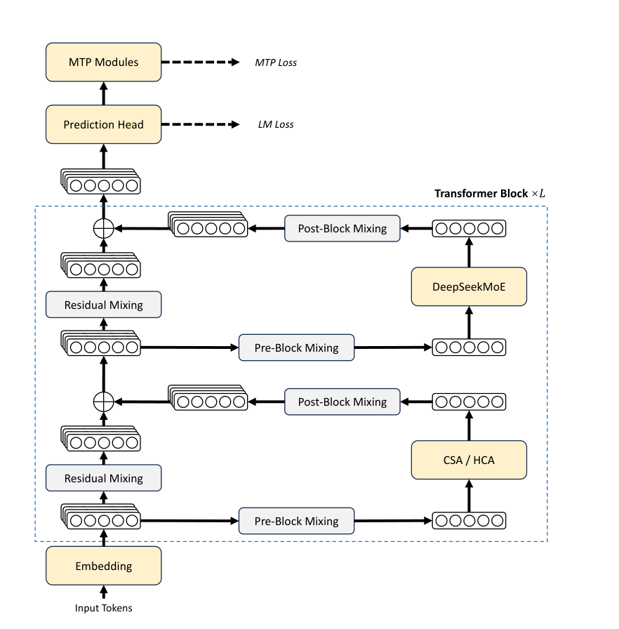
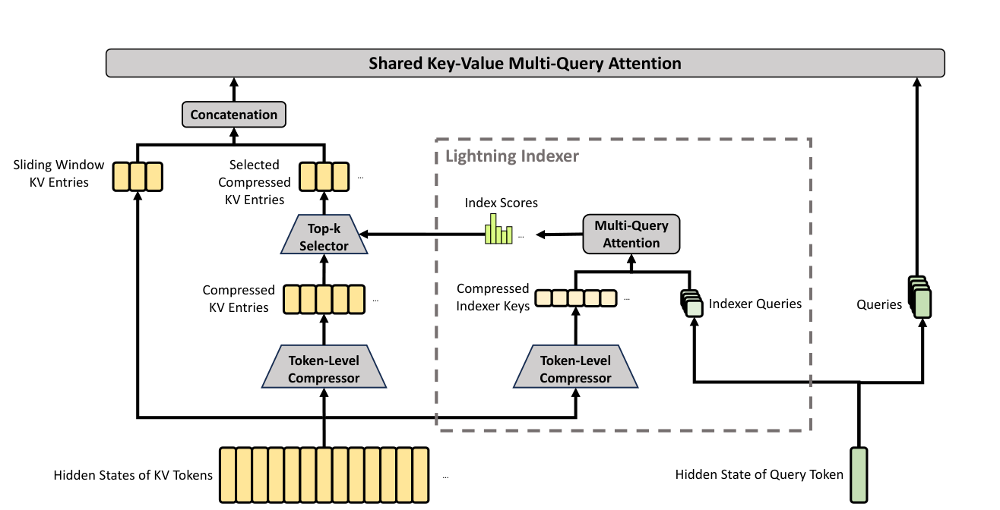
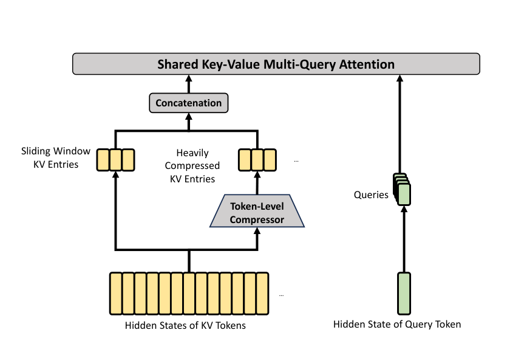
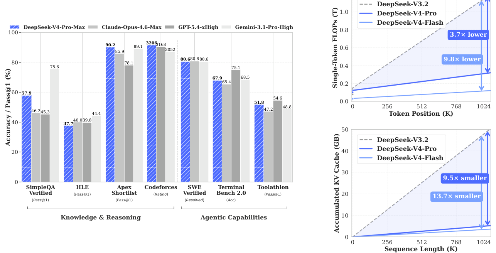
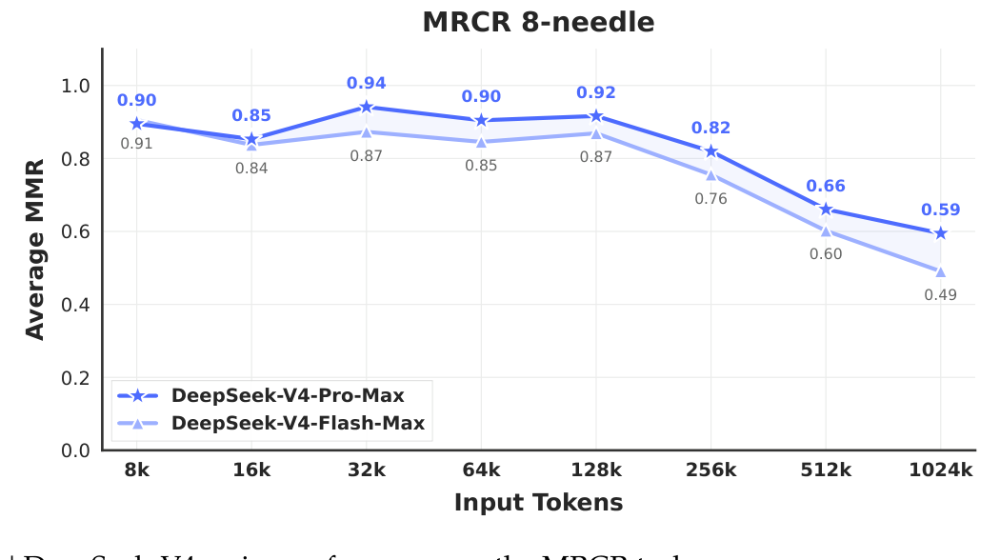

# DeepSeek-V4: Towards Highly Efficient Million-Token Context Intelligence 论文解读

## 论文基本信息

| 字段 | 内容 |
| --- | --- |
| 论文 | DeepSeek-V4: Towards Highly Efficient Million-Token Context Intelligence |
| 作者 | DeepSeek-AI（arXiv 页面列出 DeepSeek-AI 及 318 位共同作者） |
| 机构 | DeepSeek-AI |
| 发布时间 | 2026-04-26 |
| Venue | arXiv |
| 论文链接 | https://arxiv.org/abs/2606.19348 |
| 模型链接 | https://huggingface.co/collections/deepseek-ai/deepseek-v4 |
| 推理实现 | https://huggingface.co/deepseek-ai/DeepSeek-V4-Pro/tree/main/inference |

## TL;DR

DeepSeek-V4 是一份同时讨论模型架构、训练稳定性、基础设施、预训练、后训练和评测的 58 页技术报告。它发布两个预览模型：DeepSeek-V4-Pro 总参数 1.6T、每 token 激活 49B；DeepSeek-V4-Flash 总参数 284B、激活 13B。二者都原生支持 100 万 token 上下文，分别在 33T 和 32T token 上预训练。

最核心的设计是交错使用两类压缩注意力：CSA 先把每 4 个 KV 压成一个条目，再让 Lightning Indexer 选择 top-k 压缩条目做稀疏注意力；HCA 则把每 128 个 KV 压成一个条目，但在压缩后执行稠密注意力。两者都补充 128-token 滑动窗口以保留局部细节，再结合 mHC 残差扩展、Muon 优化器、低精度存储与计算，以及训练/推理系统优化。

效率结果是这篇报告最有分量的证据：在 1M 上下文下，DeepSeek-V4-Pro 的单 token 推理 FLOPs 约为 DeepSeek-V3.2 的 27%，KV Cache 约为 10%；Flash 进一步降至约 10% 和 7%。能力上，Pro-Max 在 Codeforces 达到 3206 rating、SWE Verified 80.6%、MRCR 1M 83.5 MMR；但并非全面领先闭源模型，例如 HLE 37.7% 低于 Gemini-3.1-Pro 的 44.4%，MRCR 1M 也低于 Claude Opus 4.6 的 92.9%。

## 论文脑图

```markmap
# DeepSeek-V4

## 问题

### 标准注意力难以承受百万 token

### 长链推理与长时 agent 需要更大上下文

### 万亿参数 MoE 训练存在稳定性与系统瓶颈

## 方法

### CSA：压缩后稀疏选择

### HCA：重压缩后稠密注意力

### mHC：受流形约束的残差扩展

### Muon + AdamW 混合优化

### 低精度 KV / Indexer / Expert

### Specialist + GRPO + On-Policy Distillation

## 实验

### 32T / 33T token 预训练

### Base、High、Max 多模式评测

### 知识、推理、代码、agent、百万上下文

### 内部写作、搜索、白领与研发编码任务

## 结论

### 百万 token 成为可常态部署的模型能力

### Flash 强调性价比，Pro 强调能力上界

### 架构与基础设施必须协同设计

## 局限

### 架构复杂且稳定性机制理论不足

### 128K 后长上下文检索明显衰减

### 部分真实任务依赖内部评测

### 仍需低延迟、多模态与长时 agent 研究

## 复现要点

### CSA m=4，HCA m'=128

### 滑动窗口 128，mHC 扩展 4

### 序列长度 4K→16K→64K→1M

### Flash 32T，Pro 33T
```

## 研究背景与问题定义

### 百万上下文不是简单把位置编码拉长

推理模型通过增加测试时 token 获得更强能力，agent 也会在多轮工具调用中不断积累观察、计划和中间结果。但标准自注意力的计算量随序列长度近似二次增长，KV Cache 又随上下文线性增长。到百万 token 规模时，瓶颈不再只是“模型能不能理解长文本”，而是每生成一个新 token 要扫描多少历史状态、这些状态如何存储和跨设备搬运。

因此，DeepSeek-V4 的目标可以拆成三层：

1. **算法层**：减少长上下文注意力需要保留和访问的 KV 条目；
2. **模型层**：在大幅压缩上下文的同时维持知识、推理、代码和 agent 能力；
3. **系统层**：让 MoE 通信、长上下文并行、低精度计算、KV Cache 管理真正落到训练和线上推理。

这也是为什么报告不只提出一种 sparse attention，而是给出从 CSA/HCA、mHC、Muon 到 fused kernel、TileLang、ZeRO、contextual parallelism、磁盘 KV Cache 和 FP4 QAT 的全栈方案。

### 两个模型承担不同的 Pareto 位置

| 项目 | DeepSeek-V4-Flash | DeepSeek-V4-Pro |
| --- | ---: | ---: |
| Transformer 层数 | 43 | 61 |
| Hidden size | 4,096 | 7,168 |
| 总参数 | 284B | 1.6T |
| 每 token 激活参数 | 13B | 49B |
| Routed experts / 层 | 256 | 384 |
| 每 token 激活 routed experts | 6 | 6 |
| 预训练 token | 32T | 33T |
| CSA top-k | 512 | 1,024 |
| 原生上下文 | 1M | 1M |

Flash 的定位不是缩小版 Pro，而是更偏向推理成本和性价比；Pro 用更大参数容量保存知识并抬高复杂任务上界。后续评测也反复显示：增加推理预算后，Flash 在数学和代码推理上可以逼近 Pro，但知识记忆和高难 agent 任务仍明显受模型规模影响。

## 核心方法

### 总体架构：MoE、MTP、混合注意力和 mHC



原文 Figure 2 展示了每个 Transformer block 的组成：注意力层在 CSA 与 HCA 之间交错，FFN 使用 DeepSeekMoE，残差流经 mHC 的 pre-block、post-block 和 residual mixing，顶部继续保留 DeepSeek-V3 的 Multi-Token Prediction（MTP）。这张图说明 V4 不是推翻 V3，而是在 MoE/MTP 骨架上重做长上下文注意力和残差连接。

### CSA：先压缩，再做稀疏检索



原文 Figure 3 给出 CSA 的数据流。设序列长度为 $n$，CSA 先把每 $m$ 个 token 的 KV 条目压缩成一个条目，因此序列维度先降为约 $n/m$；V4 中 $m=4$。压缩不是简单平均，而是由 token-level compressor 根据可学习权重和位置偏置聚合信息。

随后 Lightning Indexer 为当前 query 和压缩后的 indexer keys 计算相关分数，只保留 top-k 个压缩 KV 进入核心注意力。Flash 的 top-k 为 512，Pro 为 1,024。最终注意力使用 Shared Key-Value Multi-Query Attention，并把最近 128 个未压缩 KV 作为滑动窗口分支拼接进去。

直觉上，CSA 做了两次降本：

1. **压缩**：先把候选历史从 $n$ 降到 $n/4$；
2. **稀疏选择**：再从压缩历史中只挑 top-k 相关块。

代价是检索器必须准确。如果早期压缩丢掉细节，或 Lightning Indexer 没选中真正相关块，后面的高质量注意力也无法补救。因此滑动窗口分支承担了“局部信息保险”的作用。

### HCA：重压缩，但保留稠密全局访问



原文 Figure 4 展示 HCA：它不再做 top-k 稀疏选择，而是直接把每 $m'$ 个 KV 聚合为一个条目，然后对全部压缩条目执行稠密 MQA。V4 中 $m'=128$，远大于 CSA 的 $m=4$。HCA 同样拼接最近 128 个未压缩 KV，兼顾超粗粒度全局信息与高分辨率局部依赖。

CSA 与 HCA 的互补关系是整篇论文的关键：

- CSA 保留较细的压缩粒度，但只访问少量相关块；
- HCA 极度压缩全局历史，但访问所有压缩块；
- 交错堆叠让模型既有“检索式长程访问”，也有“低分辨率全局扫描”。

此外，两类注意力还共享一组工程细节：Query/KV head RMSNorm、后 64 维 partial RoPE、对输出施加反向位置旋转、attention sink，以及 grouped output projection。

### mHC：把残差宽度变成新的扩展轴

标准 residual connection 只有一条 $d$ 维状态流。Hyper-Connections（HC）把残差流扩成 $n_{hc}$ 条并允许动态混合，但深层堆叠容易出现数值不稳定。mHC 将 residual mapping $B_l$ 约束在双随机矩阵构成的 Birkhoff polytope 上：

$$
\mathcal{M}=\{M\in\mathbb{R}^{n\times n}\mid M\mathbf{1}=\mathbf{1},\ \mathbf{1}^TM=\mathbf{1}^T,\ M\ge 0\}
$$

双随机约束让映射谱范数不超过 1，残差变换成为 non-expansive，从而降低前向和反向信号爆炸风险。实现上，原始动态矩阵通过指数变换后进行 20 次 Sinkhorn-Knopp 行列归一化；V4 的 $n_{hc}=4$。

它的意义不是“残差更复杂”这么简单，而是在不增大每层内部 hidden size 的情况下扩展跨层信息通道，同时用几何约束换取稳定性。不过论文也承认，整个架构因此变得复杂，未来希望提炼出更必要、更优雅的核心设计。

### Muon、Anticipatory Routing 与 SwiGLU Clamping

V4 对多数二维权重使用 Muon，对 embedding、prediction head 和 RMSNorm 权重继续使用 AdamW。Muon 通过矩阵正交化方向更新权重，论文将其收益概括为更快收敛和更强训练稳定性。

但训练万亿参数 MoE 仍出现 loss spike。作者发现 spike 与 MoE 层 outlier 相关，routing 又会放大这种恶性循环，于是加入两种实用补丁：

- **Anticipatory Routing**：step $t$ 的 backbone 用当前参数计算，但 routing index 使用历史参数 $\theta_{t-\Delta t}$；只有检测到 spike 时短暂 rollback 并启用。启用阶段的额外 wall-clock 开销约 20%，动态触发后整体额外成本被描述为可忽略。
- **SwiGLU Clamping**：linear 分支夹到 $[-10,10]$，gate 分支上限设为 10，直接抑制异常激活。

这两项技术有效，但论文明确说其底层原理仍理解不足，因此它们更像大规模训练经验，而不是已经完备的理论结论。

### 从 4K 逐步扩到 1M

两个模型都不是从一开始就在百万长度上训练，而是按 $4K\rightarrow16K\rightarrow64K\rightarrow1M$ 逐步扩展。Flash 前 1T token 使用 dense attention，到 64K 阶段才引入 sparse attention；引入时先单独 warm up Lightning Indexer，再进行主要稀疏训练。Pro 使用相同两阶段策略，但 dense attention 阶段更长。

这个 curriculum 很合理：先让模型在较稳定的稠密注意力下学语言和表示，再逐渐训练压缩器与索引器，避免“内容建模”和“稀疏路由”同时从零开始。

### 后训练：先培养专家，再用 OPD 统一

后训练首先针对数学、代码、agent、instruction following 等领域分别训练 specialist：高质量 SFT 建立基础能力，再用 GRPO 和领域 reward 优化。难验证任务不依赖传统 scalar reward model，而使用 rubric-guided Generative Reward Model（GRM），并直接对 GRM 本身做 RL。

最后，DeepSeek-V4 用 On-Policy Distillation（OPD）替代 DeepSeek-V3.2 的 mixed RL：统一 student 从当前策略采样，再对 specialist teacher 优化 reverse KL，将不同领域能力合并进一个模型。报告还定义 Non-think、Think High、Think Max 三种 reasoning effort；Max 使用更长上下文和更弱长度惩罚，面向能力边界探索。

Agent 侧还有两个值得注意的设计：工具场景中保留跨用户轮次的完整 reasoning history，以利用 1M context 支持 interleaved thinking；Quick Instruction 则用特殊 token 复用主模型 KV Cache，并行完成是否搜索、query 生成、authority/domain 判断等辅助任务，避免额外小模型重复 prefill。

## 实验设置与主要结果

### 百万上下文效率是主结果



原文 Figure 1 左侧汇总知识、推理和 agent benchmark，右侧展示序列长度增长时的单 token FLOPs 与累计 KV Cache。到 1M token，Pro 的 FLOPs 约比 V3.2 低 3.7 倍，KV Cache 小约 9.5 倍；Flash 分别低约 9.8 倍和 13.7 倍。正文用取整比例表述为 Pro 27%/10%、Flash 10%/7%。

低成本来自一整套组合，而不是单个 sparse attention：CSA/HCA 压缩序列维度、Indexer 使用 FP4、KV 的 RoPE 部分用 BF16 而其余维度用 FP8、routed expert 采用 FP4 QAT、MoE fused kernel 重叠通信/计算/访存，推理端还提供异构与磁盘 KV Cache 管理。

### Base 模型比较：Flash 用更少激活参数超过 V3.2 多数指标

| Benchmark | DeepSeek-V3.2-Base | V4-Flash-Base | V4-Pro-Base |
| --- | ---: | ---: | ---: |
| Activated Params | 37B | 13B | 49B |
| Total Params | 671B | 284B | 1.6T |
| MMLU-Pro | 65.5 | 68.3 | 73.5 |
| SimpleQA Verified | 28.3 | 30.1 | 55.2 |
| HumanEval | 62.8 | 69.5 | 76.8 |
| LongBench-V2 | 40.2 | 44.7 | 51.5 |

Table 1 支持两个不同结论。第一，Flash 只有 V3.2 约三分之一的激活参数，却在多数知识、代码和长上下文指标上更强，说明架构、数据和优化确实改善了参数效率。第二，Pro 的巨大总参数容量主要在知识密集型任务上拉开差距，例如 FACTS Parametric 为 62.6，而 Flash 为 33.9、V3.2 为 27.1。

### Pro-Max：开放模型新高，但不是全维度 SOTA

| Benchmark | Opus 4.6 Max | GPT-5.4 xHigh | Gemini-3.1-Pro High | K2.6 Thinking | GLM-5.1 Thinking | V4-Pro-Max |
| --- | ---: | ---: | ---: | ---: | ---: | ---: |
| SimpleQA Verified | 46.2 | 45.3 | 75.6 | 36.9 | 38.1 | 57.9 |
| HLE | 40.0 | 39.8 | 44.4 | 36.4 | 34.7 | 37.7 |
| Codeforces Rating | 未报告 | 3,168 | 3,052 | 未报告 | 未报告 | 3,206 |
| MRCR 1M | 92.9 | 未报告 | 76.3 | 未报告 | 未报告 | 83.5 |
| CorpusQA 1M | 71.7 | 未报告 | 53.8 | 未报告 | 未报告 | 62.0 |
| SWE Verified | 80.8 | 未报告 | 80.6 | 80.2 | 未报告 | 80.6 |
| Terminal Bench 2.0 | 65.4 | 75.1 | 68.5 | 66.7 | 63.5 | 67.9 |
| Toolathlon | 47.2 | 54.6 | 48.8 | 50.0 | 40.7 | 51.8 |

Table 6 的正确读法是“V4-Pro-Max 建立开放模型新强基线，并在若干任务接近或超过闭源前沿”，而不是“全面最好”。它在 Codeforces、Apex Shortlist 等推理任务突出，在 SWE Verified 与闭源模型基本持平；但知识任务仍落后 Gemini-3.1-Pro，Terminal Bench 落后 GPT-5.4，MRCR 1M 落后 Opus 4.6。

### 1M 能用，但 128K 后检索明显退化



原文 Figure 9 是理解“支持 1M”最重要的校准图。Pro-Max 在 128K 时平均 MMR 为 0.92，256K 降至 0.82，512K 为 0.66，1,024K 为 0.59；Flash-Max 分别为 0.87、0.76、0.60、0.49。也就是说，1M 时仍有明显检索能力，但绝不是长度扩展后性能不变。

Table 6 的聚合 MRCR 1M 指标给 Pro 83.5、Gemini 76.3、Opus 92.9；Figure 9 的 8-needle 曲线则强调位置长度增长的衰减。两者口径不同，不能把 83.5 与曲线末端 0.59 直接视为矛盾。

### 推理预算确实能换能力，但不同任务斜率不同

Table 7 显示，从 Non-think 到 High/Max：

- Pro 的 HLE 从 7.7% 升至 34.5%/37.7%；
- Pro 的 LiveCodeBench 从 56.8% 升至 89.8%/93.5%；
- Pro 的 Terminal Bench 2.0 从 59.1% 升至 63.3%/67.9%；
- Flash 的 HLE 从 8.1% 升至 29.4%/34.8%；
- Flash 的 MRCR 1M 从 37.5 升至 76.9/78.7。

知识类任务的规模效应仍然强，例如 SimpleQA Max 是 Flash 34.1 vs. Pro 57.9；而代码与数学推理更容易通过增加 thinking token 缩小模型差距。这解释了 Flash 的价值主张：在允许较长思考时，用更小激活参数换取接近大模型的推理能力。

### 真实任务结果有价值，但证据等级较弱

论文还报告内部评测：中文功能写作对 Gemini-3.1-Pro 总体胜率 62.7% vs. 34.1%；30 个内部 R&D coding task 上 Pro-Max pass rate 67%，接近 Opus 4.5 的 70%，低于 Opus 4.6 Thinking 的 80%；30 个中文白领任务上对 Opus 4.6 Max 的非负率为 63%。

这些结果贴近产品，但数据集、采样与评委细节不如公开 benchmark 可复查，且部分对比样本很小。阅读时应将其视为产品方向证据，而不是与公开、可执行 benchmark 等价的独立结论。

## 当前工作 vs Related Work

| 方法 | 核心思路 | 主要假设 | 证据/表现 | 局限或代价 |
| --- | --- | --- | --- | --- |
| DeepSeek-V4 CSA + HCA | 细粒度压缩后 top-k 稀疏访问，与重压缩后全局稠密访问交错 | 关键信息能被压缩并被 Indexer 召回 | 1M 下 Pro FLOPs/KV 约为 V3.2 的 27%/10% | 架构复杂；压缩与索引错误不可逆 |
| DeepSeek-V3.2 DSA | Lightning Indexer 从原始/潜在 KV 中选择稀疏相关项 | top-k 稀疏注意力足以覆盖长程依赖 | V4 继承其稀疏选择思想 | KV 序列压缩和混合全局通路不如 V4 激进 |
| GQA / MQA | 多个 query head 共享更少 KV head | 共享 KV 不会显著损害表达力 | 广泛用于降低 KV Cache | 仍需随序列长度保留每个历史位置 |
| Sliding-window Attention | 每个 token 只看固定局部窗口 | 大多数依赖是局部的 | 计算稳定、实现简单 | 长程信息需额外全局机制 |
| Hyper-Connections | 扩宽残差流并动态混合多路状态 | 残差宽度可作为额外 scaling 轴 | 提升表达能力 | 深层训练可能数值不稳定 |
| mHC（本文采用） | 将 residual mapping 投影到双随机矩阵流形 | 非扩张映射可稳定信号传播 | 支撑 43/61 层 V4 训练 | Sinkhorn 与动态映射增加系统复杂度 |
| AdamW | 对每个参数做一阶自适应更新 | 坐标级自适应适合大规模预训练 | 成熟稳定，仍用于 embedding/head/norm | 对大矩阵的更新几何利用有限 |
| Muon（本文采用） | 对二维权重更新做矩阵正交化/归一化 | 矩阵结构化更新可更快收敛 | 被用于 V4 大多数参数 | 超大规模收益难与其他改动独立归因 |

## 启发、局限与可复现要点

- **启发 1：长上下文需要多分辨率记忆。** CSA 像可学习检索，HCA 像全局低分辨率地图，滑动窗口像局部高清缓存；三者组合比单一稀疏模式更稳健。
- **启发 2：算法效率只有进入系统才有价值。** 论文把低精度 KV、FP4 Indexer、fused MoE、contextual parallelism、磁盘 KV Cache 与注意力设计一起优化，这是“百万 token 可日常使用”而非仅 benchmark demo 的前提。
- **启发 3：长上下文与 test-time scaling 相互促进。** 更长 reasoning trace 不必频繁截断，agent 可以保留跨轮工具轨迹；反过来，测试时计算也更考验注意力的边际成本。
- **启发 4：Flash/Pro 是能力—成本双产品线。** 小激活模型通过更长 thinking 补推理，大参数模型承担知识容量与高难 agent 上界。
- **局限 1：Preview 且架构复杂。** 作者自己承认保留了多种预验证组件和技巧，未来仍需做原则化简化与消融。
- **局限 2：训练稳定性理解不足。** Anticipatory Routing 和 SwiGLU Clamping 是有效经验，但 spike 的理论根因和预测机制尚未解决。
- **局限 3：1M 不代表均匀可靠。** MRCR 在 128K 后快速衰减，1M 末端 Pro/Flash 只有 0.59/0.49 MMR。
- **局限 4：归因困难。** V4 同时改变架构、数据质量、优化器、训练长度、低精度和后训练流程，公开报告缺少足以隔离每个因素贡献的完整消融。
- **局限 5：部分真实任务不可复查。** 写作、白领和内部研发 coding benchmark 依赖私有样本和内部 harness，存在选择与评审偏差风险。
- **局限 6：绝对部署成本仍高。** 相对 V3.2 更省不等于便宜；1.6T 总参数、49B 激活和 1M KV 仍需要大规模服务基础设施。
- **复现要点：** Flash 使用 43 层、hidden 4096、CSA top-k 512；Pro 使用 61 层、hidden 7168、top-k 1024；二者 CSA $m=4$、HCA $m'=128$、window 128、mHC 扩展 4、Sinkhorn 20 次。
- **训练要点：** 序列从 4K 逐步扩展到 1M；先 dense，64K 阶段引入 sparse；先 warm up Indexer；Muon 负责大多数权重，AdamW 负责 embedding/head/norm。
- **可能的下一步实验：** 对 CSA/HCA 层比例、压缩率、top-k、window 做等算力消融；评估 1M 上下文中的跨位置公平性与对抗性 needle；将磁盘 KV 与语义淘汰结合；在真实长时 agent 上测任务成功率而非只测检索。

## 再读一遍路线

1. 先看 Figure 1，建立“能力—FLOPs—KV Cache”三条主线，不要先陷入公式。
2. 阅读 §2 与 Figure 2，理解 MoE/MTP 是继承项，CSA/HCA/mHC 是主要架构增量。
3. 对照 Figure 3、Figure 4，画出 CSA 的“压缩→索引→top-k”和 HCA 的“重压缩→全访问”数据流。
4. 阅读 §2.2 的式 (1)–(8)，重点理解为什么双随机矩阵能约束谱范数，以及 Sinkhorn 在哪里引入额外开销。
5. 阅读 §2.3.4 与 §3.5，把算法节省映射到 KV 精度、Indexer 精度、cache layout 和磁盘存储。
6. 阅读 §4.2，核对 Flash/Pro 的层数、专家数、压缩率、top-k、训练 token 和长度 curriculum。
7. 阅读 §5.1，梳理 Specialist SFT/GRPO、GRM、OPD、三种 reasoning effort 和 interleaved thinking。
8. 最后读 Table 6、Table 7、Figure 9：同时看最好结果、未领先项和 128K 后退化，避免把模型发布报告读成单向宣传。

# 深度 Q&A

## Q1：DeepSeek-V4 的核心贡献到底是百万上下文，还是更强 benchmark？

核心贡献更接近“让百万上下文在高能力 MoE 上具备可部署效率”。Benchmark 证明压缩架构没有把通用能力破坏掉，但真正区分 V4 的是 1M 时的 FLOPs/KV 曲线、CSA/HCA 混合架构和系统实现。若只看能力榜单，V4-Pro-Max 很强但并非所有任务都超过闭源前沿。

## Q2：CSA 与普通 RAG 有什么本质区别？

RAG 从外部文档库检索文本，再把选中内容放进模型上下文；CSA 在模型内部对已经进入上下文的隐藏状态/KV 做可学习压缩和 top-k 选择。CSA 是每一层注意力的一部分，可端到端训练，但检索范围仍受当前上下文限制，也无法像 RAG 那样访问上下文之外的新资料。

## Q3：为什么已有 CSA 还需要 HCA？

纯 CSA 依赖 Indexer 的召回，一旦相关块没进 top-k，该层就失去全局信息。HCA 用更激进的 128:1 压缩换取对全部压缩块的稠密访问，提供低分辨率全局通道。交错堆叠相当于让模型在“精准检索”和“全局概览”之间反复交换信息。

## Q4：压缩 4 个或 128 个 token 会不会丢失细节？

一定存在信息损失，问题是损失能否被多层结构补偿。V4 用可学习加权压缩而非平均池化，用 CSA 较细粒度条目、HCA 粗粒度条目和 128-token 原始滑动窗口共同缓解。但 Figure 9 的长距离退化说明补偿并不完美，尤其在 128K 之后。

## Q5：mHC 为什么有助于大模型，而不是只增加复杂度？

它把残差宽度从一条扩成四条，让不同层能动态读取和混合多路状态，相当于增加一个不等同于 hidden size 的 scaling 维度。对双随机矩阵的约束又使残差变换非扩张，降低深层信号爆炸风险。代价是动态参数生成、Sinkhorn 投影、重计算和 fused kernel 都增加实现负担。

## Q6：Muon 对 V4 的提升有多大？

论文声称 Muon 带来更快收敛和更稳定训练，但没有提供足够的等算力、单变量大规模消融来量化独立贡献。由于数据、模型规模、注意力、mHC、稳定性补丁和基础设施同时变化，不能从最终 benchmark 反推出 Muon 的净收益。

## Q7：“支持 1M context”是否意味着 1M 内任意信息都能可靠找回？

不是。支持表示模型可以接收并运行该长度；可靠利用是另一件事。MRCR 8-needle 中，Pro 从 128K 的 0.92 MMR 降到 1M 的 0.59，Flash 从 0.87 降到 0.49。它们在 1M 仍保留能力，但位置、干扰量和任务形式都会显著影响结果。

## Q8：为什么 Flash 参数更少，却能在部分推理任务接近 Pro？

推理任务的表现既取决于参数内知识，也取决于测试时搜索深度。Flash 激活参数少，但可通过更长 thinking token 增加计算，在数学和代码上缩小差距；知识型任务更依赖参数容量，SimpleQA Max 上 Flash 34.1、Pro 57.9，差距仍很大。

## Q9：OPD 相比把所有领域一起做 RL 有什么好处？

先独立训练 specialist 可以避免数学、代码、agent、写作的 reward 和数据分布互相干扰，再由统一 student 在 on-policy 样本上学习多个 teacher。Reverse KL 倾向让 student 贴近 teacher 的高概率行为。潜在问题是 teacher 冲突、长尾能力丢失和蒸馏成本，论文没有完全展开这些权衡。

## Q10：百万上下文对 agent 最直接的价值是什么？

它允许工具调用轨迹、观察、失败尝试和中间推理跨更多轮保留，减少反复摘要或重建状态。V4 在工具场景中甚至跨用户消息保留完整 reasoning history。不过上下文越长，错误状态和无用轨迹也会累积，因此未来仍需要记忆选择、状态压缩和纠错机制，而不是无限追加。

## Q11：工程团队应怎样判断是否值得使用百万上下文？

先衡量任务是否真的依赖跨 128K 以上的信息，再比较三种成本：prefill 时间、每 token decode 成本和 KV 存储/迁移。若任务只是检索少量文档，RAG 或层级摘要通常更便宜；若任务需要反复回看大量原始材料、跨轮 agent 轨迹或全库代码依赖，V4 式长上下文才更有价值。还应单独测试目标任务在 256K、512K、1M 的退化曲线，不能只看最大窗口声明。
