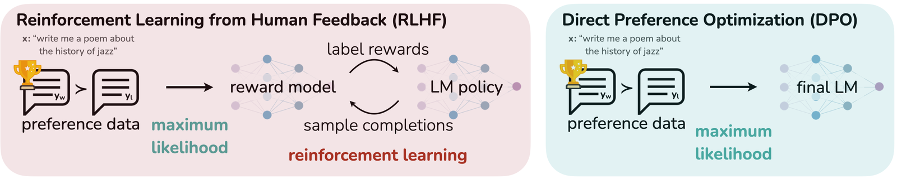
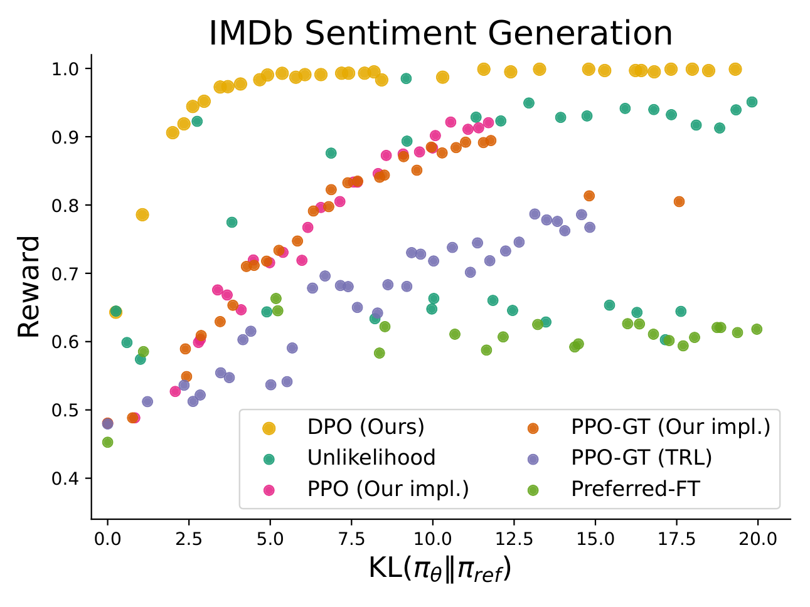
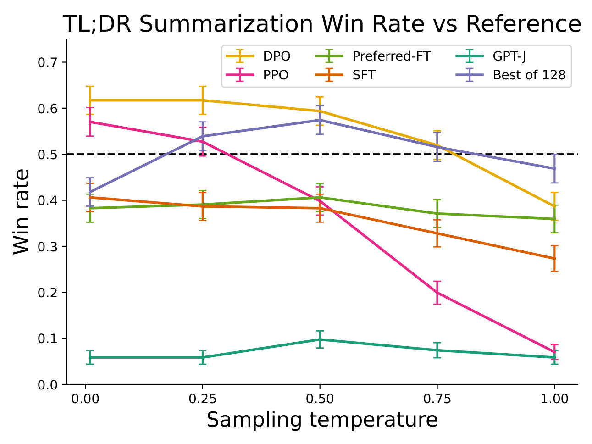
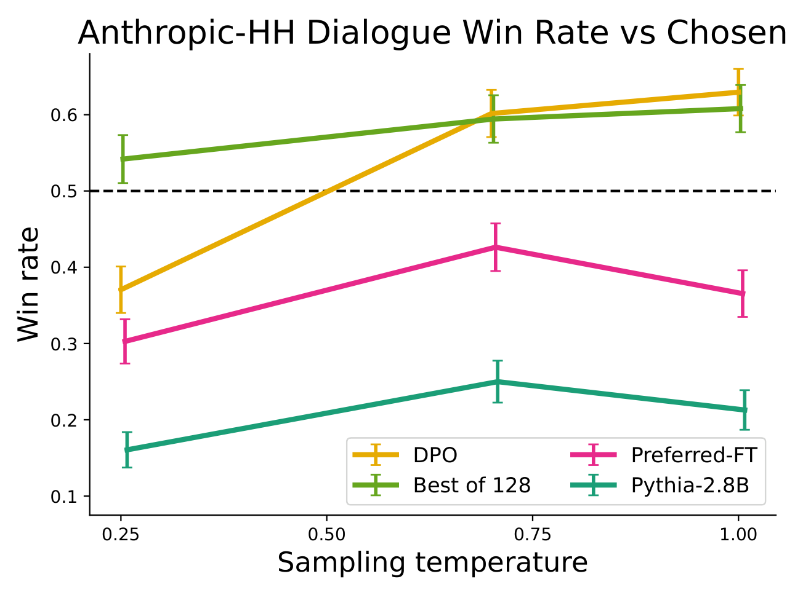
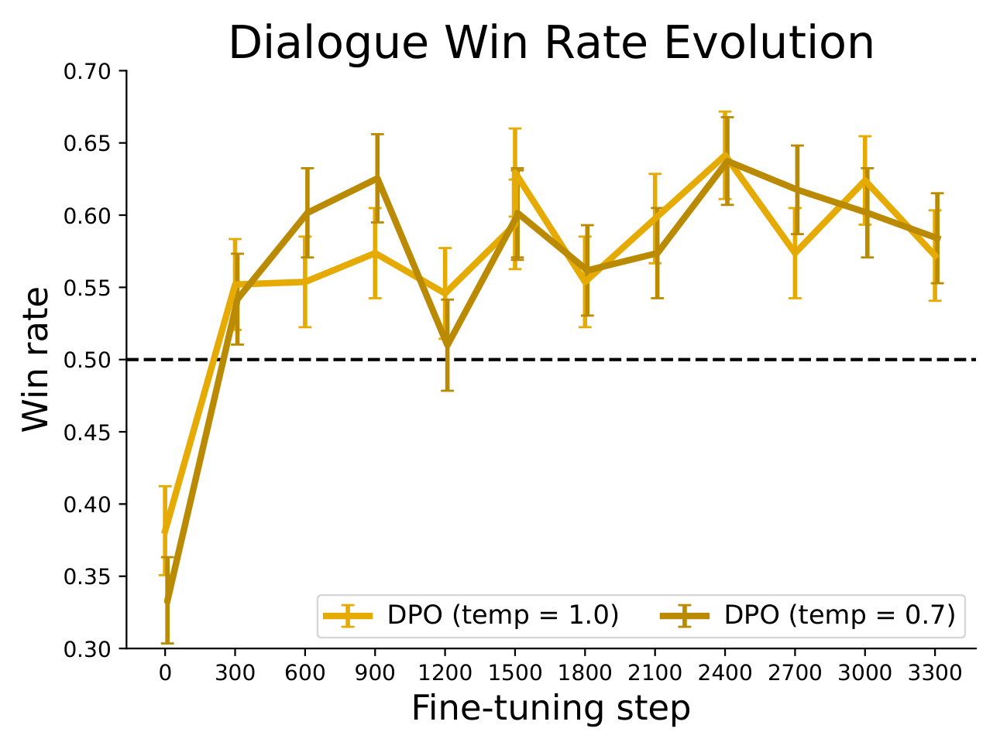

# Direct Preference Optimization: Your Language Model is Secretly a Reward Model 论文解读

## 论文基本信息

| 字段 | 内容 |
| --- | --- |
| 论文 | Direct Preference Optimization: Your Language Model is Secretly a Reward Model |
| 作者 | Rafael Rafailov, Archit Sharma, Eric Mitchell, Stefano Ermon, Christopher D. Manning, Chelsea Finn |
| 机构 | Stanford University; CZ Biohub |
| 发布时间 | 2023-05-29；arXiv v3 修订于 2024-07-29 |
| Venue | NeurIPS 2023 / arXiv |
| 论文链接 | https://arxiv.org/abs/2305.18290 |
| 代码链接 | 论文未说明/未找到 |

## TL;DR

DPO 解决的是 RLHF 工程里最痛的一段：先训练 reward model，再用 PPO 在 KL 约束下优化策略，这套流程复杂、昂贵，还容易不稳定。论文的核心洞察是：在标准 KL-constrained reward maximization 目标下，reward function 和它诱导的最优 policy 之间存在解析映射；把 reward 用 policy/reference policy 的 log-ratio 重参数化后，Bradley-Terry 偏好模型里的 partition function 会在 reward difference 中抵消。

于是，原本“训练 reward model + PPO 优化 policy”的两阶段流程，可以变成一个直接作用在偏好对 $(x, y_w, y_l)$ 上的二分类损失：提高 chosen response 相对 rejected response 的 log probability，同时用 reference model 的 log-ratio 控制偏离。DPO 的训练不需要在线采样、不需要 actor-critic、不需要显式 reward model，却仍等价于拟合一个隐式 reward model 并取其 closed-form optimal policy。

实验上，DPO 在 IMDb 情感控制中给出更好的 reward-KL frontier；在 Reddit TL;DR 摘要中，DPO 在温度 0.0 下 GPT-4 win rate 约 61%，超过 PPO 最优约 57%；在人类评估里，DPO 温度 0.25 的样本有 58% 被偏好于 PPO 温度 0 的样本；在 Anthropic HH 单轮对话中，DPO 是论文报告里唯一能相对 test set chosen completions 提升的高效方法。

## 论文脑图

```markmap
# DPO

## 问题

### RLHF 流程复杂

### PPO 训练不稳定

### reward model 与 policy optimization 分离

## 方法

### KL 约束 RLHF 目标

### optimal policy closed form

### reward-policy 重参数化

### Bradley-Terry 二分类损失

## 实验

### IMDb sentiment

### Reddit TL;DR summarization

### Anthropic HH dialogue

### CNN/DailyMail OOD

### GPT-4 vs human validation

## 结论

### 省掉显式 reward model

### 省掉 PPO/RL loop

### 性能达到或超过 PPO-RLHF

## 局限

### 依赖离线偏好数据质量

### beta 仍需控制 KL/偏好强度

### 多轮、工具、复杂 agent 场景未充分覆盖

## 复现要点

### reference policy 要合理

### 记录 chosen/rejected logprobs

### 默认 beta 0.1

### TL;DR beta 0.5
```

## 研究背景与问题定义

大语言模型预训练会学到大量知识和能力，但它并不知道人类真正希望它在某个任务中选择哪种行为。RLHF 的常见做法是：

1. 用高质量示范做 SFT，得到 reference/SFT policy。
2. 对同一 prompt 采样多条回答，让人类标注偏好，训练 reward model。
3. 用 PPO 等 RL 算法最大化 reward，同时加 KL 约束防止 policy 偏离 reference 太远。

论文指出，这个流程的复杂性主要来自第 2 和第 3 步的分离：reward model 先被拟合出来，policy 再通过 RL 去优化它。语言生成是离散采样，PPO 还要处理 reward normalization、value function、KL 控制、采样温度、训练稳定性等一堆工程细节。

DPO 的问题定义是：给定离线偏好数据

$$
\mathcal{D}=\{x^{(i)}, y_w^{(i)}, y_l^{(i)}\}_{i=1}^N
$$

其中 $y_w$ 是 preferred completion，$y_l$ 是 dispreferred completion，能否不训练显式 reward model、不跑 PPO，直接把 policy 训练到满足偏好？



原文 Figure 1 对比了传统 RLHF 和 DPO：传统路线先拟合 reward model，再用 RL 找高 reward policy；DPO 直接用偏好对优化 policy，本质上拟合的是一个由 policy/reference log-ratio 定义的隐式 reward model。

## 核心方法

### 1. 从 KL-constrained RLHF 目标开始

论文沿用标准 RLHF 目标：

$$
\max_{\pi_\theta}\mathbb{E}_{x\sim\mathcal{D}, y\sim\pi_\theta(y|x)}[r_\phi(x,y)]
-\beta D_{\mathrm{KL}}[\pi_\theta(y|x)\Vert\pi_{\mathrm{ref}}(y|x)]
$$

其中 $\beta$ 控制 policy 相对 reference 的偏离程度。对任意 reward $r$，这个 KL 约束 reward maximization 的最优 policy 有 closed form：

$$
\pi_r(y|x)=\frac{1}{Z(x)}\pi_{\mathrm{ref}}(y|x)\exp\left(\frac{1}{\beta}r(x,y)\right)
$$

把它反解成 reward：

$$
r(x,y)=\beta\log\frac{\pi_r(y|x)}{\pi_{\mathrm{ref}}(y|x)}+\beta\log Z(x)
$$

关键点是：Bradley-Terry 偏好模型只看两个回答的 reward difference，$\beta\log Z(x)$ 对同一个 prompt 下的两个回答相同，所以会抵消。

### 2. 把 reward loss 改写成 policy loss

Bradley-Terry 模型假设：

$$
p^*(y_1\succ y_2|x)=\sigma(r^*(x,y_1)-r^*(x,y_2))
$$

将 reward-policy 重参数化代入后，可以直接用 policy 表示偏好概率。于是得到 DPO loss：

$$
\mathcal{L}_{\mathrm{DPO}}(\pi_\theta;\pi_{\mathrm{ref}})
=-\mathbb{E}_{(x,y_w,y_l)\sim\mathcal{D}}
\left[
\log\sigma\left(
\beta\log\frac{\pi_\theta(y_w|x)}{\pi_{\mathrm{ref}}(y_w|x)}
-\beta\log\frac{\pi_\theta(y_l|x)}{\pi_{\mathrm{ref}}(y_l|x)}
\right)
\right]
$$

直觉上，它不是简单地最大化 $y_w$、最小化 $y_l$，而是最大化“policy 相对 reference 对 chosen 的偏好提升”减去“policy 相对 reference 对 rejected 的偏好提升”。这让 reference policy 成为 KL 控制的锚。

### 3. 梯度解释：提高 chosen，压低 rejected，但带动态权重

论文给出 DPO 梯度的机械解释：它会增加 $y_w$ 的 log probability，降低 $y_l$ 的 log probability；但每个样本有一个动态权重，取决于当前隐式 reward model 是否仍把 rejected 排得过高。

隐式 reward 定义为：

$$
\hat{r}_\theta(x,y)=\beta\log\frac{\pi_\theta(y|x)}{\pi_{\mathrm{ref}}(y|x)}
$$

如果当前模型已经很确信 chosen 比 rejected 好，这个样本的更新会变小；如果模型仍排序错误，更新会变大。这也是它比 naive unlikelihood 更稳的原因之一。

### 4. 理论含义：语言模型就是隐式 reward model

论文 §5 的标题很点题：Your Language Model Is Secretly a Reward Model。DPO 不是完全“没有 reward”，而是不再训练一个独立 reward network；policy 和 reference 的 log-ratio 本身就定义了一个 reward equivalence class 中的规范代表。

作者证明了在 Plackett-Luce/Bradley-Terry 偏好框架下：

- 同一个 reward equivalence class 中相差 $f(x)$ 的 reward 诱导相同偏好分布。
- 同一个 reward equivalence class 诱导相同 KL-constrained optimal policy。
- 在 reference policy full support、$\beta>0$ 等条件下，每个 reward equivalence class 都可以由 $r(x,y)=\beta\log\frac{\pi(y|x)}{\pi_{\mathrm{ref}}(y|x)}$ 表示。

这解释了为什么 DPO 可以不显式估计 $Z(x)$、不显式训练 reward model，也能对齐到标准 RLHF 目标对应的最优 policy。

## 实验设置与主要结果

### 1. IMDb 情感控制：DPO 的 reward-KL frontier 更优

IMDb 实验是受控设置：prompt 是 IMDb 影评前缀，目标是生成正向情感文本；偏好对由预训练 sentiment classifier 自动构造，因此可以拿 classifier 当 ground-truth reward，直接画 reward vs KL frontier。



原文 Figure 2 左图显示，DPO 在相同 KL 下达到更高 reward，或者说在相同 reward 下偏离 reference 更少。论文还强调：DPO 的 frontier 不仅优于普通 PPO，也优于能访问 ground-truth reward 的 PPO-GT，说明瓶颈不只是 reward model 质量，还包括 PPO 优化本身的效率和稳定性。

### 2. Reddit TL;DR 摘要：DPO 超过 PPO 最优温度

TL;DR 实验使用 Reddit TL;DR summarization 数据和 Stiennon et al. 的人类偏好数据。DPO、PPO、Preferred-FT 都从同一个 GPT-J SFT model 出发，评价由 GPT-4 对模型摘要和 reference summary 做 win-rate 判断。



原文报告：DPO 在 temperature 0.0 下 win rate 约 61%，超过 PPO 在其最优 temperature 0.0 下约 57%。DPO 的最大 win rate 也高于 Best-of-N baseline，并且对 sampling temperature 更鲁棒；PPO 在高温下会退化到接近 base GPT-J 的水平。人类评估中，DPO temperature 0.25 的样本有 58% 被偏好于 PPO temperature 0 的样本。

### 3. Anthropic HH 单轮对话：DPO 是唯一高效提升方法

Anthropic HH 实验使用一轮 human-assistant interaction。因为没有标准 SFT model，作者从 Pythia-2.8B 出发，用 preferred completions 做 Preferred-FT 得到 reference，再训练 DPO。评价仍用 GPT-4，与 test set preferred completions 比 win rate。



原文结论是：DPO 是唯一能够相对 Anthropic HH test set preferred completions 提升的计算高效方法，并且达到与 Best-of-128 这种昂贵 reranking baseline 类似或更好的表现。作者还尝试评估一个公开 PPO HH 模型，但没有找到让它超过 base Pythia-2.8B 的 prompt 或 sampling temperature。



训练曲线显示，DPO 在 HH dialogue 上比较快达到较好性能，并且不同 sampling temperature 下的提升相对稳定。

### 4. OOD 泛化与人类验证

论文还做了两个重要 sanity check：

| 检查 | 设置 | 结果 |
| --- | --- | --- |
| CNN/DailyMail OOD | 将 Reddit TL;DR 上训练的 DPO/PPO policy 迁移到 CNN/DailyMail 新闻摘要 | DPO 在 temp 0/0.25 下 win rate 为 0.36/0.31，PPO 为 0.26/0.23 |
| GPT-4 vs human | TL;DR 上比较 DPO/SFT/PPO-1 与 PPO temperature 0 | 人类对 DPO 的 win rate 为 58%，GPT-4(C) 为 54%；GPT-4 与人类一致率接近人类互相一致率 |

这些结果支持两个说法：第一，DPO 不只是过拟合 Reddit TL;DR 输入分布；第二，论文用 GPT-4 做 win-rate evaluator 有一定合理性，但作者也承认 prompt 选择会影响 GPT-4 对长度和简洁性的偏好。

### 5. 实现细节

附录给出一个很短的 PyTorch DPO loss。默认设置：

- $\beta=0.1$，TL;DR summarization 使用 $\beta=0.5$。
- batch size 64。
- RMSprop optimizer。
- learning rate $1e{-6}$。
- 线性 warmup 150 steps。

IMDb 附录细节中，作者使用 GPT-2-large 作为 base model，用 `siebert/sentiment-roberta-large-english` 作为 ground-truth sentiment reward；对 25,000 个 prefixes 各采样 4 个 completions，构造每个 prefix 6 个 preference pairs。

## 当前工作 vs Related Work

| 方法 | 核心思路 | 主要假设 | 证据/表现 | 局限或代价 |
| --- | --- | --- | --- | --- |
| DPO | 将 KL 约束 RLHF 目标重参数化成 policy 上的 preference classification loss | 偏好可由 Bradley-Terry/Plackett-Luce 类模型描述，reference policy 有足够 support | IMDb frontier 优于 PPO/PPO-GT；TL;DR 约 61% vs PPO 约 57%；HH 对话表现强 | 依赖离线偏好数据质量；复杂多轮/工具场景未覆盖 |
| PPO-RLHF | 显式训练 reward model，再用 PPO 优化 reward - KL | reward model 足够准确，PPO 可稳定优化离散生成 policy | InstructGPT/RLHF 标准路线，实践影响巨大 | 工程复杂、采样昂贵、value/reward/KL tuning 难 |
| Reward model + Best-of-N | 从 reference 采样 N 个候选，用 reward model rerank | reward model 可有效排序，测试时可以承受 N 次采样 | 论文中 Best-of-128 是强 baseline | 推理成本高，N 较大才强，不直接更新 policy |
| Preferred-FT | 只对 chosen completions 做监督微调 | chosen response 足以代表偏好方向 | 简单稳定 | 忽略 rejected response 和 KL/reward 结构，论文中提升有限 |
| Unlikelihood | 提高 chosen、降低 rejected 的概率 | 直接压低 rejected 有助于偏好学习 | 实现简单 | 论文发现复杂任务中可能退化，缺少 DPO 的动态权重和 reference ratio |

## 启发、局限与可复现要点

- 启发：DPO 的真正贡献不是“不要 reward”，而是把 reward 隐式藏进 policy/reference log-ratio 里，让最优 policy 可以直接学习。
- 启发：偏好优化中的 reference model 非常重要；它既是 KL 约束的锚，也是隐式 reward 的基准。
- 启发：DPO 将 RLHF 从 online RL 训练问题变成 offline supervised-style preference learning，极大降低工程复杂度。
- 启发：DPO 的样本权重解释很有用：模型越把 rejected 错排到 chosen 之上，更新越大。
- 局限：DPO 默认偏好数据是离线固定的，不能像在线 RL 那样边探索边发现新偏好区域。
- 局限：论文实验是情感、摘要、单轮对话，尚未覆盖复杂多轮工具调用、代码执行、长期 agent 任务。
- 局限：$\beta$ 仍然是关键超参；太小/太大都会改变偏好强度和 KL 控制。
- 局限：GPT-4 评估虽有人类验证，但仍可能受 prompt、长度偏好和评估模型偏差影响。
- 复现要点：必须保存 policy 和 reference 对 chosen/rejected 的 sequence logprob，而不是 token 平均随意混用。
- 复现要点：reference policy 应尽量接近偏好数据采样 policy；如果原 SFT policy 不可用，论文建议先对 preferred completions 做 MLE 得到 reference。
- 复现要点：TL;DR 可从 $\beta=0.5$ 起试，其他任务可从 $\beta=0.1$ 起试。
- 可能的下一步实验：在多轮 RLHF、tool-use、math reasoning 和代码任务上比较 DPO、PPO、IPO/KTO/SimPO 等偏好优化算法的 reward-KL frontier 和 OOD 泛化。

## 再读一遍路线

1. 先看 Figure 1 和 Introduction，明确 DPO 要替换 RLHF 的哪两步：显式 reward model 和 PPO。
2. 再读 §3 Preliminaries，把 Bradley-Terry reward model 和 KL-constrained RLHF 目标写清楚。
3. 重点读 §4，从 optimal policy closed form 到 DPO loss，这是全篇核心。
4. 接着读 §5，理解为什么 policy/reference log-ratio 可以代表 reward equivalence class。
5. 最后读 §6 和 Appendix C，核对 IMDb、TL;DR、HH 的评估设置、GPT-4 judge、人类验证和默认超参。

# 深度 Q&A

**Q1：DPO 是不是完全不需要 reward model？**

A：它不需要训练一个显式、独立的 reward model。但从理论上看，DPO 的 policy/reference log-ratio 定义了一个隐式 reward：$\hat{r}_\theta(x,y)=\beta\log\frac{\pi_\theta(y|x)}{\pi_{\mathrm{ref}}(y|x)}$。所以更准确地说，DPO 把 reward model 和 policy 合在了同一个语言模型里。

**Q2：为什么 DPO 可以省掉 PPO？**

A：因为 KL 约束 reward maximization 的最优 policy 有解析形式。把 reward 反写成 optimal policy 与 reference policy 的 log-ratio 后，偏好模型可以直接表示为 policy 的函数，于是训练目标变成一个二分类 MLE loss，而不是需要采样 rollout 的 RL 目标。

**Q3：DPO loss 和普通 binary cross entropy 有什么差别？**

A：形式上是二分类 loss，但 logit 不是普通分类器输出，而是 chosen/rejected 在 policy 相对 reference 下的 log-ratio 差值，并乘以 $\beta$。这使它同时编码偏好方向和 KL/reference 约束。

**Q4：为什么 partition function $Z(x)$ 可以消掉？**

A：Bradley-Terry 模型只依赖同一个 prompt 下两个回答的 reward difference。重参数化 reward 中的 $\beta\log Z(x)$ 对 $y_w$ 和 $y_l$ 是同一项，相减时抵消。

**Q5：DPO 和 Preferred-FT 最大区别是什么？**

A：Preferred-FT 只最大化 chosen completion 的似然，忽略 rejected completion，也不显式考虑相对 reference 的偏移。DPO 同时看 chosen 与 rejected，并通过 policy/reference log-ratio 把 KL 约束放进目标。

**Q6：DPO 为什么比 naive unlikelihood 稳？**

A：naive unlikelihood 直接压低 rejected，可能在复杂生成任务中导致模型退化。DPO 的梯度有动态权重：当当前隐式 reward 已经正确排序时更新变小，错误排序时更新变大，并且每一步都相对 reference 做比较。

**Q7：实验里 DPO 相比 PPO 最强的证据是什么？**

A：IMDb 中 DPO 的 reward-KL frontier 严格优于 PPO，甚至优于访问 ground-truth reward 的 PPO-GT；TL;DR 中 DPO 约 61% win rate 超过 PPO 约 57%；人类评价里 DPO 样本 58% 胜过 PPO 样本。

**Q8：DPO 的主要工程优势是什么？**

A：它可以用离线 preference pairs 做常规 supervised fine-tuning 风格训练，不需要在线采样、不需要 value model、不需要 PPO rollout、不需要单独 reward model 部署，训练管线短很多。

**Q9：DPO 的主要风险是什么？**

A：它很依赖偏好数据分布和 reference policy。如果 preference pairs 来自和 reference 差很远的模型，或者数据中 chosen/rejected 噪声很大，DPO 的隐式 reward 也会学歪。另外，$\beta$ 控制偏好强化和 KL 保守性，仍需要调。

**Q10：DPO 是否适合所有 RLHF 场景？**

A：不一定。DPO 很适合离线偏好对充分、任务可由 pairwise preference 表达的场景。对于需要在线探索、环境反馈、长程 credit assignment、多轮工具调用的 agent 任务，DPO 可能需要和在线数据收集或其他 RL 方法结合。

**Q11：为什么论文说语言模型 secretly 是 reward model？**

A：因为一旦固定 reference policy，任何 policy 都可以通过 $\beta\log\frac{\pi}{\pi_{\mathrm{ref}}}$ 诱导一个 reward。训练 policy 满足偏好，就等价于训练这个隐式 reward 满足偏好；而这个 reward 的 closed-form optimal policy 正是当前 policy。

**Q12：这篇论文后续影响为什么大？**

A：它把偏好对齐从复杂 RL 工程变成了一个简单、稳定、容易规模化的 loss。后来的很多偏好优化算法和 LLM post-training 配方，都在 DPO 的基础上调整 reward form、regularization、reference 使用方式或数据构造。
