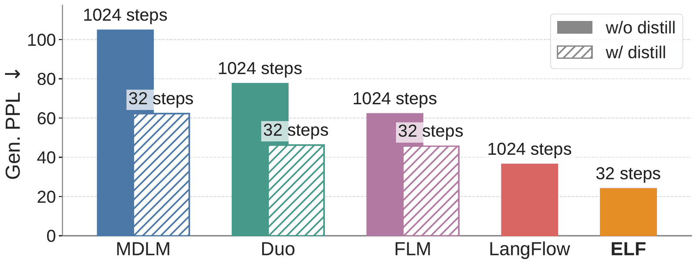
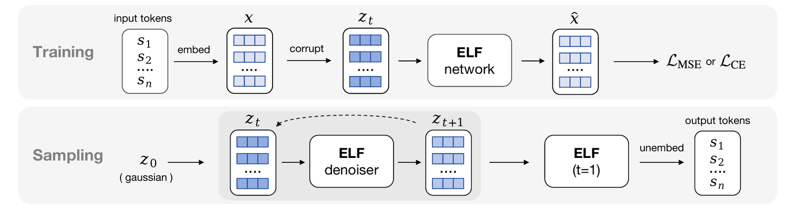
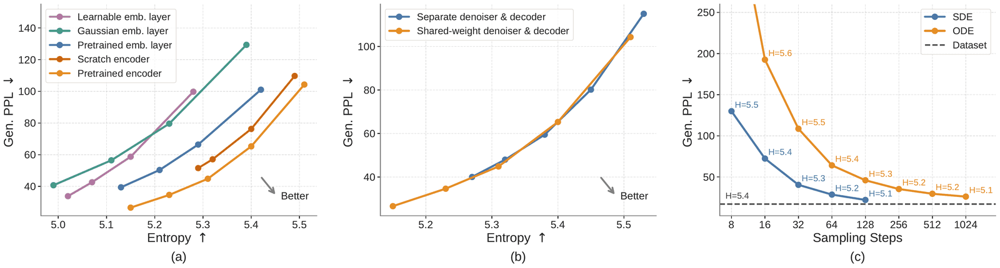
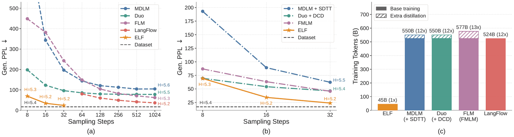
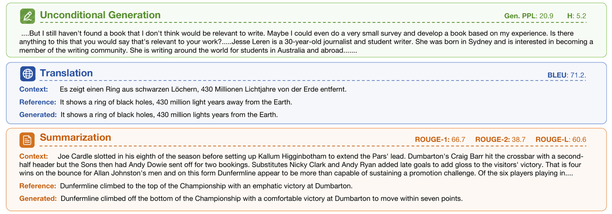

# ELF: Embedded Language Flows

ELF 在连续 embedding 空间中建模语言生成流，再映射回离散 token，为非自回归或少步文本生成提供一种新路径。

## 论文信息

| 字段 | 内容 |
| --- | --- |
| 作者 | Keya Hu, Linlu Qiu, Yiyang Lu, Hanhong Zhao, Tianhong Li, Yoon Kim, Jacob Andreas, Kaiming He |
| 机构 | MIT |
| 日期 | 2026-05-11 初版；2026-06-26 v2 修订 |
| 代码 | https://github.com/lillian039/ELF |
| 链接 | https://arxiv.org/abs/2605.10938 |

## 一句话结论

ELF 的关键尝试是绕开离散 token 的直接扩散难题，在 embedding 空间中学习语言生成流。

## 背景与问题

文本生成主流是自回归模型，但串行解码带来延迟。扩散语言模型尝试并行生成离散 token，却常受离散空间噪声设计和训练成本限制。ELF 选择把语言放到连续 embedding 中建模，再通过解码器回到 token。

## 方法拆解

ELF 使用预训练嵌入系统，将文本映射到连续空间，训练 flow 模型生成这些 embedding，再由解码模块还原文本。这样既利用连续生成模型的优势，又避免直接在离散 token 上定义复杂扩散过程。



ELF 将文本生成转化为 embedding 空间中的连续流建模。



模型先在嵌入空间生成连续表示，再通过解码映射为离散语言。



论文比较 embedding、训练目标和解码方式等关键选择。



ELF 与自回归、扩散语言模型等路线在生成机制上不同。



样例展示 ELF 在不同任务中的文本生成表现。

## 实验复盘

在 OWT 上，ELF Gen PPL 随 8/16/32 步分别为 67.32、33.66、24.08，entropy 约 5.14/5.16/5.15。训练 token 约 45B，低于部分 DLM 超过 500B 的规模。任务上，De-En BLEU 26.4，XSum R1/R2/RL 为 36.0/12.2/27.8。

## 和相关工作的区别

相较自回归 LM，ELF 目标是减少串行依赖；相较离散 diffusion LM，它把噪声和流放到连续 embedding 空间；相较纯 encoder-decoder，它引入生成流作为核心机制。

## 局限与启发

embedding 到 token 的解码仍可能成为瓶颈，长文本一致性和开放式质量与大 AR 模型仍有差距。启发是：语言 AIGC 不必只在 token 序列上建模，也可以先生成语义连续场。

## 读论文脑图

```markmap
- ELF: Embedded Language Flows
  - 问题
    - AR 解码串行，离散扩散训练困难
  - 方法
    - 在 embedding 空间学习 language flows
  - 实验
    - OWT 32 步 Gen PPL 24.08，45B token 训练
  - 启发
    - 连续表示为文本少步生成打开新路线
```

# 深度 Q&A

## Q1: ELF 为什么不用直接生成 token？

因为 token 是离散符号，定义平滑的生成轨迹比较困难。embedding 空间连续，更适合 flow 类方法。

## Q2: 它能替代自回归模型吗？

目前更像补充路线。自回归模型在开放式长文本上仍强，但 ELF 展示了低串行依赖的潜力。

## Q3: Gen PPL 随步数下降说明什么？

更多步数给连续流更多修正机会，文本分布更接近真实语料。

## Q4: 为什么训练 token 数值得关注？

ELF 用约 45B token 得到可比较结果，说明这一路线未必需要极端大规模预训练才能有效。

## Q5: embedding 解码会带来什么问题？

连续向量需要映射回离散 token，可能出现语义接近但词面错误、重复或句法不自然。

## Q6: 和扩散语言模型的关系是什么？

ELF 继承少步/并行生成愿景，但避开直接在离散 token 空间扩散。

## Q7: 适合哪些场景？

适合机器翻译、摘要、候选生成、草稿生成等对延迟和并行性敏感的任务。

## Q8: 最大研究问题是什么？

如何把 embedding 流的局部质量扩展到长上下文、强指令跟随和复杂推理。

## Q9: 这篇论文最适合和哪类工作一起读？

适合和 diffusion / flow matching / consistency model / autoregressive generation 相关工作一起读。它的位置不是单点技巧，而是在采样步数、训练目标、表示空间和系统约束之间重新分配复杂度。

## Q10: 我复现时应该优先看哪些细节？

优先看数据预处理、token 或 latent 表示、训练步数、模型规模、采样步数、guidance 设置和评测协议。生成模型论文里，很多看似小的实现选择都会改变 FID、PPL、BLEU 或可视化质量。

## Q11: 这篇论文给 AIGC 系统设计的启发是什么？

它提醒我们不要只追求更大的模型，也要关心生成过程本身是否适合部署。一步或少步生成、可逆映射、视觉归纳偏置、离散语言流等方向，都在把 AIGC 从“能生成”推向“低延迟、可控、可组合”。
