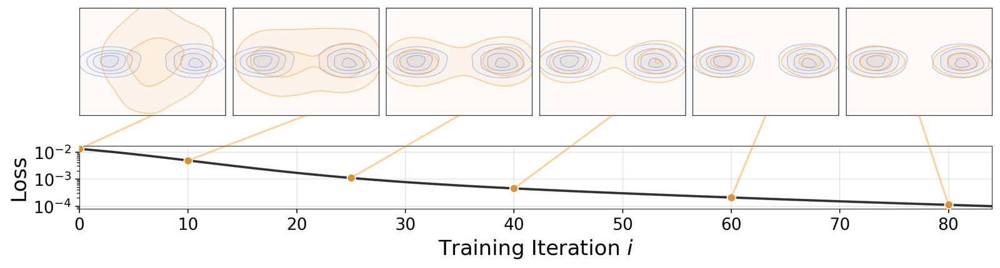
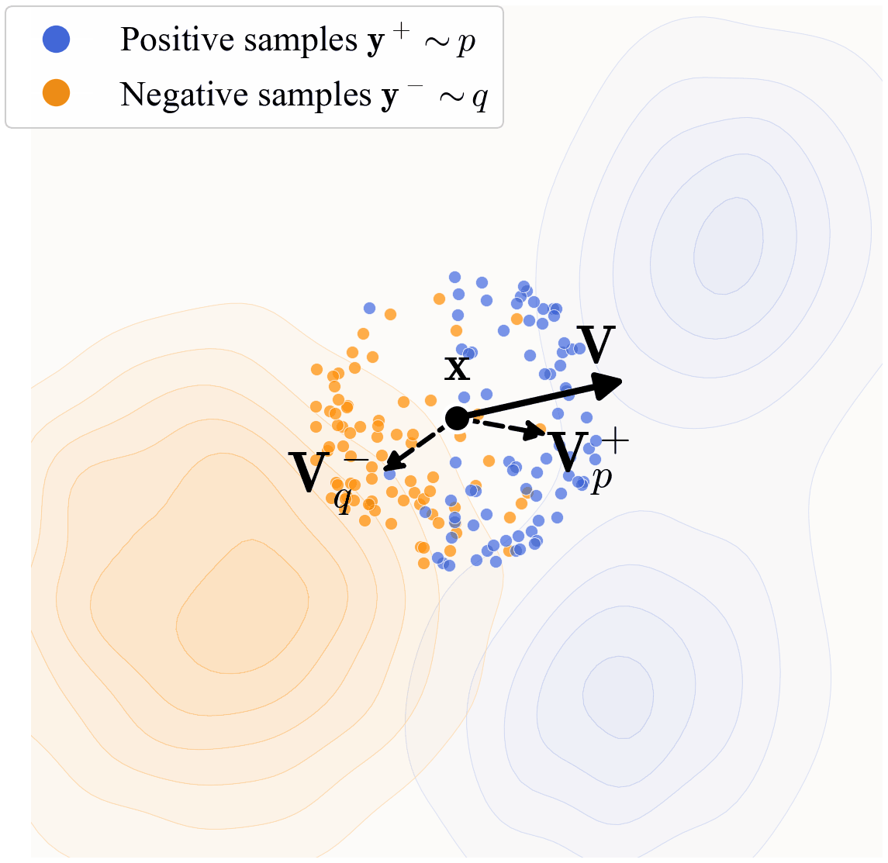
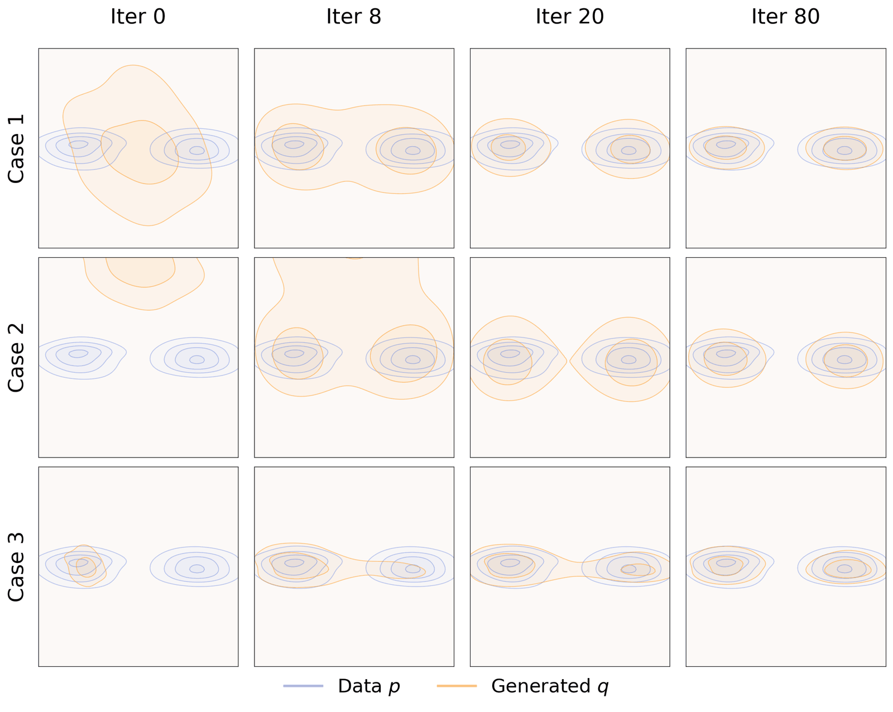
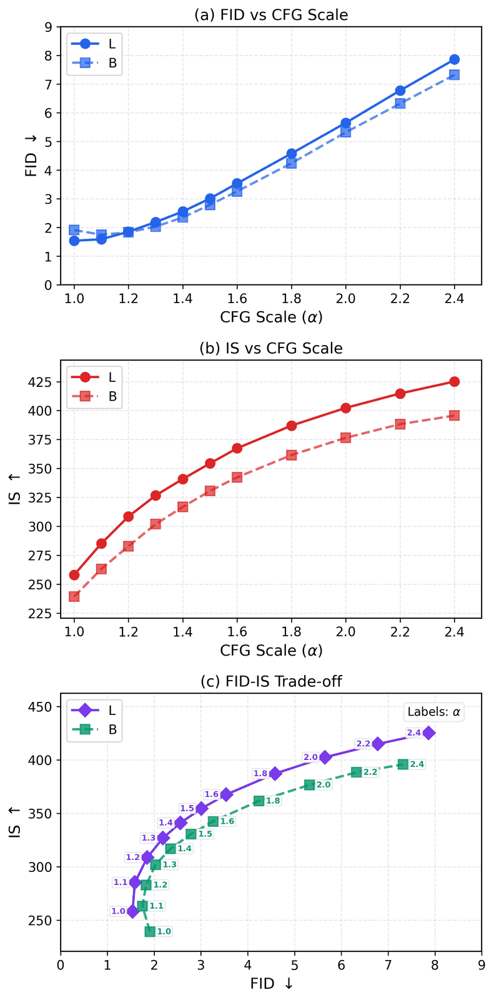

# Generative Modeling via Drifting

Drifting 用学习到的漂移场替代传统多步扩散轨迹，以少步甚至一步方式生成高质量图像，在 latent 与 pixel 设置下都表现强劲。

## 论文信息

| 字段 | 内容 |
| --- | --- |
| 作者 | Mingyang Deng, He Li, Tianhong Li, Yilun Du, Kaiming He |
| 机构 | MIT, Harvard University |
| 日期 | 2026-02-04 初版；2026-02-06 v2 修订 |
| 代码 | 未见官方代码链接 |
| 链接 | https://arxiv.org/abs/2602.04770 |

## 一句话结论

Drifting 的核心是把生成看作学习一个有效漂移方向，而不是严格追随传统扩散或 ODE 的长轨迹。

## 背景与问题

高质量生成通常需要多步去噪或积分。少步生成路线试图减少 NFE，但容易引入路径误差。Drifting 从动力学角度重新组织问题：与其模拟完整轨迹，不如学习能把状态推向数据分布的漂移场。

## 方法拆解

方法训练模型预测漂移方向，并用它驱动样本从噪声分布移动到数据分布。它可用于 latent 和 pixel 两种设置，并兼容条件 guidance。论文重点分析漂移场的学习、采样动态和训练时长对质量的影响。



Drifting 将生成过程看成由漂移场驱动的状态迁移。



模型学习在数据空间中把噪声推向样本区域的向量场。



图示展示不同阶段的漂移方向和样本演化。



guidance 改变质量、多样性和条件一致性的平衡。

## 实验复盘

latent 设置下，Drifting-B/2 FID 1.75，L/2 FID 1.54；pixel 设置下，B/16 FID 1.76，L/16 FID 1.61。消融显示 B/2 从 100ep FID 3.36，到 320ep 2.51，再到 1280ep 1.75；L/2 1280ep 可到 1.54。

## 和相关工作的区别

相较扩散模型，Drifting 不强调逐步还原噪声；相较 mean-flow 路线，它更以漂移动力学为核心解释；相较 consistency，它更关注学习方向场本身。

## 局限与启发

训练轮数和模型规模仍重要，说明少步采样并不等于低训练成本。启发是：生成模型可以从“路径模拟”转向“方向学习”。

## 读论文脑图

```markmap
- Generative Modeling via Drifting
  - 问题
    - 多步采样慢，少步近似易偏
  - 方法
    - 学习漂移场驱动噪声到数据
  - 实验
    - latent FID 1.54，pixel FID 1.61
  - 启发
    - 有效方向场可替代长采样轨迹
```

# 深度 Q&A

## Q1: Drifting 的“漂移”是什么意思？

它指模型学习一个推动样本状态变化的方向场，让噪声逐步或快速向数据分布移动。

## Q2: 它和 diffusion 的区别是什么？

diffusion 通常沿预设噪声过程反向去噪，Drifting 更强调直接学习有用的迁移方向。

## Q3: 为什么 latent 和 pixel 都做实验？

这能证明方法不是只依赖某种表示空间。latent 更高效，pixel 更直接也更难。

## Q4: 训练 epoch 对结果有什么影响？

消融显示训练越充分，FID 显著下降，说明漂移场需要足够数据和优化步数才能学稳。

## Q5: CFG 在这里扮演什么角色？

CFG 调节条件一致性和视觉质量，但过强 guidance 也可能损害多样性。

## Q6: 这篇与 iMF/PMF 有何互补？

它们都在追求低 NFE。iMF/PMF 更突出 mean-flow 目标，Drifting 更突出动力学方向场解释。

## Q7: 工程价值是什么？

如果漂移场能少步生成高质量样本，在线 AIGC 服务可显著降低延迟和推理成本。

## Q8: 主要风险是什么？

对训练配置、采样策略和数据域可能敏感，跨任务泛化还需要更多实验。

## Q9: 这篇论文最适合和哪类工作一起读？

适合和 diffusion / flow matching / consistency model / autoregressive generation 相关工作一起读。它的位置不是单点技巧，而是在采样步数、训练目标、表示空间和系统约束之间重新分配复杂度。

## Q10: 我复现时应该优先看哪些细节？

优先看数据预处理、token 或 latent 表示、训练步数、模型规模、采样步数、guidance 设置和评测协议。生成模型论文里，很多看似小的实现选择都会改变 FID、PPL、BLEU 或可视化质量。

## Q11: 这篇论文给 AIGC 系统设计的启发是什么？

它提醒我们不要只追求更大的模型，也要关心生成过程本身是否适合部署。一步或少步生成、可逆映射、视觉归纳偏置、离散语言流等方向，都在把 AIGC 从“能生成”推向“低延迟、可控、可组合”。
