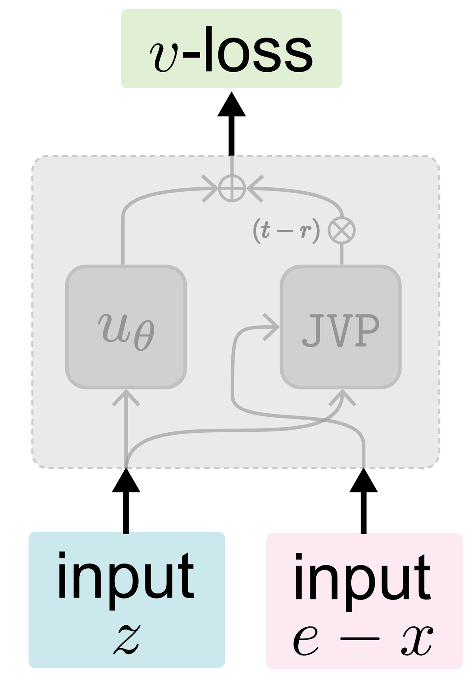
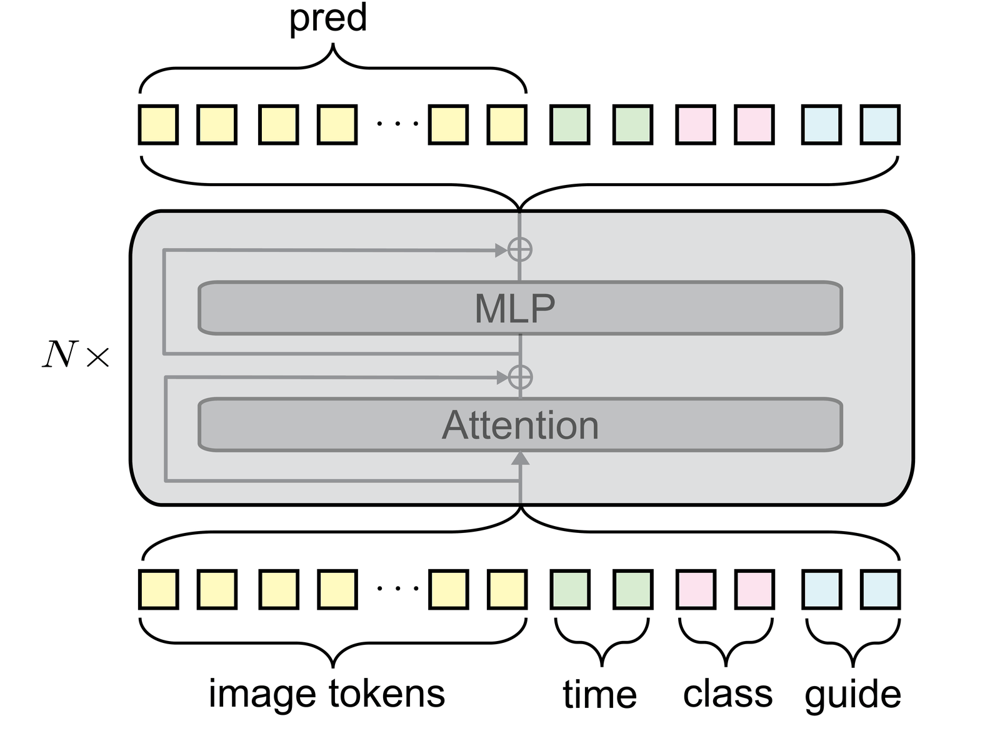
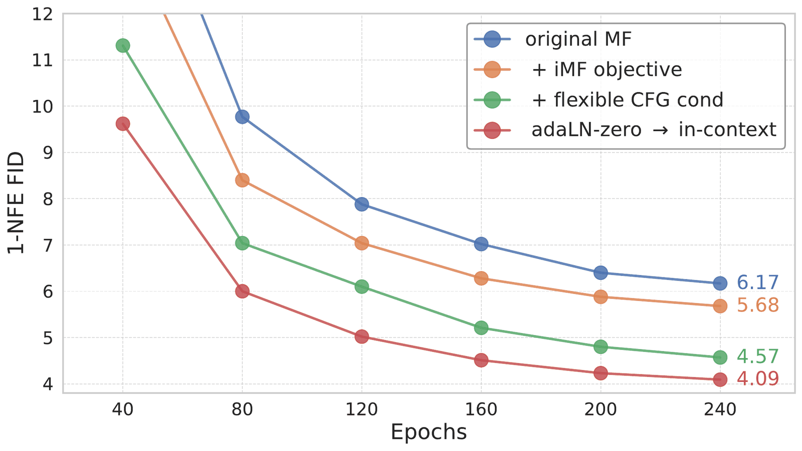
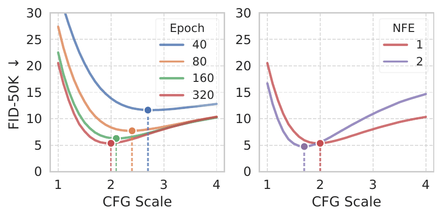

# Improved Mean Flows: On the Challenges of Fastforward Generative Models

iMF 系统分析 Mean Flows 快速生成的挑战，通过目标、架构与训练技巧改进一步生成质量，在 ImageNet 256 上 1-NFE FID 达到 1.72。

## 论文信息

| 字段 | 内容 |
| --- | --- |
| 作者 | Zhengyang Geng, Yiyang Lu, Zongze Wu, Eli Shechtman, J. Zico Kolter, Kaiming He |
| 机构 | CMU, MIT, Adobe, Tsinghua University |
| 日期 | 2025-12-01 初版；2026-05-09 v2 修订 |
| 代码 | 未见官方代码链接 |
| 链接 | https://arxiv.org/abs/2512.02012 |

## 一句话结论

iMF 的贡献不是简单把步数降到 1，而是解释为什么一步生成难，并给出一套可扩展的工程化训练配方。

## 背景与问题

扩散与 flow matching 模型质量高但采样慢。Mean Flows 希望学习能直接跨越时间区间的平均速度场，从而 fast-forward 到样本。但少步生成容易出现目标估计不稳、模型容量不足和 guidance 受限等问题。

## 方法拆解

iMF 围绕 Mean Flows 的平均速度学习做系统改进，包括更合适的参数化、网络结构调整、训练稳定性技巧和可灵活使用的 guidance。它把 fast-forward 生成视作独立建模问题，而不是普通多步采样的粗略截断。



iMF 展示少步生成的样本质量与速度优势。



论文将网络结构、条件注入和训练目标作为整体系统优化。



消融显示改进并非单一技巧，而是多个设计共同推动一步生成质量。



iMF 保留对 guidance 与采样配置的调节能力。

## 实验复盘

ImageNet 256 上，1-NFE iMF-B/M/L/XL 的 FID 为 3.39、2.27、1.86、1.72；2-NFE 可到 1.54。原始 MF-XL/2 的 FID 约 3.43、IS 247.5，而 iMF-XL/2 提升到 FID 1.72、IS 282.0。

## 和相关工作的区别

相较 consistency model，iMF 更接近 flow matching 的时间平均速度学习；相较蒸馏路线，它强调直接训练 fast-forward 生成器。

## 局限与启发

一步生成仍可能牺牲细粒度可控性，并依赖精心训练配置。启发是：AIGC 低延迟生成需要把目标、架构、采样和 guidance 一起设计。

## 读论文脑图

```markmap
- Improved Mean Flows: On the Challenges of Fastforward Generative Models
  - 问题
    - 高质量生成与低 NFE 的冲突
  - 方法
    - 改进 Mean Flows 的目标和训练系统
  - 实验
    - ImageNet 256 1-NFE FID 1.72，2-NFE FID 1.54
  - 启发
    - fast-forward 生成需要专门建模
```

# 深度 Q&A

## Q1: Mean Flows 想解决什么？

它想让模型直接学习跨时间区间的平均变化，而不是一步一步沿 ODE 或扩散轨迹积分。

## Q2: 为什么一步生成难？

一步要同时处理从噪声到数据的巨大变化，任何目标偏差、容量不足或条件注入问题都会被放大。

## Q3: iMF 的提升来自单个 trick 吗？

不是。论文强调多项设计叠加，包括参数化、结构、训练稳定性和 guidance 处理。

## Q4: 1-NFE FID 1.72 有什么意义？

它说明少步生成不一定只能作为质量折中方案，在合适训练下也能接近或超过很多多步基线。

## Q5: 2-NFE 为什么还能提升？

即使模型为 fast-forward 训练，多一次函数评估仍可提供额外校正空间，降低一步跨越带来的误差。

## Q6: 和蒸馏有什么区别？

蒸馏通常依赖教师模型转移采样轨迹，而 iMF 更强调直接学习平均流场。

## Q7: 部署价值在哪里？

低 NFE 直接降低延迟和算力成本，对交互式图像生成、批量内容生产和端侧生成很有吸引力。

## Q8: 还需要担心什么？

需要关注不同数据域上的稳定性、guidance 强度下的退化，以及一步生成是否牺牲多样性。

## Q9: 这篇论文最适合和哪类工作一起读？

适合和 diffusion / flow matching / consistency model / autoregressive generation 相关工作一起读。它的位置不是单点技巧，而是在采样步数、训练目标、表示空间和系统约束之间重新分配复杂度。

## Q10: 我复现时应该优先看哪些细节？

优先看数据预处理、token 或 latent 表示、训练步数、模型规模、采样步数、guidance 设置和评测协议。生成模型论文里，很多看似小的实现选择都会改变 FID、PPL、BLEU 或可视化质量。

## Q11: 这篇论文给 AIGC 系统设计的启发是什么？

它提醒我们不要只追求更大的模型，也要关心生成过程本身是否适合部署。一步或少步生成、可逆映射、视觉归纳偏置、离散语言流等方向，都在把 AIGC 从“能生成”推向“低延迟、可控、可组合”。
