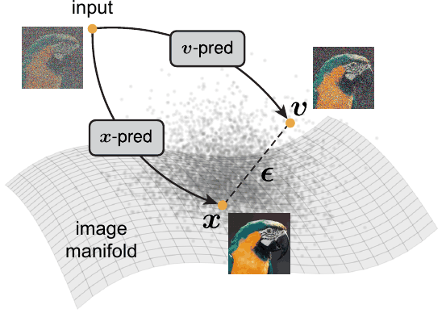
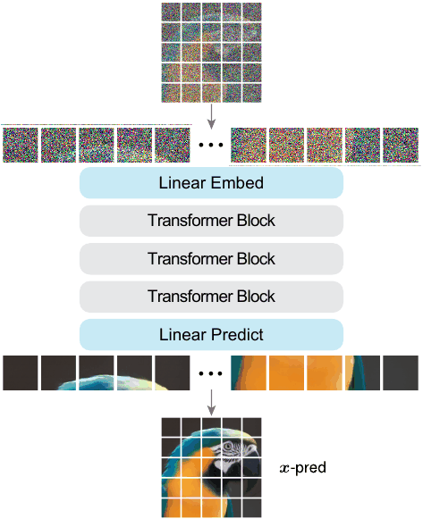
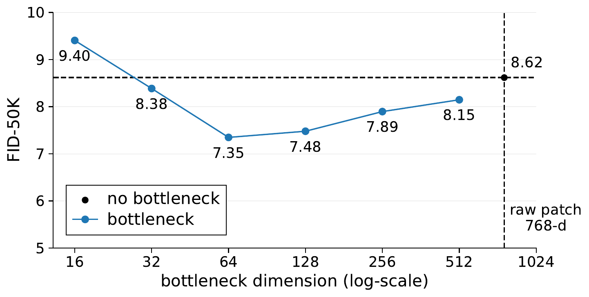

# Back to Basics: Let Denoising Generative Models Denoise

JiT 把扩散模型的中间状态生成器退回到“只做去噪”的本职工作，用 jigsaw tokenization 和 bottleneck 架构减少额外平滑负担，在 ImageNet 上以更朴素的目标拿到强结果。

## 论文信息

| 字段 | 内容 |
| --- | --- |
| 作者 | Tianhong Li, Kaiming He |
| 机构 | MIT |
| 日期 | 2025-11-17 初版；2026-01-07 v2 修订 |
| 代码 | 未见官方代码链接 |
| 链接 | https://arxiv.org/abs/2511.13720 |

## 一句话结论

这篇论文的核心判断是：生成模型不一定需要越来越复杂的中间目标，先让模型真正学会“去噪”本身，反而能提升采样质量与扩展性。

## 背景与问题

扩散模型常被解释为逐步去噪，但实际训练中，网络可能借助局部像素相关性完成较浅的插值任务，而不是学习从噪声回到图像流形的全局生成规律。作者认为这种偏离会让模型在高噪声、少步采样和大模型扩展时付出代价。JiT 因此从输入表示和网络结构两端下手，减少局部捷径。

## 方法拆解

方法由两部分组成。第一，jigsaw tokenization 把图像切成 token 后重新排列，使局部邻域不再天然可见；第二，bottleneck 架构压缩中间表征，让 Transformer 不能简单依赖低层像素复制。训练目标保持简洁，仍然围绕 denoising 展开，重点是改变任务难度与信息路径，而不是堆叠新的损失。



图示强调真实图像分布位于低维流形附近，训练目标应让模型专注把带噪样本拉回数据流形。



JiT 使用 jigsaw tokenization 打乱局部图像块，并用 bottleneck Transformer 处理 token，从结构上弱化直接复制像素的捷径。



bottleneck 限制模型对局部细节的直接访问，迫使网络学习更有语义的去噪映射。

## 实验复盘

ImageNet 256 上，JiT-B/L/H/G 的 FID 分别为 3.66、2.36、1.86、1.82；ImageNet 512 上为 4.02、2.53、1.94、1.78。3x3 预测与损失消融显示，x-pred 配 v-loss 的 FID 为 8.62，而错误组合会显著退化，说明目标参数化仍是关键。

## 和相关工作的区别

相较 DiT 类模型，JiT 不主要追求更复杂的 Transformer，而是改变 token 可见性；相较 consistency 或 rectified flow，它也不是直接把采样步数压到极限，而是重新审视“去噪任务是否足够纯”。

## 局限与启发

局限在于方法仍主要围绕图像生成验证，是否能迁移到视频、3D 或多模态生成还需要更多实证。启发是：AIGC 训练目标的朴素性本身可能是一种优势，但前提是输入结构不允许模型走捷径。

## 读论文脑图

```markmap
- Back to Basics: Let Denoising Generative Models Denoise
  - 问题
    - 局部像素捷径削弱真正去噪学习
  - 方法
    - jigsaw tokenization + bottleneck Transformer
  - 实验
    - ImageNet 256/512 FID 随规模稳定提升
  - 启发
    - 先约束信息路径，再谈生成目标复杂化
```

# 深度 Q&A

## Q1: JiT 为什么叫 back to basics？

因为它不是提出一个更复杂的新生成范式，而是回到扩散模型最初的解释：从噪声中恢复数据。论文认为许多性能问题来自模型没有被迫学习足够困难的去噪映射。

## Q2: jigsaw tokenization 解决了什么？

它破坏局部连续像素块的天然邻接关系，降低模型通过邻域插值完成训练目标的可能性。这样模型更需要整合长程上下文和语义结构。

## Q3: bottleneck 的作用是什么？

bottleneck 限制信息吞吐，让网络不能把输入细节无损传递到输出。它像是把去噪任务从“补局部纹理”推向“恢复全局结构”。

## Q4: 结果说明了什么？

从 B 到 G 规模，FID 在 256 和 512 分辨率上都稳定下降，说明方法具有扩展性，而不是只在小模型上偶然有效。

## Q5: 这和 DiT 的关系是什么？

JiT 可以看作对 DiT 路线的结构性修正：Transformer 仍然是主体，但 token 组织方式和信息瓶颈被重新设计。

## Q6: 论文最有价值的消融是什么？

预测目标与损失参数化的 3x3 消融很重要，它说明“看起来都是去噪”的目标组合差别巨大，不能只看总体框架。

## Q7: 对工程部署有什么意义？

如果训练出的 denoiser 更强，后续少步采样、蒸馏或加速方法都会有更好的起点。它不是直接做部署优化，但会改善上游模型质量。

## Q8: 最大风险是什么？

方法对图像 patch 结构的依赖较强。在文本、音频或视频里，如何定义类似的 jigsaw 与 bottleneck 仍需要重新设计。

## Q9: 这篇论文最适合和哪类工作一起读？

适合和 diffusion / flow matching / consistency model / autoregressive generation 相关工作一起读。它的位置不是单点技巧，而是在采样步数、训练目标、表示空间和系统约束之间重新分配复杂度。

## Q10: 我复现时应该优先看哪些细节？

优先看数据预处理、token 或 latent 表示、训练步数、模型规模、采样步数、guidance 设置和评测协议。生成模型论文里，很多看似小的实现选择都会改变 FID、PPL、BLEU 或可视化质量。

## Q11: 这篇论文给 AIGC 系统设计的启发是什么？

它提醒我们不要只追求更大的模型，也要关心生成过程本身是否适合部署。一步或少步生成、可逆映射、视觉归纳偏置、离散语言流等方向，都在把 AIGC 从“能生成”推向“低延迟、可控、可组合”。
