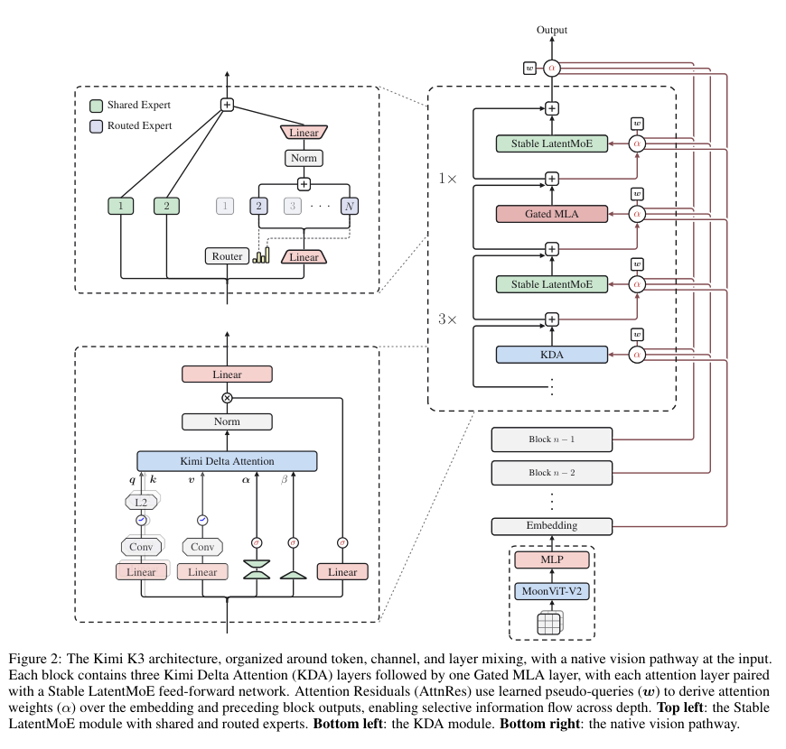
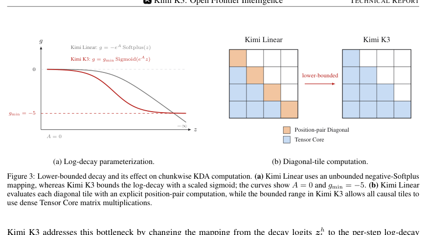
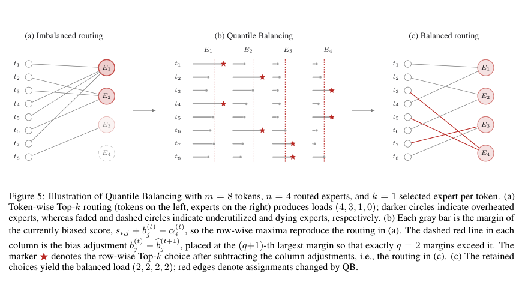
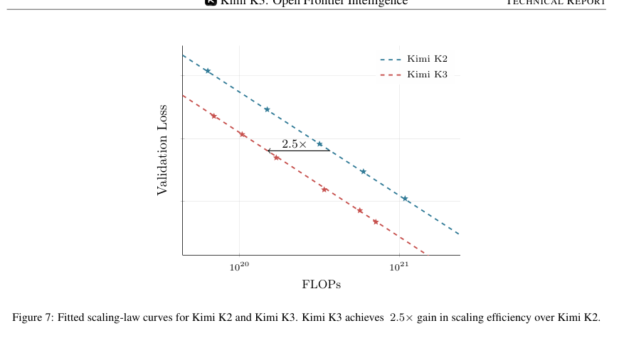
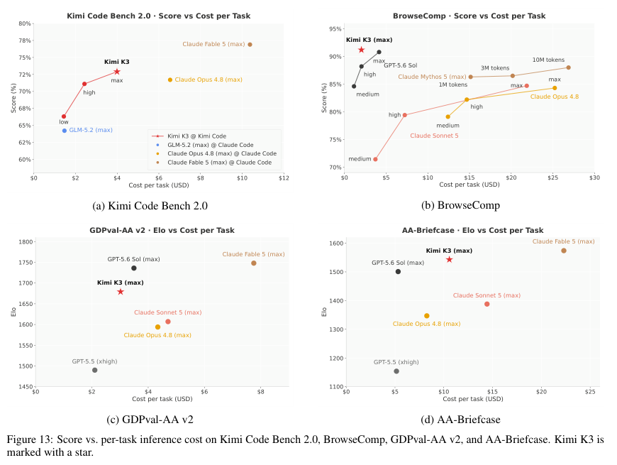

# Kimi K3: Open Frontier Intelligence 论文解读

Kimi K3 的重点不只是把模型放大到 2.78T 参数，而是回答一个更难的问题：当稀疏模型、百万 token 上下文、原生视觉与可持续数千次工具调用的 agent 训练同时出现时，模型结构、优化器、并行系统和 RL 环境该怎样协同设计？这份 47 页技术报告给出的答案，是一条从 pre-training 到 serving 都围绕“有效计算”重构的路线。

## 论文基本信息

| 字段 | 内容 |
| --- | --- |
| 论文 | Kimi K3: Open Frontier Intelligence |
| 作者 | Kimi Team |
| 机构 | Moonshot AI |
| 发布时间 | 2026-07-27 初版；2026-08-07 v2 修订 |
| Venue | arXiv |
| 论文链接 | https://arxiv.org/abs/2607.24653 |
| 开放权重 | https://huggingface.co/moonshotai/Kimi-K3 |

## TL;DR

Kimi K3 是一个开放权重、原生多模态的 2.78T 参数 MoE，单 token 激活 104.2B 参数，支持 1M 上下文。它把每组三层 Kimi Delta Attention（KDA）与一层 Gated MLA 交错，沿深度加入 Attention Residuals，沿通道用 Stable LatentMoE 把 896 个路由专家压进 3584 维 latent space，每个 token 选择 16 个专家。论文报告，这组架构、数据与训练改动相对 Kimi K2 带来约 2.5 倍整体缩放效率。

真正值得读的不是“3T”这个数字，而是作者如何让极端稀疏仍可训练、让线性注意力真的吃满 Tensor Core、让九个领域/推理强度专家最终合成一个模型，以及如何保留跨 RL iteration 的超长 rollout 和 sandbox 状态。结果上，K3 在 coding、浏览和 web development 上进入前沿区间，并在多个任务上形成较好的分数—成本前沿；但研究级推理、独立安全评估和不同模型间完全等价的评测口径仍是明显短板。

```markmap
# Kimi K3
## Pre-training foundation
### 2.78T total / 104.2B active
### 1M context
### Native text-image-video training
## Architecture
### 3× KDA + 1× Gated MLA
### Block Attention Residuals
### Stable LatentMoE
#### 896 routed experts
#### 16 active per token
#### RMSNorm + SiTU-GLU + QB
### MoonViT-V2
## Post-training
### SFT cold start
### 3 domains × 3 effort levels
### Multi-Teacher On-Policy Distillation
## System
### FlashKDA and KDA context parallelism
### Balanced expert parallelism
### Persistent rollout and sandbox states
### Cache- and budget-aware serving
## Evidence
### 2.5× scaling efficiency
### Frontier coding and agent results
### Strong score-cost frontier
```

## 1. 这篇论文试图解决什么

前沿模型的瓶颈已经从“参数够不够多”变成四种约束的耦合：总参数继续扩大，但每 token 的计算不能同比增长；上下文从十万走向百万，标准注意力的 KV cache 与通信成本迅速恶化；agent rollout 需要跨数百到数千次工具调用保持世界状态；视觉又不能只是后挂一个冻结 encoder，否则视觉—代码—执行反馈很难在同一轨迹里共同优化。

Kimi K3 因而把信息流分成三个正交方向来扩展：

1. **token 维度**：KDA 承担大部分长程混合，MLA 周期性提供全局、内容选择性的注意力。
2. **深度维度**：Attention Residuals 让当前层按需读取 embedding 与更早的 block，而不是把所有历史层压进一个逐层累加的 residual state。
3. **通道维度**：LatentMoE 让大量路由专家只在低维空间工作，完整宽度的共享专家保留通用变换。

这三个方向共同决定了论文的主线：不是单独追求某个模块的理论新颖性，而是让 3T 级稀疏模型的训练、RL 与部署都能落地。

## 2. 总体架构：三种信息混合叠在一起



图源：论文 Figure 2。右侧是 3 个 KDA 层接 1 个 Gated MLA 层的重复结构，红色连线表示沿深度做选择性读取的 Attention Residuals；左上、左下分别展开 Stable LatentMoE 与 KDA，底部是原生视觉路径。

K3 有 93 层，其中 69 层 KDA、24 层 MLA，hidden size 仍为 7168；相比 K2 的 61 个 MLA 层，它显著加深网络并改为混合注意力。每个 attention layer 后都跟一个 Stable LatentMoE。模型含 896 个 routed experts、2 个 full-width shared experts，每个 token 激活 16 个 routed experts；总参数 2.78T，激活参数 104.2B。

这种设计不是简单地用线性注意力替换 softmax attention。KDA 的固定大小 recurrent state 适合长上下文，但其递归更新不如 attention 天然并行；MLA 虽仍要维护 cache，却保留了不受限的全局 token 交互。3:1 的比例是在效率和选择性容量之间做折中，最后再额外放一层 Gated MLA。

### 2.1 KDA：给遗忘率加下界，换来规整矩阵乘

KDA 使用 delta-rule 更新固定大小状态。它会先衰减旧状态，再按当前 key/value 写入新信息；通道级 forget gate 使不同通道能保持不同记忆跨度。问题在于，Kimi Linear 原本把 log-decay 映射到无下界负数。chunk 内累计衰减过小时，逆缩放因子会溢出 BF16，于是矩阵的对角 tile 只能走显式 position-pair 计算，难以全部转成密集 Tensor Core GEMM。



图源：论文 Figure 3。K3 把每步 log-decay 限制在 `(g_min, 0)`，其中 `g_min = -5`；16-token tile 的累计范围因此可控，原先需要特殊处理的因果对角 tile 也能改用密集矩阵乘。

其核心参数化可写为：

$$
g_t^h = g_{\min}\,\mathrm{Sigmoid}(e^{A_h}z_t^h),\qquad
\alpha_t^h = \exp(g_t^h),\qquad g_{\min}=-5.
$$

因此单步 retention 大于 $e^{-5}\approx 6.7\times10^{-3}$。论文的关键洞察是：一个看似限制表达力的数值下界，反而把不规则因果计算变成规则 GEMM，使算法更贴近硬件。K3 还把 KDA 输出门从低秩参数化换成输入相关的 full-rank projection，并在 recurrent output 上做 head-wise RMSNorm。

### 2.2 Gated MLA：少量全局注意力负责“精确检索”

MLA 把每个 token 的 key/value 压缩进低维 latent vector，降低 cache。K3 的 MLA 不使用显式位置编码（NoPE），并加入输入相关、逐通道的 full-rank output gate。KDA 提供隐式的顺序与近因混合，MLA 则负责无约束的全局内容交互；两者职责分离，也省去了扩展 context 时重调 RoPE 或 YaRN 参数。

### 2.3 Attention Residuals：把深度也当成可检索序列

标准 residual 把前面所有层逐步压缩进同一个状态。Full AttnRes 为每层学习一个 pseudo-query，对 embedding 与所有前序层输出做 softmax 加权；当前层于是可以选择“从哪一层读”。完整形式的算术开销可接受，但需要让所有层输出常驻，给 pipeline parallelism 带来内存和通信压力。

K3 使用 Block AttnRes：把层分成 8 个 12-layer block，加上 embedding 一共形成 9 个可检索来源；block 内用部分和，block 间才做完整 attention。这样把保存状态的开销从 $O(Ld)$ 降为 $O(Nd)$。它解决的是深度方向的信息瓶颈，与 token 方向的 KDA/MLA 互补。

## 3. Stable LatentMoE：把 896 个专家训稳

LatentMoE 先把 routed path 从 7168 维投影到 3584 维，16 个被选专家只在这个 latent space 内工作，再投影回完整宽度；2 个 shared experts 则直接处理 full-width 表示。这样可以扩大专家池与激活专家数，而不让通信和 expert weight traffic 等比例增长。

但极端稀疏带来两个稳定性问题：多个矩阵连续相乘让 routed branch 内部 activation 容易爆炸；近千个专家又使传统固定步长 bias update 容易在“适应太慢”和“负载振荡”间摇摆。Stable LatentMoE 对应给出三件套：

- 在路由专家聚合结果与 up-projection 之间加 RMSNorm，消除不同专家组合导致的尺度漂移。
- 用 SiTU-GLU 替代 SwiGLU。它分别用 softcap 限制 gate 与 up branch，论文设置 $\beta_1=4,\beta_2=25$，因此乘积绝对值上界为 100。
- 用 Quantile Balancing（QB）一次估计满足目标负载的专家 bias，而不是固定步长追赶平均负载。



图源：论文 Figure 5。示例中 8 个 token 经过普通 Top-1 routing 后负载为 `(4,3,1,0)`；QB 根据每个专家的 margin 分位数调整下一步 bias，把目标负载直接校准为 `(2,2,2,2)`。

对 $m$ 个 token、$n$ 个专家和 Top-$k$ routing，目标负载是 $q=mk/n$。QB 先取 Top-$(k+1)$，用第 $k+1$ 名分数作为每个 token 的 cutoff，再从“专家分数减 cutoff”的 margin 中取 $1-k/n$ 分位数，得到下一 step 的 bias。bias 只影响 dispatch，不进入最终 mixture weight，因此不会直接改变 router 的梯度优化。大规模训练中，作者不 gather 数百万 margin，而是对每个专家做直方图统计，一次 all-reduce 聚合 bin count，再近似恢复全局分位数。

这里最有启发性的不是某个新 loss，而是把负载均衡写成“目标分位数求解”。在静态 shape、perfectly balanced expert execution 的系统里，这种算法会直接变成吞吐收益。

## 4. 原生视觉与优化器

K3 的 MoonViT-V2 不是从 SigLIP 等 contrastive encoder 初始化，而是与语言 backbone 一起从头做 next-token prediction。作者发现，预训练视觉 encoder 接入 LLM 后梯度范数更高且频繁尖峰；从头训练的 MoonViT-V2 更稳定，同时在视觉评测上追平 SigLIP 初始化基线。

MoonViT-V2 有 27 层、约 401M 参数，图像与视频共享参数；时空 attention 分解为空间与时间两步，随后做 temporal pooling。投影前的 2×2 pixel shuffle 把 visual token 数缩小 4 倍，使最高 3584×3584 输入仍可容纳于 1M context。

优化器沿用 Muon，但对 Q/K/V 的 momentum matrix 按 head 分块做 Newton–Schulz orthogonalization。Full-matrix Muon 容易让大梯度 head 主导共同更新；Per-Head Muon 把不同 head 的更新尺度拉平，同时略微降低正交化开销。

## 5. 预训练：2.5× 缩放效率来自一组共同改动



图源：论文 Figure 7 与 Table 1。作者在 OOD validation data 上拟合 scaling law，报告 K3 相对 K2 获得约 2.5 倍整体 scaling efficiency；同页表格列出层数、参数、专家、上下文和注意力结构的变化。

| 结构项 | Kimi K2 | Kimi K3 |
| --- | ---: | ---: |
| 层数 | 61 | 93 |
| 总参数 | 1.04T | 2.78T |
| 激活参数 | 32.6B | 104.2B |
| routed experts | 384 | 896 |
| 每 token 激活专家 | 8 | 16 |
| 训练上下文 | 128K | 1M |
| attention | 61 MLA | 69 KDA + 24 MLA |
| activation | SwiGLU | SiTU-GLU |

要谨慎理解“2.5×”：这是架构、数据和 recipe 的联合缩放曲线，不是某个单独模块的消融增益，也不是说最终 2.78T 模型只花了 K2 路线 40% 的总训练费。作者重新搜索 batch size、learning rate、tokens-per-parameter 与模型 shape，并发现分别调到各自最优后 cosine decay 优于 WSD；最终用 1% linear warmup、0.1 weight decay。上下文先从 8K 训练，再扩到 64K，最终经长上下文扩展达到 1M。

数据覆盖 Web、Code、Math、Knowledge 与大规模视觉语料。尤其值得注意的是 programmatic multimodal data：代码与 SVG、3D、网页、游戏、CAD 等渲染结果成对出现。这与后训练中的 visual coding agent 目标是一致的，而不是把“多模态”当作独立 benchmark 能力。

## 6. 后训练：九个专家模型怎样合回一个 K3

后训练分三阶段：SFT 冷启动、领域/推理强度专门化 RL、Multi-Teacher On-Policy Distillation（MOPD）统一。

RL 把任务分为三个大域：general tasks（推理、知识、视觉、搜索与知识工作）、general agents（长程助手、深度研究、写作）和 coding agents（SWE、kernel、web development）。每个域再训练 low/high/max 三档 reasoning effort，因此共有 9 个 teacher policies。

MOPD 在训练时采样领域 $d$ 与 effort $e$，让 student 的 on-policy token 接收对应 teacher 的密集 log-ratio reward，并对极端值裁剪：

$$
r_{\text{opd}}^d(y_t)=\operatorname{clip}\!\left(\operatorname{sg}\log
\frac{\pi_{\text{teacher}}^{(d,e)}(y_t\mid x,y_{<t})}
{\pi_\theta(y_t\mid e,x,y_{<t})},-R_{\max},R_{\max}\right).
$$

这比离线蒸馏更贴近 student 实际访问的状态，也能自然接入 partial rollout。论文还做了 deployment-aware post-training：从 SFT 起对占参数大头的 MoE expert weights 做 MXFP4 QAT，activation 用 MXFP8，非 expert 模块保留更高精度。

### 6.1 RL 环境比算法名字更重要

K3 的训练环境值得单独看：同一 white-box 抽象可组合 tool schema、system prompt、context management、skills、memory 与 subagents，动态实例化 Kimi Code、Claude Code、Codex、OpenClaw、Hermes 等 harness，减少模型对单一 scaffold 的过拟合。

任务侧包含知识图谱驱动的材料检索与合成、可验证的专业工作、GPU kernel 优化、跨 Gmail/Notion/Slack/Canvas mock app 的个人助理、黑盒系统复刻与 web development。个人助理 rollout 最长可到数千次工具调用和数百万累计 context token；最终 reward 由环境状态或独立 verifier 判定，而不是相信模型自报“完成”。

## 7. 基础设施：百万 token agent 不是靠 context length 声明实现的

KDA 用固定 recurrent state 替代随序列增长的 KV cache，但递归依赖会削弱 GPU 并行度。论文为训练/prefill 实现 FlashKDA，把 chunk 内并行和跨 chunk 状态传播重叠；跨设备的 KDA Context Parallelism 传递“累计 transition + local write state”，而不是像普通线性注意力那样只加和局部状态。

MoE 侧，MoonEP 依靠 QB 提供的均匀负载，把 expert execution 变成 perfectly balanced static shapes，并用 zero-copy 通信及计算—通信重叠维持吞吐。RL 侧则保留 partial rollout、外置 KV cache 与可恢复 microVM sandbox：一次超长轨迹不用在一个 iteration 内跑完，也不必在下一轮重建整个工具世界。

服务侧继续利用 KDA state-aware prefix cache，并按 cache locality、剩余 token budget 与请求类别调度。因为小于 2K 和接近 1M 的请求成本横跨约三个数量级，系统对不同请求类实行 budget-based admission control，避免一波长上下文请求拖垮所有短请求的 TTFT。

## 8. 实验结果：强在哪里，证据边界在哪里

论文把最大 reasoning effort 的 K3 与 Claude Fable 5、GPT-5.6 Sol、Claude Opus 4.8、GPT-5.5 及开放权重 GLM-5.2 对比。以下选取能代表模型轮廓的结果：

| 任务 | Kimi K3 | 该表最佳 | 观察 |
| --- | ---: | ---: | --- |
| DeepSWE | 67.5 | GPT-5.6 Sol 73.0 | 接近前沿，但非最佳 |
| Terminal-Bench 2.1 | 88.3 | GPT-5.6 Sol 88.8 | 基本持平 |
| FrontierSWE | 81.2 | Claude Fable 5 86.6 | 排第二 |
| ProgramBench | **77.8** | **Kimi K3 77.8** | 略高于 GPT-5.6 Sol 77.6 |
| SWE-Marathon | **42.0** | **Kimi K3 42.0** | 该表最佳 |
| BrowseComp | **91.2** | **Kimi K3 91.2** | 该表最佳 |
| GDPval-AA v2（Elo） | 1686 | Claude Fable 5 1747 | 距 GPT-5.6 Sol 50 Elo |

第三方汇总提供了另一视角：Artificial Analysis Intelligence Index v4.1 为 57.1（当时 #4/580），Vals Index 为 74.7（#2/39）；WebDev Arena Elo 1678（#1/99），Text Arena Elo 1486（#8/200），Agent Arena 为 9.1（#4/37）。这些数字会随 leaderboard 更新漂移，而且各来源有自己的 harness 与统计设置，应视为 2026-07-23 的快照。



图源：论文 Figure 13。四个面板比较 Kimi Code Bench 2.0、BrowseComp、GDPval-AA v2 与 AA-Briefcase 的每任务成本；K3 用星号标出，整体位于或接近分数—成本前沿。

成本是 K3 结果中最有说服力的部分之一。BrowseComp 得分 91.2、每任务约 2.03 美元，论文报告其成本约为 GPT-5.6 Sol 的一半；GDPval-AA v2 与 GPT-5.6 Sol 相差 50 Elo，但成本低 13%，相对 Claude Fable 5 便宜约 2.6 倍。Kimi Code Bench 2.0 上，K3 max 比 Claude Fable 5 低约 4 分，但成本仅为其约 38%。

### 8.1 评测解读时必须保留的限定

- 不同模型并非总在同一 harness：coding task 会取 Kimi Code、Claude Code 或 Codex 中的设定，Terminal-Bench 2.1 甚至报告各模型跨 harness 最好成绩。
- 所有 K3 主结果用 max effort、temperature 1.0；GPT-5.5 用 xhigh，其他模型的 effort 命名和预算也未必完全同构。
- BrowseComp 默认使用 300K token 触发的 context compaction；直接用完整 1M context 且无 context management 时，K3 是 90.4，而非 91.2。
- SWE-Marathon 使用 2026-07-09 的 H20 校准分支，早于最终 v1.1；Claude Fable 5 在 35% 任务触发 fallback。
- 论文未公开完整 pre-training token 数、总训练 FLOPs、完整数据混合比例和全部消融，因此外部团队无法仅凭报告复现训练成本与 2.5× 结论。

## 9. 相关工作对比

| 路线 | 代表 | 核心做法 | K3 的差异 |
| --- | --- | --- | --- |
| 稀疏 MoE | DeepSeekMoE、Kimi K2 | shared + routed experts，降低激活计算 | K3 在 latent width 内路由 896 专家，并用 normalization、SiTU-GLU、QB 解决极端稀疏稳定性 |
| 线性/混合注意力 | Kimi Linear、Mamba-2、Gated DeltaNet | 固定状态或 delta rule 改善长序列效率 | K3 采用 3×KDA + 1×MLA，并为 KDA 设计下界 decay、FlashKDA 与跨设备 CP |
| 深度信息路由 | Dense residual、DeepNet 类残差缩放 | 逐层累加或重标定 residual | AttnRes 让层通过 pseudo-query 选择 embedding/先前 block，显式缓解深度瓶颈 |
| 多模态 LLM | Kimi K2.5、SigLIP 初始化路线 | 视觉 encoder 预训练后与 LLM 对齐 | MoonViT-V2 从头参与 next-token training，优先解决联合训练稳定性 |
| 多专家后训练 | 专门化 RL、offline distillation | 每域训练或用固定 teacher 数据蒸馏 | 3 域 × 3 effort teachers，经 MOPD 在 student on-policy 状态上统一 |

## 10. 局限、可复现性与启发

### 局限

第一，研究级推理仍有缺口。K3 在 GPQA Diamond 得到 93.5%，但 HLE-Full 无工具/有工具分别为 43.5%/56.0%，CritPt 为 23.4%，论文也明确将 research-level reasoning 列为改进方向。

第二，开放权重不等于开放训练。权重提供了部署与后续研究入口，但报告没有给出可完整重建 pre-training 的数据清单、token budget、训练集群规模、总能耗及所有关键 ablation。第三，安全能力需要独立看待：论文内部 cyber exploit set 上完成 14/36，但 AISI/NIST 的独立测试中任意代码执行为 0/41，说明内部 agent/coding 强并不能推出攻防能力也同样前沿。

第四，1M context 是系统能力上限，不意味着每个任务都应直接塞满 1M。BrowseComp 的最好结果反而使用 300K 触发 compaction，说明上下文管理仍是 agent policy 的组成部分。

### 可复现性清单

- 已开放：模型权重、模型结构与核心公式、评测配置的较多细节。
- 部分可复现：推理和 benchmark，但依赖指定 harness、effort、temperature、tool 与 context-management 配置。
- 难以复现：2.78T pre-training、九 teacher RL、长期运行的 mock applications 与生产级基础设施。
- 建议外部验证：固定 harness 与 token/cost budget，对 K3、GLM-5.2 和闭源模型做同分布重复运行，并分别报告平均值、方差、失败类型与真实 API 成本。

### 对模型研发的三点启发

1. **先把可训练性写进架构**：SiTU-GLU、RMSNorm、QB 都是在超大规模下把数值与负载问题前置解决，而非训练失败后再补 heuristic。
2. **算法指标要映射到系统形状**：QB 不只让专家“公平”，更让 all-to-all 后的执行成为静态均匀 batch；lower-bounded decay 不只稳定，更让对角 tile 走 Tensor Core。
3. **agent scaling 的真实单位是可恢复状态**：支持 1M token 还不够，rollout、KV、sandbox 与 verifier 都要跨 iteration 持久化，才可能把数千步任务放进 RL。

## 11. 推荐重读路线

第一次只读 Figure 2、Table 1、Figure 8、Table 2 与 Figure 13，先建立“结构—训练—结果—成本”的骨架。第二次精读 §2.1–2.3，重点核对 KDA decay 下界、Block AttnRes 与 QB 的因果更新。第三次读 §4.2 与 §5，理解长程 agent 的任务环境和状态系统为何比单一 RL objective 更决定上限。最后再看评测附注和安全章节，用失败案例校正主结果带来的乐观印象。

# 深度 Q&A

## Q1：Kimi K3 的 2.78T 参数是否意味着每个 token 都要做 2.78T 规模计算？

不是。2.78T 是总参数，MoE routing 使单 token 只激活约 104.2B 参数。其稀疏性主要来自 896 个 routed experts 中只选 16 个，再加 2 个 full-width shared experts。显存仍需容纳或分片全部权重，但单 token 的 expert compute 远小于 dense 2.78T。

## Q2：为什么既然 KDA 更适合长上下文，还要保留 MLA？

KDA 把历史压进固定 recurrent state，成本可控，但这种压缩可能损失任意位置间的精确、内容选择性交互。周期性的 MLA 提供完整 global attention；3:1 混合让 KDA 处理大部分长程流动，让 MLA 充当高容量检索通道。

## Q3：lower-bounded decay 会不会让模型忘不掉无用信息？

它限制的是单步 log-decay 的最小值，不是强迫所有信息长期保留。模型仍能通过多步衰减快速遗忘，也能通过 delta-rule 写入覆盖旧关联。论文的取值主要保证 16-token tile 内数值可控；是否影响更广任务的最优记忆跨度，仍需要独立消融验证。

## Q4：Quantile Balancing 与辅助负载均衡 loss 的根本区别是什么？

辅助 loss 把“均匀路由”作为额外优化目标，可能干扰主任务梯度；QB 通过只参与 Top-k dispatch 的 expert bias，直接校准下一 step 的目标负载，而 mixture weight 不含该 bias。它更像一个在线约束求解器，而不是给模型增加一项需要权衡系数的 loss。

## Q5：AttnRes 能否理解为“层方向上的 attention”？

可以。token attention 让当前位置选择过去 token，AttnRes 则让当前层选择 embedding 与过去 layer/block representation。Block 版本牺牲细粒度，把状态数从层数 $L$ 降到 block 数 $N$，从而控制显存、pipeline 通信和 inference state。

## Q6：原生多模态与后接视觉 encoder 的实际差异是什么？

后接方案通常先学好文本 LLM 和视觉 encoder，再做 alignment；K3 从开始就把 visual/text token 放进同一个 next-token objective。这样代码、渲染图、视频帧和工具反馈能共同塑造 backbone，但训练稳定性要求更高，所以作者专门重做 MoonViT-V2 并使用从头训练、无 bias projection 等设计。

## Q7：2.5× scaling efficiency 能否归因于 KDA？

不能。Figure 7 比较的是 K2 与 K3 整套 recipe 的拟合曲线，变化同时包含 hybrid attention、AttnRes、Stable LatentMoE、数据、优化器和超参数重搜。没有逐项控制变量的完整消融，就不能把 2.5× 分配给某个模块。

## Q8：MOPD 为什么要 on-policy？

离线蒸馏只覆盖 teacher 生成的状态，student 一旦走到不同 prefix，监督可能失配。MOPD 在 student 自己采样的 token 上查询对应领域/effort teacher 的相对偏好，训练分布更贴近部署时 student 会访问的轨迹，同时提供逐 token 密集信号。

## Q9：K3 的 1M context 是否让 context compaction 失去意义？

没有。更大窗口降低了被迫压缩的频率，但长程任务会持续制造观察、代码、截图和工具结果，累计 token 甚至超过数百万。论文中 BrowseComp 最佳配置仍在 300K 触发 compaction；窗口、摘要策略、外部 memory 与 cache 调度是互补关系。

## Q10：这篇论文最强的证据是什么？

最强证据是不同类型结果互相印证：scaling curve 表明 pre-training recipe 更有效，多个 coding/agent benchmark 进入前沿区间，第三方榜单给出外部快照，成本图又显示这些分数并非完全靠极高推理预算换来。任何单项都不充分，但组合起来形成了相对可信的模型轮廓。

## Q11：这篇论文最缺的证据是什么？

最缺的是可分解的 ablation 与端到端训练账本。外界仍难回答 KDA、AttnRes、QB、数据、模型加深各贡献多少，也无法从报告复算预训练和九 teacher RL 的总 FLOPs、token 与成本。开放权重使“模型是否好用”可验证，却还不足以让“为什么达到这个结果”完全可审计。

## Q12：如果只复用一个思想，哪个最值得？

对 MoE 训练团队，QB 最直接，因为它把目标负载写成分位数估计，并能通过直方图 all-reduce 落地；对长上下文团队，KDA 的 decay 下界展示了如何从 BF16 动态范围反推参数化；对 agent 团队，最值得复用的则是“持久化 rollout + sandbox + 独立 verifier”的环境设计，而不是某条孤立的 RL 公式。
