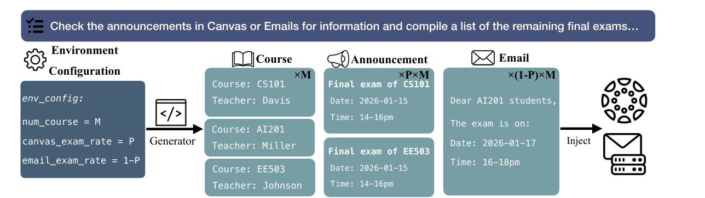
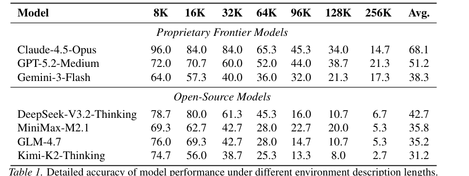
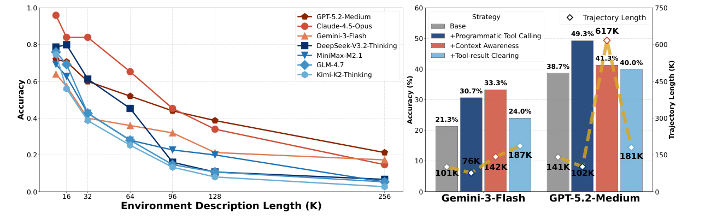
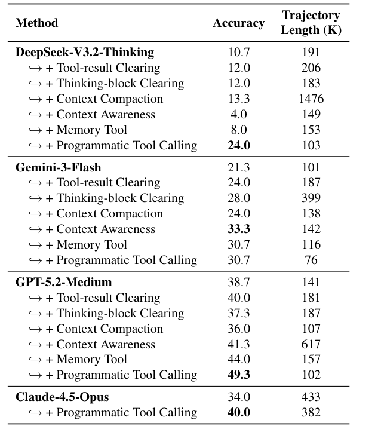

# LOCA-bench 论文解读

## 论文基本信息

| 字段 | 内容 |
| --- | --- |
| 论文 | LOCA-bench: Benchmarking Language Agents Under Controllable and Extreme Context Growth |
| 作者 | Weihao Zeng, Yuzhen Huang, Junxian He |
| 机构 | The Hong Kong University of Science and Technology (HKUST) |
| 发布时间 | 2026-02-08（arXiv v1） |
| Venue | arXiv preprint（cs.AI） |
| 论文链接 | [arXiv:2602.07962](https://arxiv.org/abs/2602.07962) |
| 代码链接 | [hkust-nlp/LOCA-bench](https://github.com/hkust-nlp/LOCA-bench) |

## TL;DR

现有长上下文 benchmark 往往把一大段文本一次性交给模型，再测试 needle retrieval、聚合或单轮推理。真实 agent 的上下文却是动态长出来的：它要决定调用什么工具、翻多少页、保留哪些观察，并在越来越长的 trajectory 中持续遵守早期指令。LOCA-bench 的关键设计，是固定任务语义，只扩大环境状态，用 **Environment Description Length** 量化完成任务理论上需要读取的环境信息量，从而把“任务变难”和“上下文变长”尽量解耦。

基准包含 15 个种子任务、7 档环境描述长度（8K 到 256K）、每档每任务 5 个随机种子，共 525 个样本和 280 个工具。所有模型都会随环境增长明显退化：Claude-4.5-Opus 从 8K 的 96.0% 降到 256K 的 14.7%，GPT-5.2-Medium 从 72.0% 降到 21.3%，DeepSeek-V3.2-Thinking 从 78.7% 降到 6.7%。失败不只是“没找到信息”，还包括探索提前终止、忘记输出约束，以及已经读对数据却在后续代码中改写错数值。

论文进一步把 agent 视为 **model + scaffold** 的组合。在 128K 设置下，程序化工具调用（Programmatic Tool Calling）对多个模型都有效：GPT-5.2-Medium 从 38.7% 提升到 49.3%，同时 trajectory 从 141K 降到 102K；DeepSeek-V3.2-Thinking 从 10.7% 提升到 24.0%，trajectory 从 191K 降到 103K。这里最值得带走的结论是：长上下文 agent 的能力不能只看模型标称 context window，也必须评估它如何探索、压缩、外存和编排工具。

## 论文脑图

```markmap
- LOCA-bench
  - 问题
    - 静态长文本 benchmark 无法覆盖动态 agent trajectory
    - 任务难度与上下文长度常被混在一起
    - context rot 会影响探索、指令遵循与事实保持
  - 方法
    - 固定任务语义
    - 参数化生成可扩展环境状态
    - Environment Description Length 衡量环境复杂度
    - mock server 与执行式验证
  - 数据
    - 15 个种子任务
    - 7 档长度：8K 到 256K
    - 每个任务与长度使用 5 个随机种子
    - 共 525 个样本、280 个工具
  - 实验
    - 3 个闭源前沿模型
    - 4 个强开源模型
    - ReAct scaffold
    - 二元任务成功率与效率指标
  - 结论
    - 所有模型随环境增长明显退化
    - 长上下文下闭源与开源模型差距扩大
    - 程序化工具调用兼顾准确率与上下文效率
  - 局限
    - 只有 15 个种子任务
    - 依赖合成环境状态与本地 mock server
    - 不同模型的上下文上限和截断策略并不完全可比
  - 复现要点
    - 固定公开配置与随机种子
    - 同时报告任务成功率、trajectory、工具调用和工具输出
    - 评测 model 与 scaffold 的具体组合
```

## 研究背景与问题定义

### 静态长上下文不等于长程 agent

RULER、LongBench v2、MRCR 等长上下文评测主要检查模型能否在给定文本中检索、聚合或推理。它们很重要，但交互式 agent 多了一个决策层：环境信息不会自动进入上下文，模型必须先选择工具、参数和翻页策略，观察才会逐步累积。

因此，同一个基础模型在不同 scaffold 下可能表现完全不同。一个 scaffold 会清除旧工具结果，另一个会做摘要压缩，还有一个允许模型把批量工具调用写成程序。LOCA-bench 不只问“模型能记住多少”，而是问：

1. agent 能否在上下文增长时继续充分探索；
2. 能否跨多个工具组合证据并完成推理；
3. 能否持续遵守早期给出的格式和行为约束；
4. 能否让最终写入环境的结果仍然忠于已检索证据。

### 可控变量：Environment Description Length

论文定义 **Environment Description Length（EDL）**：用脚本执行完成任务所需的工具查询，收集并拼接这些工具输出，再用 GPT-4 tokenizer 计算 token 数。它描述的是环境中与任务执行相关的信息规模，而不是 agent 某次实际运行产生的 trajectory 长度。

这个区分很关键。EDL 是受 benchmark 配置控制的自变量；trajectory length、工具调用次数和工具输出长度则是 agent 行为产生的因变量。论文通过固定任务 prompt、调整课程数量、商品数量、表格大小和干扰内容等环境参数，使任务语义保持不变，但 EDL 从 8K 增长到 256K。

## 核心方法

### 1. 参数化生成环境状态

LOCA-bench 从 Toolathlon 选取 15 个现实风格的种子任务，覆盖 Canvas、Email、Google Calendar、Excel、BigQuery、Snowflake、Google Sheets 和 WooCommerce 等环境。每个任务都有手写模板和生成器，配置项决定实体数量、信息分布、例外条件与干扰内容。

以“整理剩余期末考试”为例，生成器可以控制课程数 \(M\)，以及考试通知分别出现在 Canvas 和 Email 中的比例 \(P\)。agent 必须跨来源读取信息，处理免考或无考试课程，并按指定规则写入 Excel。扩大 \(M\) 会增加上下文压力，却不会改变任务目标。



原文 Figure 2 展示了从环境配置、模板实例化到 mock server 注入的流程。它支撑了 benchmark 最重要的控制变量设计：规模可变，任务语义固定。

### 2. 本地 mock server

真实在线服务有认证、并发限制、接口变化和数据不可重复等问题。作者为 Calendar、Canvas、Email、BigQuery、Google Sheets、Snowflake 和 WooCommerce 构建本地数据库后端，并尽量保持工具名称、请求 schema 和返回格式与真实服务一致。

这既提高可复现性，也允许 benchmark 精确注入数据、构造边缘案例和生成不同长度的环境。代价是模拟环境仍然无法完全复刻真实服务的延迟、权限故障、脏数据和接口漂移。

### 3. 执行式验证

每个任务都配有人工编写的规则式验证脚本，直接比较 agent 执行后的环境状态与 ground truth。结果是二元成功指标：完成记为 1，否则为 0。相比让 LLM judge 阅读自然语言答案，这种方式更适合文件、表格、邮件和数据库修改任务，也能稳定检查列名、排序、遗漏项和数值错误。

### 4. 可插拔 context engineering

论文实现了两类策略：

- **Context editing**：清除旧工具结果、清除旧 thinking block、压缩对话历史。
- **Advanced tool use**：告知剩余上下文容量、使用外部 memory tool、使用 programmatic tool calling。

Programmatic Tool Calling 的直觉尤其直接：模型写一段程序，让程序完成分页、过滤、聚合和多次工具调用，只有处理后的结果回到模型上下文。它把“大量原始观察进入上下文”改成“计算靠近数据执行”，既减少 token，也更容易系统处理分页和边缘条件。

## 实验设置与主要结果

### 数据规模与被测模型

LOCA-bench 对 15 个任务分别构造 8K、16K、32K、64K、96K、128K、256K 七档 EDL；每个任务、每档长度使用 5 个随机种子，因此每档 75 个样本、总计 525 个样本。

基础实验统一使用 ReAct scaffold，比较 Claude-4.5-Opus、GPT-5.2-Medium、Gemini-3-Flash、DeepSeek-V3.2-Thinking、MiniMax-M2.1、GLM-4.7 和 Kimi-K2-Thinking。除平均成功率外，还记录 trajectory length、工具调用次数和工具输出 token 数。

### 1. 上下文越长，成功率普遍快速下降



原文 Table 1 显示的不是少量噪声，而是跨模型一致的单调退化趋势。Claude-4.5-Opus 平均准确率最高，为 68.1%，但从 8K 到 256K 仍下降 81.3 个百分点。GPT-5.2-Medium 的下降相对平缓，256K 仍有 21.3%；开源模型中 DeepSeek-V3.2-Thinking 平均最好，为 42.7%，但 128K 后只剩 10.7%，256K 为 6.7%。



原文 Figure 1 左图把趋势画得更直观：32K 左右开始出现明显分化，长上下文下前沿闭源模型的准确率约为开源模型的 2 到 3 倍。右图则说明 scaffold 可以改变同一模型在相同 EDL 下的结果。

### 2. agent 没有随环境规模持续增加探索

论文 Figure 3 显示，trajectory length、工具调用数和工具输出长度起初随 EDL 增长，但多数模型在 96K 左右开始平台化。环境仍在线性变大，agent 却没有同比增加读取和探查，这意味着模型会在长上下文压力下变得保守或“没耐心”。

作者还观察到，读取更多工具输出通常与更高成功率相关。这里不能直接推出因果关系，因为更强模型本身可能同时更会探索、也更会完成任务；但结合失败案例，探索不足确实是明确的失败机制。例如某个 WooCommerce 任务中，agent 只读第一页 100 个产品就断言没有符合条件的商品，而实际目录超过 200 个产品。

### 3. 失败模式超出普通检索错误

轨迹分析归纳了四类失败：

- **复杂推理退化**：跨 Canvas 和 Email 收集考试信息时漏掉一个来源，也没有完成课程 ID 映射。
- **指令遵循变弱**：任务要求保留 CSV 原列名，agent 却把 `A_conversion_%` 改成 `A_conversion_pct`。
- **探索不足**：只读取第一页列表便提前结束，没有处理分页。
- **幻觉式不一致**：工具结果中振动值是 1.61，后续 Python 代码却写成 2.46。

最后一种尤其值得警惕：模型不是没检索到证据，而是证据在长 trajectory 中失真。因此，仅增加 RAG 或扩大 context window 并不能自动解决问题。

### 4. Programmatic Tool Calling 最稳定



原文 Table 2 在 128K EDL 下比较多种策略。Programmatic Tool Calling 对四个模型都带来提升，并且通常缩短 trajectory：

| 模型 | Base 准确率 / trajectory | Programmatic Tool Calling | 变化 |
| --- | --- | --- | --- |
| DeepSeek-V3.2-Thinking | 10.7% / 191K | 24.0% / 103K | +13.3 点，trajectory -88K |
| Gemini-3-Flash | 21.3% / 101K | 30.7% / 76K | +9.4 点，trajectory -25K |
| GPT-5.2-Medium | 38.7% / 141K | 49.3% / 102K | +10.6 点，trajectory -39K |
| Claude-4.5-Opus | 34.0% / 433K | 40.0% / 382K | +6.0 点，trajectory -51K |

其他策略具有明显的模型依赖性。Context Awareness 把 Gemini-3-Flash 提升到 33.3%，GPT-5.2-Medium 提升到 41.3%，却让 DeepSeek-V3.2-Thinking 从 10.7% 降到 4.0%。Memory Tool 也让 DeepSeek 降到 8.0%。这说明给 agent 更多机制不等于它会正确使用机制，context engineering 需要与模型训练分布和 tool-use 能力匹配。

### 5. 更复杂的 scaffold 可能反而变差

在 Claude-4.5-Opus 的 128K 实验中，原生 ReAct 为 34.0%，作者实现的 Programmatic Tool Calling 为 40.0%，Anthropic 官方版本达到 49.3%，Claude Agent scaffold 却只有 26.7%。

作者从轨迹推测，Claude Agent 会鼓励模型启动多个 subagent；但 subagent 没拿到必要工具时，只会快速累积无关上下文，之后主 agent 还要重新执行任务。这个结果不应外推为“subagent 一定有害”，它更准确地说明：benchmark 必须报告完整的 model-scaffold-tool 配置，不能把所有差异都归到基础模型。

## 当前工作 vs Related Work

| 方法 | 核心思路 | 主要假设 | 证据/表现 | 局限或代价 |
| --- | --- | --- | --- | --- |
| LOCA-bench | 固定任务语义，通过参数化环境状态控制动态 agent 上下文增长 | 环境描述长度能近似表示 agent 面对的信息复杂度 | 525 个执行式样本；测试模型、scaffold 与 context engineering | 只有 15 个种子任务，依赖合成状态与 mock server |
| RULER | 用多种合成长上下文任务估计模型的有效上下文长度 | 静态输入上的检索与聚合能反映长上下文能力 | 覆盖 needle、变量追踪、聚合等任务 | 不包含动态工具探索和环境修改 |
| GSM-Infinite | 可控扩展数学文本中的上下文长度与推理复杂度 | 合成数学任务能隔离长度和推理变量 | 支持近乎无限扩展的受控分析 | 任务域单一，不评估工具调用与 scaffold |
| Toolathlon | 在多服务、多工具环境中测试真实风格长程 agent 任务 | 现实工具组合能反映 agent 执行能力 | 任务多样、可验证；也是 LOCA-bench 的种子任务来源 | 原始设定不系统控制上下文长度 |
| LongBench v2 | 用现实长文档多任务评估深层理解与推理 | 静态文档任务可覆盖现实长上下文需求 | 覆盖多个领域和复杂推理 | 环境不会随 agent 行为动态展开 |

LOCA-bench 的增量不是提出一种更长的文本，而是把 **受控长度扩展** 与 **可执行 agent 环境** 结合起来。它与 RULER、GSM-Infinite 的关系更像从静态能力诊断走向交互式系统诊断；与 Toolathlon 的关系则是从“任务是否困难”进一步追问“困难是否由上下文增长造成”。

## 启发、局限与可复现要点

- **启发**：评估长程 agent 时，应把 context window 当作系统资源，而不是模型规格表上的单一数字。模型、工具返回格式、压缩策略、外部记忆和程序化编排共同决定有效上下文能力。
- **启发**：把计算推向工具侧通常比把全部原始结果塞回模型更稳。分页、过滤、join、aggregation 等确定性操作尤其适合 programmatic tool calling。
- **局限**：EDL 由脚本收集“完成任务所需”的工具输出后计算，依赖 benchmark 作者对必要信息和标准探索路径的定义；它不是模型实际必须消费的严格下界。
- **局限**：15 个种子任务带来一定多样性，但 525 个实例主要来自参数化扩展，语义多样性仍小于实例数量给人的直觉。
- **局限**：mock server 提升了复现性，却弱化了真实服务中的权限、网络、并发、接口漂移和非结构化错误。
- **局限**：模型最大上下文不同，超限后的截断与重复工具调用会混入结果。论文报告了这些设置，但跨模型曲线仍不是完全同条件对比。
- **复现要点**：固定论文发布的 environment configuration 与随机种子；使用相同 ReAct prompt、工具 schema、context limit 和截断策略。
- **复现要点**：不能只报告最终 accuracy，还要保留 trajectory length、工具调用次数、工具输出 token、清除或压缩掉的 token，以及最终环境 diff。
- **可能的下一步实验**：加入软件工程、浏览器操作和桌面自动化任务；分别控制干扰信息量、相关信息分散度、工具返回冗余度与任务步骤数，分析不同 context rot 来源。
- **可能的下一步实验**：在同一基础模型上比较摘要压缩、结构化事件日志、检索式记忆、程序化工具调用和多 agent 分工，并按成功率、token 成本、延迟和错误可恢复性画 Pareto frontier。

## 再读一遍路线

第一遍先看 Figure 2 和 §2.2，理解论文如何保持任务不变、只扩展环境状态。随后读 §2.3，核对 15 个种子任务、7 档 EDL、5 个随机种子和 525 个样本之间的关系。

第二遍看 Table 1 与 Figure 3。Table 1 回答“性能掉多少”，Figure 3 回答“agent 行为如何变”：环境继续增长，但探索量在约 96K 后平台化。再读 §3.3 和附录 Figure 4-7，把成功率下降对应到具体轨迹错误。

最后读 Table 2、Table 3 和 §4。重点比较 context editing 与 advanced tool use，并留意同一种策略在不同模型上可能正负相反。复现时应优先核对工具 schema、程序化工具调用实现、context threshold、截断规则和执行式 verifier。

# 深度 Q&A

## Q1：LOCA-bench 与 needle-in-a-haystack 最大的区别是什么？

Needle 测试通常把完整文本一次性放进上下文，模型只需找到指定事实。LOCA-bench 中的信息分散在工具和环境里，agent 要先决定探索路径，观察才会进入上下文；它还必须继续执行写文件、改表格或发邮件等动作。因此，评测同时覆盖检索、规划、工具编排、状态保持和指令遵循。

## Q2：Environment Description Length 等于模型实际看到的 token 数吗？

不等于。EDL 是脚本收集任务相关环境信息后得到的控制指标，用来描述环境规模。模型实际看到多少由它的工具调用、分页策略、scaffold、上下文清理和截断行为决定，对应论文另外报告的 trajectory length 与 tool-output length。

## Q3：为什么固定任务 prompt 还不能完全保证“只改变上下文长度”？

环境规模增长可能同时增加实体数、分页次数、join 数和边缘案例的绝对数量，因此认知负担不只来自 token。LOCA-bench 已比直接换一批更难任务更可控，但 EDL 与操作步骤、检索复杂度仍可能相关。更严格的后续实验应分别操纵这些变量。

## Q4：为什么长上下文会让 agent 探索不足？

论文的行为证据是：EDL 继续增长时，工具调用和工具输出在约 96K 后趋于平台。可能原因包括模型对剩余预算的不确定、长观察造成注意力稀释、早期部分证据诱发过早收敛，以及 scaffold 的截断压力。论文给出了现象与案例，但没有把这些机制做严格因果分解。

## Q5：Programmatic Tool Calling 为什么能同时提高准确率和降低 token？

它允许代码在工具侧完成循环、分页、过滤和聚合，避免每次原始返回都进入模型上下文。确定性控制流也减少了漏页、忘记边界条件和手工复制数值的机会。它不是单纯“压缩文本”，而是改变了计算发生的位置。

## Q6：为什么 Context Awareness 或 Memory Tool 会伤害某些模型？

工具存在不代表模型知道何时、如何使用。额外机制会增加动作空间和说明文本，也可能诱导模型过度关注预算、频繁读写记忆，反而打断原任务。DeepSeek-V3.2-Thinking 在这两种策略下退化，说明 scaffold 设计与模型的训练适配性同样重要。

## Q7：Claude Agent 的低分能证明多 agent 不适合长上下文吗？

不能。论文只测试了一个特定模型、scaffold 和环境组合。轨迹显示 subagent 缺少必要工具、产生无效并行调用，这是配置和协调失败的证据，而不是多 agent 架构的普遍否定。更公平的实验应控制工具授权、任务切分、共享记忆和并行预算。

## Q8：二元成功率会不会丢失过多信息？

会。它适合给出清晰、可执行验证的最终结果，但无法区分“只错一列名”和“完全没有完成任务”。论文用轨迹长度、工具调用与失败案例补充解释；未来可以增加目标级通过率、环境 diff 距离和约束满足率，同时保留二元 success 作为主指标。

## Q9：这个 benchmark 最适合指导哪些工程决策？

它适合比较同一模型下的 context compaction、工具结果清理、外部记忆、程序化工具调用和 agent framework，也适合比较模型升级是否真的改善长程可靠性。对于生产系统，最有价值的不是单个平均分，而是成功率随 EDL 的退化曲线与失败类型分布。

## Q10：下一代长上下文 agent benchmark 应补什么？

一是加入真实服务噪声、权限和恢复流程；二是覆盖软件仓库、浏览器与桌面等更开放环境；三是把 EDL、任务步骤数、干扰比例和证据分散度正交化；四是统一报告成本、延迟、压缩损失和错误恢复。这样才能从“谁的窗口更长”走向“谁能在长期执行中可靠管理状态”。
