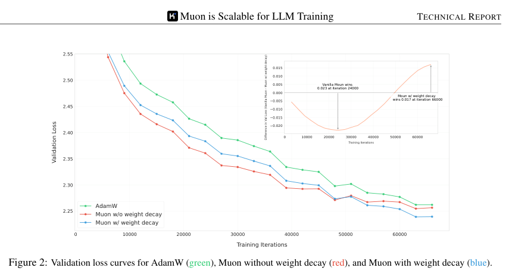
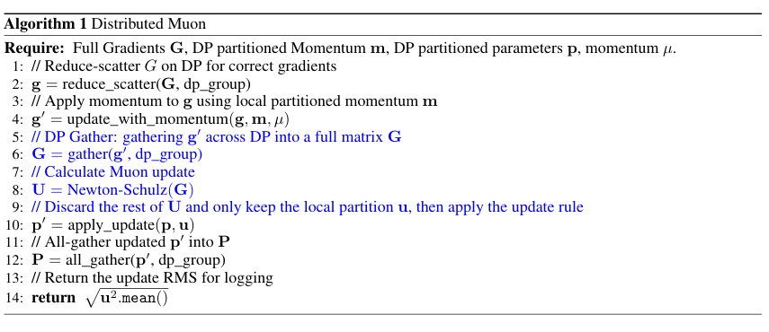
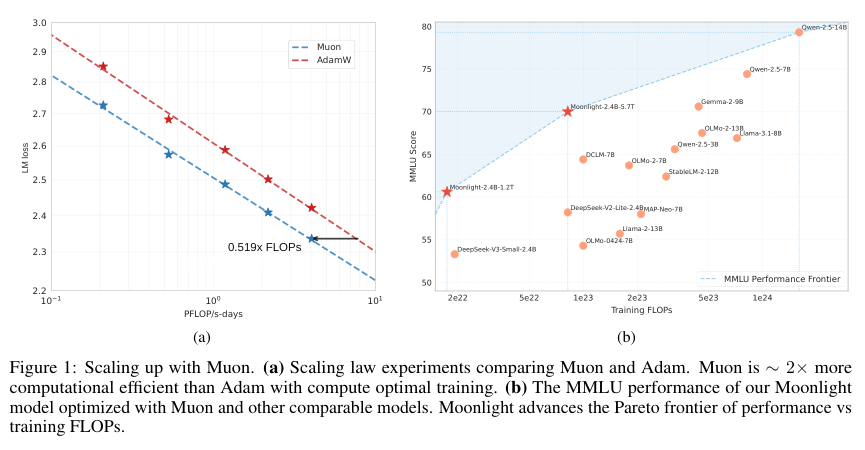
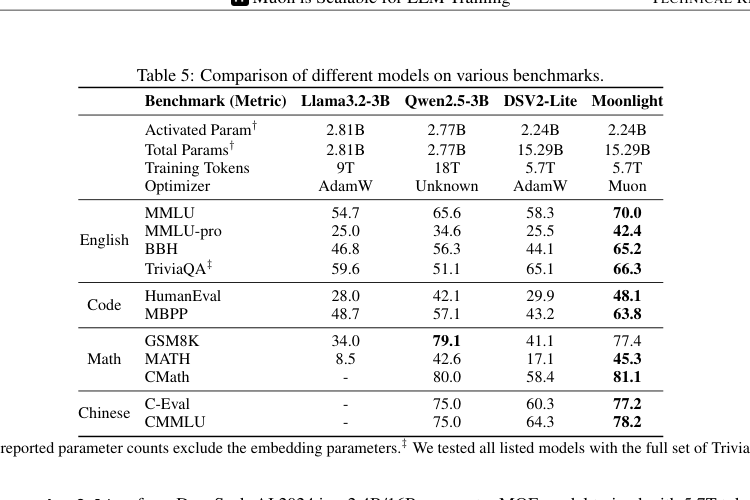
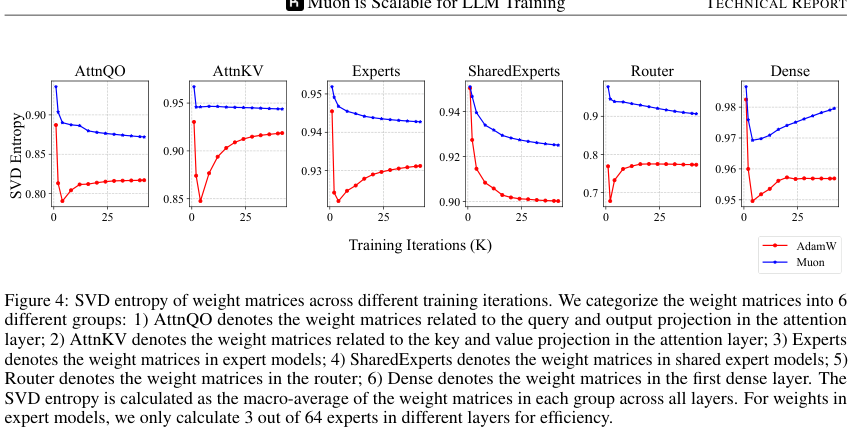

# Muon is Scalable for LLM Training 论文解读

Muon 在小模型上表现亮眼，但“能训 GPT-2 级模型”与“能稳定训练数十亿参数、数万亿 token 的 LLM”之间，隔着更新尺度、权重长期漂移、分布式内存与通信四道门槛。这篇技术报告逐一补齐这些工程条件，并用 Moonlight - 一个 3B 激活、16B 总参数的 MoE - 做了 5.7T token 的端到端验证。

## 论文基本信息

| 字段 | 内容 |
| --- | --- |
| 论文 | Muon is Scalable for LLM Training |
| 作者 | Jingyuan Liu, Jianlin Su, Xingcheng Yao, Zhejun Jiang, Guokun Lai, Yulun Du 等 |
| 机构 | Moonshot AI; UCLA |
| 发布时间 | 2025-02-24 |
| Venue | arXiv |
| 论文链接 | https://arxiv.org/abs/2502.16982 |
| 代码链接 | https://github.com/MoonshotAI/Moonlight |
| 模型权重 | https://huggingface.co/moonshotai/Moonlight-16B-A3B |

## TL;DR

Muon 对矩阵参数的 momentum 做近似正交化，让更新不被少数奇异方向主导。原始版本的问题是：长时间训练时权重与 layer output RMS 会持续增长；同时，正交化后 update RMS 取决于矩阵形状，宽 MLP 更新可能过小，小矩阵更新又可能过大。本文的核心修正很朴素：加入 decoupled weight decay，再把每个 $A\times B$ 矩阵的更新乘以 $0.2\sqrt{\max(A,B)}$，使其尺度接近 AdamW，也让 Muon 直接复用为 AdamW 调好的 learning rate 与 weight decay。

作者在 399M-1.5B dense model 上重新为 AdamW 搜索 compute-optimal baseline，拟合后报告 Muon 只需约 51.9% FLOPs 就能达到相同 loss。最终的 Moonlight 在 5.7T token 后，以 2.24B 激活参数在 MMLU、MATH、HumanEval 等任务上显著超过同架构、同 token 的 DeepSeek-V2-Lite。不过，这个结论不能简化为“Muon 在任何阶段都优于 AdamW”：SFT 实验显示，pretraining 与 finetuning optimizer 不匹配时优势会消失，而 AdamW 预训练的 Qwen2.5-7B 直接换 Muon SFT 反而略差。

## 论文脑图

```markmap
# Muon Scaling
## 问题
### 小模型收益能否扩到 billion-scale LLM
### 更新尺度随矩阵形状变化
### 长期训练权重 RMS 增长
### 正交化依赖完整矩阵
## 方法
### Momentum orthogonalization
### Weight decay
### Shape-aware update RMS
### Distributed Muon with ZeRO-1
## 实验
### 399M-1.5B scaling law
### 800M update-scale ablation
### 16B MoE / 5.7T tokens
### Pretrain-SFT optimizer interchangeability
## 结论
### 约 51.9% FLOPs 匹配 AdamW loss
### Moonlight 改善 performance-compute frontier
## 局限
### 非矩阵参数仍由 AdamW 更新
### 私有数据与训练集群细节有限
### Optimizer mismatch 尚未解决
## 复现要点
### Momentum 0.95 / Newton-Schulz 5 steps
### Update RMS target 0.2
### Weight decay 0.1
### 8K pretraining context
```

## 研究背景与问题定义

AdamW 是大模型训练的默认选择：它对每个参数做一阶矩与二阶矩估计，再用 element-wise preconditioning 调整更新。Muon 的出发点不同。对可写成矩阵的权重 $W$，它先积累 gradient momentum $M_t$，然后近似计算其极分解中的正交因子：

$$
M_t=\mu M_{t-1}+\nabla\mathcal{L}_t(W_{t-1}),\qquad
O_t=\operatorname{NewtonSchulz}(M_t),\qquad
W_t=W_{t-1}-\eta_t O_t.
$$

若 $M=U\Sigma V^\top$，理想正交化结果是 $UV^\top$。直觉上，各奇异方向的更新幅度被拉齐，训练不会长期沿少数 dominant directions 前进。论文把它解释为 spectral-norm constraint 下的 steepest descent，而 Adam 更接近动态的 element-wise norm constraint。

困难在于，大模型的矩阵形状差异极大：attention projection、MLP、MoE expert、router 都不一样。正交矩阵并不天然具有统一的 element-wise RMS；分布式场景中，Newton-Schulz 又必须看到完整矩阵，不能直接照搬只分片 optimizer states 的 ZeRO-1。

## 核心方法

### 1. Newton-Schulz：用矩阵乘近似正交化

Muon 不显式做昂贵 SVD，而是从 $X_0=M/\lVert M\rVert_F$ 出发，反复计算五次五次多项式迭代：

$$
X_k=aX_{k-1}+b(X_{k-1}X_{k-1}^{\top})X_{k-1}
+c(X_{k-1}X_{k-1}^{\top})^2X_{k-1},
$$

其中 $a=3.4445,b=-4.7750,c=2.0315$。作者测试 10 步会得到更精确的正交结果，却没有带来更好 loss，因此采用 5 步；momentum 取 0.95。这个结果提醒我们，optimizer 的数值子问题不必求到高精度，只要近似误差处于训练可容忍范围。

### 2. Weight decay：解决 over-training 时的长期漂移

原始 Muon 在训练早期下降更快，但随着 token 增加，部分权重和 layer output RMS 会持续增长，甚至逼近 BF16 的安全边界。本文把 AdamW 的 decoupled weight decay 加入 Muon：

$$
W_t=W_{t-1}-\eta_t(O_t+\lambda W_{t-1}).
$$



图源：论文 Figure 2。800M 模型训练 100B token，约为 compute-optimal token 数的 5 倍；无 weight decay 的 Muon 前期领先，但后期带 weight decay 的版本反超，并取得最低 validation loss。图中差值曲线直接支撑“短跑优势不等于长跑可扩展性”。

### 3. Shape-aware update RMS：真正让默认超参数可复用

对满秩 $A\times B$ 矩阵，论文证明正交化更新的理论 RMS 为：

$$
\operatorname{RMS}(O)=\sqrt{\frac{1}{\max(A,B)}}.
$$

这意味着矩阵越宽，逐元素更新越小。以 $[H,4H]$ MLP 为例，如果只按 hidden size $H$ 做全局缩放，MLP 更新只有预期的一半；相反，把很小的 head matrix 单独交给 Muon，更新可能过大而不稳定。

作者把每个矩阵的 Muon update 乘以 $\sqrt{\max(A,B)}$ 抵消形状效应，再用 0.2 匹配 AdamW 实测约 0.2-0.4 的 update RMS：

$$
W_t=W_{t-1}-\eta_t\left(
0.2\,O_t\sqrt{\max(A,B)}+\lambda W_{t-1}
\right).
$$

在 800M、4B training tokens 的对照中，简单 baseline 的 validation loss 为 2.812；直接 normalize update 和 adjusted LR 均为 2.789。作者选择 adjusted LR，因为它避免显式计算 RMS，成本更低，同时对 $[H,H]$ 矩阵不做不必要的额外放大。

### 4. Distributed Muon：分片状态，临时聚合完整更新



图源：论文 Algorithm 1。蓝色步骤是相对 vanilla ZeRO-1 新增的操作：先在 DP group 内 gather momentum-adjusted gradient，恢复完整矩阵并运行 Newton-Schulz，然后只保留本 rank 对应的 update partition。

完整流程是：gradient reduce-scatter -> 本地更新分片 momentum -> DP gather 为完整矩阵 -> BF16 Newton-Schulz -> 丢弃非本地 update -> 更新本地 master weight -> all-gather parameters。Muon 只有一个 momentum buffer，而 AdamW 有一阶、二阶两个 buffer，因此 optimizer state 增量内存约为后者一半。

代价是通信量增加。论文估计 Distributed Muon 的通信 workload 为 Distributed AdamW 的 `(1, 1.25]` 倍；如果启用 TP，还需额外一次 BF16 TP gather。作者称 optimizer 本身通常只占 forward-backward 时间的 1%-3%，通过 gather/computation overlap 后，在其大规模集群中没有观察到明显端到端延迟差异。这里需要注意：报告没有给出完整的硬件、集群规模和吞吐表，所以“无明显开销”尚不是跨平台结论。

## 实验设置与主要结果

### 1. Scaling law 是否公平

作者没有拿一个未经调优的 AdamW 当稻草人，而是在 399M、545M、822M、1.1B、1.5B dense Llama-like models 上，为 AdamW 搜索 compute-optimal 的模型大小、token 数、learning rate 和 batch size。序列长度均为 8K，token 预算从 8.92B 到 38.91B。Muon 因 update RMS 已对齐 AdamW，直接复用对应最优 learning rate 和 weight decay。



图源：论文 Figure 1。左图拟合显示，相同 loss 下 Muon 使用约 0.519 倍 AdamW FLOPs，即论文所称约 2 倍计算效率；右图把 Moonlight 放在 MMLU 分数与 training FLOPs 坐标中，显示其处于当时的 Pareto frontier。

拟合公式分别是 $L_{\text{Muon}}=2.506C^{-0.052}$ 与 $L_{\text{AdamW}}=2.608C^{-0.054}$。两条曲线斜率接近，主要是截距差异；这说明论文证据更接近“在测试 compute 区间内整体平移效率曲线”，而不是 Muon 的 scaling exponent 明显更优。向远超 1.5B dense model 的区间外推仍需谨慎。

### 2. Moonlight 预训练 recipe

Moonlight 采用 DeepSeek-V3-Small 风格 MoE，不计 embedding 时为 15.29B 总参数、2.24B 激活参数；计入 embedding 后约 16B/3B。最大 context length 为 8K，weight decay 0.1。训练分三段：

1. `0-33B tokens`：2K steps warmup 到 `4.2e-4`，batch size 2048。
2. `33B-5.2T tokens`：cosine decay 到 `4.2e-5`；200B token 后 batch size 从 2048 增至 4096。
3. `5.2T-5.7T tokens`：500B-token cooldown，learning rate 先回到 `1e-4`，再线性降为 0；使用更高质量的 math、code、reasoning 数据。

训练数据细节引用另一份 Kimi 报告，本篇没有给出可独立重建的数据配比。模型也未采用 MTP；aux-free routing bias 在前两阶段 update rate 为 `1e-3`，cooldown 阶段冻结为 0。

### 3. 5.7T token 主结果



图源：论文 Table 5。Moonlight 与 Llama 3.2-3B、Qwen2.5-3B、DeepSeek-V2-Lite 对比；表中的 total/activated params 不含 embedding，Moonlight 与 DeepSeek-V2-Lite 训练 token 都是 5.7T。

| Benchmark | Llama3.2-3B | Qwen2.5-3B | DSV2-Lite | Moonlight |
| --- | ---: | ---: | ---: | ---: |
| MMLU | 54.7 | 65.6 | 58.3 | **70.0** |
| MMLU-Pro | 25.0 | 34.6 | 25.5 | **42.4** |
| HumanEval | 28.0 | 42.1 | 29.9 | **48.1** |
| MBPP | 48.7 | 57.1 | 43.2 | **63.8** |
| GSM8K | 34.0 | **79.1** | 41.1 | 77.4 |
| MATH | 8.5 | 42.6 | 17.1 | **45.3** |
| C-Eval | - | 75.0 | 60.3 | **77.2** |
| CMMLU | - | 75.0 | 64.3 | **78.2** |

最干净的 optimizer 对照不是跨模型表，而是同架构、同数据的 1.2T checkpoint：Moonlight-A 只把 optimizer 换成 AdamW。Muon 在 HumanEval 上为 37.2 vs 29.3，MATH 为 19.8 vs 16.1，GSM8K 为 45.0 vs 43.8；但 BBH 是 43.2 vs 45.3，说明收益并非所有任务一致。作者观察 code/math 收益更明显，但没有给出机制性的任务级解释。

### 4. 奇异谱：支持机制直觉，但不是因果证明



图源：论文 Figure 4。Muon 在 AttnQO、AttnKV、Experts、SharedExperts、Router 和 Dense 六组矩阵上，平均 SVD entropy 都高于 AdamW；router 的差异尤其大。作者据此认为正交化让权重探索更多方向。

在 1.2T checkpoint，超过 90% 权重矩阵的 Muon SVD entropy 高于 AdamW。这个分析与“避免少数奇异方向主导”直觉一致，但仍是相关性证据：更平坦的 singular spectrum 与更低 loss 同时出现，不代表前者单独造成后者，也不能推出越高 entropy 越好。

### 5. SFT optimizer interchangeability：论文最重要的反例

在 Tulu-3 SFT mixture 上，Muon pretrain + Muon SFT 的组合最好：MMLU 55.7、HumanEval 57.3、MBPP 55.6、GSM8K 68.0。Muon-pretrained 模型换 AdamW SFT 后分别降到 50.2、52.4、55.2、64.9。

反过来，AdamW-pretrained Moonlight-A 用 Muon SFT 并没有稳定优于继续用 AdamW。对公开 Qwen2.5-7B 做 SFT 时，Muon 在四项指标全部略低：MMLU 70.8 vs 71.4、HumanEval 77.4 vs 79.3、MBPP 71.6 vs 71.9、GSM8K 85.8 vs 89.8。Muon 的优势因此更像一条需要从 pretraining 延续的 optimization trajectory，而不是可随时热插拔的 finetuning 加速器。

## 当前工作 vs Related Work

| 方法 | 核心思路 | 主要假设 | 证据/表现 | 局限或代价 |
| --- | --- | --- | --- | --- |
| 本文 Muon | 正交化 momentum，加入 weight decay 与 shape-aware scale | 矩阵权重适合 spectral-norm 约束 | 约 0.519× FLOPs 匹配 AdamW loss；16B MoE/5.7T 验证 | 非矩阵参数仍用 AdamW；需完整矩阵 gather |
| AdamW | 一、二阶矩的 element-wise preconditioning + decoupled decay | 每参数自适应尺度足够稳健 | 大模型事实标准，生态成熟 | 两个 optimizer buffers；可能偏向少数矩阵方向 |
| 原始 Muon | Newton-Schulz 正交化 gradient momentum | 小规模收益能外推 | 小型语言模型上收敛快 | 无 weight decay，update RMS 随矩阵形状变化 |
| Shampoo/二阶预条件路线 | 利用 Kronecker/矩阵统计近似二阶几何 | 额外统计与矩阵运算可换收敛效率 | 理论与中小规模结果丰富 | 状态、通信和实现复杂度通常更高 |
| ZeRO-1 AdamW | 分片 optimizer states，element-wise 本地更新 | 更新不依赖完整矩阵 | 内存和通信路径成熟 | 不能直接支持 Muon 的完整矩阵正交化 |

## 启发、局限与可复现要点

### 启发

- 优化器扩展失败往往不是“算法无效”，而是长期正则、参数形状和分布式布局没有对齐。
- “直接复用 AdamW 超参数”并非魔法：它建立在把 Muon update RMS 明确校准到 0.2 的基础上。
- optimizer state 内存减少与每 step 计算增加可以同时发生，评估时必须把 memory、communication、latency 和 convergence FLOPs 分开。
- 最有价值的负面结果是 optimizer mismatch：预训练决定的权重谱和后续 optimizer 可能形成路径依赖。

### 局限

- Scaling law 最大只到 1.5B dense model，最终 16B MoE 主要用于端到端验证，并非同规模 AdamW compute-optimal sweep。
- 预训练数据来自私有 pipeline，本篇没有披露可复现的数据组成、清洗和 sampling ratio。
- 报告没有给出训练硬件、GPU 数、MFU、tokens/s、wall-clock time 和能耗，无法从 52% training FLOPs 推导 52% 实际成本。
- “没有明显 latency overhead”缺少跨 DP/TP 规模的吞吐曲线；通信上界分析也不等价于实测 wall time。
- Muon 仍与 AdamW 混用：embedding、LM head、RMSNorm 等非矩阵参数不属于 Muon framework。
- Benchmark 为 base model few-shot 结果，不能直接代表 instruction following、RL 后 agent 能力或部署质量。

### 复现要点

- 矩阵参数用 Muon，非矩阵参数用 AdamW；两者共享 learning rate 与 weight decay。
- Muon momentum `0.95`，Newton-Schulz `5` steps，更新缩放 `0.2 * sqrt(max(A,B))`。
- Weight decay `0.1`；论文附录特别指出 RMSNorm gamma 也施加 decay 对稳定性重要。
- 公平对比必须先为 AdamW 搜索 compute-optimal model/token/LR/batch，再让已校准的 Muon 复用这些超参数。
- 至少同时记录 loss、gradient norm、weight/output RMS、max attention logit、large-logit ratio 与 SVD entropy。

### 可能的下一步实验

1. 在相同数据、架构和 wall-clock budget 下，报告 Muon/AdamW 的 tokens/s、峰值显存、通信占比和最终 loss。
2. 把 scaling sweep 扩到更大 dense/MoE 模型，验证 0.519× 是否跨越架构与 compute 区间。
3. 系统研究 AdamW -> Muon 与 Muon -> AdamW 切换时的 learning-rate interpolation、state conversion 和谱变化。
4. 分别消融 weight decay、shape scale 与 0.2 global factor，量化三者在长 token horizon 的独立贡献。

## 再读一遍路线

第一遍只看 Figure 1、Equation 4、Algorithm 1、Table 4/5 和 Table 6，先建立“尺度校准 -> 分布式实现 -> scaling -> 模型结果 -> 反例”的证据链。第二遍精读 §2.2，自己推导满秩正交矩阵 RMS 为什么是 $1/\sqrt{\max(A,B)}$。第三遍看 Appendix B/D，核对 AdamW baseline 搜索与训练稳定性。最后回到 §3.5：如果一个结论无法解释 optimizer mismatch，就不要把它泛化成“Muon 全面替代 AdamW”。

# 深度 Q&A

## Q1：Muon 与 AdamW 最本质的差别是什么？

AdamW 按元素用一阶/二阶矩调整梯度，Muon 则把二维矩阵视为一个线性算子，对整块 momentum 做正交化。前者关注 coordinate-wise scale，后者关注矩阵的 singular directions。实际系统里两者不是完全互斥：本文仍用 AdamW 更新非矩阵参数。

## Q2：为什么正交化可能提高训练效率？

如果原始 momentum 的能量集中在少数奇异方向，直接更新会反复强化这些方向。近似替换为 $UV^\top$ 后，各非零奇异方向尺度更均匀，模型可能更快探索有效参数空间。论文的 SVD entropy 结果支持这个现象，但没有证明它是 loss 改善的唯一原因。

## Q3：为什么 Muon 必须加入 weight decay？

短程训练中正交化更新下降很快，但没有 decay 时，权重和 layer output RMS 会随长训练持续增大。Figure 2 显示 vanilla Muon 在 24K iteration 附近一度领先，而约 66K iteration 时带 decay 的 Muon 已反超。大模型训练是长 horizon 问题，早期 loss 不能代表最终稳定性。

## Q4：`0.2 * sqrt(max(A,B))` 各自解决什么？

`sqrt(max(A,B))` 消除正交矩阵逐元素 RMS 对形状的依赖，使宽 MLP 和方形 attention matrix 获得一致更新尺度；`0.2` 再把这个统一尺度校准到 AdamW 的经验范围，从而共享 learning rate 与 weight decay。两者分别是相对校准和绝对校准。

## Q5：论文的“约 2 倍计算效率”是否等于训练速度快 2 倍？

不是。它指拟合 scaling law 后，Muon 用约 51.9% training FLOPs 达到相同 validation loss。每 step 的 Muon 还多了 gather 与 Newton-Schulz；实际 wall-clock 收益取决于硬件、通信、并行策略和能否 overlap。论文没有给出足以换算为 2 倍 wall-clock 的数据。

## Q6：Distributed Muon 为什么不能直接使用普通 ZeRO-1？

AdamW 的 element-wise update 可以在参数分片上独立计算；Muon 的正交化依赖完整二维矩阵。本文先分片保存 momentum 省内存，在更新瞬间 gather 完整矩阵，算完后只保留本 rank 的 update slice，再 all-gather 新参数。

## Q7：Muon 是否真的比 AdamW 更省显存？

就 optimizer momentum buffers 而言是：Muon 只保留一个，AdamW 通常保留两个，因此这部分增量内存约减半。但总训练显存还包括 parameters、gradients、activations、communication buffers 和临时 full matrix，不能把“optimizer state 减半”误读为“总显存减半”。

## Q8：Moonlight 的结果能把收益完全归因于 Muon 吗？

跨模型 Table 5 不能，因为数据、架构和 recipe 不完全相同。更强证据是 1.2T token 的 Moonlight vs Moonlight-A：架构与训练设置相同，只换 optimizer，并在多数任务上由 Muon 领先。但即使这里 BBH 仍由 AdamW 领先，所以结论应是平均/任务相关收益，而非逐任务支配。

## Q9：为什么 AdamW 预训练模型直接用 Muon SFT 效果不好？

论文只确认现象，没有给出机制答案。一种合理但尚未被证明的解释是，两种 optimizer 塑造了不同的权重谱和局部几何，切换后原有 learning rate、momentum state 与参数尺度不再匹配。解决它可能需要 optimizer state conversion 或平滑过渡，而不是硬切换。

## Q10：Muon 更适合 MoE 吗？

论文观察到 router 的 SVD entropy 差异最大，Moonlight 也验证了大型 MoE 可稳定训练，这提示 MoE 可能更受益。但实验没有提供同 compute 下 dense vs MoE 的 optimizer interaction factorial design，因此“Muon 特别适合 MoE”仍是值得验证的假设，不是定论。

## Q11：如果要在现有训练栈试用，最小安全方案是什么？

先在相同 architecture/data 的小规模 run 上复现 AdamW baseline；只把二维矩阵交给 Muon，保留非矩阵参数的 AdamW；使用 weight decay、shape-aware scale、0.2 target、5-step Newton-Schulz 和 momentum 0.95；同时监控 update RMS、weight RMS 与 attention logits。不要从公开 AdamW checkpoint 直接切到 Muon SFT 后就判断优化器优劣。

## Q12：这篇论文最重要的贡献究竟是新优化器还是扩展方法？

Muon 本身来自更早的工作；本文的核心贡献是把它变成可用于大模型的 recipe 与系统：长期 weight regularization、参数级尺度校准、ZeRO-1 式分布式实现、公平 scaling baseline，以及 16B MoE/5.7T token 验证。它展示的是“如何让一个优化想法跨过规模鸿沟”。
