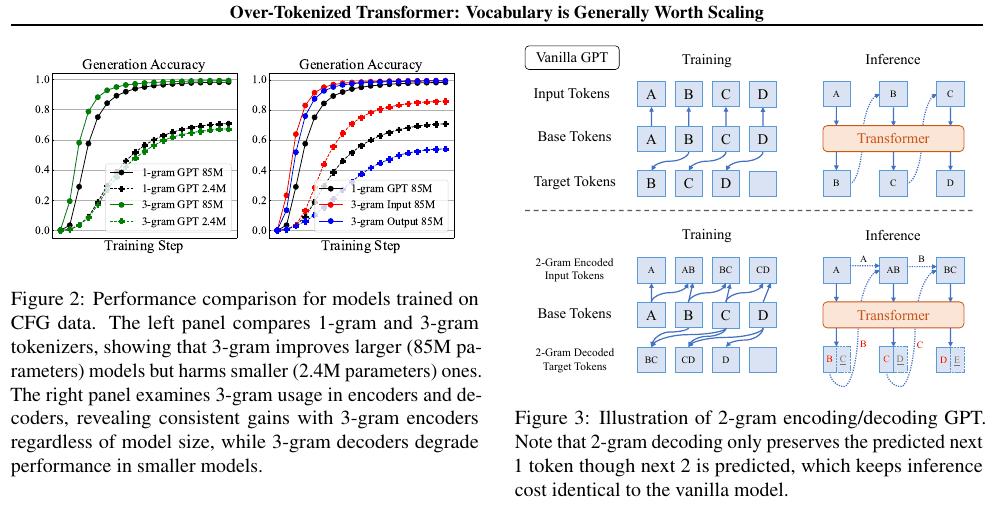
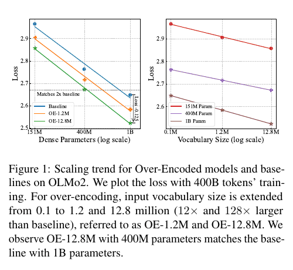
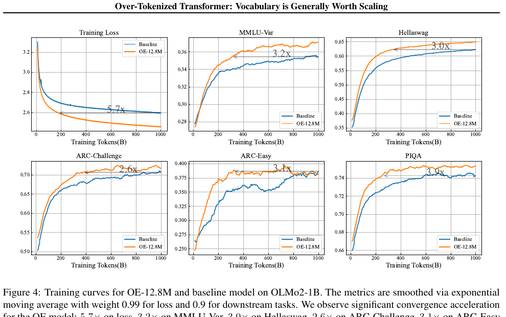
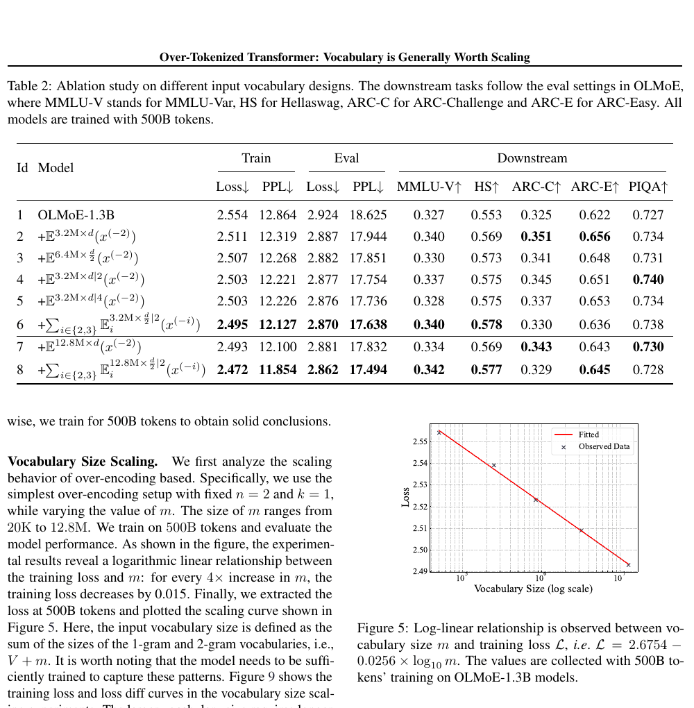
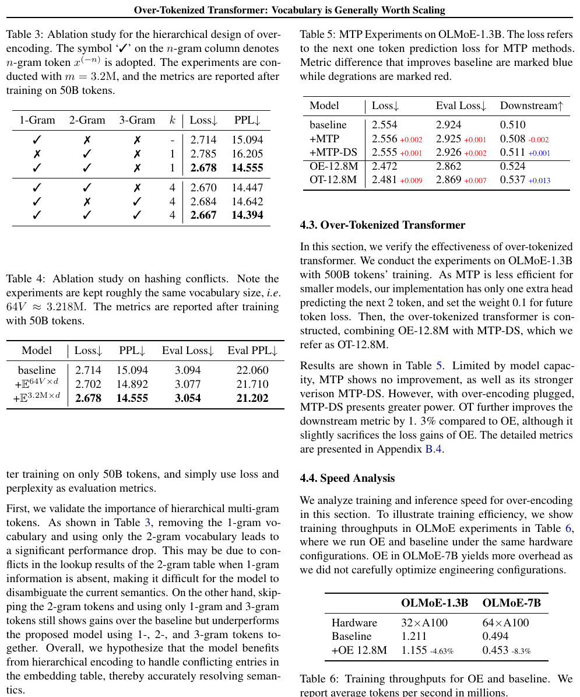

# Over-Tokenized Transformer: Vocabulary is Generally Worth Scaling 论文解读

## 论文基本信息

| 字段 | 内容 |
| --- | --- |
| 论文 | Over-Tokenized Transformer: Vocabulary is Generally Worth Scaling |
| 作者 | Hongzhi Huang, Defa Zhu, Banggu Wu, Yutao Zeng, Ya Wang, Qiyang Min, Xun Zhou |
| 机构 | ByteDance Seed |
| 发布时间 | 2025-01-28；arXiv v2 修订于 2025-05-23 |
| Venue | ICML 2025 |
| 论文链接 | https://arxiv.org/abs/2501.16975v2 |
| 代码链接 | 论文未说明/未找到独立代码仓库；Appendix A 提供 PyTorch-like 实现 |

## TL;DR

这篇论文重新审视 LLM scaling 中经常被当作预处理细节的 tokenizer。常见做法使用同一套 vocabulary 做输入 embedding 和输出 unembedding；扩大词表既增加输入表示能力，也同时扩大 softmax 分类空间，因此小模型可能因输出任务过细而欠拟合。作者通过合成 CFG 实验把两个作用拆开，发现扩大输入词表在不同模型规模上都有效，而扩大输出词表只在容量足够时才有利。

基于这个观察，作者提出 Over-Encoding（OE）：保留原始 BPE token 序列和输出词表，为每个位置额外构造 2-gram、3-gram 等哈希 ID，用可配置的超大稀疏 embedding table 查表，再把不同粒度的表示相加。默认 OE-12.8M 将附加输入词表扩到 1,280 万级，但不改变输出 softmax，也不缩短序列。Over-Tokenized Transformer（OT）则把 OE 与 DeepSeek 风格的 Multi-Token Prediction 结合，分别增强输入表示与未来 token 监督。

核心结果是一个新的缩放轴：在 OLMoE-1.3B、500B training tokens 的设置下，输入词表每扩大 4 倍，训练 loss 约下降 0.015；拟合关系为 $\mathcal{L}=2.6754-0.0256\log_{10}m$。在 dense OLMo2 上，400M OE-12.8M 的 loss 可匹配 1B baseline；在 OLMo2-1B 上，OE 的 loss 收敛等效加速 5.7 倍。代价不是零：embedding 参数会膨胀到十亿乃至数十亿级，训练瓶颈从 FLOPs 转向显存、通信和查表系统设计。

## 论文脑图

```markmap
# Over-Tokenized Transformer

## 问题

### tokenizer 被忽略为 scaling dimension

### 输入与输出共享词表，两个作用纠缠

### 大输出词表可能让小模型欠拟合

## 方法

### CFG 实验拆分 encoding / decoding

### OE：分层 1/2/3-gram 输入 embedding

### 哈希取模控制实际词表大小

### 低维切片与投影增加查表容量

### OT：OE + DeepSeek-style MTP

## 实验

### OLMo2 dense：151M / 400M / 1B

### OLMoE：1.3B / 7B，500B tokens

### C4 loss/PPL 与五个稳定下游任务

### 训练和推理吞吐测试

## 结论

### 输入词表与 loss 呈 log-linear scaling

### 400M OE 匹配 1B baseline loss

### OE 与 MTP 具有互补性

## 局限

### 超大 embedding 的存储和通信成本

### scaling law 主要在有限架构和 token 区间验证

### 部分下游指标波动且 MoE 增益减弱

## 复现要点

### 保留 base tokenizer 与输出 head

### 默认 n=3、m=12.8M

### m 与 base vocabulary size 尽量互质

### embedding row-wise sharding + all-to-all
```

## 研究背景与问题定义

### 为什么需要拆分输入与输出 vocabulary

标准 Transformer 通常把 vocabulary size $V$ 同时用于两处：输入侧用 $V\times d$ 的 embedding table 将 token ID 映射为向量，输出侧用 unembedding / LM head 将 hidden state 映射回 $V$ 类 logits。两边经常 weight tying，于是“扩大词表”同时发生三件事：token 粒度变粗、输入表示参数增加、输出分类问题变难。

这三个因素对模型规模的影响并不相同。输入 embedding 是稀疏查表，每个位置只激活少量行；输出 unembedding 却要对整个 vocabulary 计算 logits。更大的输入词表可能低成本地提升表示容量，更大的输出词表则会显著增加计算，并把 next-token prediction 变成更细粒度的分类任务。论文因此提出：tokenizer scaling 不应只问“词表多大”，还要问“扩的是输入、输出，还是两者”。

### CFG 合成实验给出的关键因果线索

作者先在一个可精确计算语言分布的 Context-Free Grammar 上实验。序列由 3 个字符组成，最大长度 729；比较 1-gram 与 3-gram tokenizer，以及只在输入或输出使用 3-gram 的变体。



原文 Figure 2–3 给出最直接的动机证据：完整 3-gram tokenizer 对 85M GPT-2 有利，对 2.4M 模型却有害；拆开后，3-gram input 在两种模型规模上都改善 generation accuracy，而 3-gram output 仍会伤害小模型。作者据此把 input vocabulary 的表示容量与 output vocabulary 的监督粒度分开设计。

需要注意，这个合成实验是机制线索而不是现实语言的严格证明。CFG 的字符集合和语法结构远比自然语言简单，但它让输入/输出 vocabulary 的影响可以在受控条件下观察。

## 核心方法

### General n-gram Embedder：不枚举 $V^n$ 个 token

给定 base tokenizer 产生的序列 $x_1,\ldots,x_t$，第 $i$ 个位置的 $n$-gram ID 定义为：

$$
x_i^{(-n)}=f(x_i,x_{i-1},\ldots,x_{i-n+1}).
$$

若用 $V$ 进制直接编码，完整 $n$-gram 空间可达 $V^n$，对十万级 BPE vocabulary 完全不可存储。作者不创建完整表，而是准备一个 $m\times d$ embedding table，并用取模映射：

$$
\mathbf{h}=\mathbf{E}\left(x^{(-n)}\bmod m\right),\qquad \mathbf{E}\in\mathbb{R}^{m\times d}.
$$

这相当于 feature hashing：$m$ 控制实际参数量，不同 $n$-gram 可能碰撞到同一行。扩大 $m$ 会降低碰撞并增加稀疏表示容量，但也增加模型文件和分布式查表成本。

### Over-Encoding：把多种粒度的 embedding 叠加

OE 不替换 base tokenizer，也不把多个 BPE token 合并为更短序列，而是在每个位置叠加 1-gram、2-gram、…、$n$-gram 表示。其总体形式为：

$$
\texttt{OE}(x)=\mathbb{E}^{V\times d}(x^{(-1)})+
\sum_{i=2}^{n}\mathbb{E}^{m\times d/n\mid k}(x^{(-i)}).
$$

第一项保留标准 1-gram embedding，并与原输出 head 保持 tied-weight 兼容；后续项为附加的多粒度 n-gram embedding。默认实现通常取 $n=3$、$m=1.28\times10^7$，即 OE-12.8M。

论文还把每张 embedding table 沿维度切成 $k$ 个低维表，每张表经独立线性投影回 $d_{model}$ 后求和。直觉上，同样的参数预算可以进行更多次独立查表，减少单次内存访问宽度，同时利用不同哈希映射组合出更强表示。多个表的 $m$ 会做轻微偏移，避免它们产生完全相同的 collision pattern。



原文 Figure 1 是论文最重要的结果概览。左图显示 OE-12.8M 让 400M dense model 达到 1B baseline 的训练 loss；右图显示在 151M、400M、1B 三种规模上，vocabulary 从约 0.1M 扩到 1.2M、12.8M 时，loss 都近似线性下降。

### Over-Decoding 与 Over-Tokenized Transformer

Over-Decoding（OD）把更大的输出 vocabulary 理解为更细粒度的未来 token 联合预测。作者把 Multi-Token Prediction（MTP）视为 OD 的实用近似：不真的构造巨大的 n-gram softmax，而是增加未来 token prediction heads。

最终的 Over-Tokenized Transformer（OT）把 OE 与 DeepSeek V3 风格的递归 MTP（MTP-DS）结合。第 $n$ 个预测 head 会把下一个第 $n-1$ 个 token 的 embedding 作为条件。OE 提升这些 token embedding 的表示能力，使未来 token prediction 更容易训练；反过来，MTP 的额外监督也让 OE 参数得到更充分学习。

在 OLMoE-1.3B 上，单独 MTP 和 MTP-DS 几乎不改善小模型，downstream 分别为 0.508 和 0.511，baseline 为 0.510；OE-12.8M 为 0.524，组合后的 OT-12.8M 达到 0.537。不过 OT 的 next-one-token loss 为 2.481，略差于 OE 的 2.472，说明额外下游收益并非所有训练指标同时改善。

### 工程实现：计算便宜，系统不一定便宜

OE 的附加 FLOPs 很低，因为每个 token 只查少数 embedding rows；论文 Table 8 测得 OLMoE-1.3B / 7B 的 forward GFLOPs 仅增加 0.38% / 0.35%。真正的难点是存储与通信：OE-12.8M 在 OLMoE-1.3B 上引入 13.1B embedding parameters，在 OLMoE-7B 上达到 26.3B。

作者为 OE embedding 单独做 row-wise tensor parallel：每个 data-parallel rank 只持有一部分行，输入 token 被发送到拥有对应 embedding 的 rank，查表结果再传回。前向两次 all-to-all，反向再一次。优化后，$m=10^7$ 的 FSDP 训练吞吐下降少于 5%；未经优化时下降约 25%，且 $m>5\times10^6$ 容易 OOM。

推理时，作者把 OE 参数 offload 到 CPU，从而不增加 GPU memory；但这依赖查表与数据传输效率，不能简单理解成“这些参数完全免费”。

## 实验设置与主要结果

### 模型、数据与指标

实验基本沿用 OLMo 系列配置，只替换输入 embedding：

| 实验族 | 模型规模 | 训练 token | Base vocabulary | 主要用途 |
| --- | --- | --- | --- | --- |
| OLMo2 dense | 151M、400M、1B | 151M/400M 训练 400B；1B 训练 1T | 100,278 | 模型规模与 vocabulary scaling |
| OLMoE | 1.3B total / 260M active；7B total / 1.3B active | 500B | 50,280 | MoE 泛化、消融、OT 与速度 |
| CFG GPT-2 | 2.4M、85M | 合成数据 | 3 字符的 1/3-gram | 解耦输入与输出词表作用 |

语言模型指标为 C4 English validation 上的 loss / perplexity。下游评测较多，但作者主要分析波动相对小的五项：MMLU-Var、HellaSwag、ARC-Challenge、ARC-Easy 和 PIQA。论文也明确承认 zero-shot 指标有显著波动，因此不能只抓单个任务的微小差异。

### Dense scaling：400M OE 对齐 1B baseline

在 Figure 1 的 400B-token 对比点，OE-12.8M 的 400M model 与 1B baseline loss 接近。对于 OLMo2-1B，OE 相对 baseline 的 loss 优势从 400B tokens 时约 0.12 增至 1T 时约 0.14，说明大 vocabulary 需要足够训练才能显现并稳定保持收益。



原文 Figure 4 将“同等指标需要多少训练 token”画成收敛加速：loss 为 5.7 倍，MMLU-Var 3.2 倍，HellaSwag 3.0 倍，ARC-Challenge 2.6 倍，ARC-Easy 3.1 倍，PIQA 3.9 倍。这些倍数是达到同等指标的 token-efficiency，不是最终 accuracy 提升倍数。

### MoE scaling：loss 稳定改善，下游增益递减

OLMoE-1.3B 的 training loss 从 2.554 降到 2.472，五项 downstream 平均从 0.510 升到 0.524；OLMoE-7B 的 loss 从 2.305 降到 2.229，downstream 从 0.601 升到 0.608。两种规模的 loss 改善接近，但大模型上的 downstream 增益较小。

作者推测 OE 的 sparse embedding parameters 与 MoE 的 sparse FFN parameters 存在部分收益重叠。这是合理解释，但论文没有提供能排除其他因素的因果实验，因此应视为 hypothesis。

### Vocabulary scaling law 与结构消融



原文 Figure 5 在 OLMoE-1.3B、500B tokens 下把 $m$ 从 20K 扩到 12.8M，拟合出：

$$
\mathcal{L}=2.6754-0.0256\log_{10}m.
$$

等价地，$m$ 每扩大 4 倍，training loss 约下降 0.015。Table 2 进一步显示，默认的 hierarchical 2/3-gram、低维切片配置（C-8）取得最佳 loss / PPL：train loss 2.472、eval loss 2.862，而 baseline 分别为 2.554 / 2.924。

但下游各项并不一致：C-8 的 MMLU-Var 最好（0.342），HellaSwag 0.577，ARC-Challenge 0.329 反而不是最优。训练 loss 的稳定 scaling 不能直接等价为所有能力维度单调提升。

### 哪些设计有效，哪些会破坏 OE



原文 Table 3 表明只使用 2-gram、移除 1-gram 会让 loss 从 baseline 2.714 恶化到 2.785；同时使用 1/2/3-gram、$k=4$ 时降到 2.667。保留 base 1-gram 是消解哈希冲突和局部语义的关键，不应把 OE 当成“完全替换 tokenizer”。

Table 4 刻意令 $m=64V$，让哈希映射与 base vocabulary 周期对齐；虽然实际 vocabulary 规模约等于 3.218M，但 loss 只到 2.702。使用与 $V$ 不易产生周期冲突的 $m=3.2M$ 时，loss 为 2.678。工程上应让不同表采用独立映射，并尽量选择与 $V$ 互质的 $m$。

Table 5 验证 OE 与 MTP 的互补性；Table 6 则给出代价：OLMoE-1.3B 上训练吞吐从 1.211M tokens/s 降到 1.155M（-4.63%），OLMoE-7B 从 0.494M 降到 0.453M（-8.3%）。后者并未充分做工程调优，因此不应将 8.3% 视为方法的固定开销。

### 推理速度

Table 7 固定 sequence length 2,048，在单张 A100 上测试。Dense-1B batch 1 的 prefill 从 20,728.7 降到 19,446.4 tokens/s，decode 从 136.2 降到 126.6；batch 64 decode 则从 1,422.1 降到 1,407.4。随着 batch 和模型规模增大，相对影响通常缩小，但小 batch dense inference 的开销仍然可见。

因此论文摘要中的“no additional cost”更准确的工程解释是：在同等 dense compute 和训练 token 预算下，可用稀疏 embedding 参数换取更低 loss；它不代表模型存储、通信、CPU offload 或所有吞吐指标完全无成本。

## 当前工作 vs Related Work

| 方法 | 核心思路 | 主要假设 | 证据/表现 | 局限或代价 |
| --- | --- | --- | --- | --- |
| OE / OT（本文） | 分离输入与输出 vocabulary；输入侧叠加哈希 2/3-gram embedding，OT 再结合 MTP | 大输入词表是低 FLOPs 的稀疏 scaling dimension | 400M OE 匹配 1B baseline loss；OLMoE-1.3B loss 2.554→2.472 | embedding 参数、存储和 all-to-all 通信很大；有哈希冲突 |
| 更大 BPE / Unigram vocabulary | 重新训练 tokenizer，同时扩大输入和输出 token 集 | 更粗 token 能缩短序列并提升大模型效率 | 大模型通常受益 | 输出 softmax 同时变大，小模型可能欠拟合；迁移已有模型困难 |
| MegaByte / byte-level patching | 直接处理 bytes，再以 patch 降低高层序列长度 | tokenizer-free 表示能减少分词偏差 | 避免固定 subword vocabulary | 架构变化较大；论文认为规模化性能仍落后 tokenizer-based 方法 |
| BLT | byte-level latent patching，并使用 n-gram hashing embedding | 动态 patch 与 byte n-gram 可共同提升效率 | 与 OE 并行出现相似 n-gram hashing 观察 | 面向 byte-level 架构，不能直接等同于 BPE 上的 OE |
| MTP / DeepSeek-style MTP | 增加未来多个 token 的辅助预测 head | 更丰富监督能改善表示与推理 | 大模型常受益；与 OE 组合 downstream 0.537 | 小 OLMoE 上单独 MTP 几乎无收益，增加训练 head 与 loss 权重选择 |
| Sparse MoE | 扩大稀疏 FFN experts，总参数增大但 active compute 受控 | 专家参数提供可路由的容量 | 已验证为有效 sparse scaling 轴 | 路由、负载均衡和显存访问复杂；与 OE 收益可能部分重叠 |
| Massive n-gram LM | 训练超大离散 n-gram 统计模型，与 neural LM 融合 | 长尾局部统计可补充神经模型 | 5T-token 规模上可降低 perplexity | 通常作为外部模型；本文把 n-gram 容量直接注入 Transformer embedding |

## 启发、局限与可复现要点

- 启发：input embedding 与 output head 应作为两个独立 scaling axes。weight tying 是有效工程默认值，但不意味着两边最优容量相同。
- 启发：除了 dense parameters、MoE experts、数据量和 context length，稀疏 embedding parameters 也可能进入 scaling law 设计空间。
- 启发：OE 更像“在原 token 上增加局部组合特征”，而不是传统意义上把文本重分词成更长的 token；它保留序列长度和输出接口，适合在已有训练 recipe 上做受控替换。
- 启发：训练系统对方法结论影响很大。理论 FLOPs 增加不到 0.5%，未经专门 sharding 的实际吞吐却可下降 25%，说明算法收益必须与系统实现共同评估。
- 局限：log-linear law 主要在 OLMoE-1.3B、20K–12.8M vocabulary、最多 500B tokens 的区间拟合；超出范围是否持续尚未验证。
- 局限：dense 主实验最大到 1B，MoE total parameters 最大到 7B。对数十亿 active parameters 和当前 frontier 训练规模的外推缺少直接证据。
- 局限：超大 embedding 参数会显著增加 checkpoint、optimizer state、CPU 内存、网络通信与部署复杂度；“稀疏激活”只解决一部分成本。
- 局限：哈希 collision 不可避免，且论文只给出较简单的互质 / 多映射策略；多语言、代码和长尾专名是否受 collision 不均衡影响尚未分析。
- 局限：作者观察到 zero-shot 下游指标波动，一些任务并不随 loss 单调改善，因此需要更多 seeds 和统计置信区间。
- 复现要点：首先保留 base tokenizer、1-gram embedding 和原 output head，只新增输入侧 2/3-gram tables。
- 复现要点：默认 $n=3$、$m=12.8M$，并选择 $k$ 使 $d_{model}/(nk)\approx256$；不同表使用略有差异且尽量与 $V$ 互质的映射规模。
- 复现要点：对照实验必须固定 Transformer、数据、token budget 和 output vocabulary，仅替换 input embedding。
- 复现要点：同时记录模型 loss、下游结果、实际吞吐、通信量、CPU/GPU memory 与 checkpoint size，不能只报 FLOPs。
- 可能的下一步实验：把 OE 接到现代 7B–70B dense / MoE 模型上，比较它与增加 experts、增加训练数据之间的 compute-optimal 配比。
- 可能的下一步实验：设计 learnable hashing、product quantization 或 hot/cold n-gram tiering，降低碰撞和 CPU offload 访问成本。

## 再读一遍路线

第一遍先读 Figure 2、Figure 3 和 §3.1。它们建立整篇论文最关键的分解：输入 vocabulary 提升表示容量，输出 vocabulary 改变预测难度，两者不能混为一谈。

第二遍读 Equation 1–5 和 Appendix A。重点确认 OE 并不改变 base token sequence，而是为每个位置生成多个 hashed n-gram IDs；再理解 $m$、$n$、$k$ 分别控制词表行数、上下文粒度和低维切片数。

第三遍读 Figure 1、Figure 4、Figure 5 和 Table 1–2。先看 dense scaling，再看 MoE 上的 log-linear law，最后核对 downstream 是否与 loss 同步变化。

最后读 Table 3–8 与 §3.3/§4.4。这里决定方法是否能落地：层级 1/2/3-gram、互质哈希、row-wise sharding、all-to-all、CPU offload，以及训练/推理吞吐都比“额外 FLOPs 很小”更能说明真实成本。

# 深度 Q&A

## Q1：论文标题中的 Over-Tokenized 是不是指把句子切成更多 token？

不是。OE 保留 base tokenizer 产生的 token 序列长度，在每个位置增加由相邻 token 组合而成的 2/3-gram embedding。它“过度扩张”的主要是输入表示词表和稀疏参数，而不是序列 token 数。完整 OT 还加入 MTP，但推理输出仍按 base token 逐步生成。

## Q2：为什么扩大输入 vocabulary 对小模型也有效，扩大输出 vocabulary 却可能有害？

输入 embedding 做的是 feature lookup，更大词表能给常见局部组合更专门的表示，主干模型仍处理同样长度的 hidden states。输出 vocabulary 决定分类空间；类别过多会要求小模型拟合更细的条件联合分布，容易加重欠拟合。CFG 实验正是为了隔离这两个机制。

## Q3：OE 与直接训练更大 BPE tokenizer 有什么区别？

更大 BPE 通常会改变分词边界、缩短序列，并同时扩大 input/output vocabulary。OE 不改变分词和输出 head，只在输入层叠加 hashed n-gram features，因此更容易与现有模型结构和评测接口保持可比，也能单独研究 input vocabulary scaling。

## Q4：12.8M vocabulary 为什么会产生 13.1B embedding parameters？

词表行数要乘 embedding / model 维度，并且 OE 同时包含多个 n-gram tables 和切片投影。论文把这些视为稀疏参数：每个 token 只访问极少数行，所以 FLOPs 很小；但参数仍需要被存储、优化、分片和传输，不能用 active compute 的视角忽略其物理体积。

## Q5：log-linear scaling law 的证据有多强？

在论文测试的 OLMoE-1.3B、20K–12.8M、500B-token 区间内，观测点与直线拟合较好，且不同 dense model scale 也显示近似平行趋势。这是有价值的经验规律，但点数、模型家族和规模区间仍有限；它不足以证明把词表继续扩到数亿时 loss 仍会线性下降。

## Q6：400M OE 匹配 1B baseline 是否意味着它更便宜？

在 dense Transformer FLOPs 和训练 token 角度，它很有吸引力；OE 增加的计算很小。但总成本还包括数十亿 embedding 参数的 optimizer state、checkpoint、网络 all-to-all、CPU 内存和部署复杂度。是否更便宜取决于训练集群的内存与通信价格，而不仅是主干 FLOPs。

## Q7：为什么必须保留 1-gram embedding？

哈希 n-gram 会发生 collision，不同组合可能共享一行。1-gram 提供稳定的当前 token 身份，帮助模型消解冲突。Table 3 中只保留 2-gram 的 loss 比 baseline 更差，而 1/2/3-gram 分层组合最好，说明层级表示不是可有可无的装饰。

## Q8：为什么 $m$ 要尽量与 base vocabulary size $V$ 互质？

若 $m$ 与 $V$ 存在强周期关系，base-$V$ 编码后的 n-gram IDs 在取模时会产生结构化 collision，而非更均匀的随机冲突。Table 4 中 $m=64V$ 的设置明显弱于规模相近的 3.2M table。不同 n-gram tables 也应采用略有差异的映射，避免碰撞模式完全重合。

## Q9：OE 和 MTP 为什么互补？

OE 增强输入 token 及其局部组合的表示，MTP 增加未来多个 token 的训练监督。对小模型，单独 MTP 可能太难；加入 OE 后，未来 token head 接收到更有信息的 embedding 条件，学习变容易。实验中 OT downstream 为 0.537，高于 OE 的 0.524，但 next-token loss 略差，说明互补主要体现在能力指标而非所有目标。

## Q10：这项工作最大的工程瓶颈是什么？

不是矩阵乘 FLOPs，而是稀疏参数的数据移动。标准 FSDP 会频繁通信超大 embedding，导致吞吐下降和 OOM。论文专门用 row-wise sharding 与 all-to-all，把查询路由到持有对应行的 rank；推理再用 CPU offload。实际系统需要高带宽互联、异步预取和良好 cache locality 才能兑现理论优势。

## Q11：下游任务没有全部改善，是否削弱论文结论？

它限制了结论范围。论文对“input vocabulary 增大可稳定降低 language-model loss”的证据较强；对“所有下游能力都单调提升”的证据并不成立。作者也说明 zero-shot 指标波动较大。应用时应把目标能力、多个 seeds 和置信区间纳入评估，而不是只根据预训练 loss 决策。

## Q12：最值得继续研究的方向是什么？

第一，验证更大 active model 与更长训练区间下的 vocabulary scaling 是否继续成立；第二，把 embedding capacity、MoE capacity 和 training tokens 放进统一 compute-optimal law；第三，改进哈希与存储系统，例如 learnable collision resolution、hot n-gram GPU cache、cold table CPU/NVMe 分层，以及与 pipeline prefetch 重叠通信。
