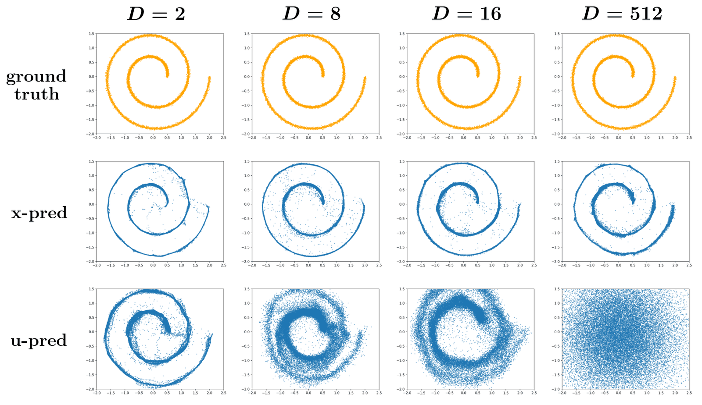
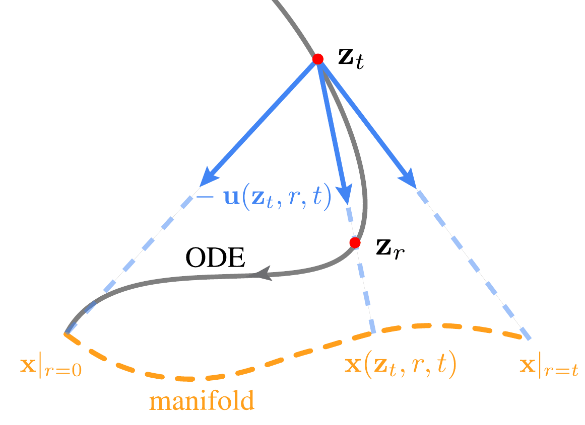
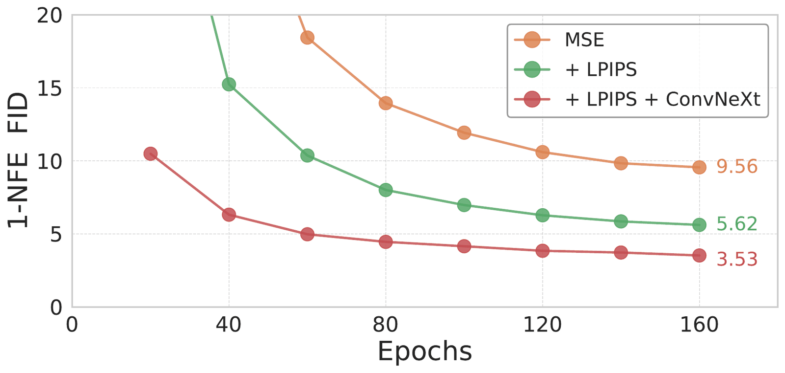
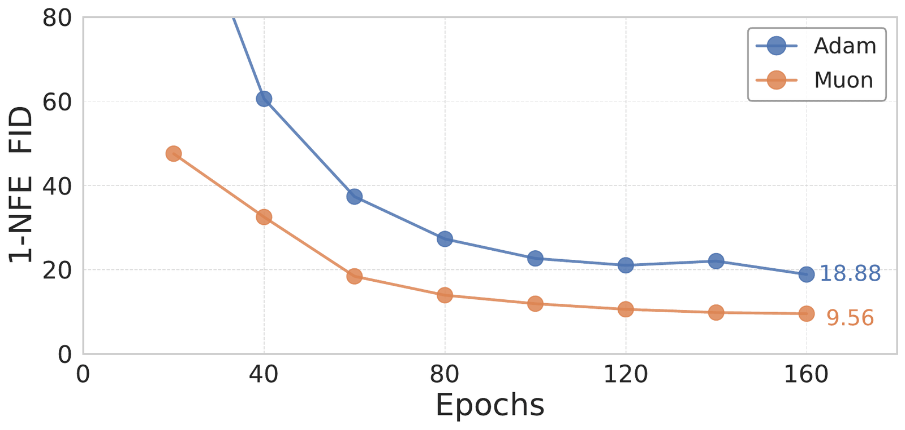

# One-step Latent-free Image Generation with Pixel Mean Flows

Pixel Mean Flows 把一步生成从 latent 空间推进到像素空间，避免 VAE 解码器开销，在 ImageNet 256/512 上实现强一跳生成质量。

## 论文信息

| 字段 | 内容 |
| --- | --- |
| 作者 | Yiyang Lu, Susie Lu, Qiao Sun, Hanhong Zhao, Zhicheng Jiang, Xianbang Wang, Tianhong Li, Zhengyang Geng, Kaiming He |
| 机构 | MIT, CMU |
| 日期 | 2026-01-29 初版；2026-05-09 v3 修订 |
| 代码 | 未见官方代码链接 |
| 链接 | https://arxiv.org/abs/2601.22158 |

## 一句话结论

PMF 证明一步生成不必依赖 latent VAE，直接在像素空间学习 mean flow 也可以达到高质量。

## 背景与问题

很多高效图像生成系统依赖 latent diffusion，因为像素空间维度高、训练难、采样贵。但 latent 路线需要 VAE 编码/解码，可能带来重建损失和额外 FLOPs。PMF 问的是：如果训练足够好，是否可以直接一步生成像素？

## 方法拆解

PMF 将 Mean Flows 扩展到像素空间，围绕目标参数化、损失权重、模型结构和优化器进行调整。重点不是增加采样步数，而是让一个函数评估直接完成从噪声到图像的映射。



PMF 展示无需 latent VAE 的像素级一步生成效果。



论文重新设计像素空间的 mean-flow 目标，处理高维像素生成的难点。



损失设计直接影响一步生成的视觉质量和稳定性。



Muon 等优化选择在大规模像素生成训练中发挥关键作用。

## 实验复盘

ImageNet 256 上，1-NFE PMF-B/L/H 的 FID 为 3.12、2.52、2.22；ImageNet 512 上为 3.70、2.75、2.48。论文还报告 LPIPS 从 9.56 降到 5.62，引入 ConvNeXt 可到 3.53；相比 SD-VAE 解码器 310G/1230G FLOPs，latent-free 路线有部署吸引力。

## 和相关工作的区别

相较 latent diffusion，PMF 避免了 VAE；相较 iMF，它把 fast-forward 生成推进到更难的像素空间；相较 GAN，它仍保留 flow/扩散式训练稳定性。

## 局限与启发

像素空间训练算力压力更大，且当前验证集中在 ImageNet。启发是：latent 表示并不是永恒前提，未来 AIGC 系统可能在质量、延迟和重建保真之间重新选择。

## 读论文脑图

```markmap
- One-step Latent-free Image Generation with Pixel Mean Flows
  - 问题
    - latent VAE 有解码开销和重建限制
  - 方法
    - 像素空间 one-step Mean Flows
  - 实验
    - ImageNet 256 FID 2.22，512 FID 2.48
  - 启发
    - latent-free 一步生成具备现实可能
```

# 深度 Q&A

## Q1: PMF 为什么强调 latent-free？

因为 latent 模型虽然高效，但依赖 VAE 解码，带来额外算力和潜在细节损失。PMF 直接生成像素，绕开这层瓶颈。

## Q2: 像素空间一步生成难在哪里？

像素维度高、局部细节多、长程结构复杂，一步映射容易模糊或失真。

## Q3: PMF 和 iMF 的核心差异是什么？

iMF 主要讨论 fast-forward 生成的改进框架，PMF 把类似思想落到更具挑战的像素空间。

## Q4: 为什么要关心 VAE FLOPs？

部署时 VAE 解码不是免费步骤，高分辨率下会显著增加延迟和成本。

## Q5: ImageNet 512 结果说明什么？

PMF 不只在低分辨率成立，在更高分辨率下仍能保持可用质量。

## Q6: 优化器消融为什么重要？

像素空间训练对优化稳定性更敏感，优化器可能决定模型是否能有效收敛。

## Q7: PMF 会取代 latent diffusion 吗？

短期不一定。latent diffusion 生态成熟，PMF 更像是在打开另一个高质量低延迟方向。

## Q8: 后续可以怎么扩展？

可以研究文本条件、视频、超分辨率以及和可控编辑结合的像素级 fast-forward 生成。

## Q9: 这篇论文最适合和哪类工作一起读？

适合和 diffusion / flow matching / consistency model / autoregressive generation 相关工作一起读。它的位置不是单点技巧，而是在采样步数、训练目标、表示空间和系统约束之间重新分配复杂度。

## Q10: 我复现时应该优先看哪些细节？

优先看数据预处理、token 或 latent 表示、训练步数、模型规模、采样步数、guidance 设置和评测协议。生成模型论文里，很多看似小的实现选择都会改变 FID、PPL、BLEU 或可视化质量。

## Q11: 这篇论文给 AIGC 系统设计的启发是什么？

它提醒我们不要只追求更大的模型，也要关心生成过程本身是否适合部署。一步或少步生成、可逆映射、视觉归纳偏置、离散语言流等方向，都在把 AIGC 从“能生成”推向“低延迟、可控、可组合”。
