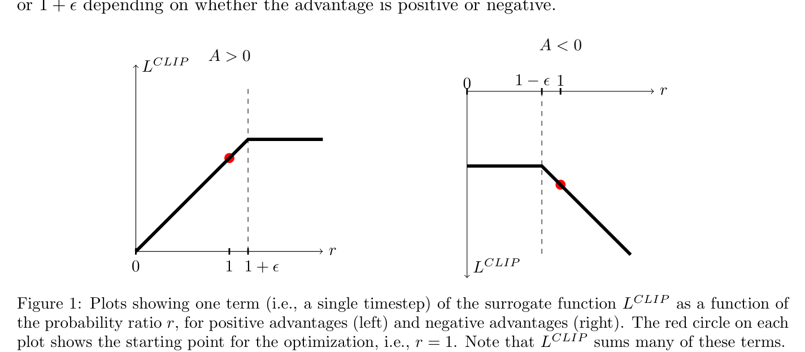
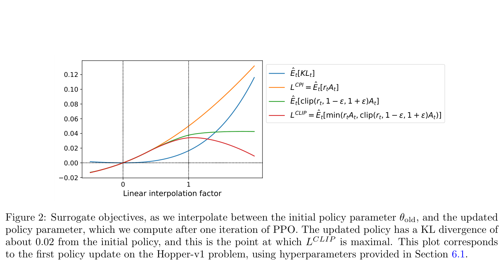
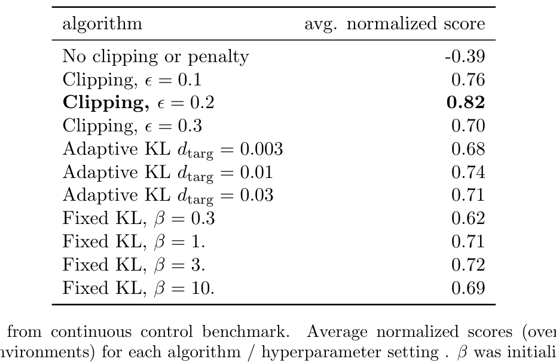
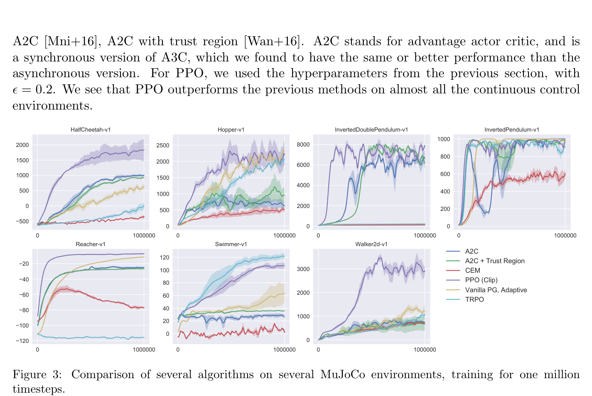
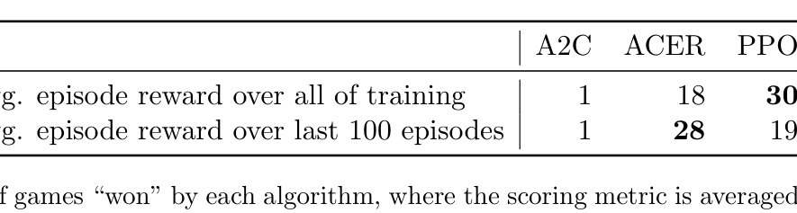

# Proximal Policy Optimization Algorithms 论文解读

## 论文基本信息

| 字段 | 内容 |
| --- | --- |
| 论文 | Proximal Policy Optimization Algorithms |
| 作者 | John Schulman, Filip Wolski, Prafulla Dhariwal, Alec Radford, Oleg Klimov |
| 机构 | OpenAI |
| 发布时间 | 2017-07-20；arXiv v2 修订于 2017-08-28 |
| Venue | arXiv |
| 论文链接 | https://arxiv.org/abs/1707.06347 |
| 代码链接 | 论文未说明/未找到 |

## TL;DR

PPO 想解决 policy gradient 的老问题：普通策略梯度每批样本通常只安全地用一次，多做几轮更新容易把新策略推得离旧策略太远；TRPO 用 trust region 约束解决稳定性，但实现复杂、需要二阶近似，也不太适合带 dropout、参数共享或辅助任务的网络。

论文提出一种更简单的一阶优化方案：仍然交替进行“采样 rollout”和“优化 surrogate objective”，但把新旧策略概率比 $r_t(\theta)=\frac{\pi_\theta(a_t|s_t)}{\pi_{\theta_{\mathrm{old}}}(a_t|s_t)}$ 限制在 $[1-\epsilon,1+\epsilon]$ 附近。核心 clipped objective 会在更新过大且方向看似有利时截断收益，从而形成对原 surrogate 的 pessimistic lower bound。

实验上，PPO-Clip 在 7 个 MuJoCo 连续控制任务的 objective ablation 中平均归一化分数最高，$\epsilon=0.2$ 得到 0.82；在连续控制对比里，PPO 几乎所有环境优于 TRPO、A2C、CEM 等 baseline；在 Atari 上，PPO 按训练期平均回报赢 30/49 个游戏，样本效率显著好于 A2C，并接近 ACER，但实现更简单。虽然这不是 LLM 论文，但 PPO 后来成为 RLHF/RLVR 训练语言模型时最常见的策略优化器之一。

## 论文脑图

```markmap
# PPO

## 问题

### vanilla policy gradient 样本效率低

### 多轮复用同一批轨迹会导致过大更新

### TRPO 稳定但复杂

## 方法

### probability ratio r_t

### clipped surrogate objective

### adaptive KL penalty baseline

### 多 epoch minibatch SGD

### value loss + entropy bonus

## 实验

### surrogate objective ablation

### MuJoCo continuous control

### Roboschool humanoid

### Atari 49 games

## 结论

### PPO-Clip 综合最好

### 接近 TRPO 稳定性

### 一阶优化更简单通用

## 局限

### clip 不是严格 trust region

### epsilon 等超参仍影响稳定性

### 理论单调改进保证弱于 TRPO

## 复现要点

### advantage normalization

### old policy logprob 固定

### 多轮 minibatch 更新

### 监控 KL 和 entropy
```

## 研究背景与问题定义

论文从 2017 年神经网络强化学习的几个主流路线出发：DQN 在离散 Atari 上有效，但对连续控制和函数逼近理论仍不稳定；vanilla policy gradient 简单，但样本效率差、鲁棒性弱；TRPO 通过 trust region 约束策略变化，表现可靠，但实现复杂，且与 dropout、policy/value 参数共享、辅助任务等结构不太兼容。

PPO 的目标是折中：像 TRPO 一样避免过大 policy update，又像普通一阶优化一样容易实现、可并行、可复用同一批样本做多轮 minibatch 更新。它要解决的核心问题可以概括为：

> 如何在不做二阶 trust-region 优化的情况下，限制新策略不要离采样策略太远，同时充分利用已采样 trajectory？

这点也是 PPO 后来进入 LLM RLHF 的原因：语言模型 policy 很大，训练管线复杂，能用一阶优化和 minibatch 方式近似控制 KL 的算法天然有工程吸引力。

## 核心方法

### 1. 从 policy gradient 到 surrogate objective

普通 policy gradient 使用估计器：

$$
\hat{g}=\hat{\mathbb{E}}_t[\nabla_\theta\log\pi_\theta(a_t|s_t)\hat{A}_t]
$$

可以对应到一个可自动微分的目标：

$$
L^{PG}(\theta)=\hat{\mathbb{E}}_t[\log\pi_\theta(a_t|s_t)\hat{A}_t]
$$

问题是，如果对同一批 trajectory 反复优化这个目标，新策略会逐渐偏离采样时的旧策略，导致 importance mismatch 和过大更新。

TRPO 使用 conservative policy iteration 的 surrogate：

$$
L^{CPI}(\theta)=\hat{\mathbb{E}}_t\left[
\frac{\pi_\theta(a_t|s_t)}{\pi_{\theta_{\mathrm{old}}}(a_t|s_t)}
\hat{A}_t
\right]
=\hat{\mathbb{E}}_t[r_t(\theta)\hat{A}_t]
$$

并加 KL trust region 约束。PPO 保留这个概率比 $r_t(\theta)$，但把“不能走太远”的逻辑放进目标函数本身。

### 2. PPO-Clip：截断有利方向上的过大更新

论文主推的 clipped surrogate objective 是：

$$
L^{CLIP}(\theta)=
\hat{\mathbb{E}}_t\left[
\min\left(
r_t(\theta)\hat{A}_t,
\mathrm{clip}(r_t(\theta),1-\epsilon,1+\epsilon)\hat{A}_t
\right)
\right]
$$

当 advantage 为正时，增大动作概率是有利的，但 $r_t$ 超过 $1+\epsilon$ 后，收益不再继续增加；当 advantage 为负时，降低动作概率是有利的，但 $r_t$ 低于 $1-\epsilon$ 后也不再继续得到额外收益。取 `min` 的作用是让目标成为对未截断 surrogate 的保守估计：有利方向上的过大更新被截断，不利方向仍会被惩罚。



原文 Figure 1 展示单个 timestep 的目标形状：红点是旧策略 $r=1$，对正 advantage 和负 advantage，clip 分别限制右侧或左侧的过大收益。这张图是理解 PPO-Clip 的最佳入口。



原文 Figure 2 用 Hopper-v1 的一次 policy update 说明：沿更新方向插值时，$L^{CLIP}$ 是 $L^{CPI}$ 的下界式版本，并在 KL 约 0.02 处达到最大。这说明 clip 不是硬约束 KL，而是用目标函数形状间接抑制过大更新。

### 3. Adaptive KL penalty：重要 baseline，但不是最终赢家

论文也讨论了另一种 PPO 变体：直接优化 KL penalty 目标：

$$
L^{KLPEN}(\theta)=\hat{\mathbb{E}}_t
\left[
r_t(\theta)\hat{A}_t-\beta KL[\pi_{\theta_{\mathrm{old}}}(\cdot|s_t),\pi_\theta(\cdot|s_t)]
\right]
$$

然后根据实际 KL 是否低于或高于目标 $d_{\mathrm{targ}}$ 来调整 $\beta$：如果 KL 太小就减半 $\beta$，如果 KL 太大就翻倍 $\beta$。这和后来 RLHF 里动态 KL controller 的味道很像。论文实验里 adaptive KL 比固定 KL 好，但总体不如 PPO-Clip。

### 4. 实际训练目标：policy、value 和 entropy 合在一起

如果 policy 和 value function 共享网络参数，论文建议组合目标：

$$
L_t^{CLIP+VF+S}(\theta)=
\hat{\mathbb{E}}_t[
L_t^{CLIP}(\theta)
-c_1 L_t^{VF}(\theta)
+c_2 S[\pi_\theta](s_t)
]
$$

其中 value loss 训练状态价值函数，entropy bonus 鼓励探索。训练流程本质上很朴素：

1. 用当前 policy 与环境交互收集一批 trajectories。
2. 计算 reward-to-go / GAE advantage。
3. 固定旧策略 logprob，做多轮 minibatch SGD/Adam 优化 clipped objective。
4. 更新 policy 后进入下一轮采样。

## 实验设置与主要结果

### 1. Objective ablation：clip 版本胜出

论文先在 7 个 OpenAI Gym + MuJoCo 连续控制任务上比较不同 surrogate objective：无 clipping/penalty、不同 $\epsilon$ 的 clipping、adaptive KL、fixed KL。每种设置在 7 个环境上各跑 3 个随机种子，共 21 个 runs；每个环境把 random policy 归一化为 0、最佳结果为 1，再求平均。



Table 1 的关键数值：

| 方法 | 平均归一化分数 |
| --- | --- |
| No clipping or penalty | -0.39 |
| Clipping, $\epsilon=0.1$ | 0.76 |
| Clipping, $\epsilon=0.2$ | 0.82 |
| Clipping, $\epsilon=0.3$ | 0.70 |
| Adaptive KL, $d_{\mathrm{targ}}=0.01$ | 0.74 |
| Fixed KL, $\beta=3$ | 0.72 |

结论很直接：不限制更新会崩，clip 明显有效，其中 $\epsilon=0.2$ 最好。

### 2. MuJoCo 连续控制：PPO 几乎全面优于对比算法

论文将 PPO-Clip 与 TRPO、CEM、vanilla PG adaptive、A2C、A2C+Trust Region 在多个 MuJoCo 环境上比较，训练 100 万 timesteps。



原文 Figure 3 覆盖 HalfCheetah、Hopper、InvertedDoublePendulum、InvertedPendulum、Reacher、Swimmer、Walker2d 等环境。作者总结 PPO 在几乎所有连续控制环境上都优于前述方法。这个结果是 PPO 从“简单替代 TRPO”变成通用 RL baseline 的关键证据。

### 3. Roboschool humanoid：高维连续控制 showcase

论文还在 Roboschool 3D humanoid 上展示 PPO 能处理更复杂的连续控制任务，包括 forward locomotion、目标位置变化的 Flagrun、以及被方块撞击后需要重新站起的 FlagrunHarder。正文 Figure 4 是学习曲线，Figure 5 是 learned policy 的连续帧。这里不是严格横向 benchmark，而是展示 PPO 的可扩展性。

### 4. Atari：样本效率优于 A2C，接近 ACER 但更简单

Atari 实验在 Arcade Learning Environment 上比较 PPO、A2C、ACER，三者使用同样 policy network architecture。论文看两个指标：训练全过程平均 episode reward，以及最后 100 episodes 平均 reward。



Table 2 的胜场数：

| 指标 | A2C | ACER | PPO | Tie |
| --- | --- | --- | --- | --- |
| 训练全过程平均 episode reward | 1 | 18 | 30 | 0 |
| 最后 100 episodes 平均 reward | 1 | 28 | 19 | 1 |

解读是：PPO 在样本效率/训练期平均回报上明显优于 A2C，也优于 ACER；在最终性能上 ACER 赢的游戏更多，但 PPO 实现更简单。论文摘要里也把结论写成：PPO 在 Atari 上 sample complexity 显著好于 A2C，和 ACER 类似但更简单。

### 5. 复现超参

论文附录给出几个关键超参：

| 设置 | MuJoCo | Atari |
| --- | --- | --- |
| Horizon | 2048 | 128 |
| Adam stepsize | $3\times10^{-4}$ | $2.5\times10^{-4}\times\alpha$ |
| Epochs | 10 | 3 |
| Minibatch size | 64 | $32\times8$ |
| Discount $\gamma$ | 0.99 | 0.99 |
| GAE $\lambda$ | 0.95 | 0.95 |
| Clip $\epsilon$ | 0.2 in main continuous experiments | $0.1\times\alpha$ |

其中 $\alpha$ 在 Atari 中随训练从 1 线性退火到 0。

## 当前工作 vs Related Work

| 方法 | 核心思路 | 主要假设 | 证据/表现 | 局限或代价 |
| --- | --- | --- | --- | --- |
| PPO-Clip | 用 probability ratio clipping 构造保守 surrogate，多轮 minibatch 一阶优化 | clip 足以抑制过大有利更新，近似 trust region 效果 | Table 1 中 $\epsilon=0.2$ 最好；MuJoCo 几乎全面优于对比方法；Atari 样本效率强 | 没有 TRPO 那样严格 monotonic guarantee；clip 不是精确 KL 约束 |
| TRPO | 用 KL trust region 和二阶/自然梯度近似限制策略更新 | trust region 能带来稳定单调改进 | 是 PPO 追求的稳定性基准 | 实现复杂，不适合某些网络结构和参数共享 |
| Vanilla policy gradient | 直接优化 logprob-weighted advantage | 小步更新足够稳定 | 简单，易实现 | 数据效率差，同批数据多轮更新容易过大 |
| Adaptive KL PPO | 在 surrogate 中加入 KL penalty 并动态调 $\beta$ | 目标 KL 能控制更新幅度 | 比固定 KL 更稳，是重要 baseline | 论文实验中弱于 clipped objective |
| A2C/ACER | Actor-critic 及 experience replay 变体 | value baseline/replay 可提升效率 | Atari 上强，ACER 最终性能胜场较多 | PPO 在样本效率和实现简单性上更有吸引力 |

## 启发、局限与可复现要点

- 启发：PPO 的核心工程价值是“让同一批 rollout 可以安全做多轮 minibatch 更新”，这比公式本身更影响训练效率。
- 启发：clip 不是把 KL 直接限制住，而是去掉有利方向上的过大 incentive；实际训练仍应监控 KL。
- 启发：PPO-Clip 可以看作 TRPO 精神的一阶、工程友好版本。
- 启发：在 LLM RLHF/RLVR 中，PPO 的 KL/reference policy 思想和本文 adaptive KL/clip 思路高度相关。
- 局限：PPO 没有 TRPO 那种严格 trust-region 理论保证，clip 后仍可能出现 KL 异常。
- 局限：$\epsilon$、epoch 数、batch size、advantage normalization、value loss 权重都会影响训练稳定性。
- 局限：论文实验主要是经典 RL 环境，不包含后来 LLM token-level credit assignment 和 reward hacking 问题。
- 复现要点：采样时要保存 old logprob，训练时用固定的 old policy denominator 计算 $r_t$。
- 复现要点：同一批 rollout 做多轮更新，但不要无限复用；MuJoCo 主实验用 10 epochs，Atari 用 3 epochs。
- 复现要点：优势估计建议使用 GAE，论文中 $\gamma=0.99,\lambda=0.95$。
- 复现要点：训练时同时记录 clip fraction、approx KL、entropy、value loss；PPO 出问题往往先体现在 KL/entropy 异常。
- 可能的下一步实验：把 PPO-Clip、GRPO、DPO/IPO 等放到 LLM post-training 的同一 reward-KL frontier 上比较，而不是只看最终 benchmark 分数。

## 再读一遍路线

1. 先读 Abstract 和 Introduction，抓住 PPO 对 TRPO 的定位：稳定性接近、实现更简单。
2. 读 §2，确认 policy gradient、CPI surrogate、TRPO KL 约束的来龙去脉。
3. 重点读 §3 和 Figure 1/2，理解 clipped surrogate 是如何阻止过大更新的。
4. 再读 §4，把 adaptive KL penalty 和 PPO-Clip 做对比。
5. 最后读 §6 和 Appendix A/B，核对 objective ablation、MuJoCo、Roboschool、Atari 的证据链和超参。

# 深度 Q&A

**Q1：PPO 的“proximal”到底是什么意思？**

A：它指每次策略更新不要离旧策略太远。TRPO 用显式 KL trust region 保证“近”，PPO 用 clipped ratio 或 adaptive KL penalty 让策略更新保持在旧策略附近。

**Q2：为什么 PPO 要用新旧策略概率比 $r_t$？**

A：trajectory 是旧策略采样来的，但我们要评估新策略更新的方向。概率比 $r_t=\pi_\theta(a_t|s_t)/\pi_{\theta_{\mathrm{old}}}(a_t|s_t)$ 起到 importance ratio 的作用，衡量新策略相对旧策略在该动作上的概率变化。

**Q3：clip 为什么要配合 `min`？**

A：只做 clip 会忽略一些不利变化。取 `min` 后，目标会选择更保守的一项：当更新让 objective 看起来更好但 ratio 已经过界时，收益被截断；当更新让 objective 变差时，坏处仍被计入。

**Q4：PPO-Clip 是严格 KL 约束吗？**

A：不是。clip 约束的是 sampled action probability ratio，不是完整 action distribution 的 KL。因此实践中仍可能出现 KL 偏大，需要监控 approximate KL 或配合 early stopping / KL penalty。

**Q5：为什么不用固定 KL penalty？**

A：固定 $\beta$ 很难跨任务、跨训练阶段稳定工作。论文实验显示 fixed KL 的得分不如 clip；adaptive KL 能自动调 $\beta$，但仍弱于 clipped objective。

**Q6：PPO 相比 TRPO 最大工程优势是什么？**

A：PPO 只需要一阶优化，直接用 Adam/SGD 和自动微分即可；TRPO 需要更复杂的 constrained optimization / natural gradient 近似。PPO 更容易与大模型、并行采样、参数共享结合。

**Q7：论文里的最佳 clip epsilon 是多少？**

A：Table 1 中连续控制 objective ablation 里，$\epsilon=0.2$ 的平均归一化分数最高，为 0.82；$\epsilon=0.1$ 是 0.76，$\epsilon=0.3$ 是 0.70。

**Q8：PPO 为什么后来会用于 LLM RLHF？**

A：RLHF 也需要在 reference model 附近优化 reward，避免策略偏离太远。PPO 的“reward 最大化 + KL/ratio 控制 + minibatch 一阶优化”非常适合大规模语言模型 post-training 的工程约束。

**Q9：PPO 在 LLM 上和原论文环境有什么不同？**

A：原论文主要是连续控制和 Atari，动作空间和 reward 结构相对清晰；LLM 是长序列离散 token，reward 常在序列末端，credit assignment、KL 估计、长度偏置、reward hacking 都更复杂。因此 LLM PPO 需要更多工程修正。

**Q10：PPO 最常见的复现坑是什么？**

A：old logprob 没固定、advantage 没标准化、epoch 过多导致 KL 爆、value loss 权重过大、entropy 过快塌陷、clip range 和 learning rate 不匹配。这些都会让 PPO 表面在跑，实际策略已经偏得太远。

**Q11：Table 2 的 Atari 结果该怎么理解？**

A：按训练全过程平均回报，PPO 赢 30/49 个游戏，ACER 赢 18，A2C 只赢 1，说明 PPO 样本效率强；按最后 100 episodes，ACER 赢 28，PPO 赢 19，说明 ACER 最终性能也很强，但 PPO 更简单。

**Q12：今天再读 PPO，最重要的启发是什么？**

A：PPO 的成功不只来自一个漂亮公式，而是来自把一个复杂 trust-region 思想降成可工程化的训练协议：采样、固定 old policy、估计 advantage、多轮 minibatch、clip ratio、监控 KL。这套协议后来影响了几乎所有大模型 RL 后训练。
