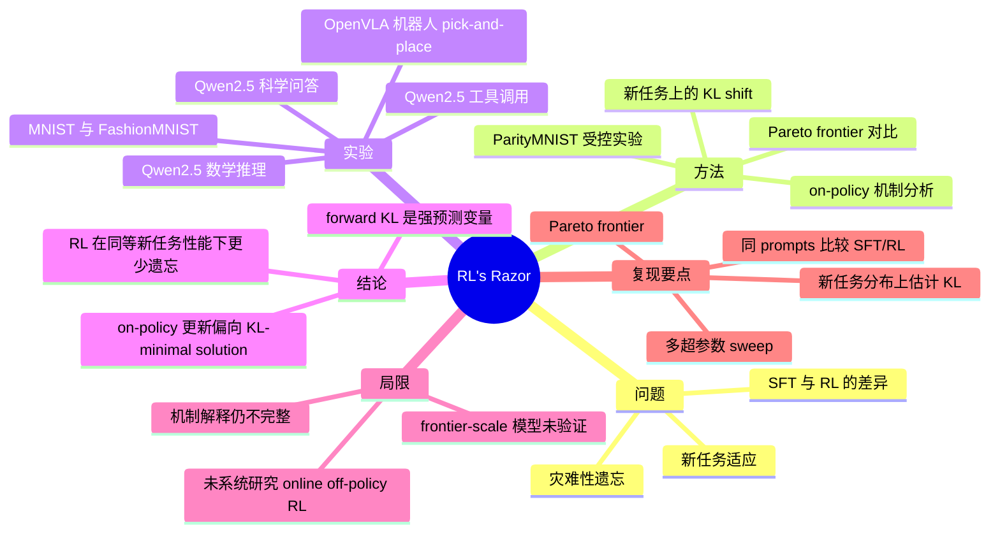
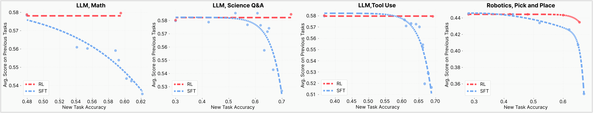
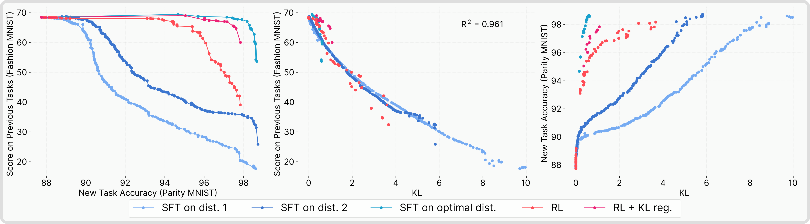
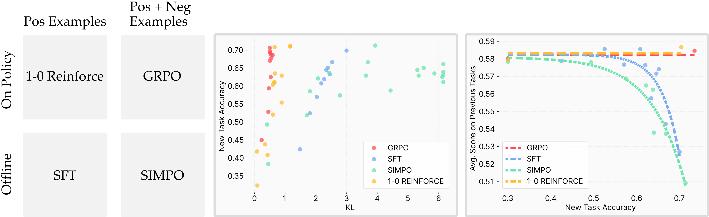
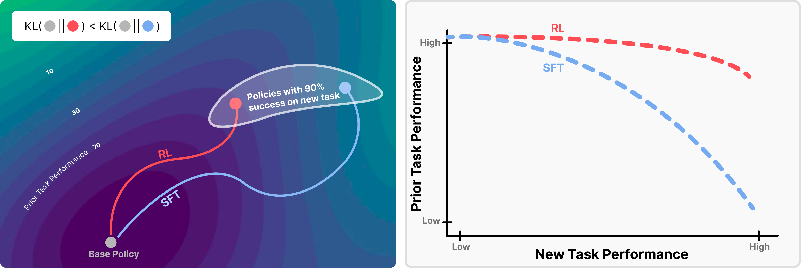
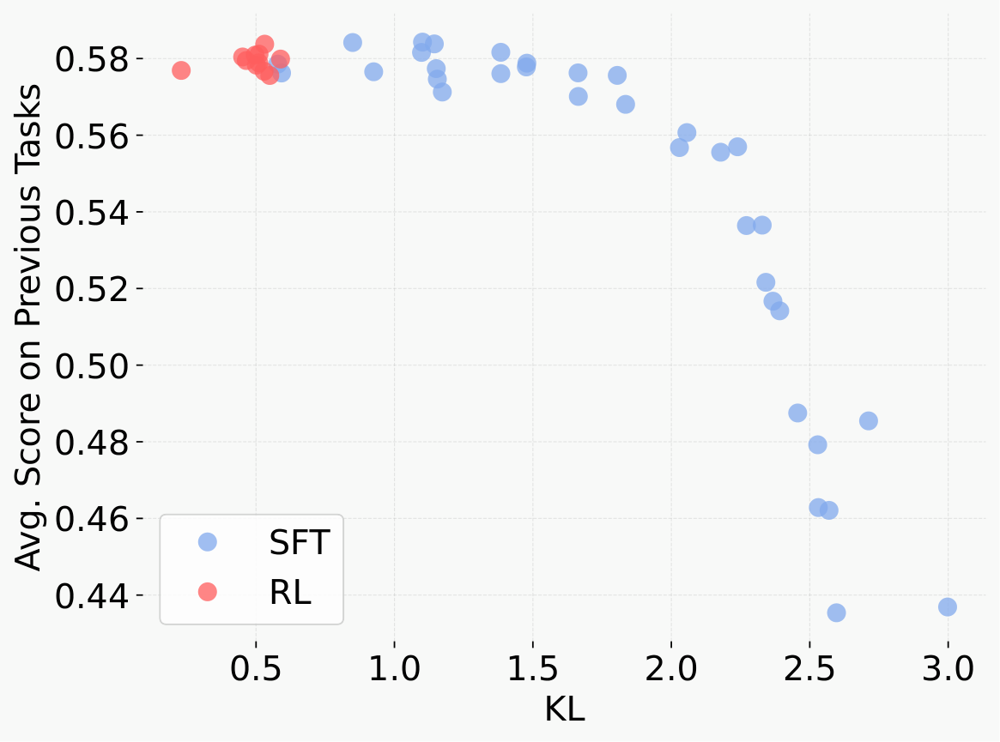

# RL's Razor: Why Online Reinforcement Learning Forgets Less 论文解读

## 论文基本信息

| 字段 | 内容 |
| --- | --- |
| 论文 | RL's Razor: Why Online Reinforcement Learning Forgets Less |
| 作者 | Idan Shenfeld, Jyothish Pari, Pulkit Agrawal |
| 机构 | Improbable AI Lab, MIT |
| 发布时间 | 2025-09-04 |
| Venue | arXiv |
| 论文链接 | https://arxiv.org/abs/2509.04259 |
| 项目页 | http://jyopari.github.io/posts/rl_razor |
| 代码链接 | 论文未说明/未找到 |

## TL;DR

这篇论文研究一个很实用的问题：为什么同样在新任务上微调，RL 往往比 SFT 更少破坏模型原本能力？作者的答案不是“RL 天然更聪明”，而是一个更可测的量：在新任务输入分布上，微调后策略相对基座策略的 KL divergence 越大，灾难性遗忘越严重。

论文提出 **RL's Razor**：在许多都能解决新任务的策略中，online/on-policy RL 更偏向选择离原始模型 KL 距离更近的解；SFT 则可能被外部标注分布拉向离基座模型很远的解。因此，在新任务性能相近时，RL 通常保留更多 prior capabilities。作者在 Qwen2.5 3B-Instruct 的数学、科学问答、工具调用任务，以及 OpenVLA 7B 机器人任务上观察到这个现象，并用 ParityMNIST 做受控验证。

最值得记住的数值证据是：在 ParityMNIST 中，forward KL 对遗忘的二次拟合达到 $R^2=0.96$；在 LLM 实验中也有 $R^2=0.71$ 的相关性。论文还展示 oracle SFT：如果 SFT 的监督分布被设计成 KL-minimal，它甚至可以比 RL 更少遗忘，这说明关键不是“RL”这个名字，而是训练分布是否接近基座模型。

## 论文脑图

## 研究背景与问题定义

持续学习里的痛点是：模型学会一个新任务后，常常丢掉原先能力。对 foundation model 来说，这不是一个小问题，因为预训练和后训练得到的能力集合很大，几乎不可能在每次微调时都完整拿旧任务数据做约束。

论文把问题设定成 post-training 方法比较：给定同一批新任务 prompts，用 SFT 或 RL 微调模型，然后同时评估两条轴：

- 新任务性能：新引入任务的 held-out test performance。
- 旧任务性能：一组无关 benchmark 上的平均能力保留，性能下降被视为 forgetting。

关键问题是：当 RL 和 SFT 在新任务上达到相近表现时，为什么 prior task performance 会差这么多？

作者提出的核心变量是：

$$
\mathbb{E}_{x\sim\tau}\left[\mathrm{KL}(\pi_0 \Vert \pi)\right]
$$

其中 $\tau$ 是新任务输入分布，$\pi_0$ 是 base policy，$\pi$ 是 fine-tuned policy。注意这个 KL 是在新任务分布上测的，不需要旧任务数据；这也是它在工程上有吸引力的地方。

## 核心方法

### 1. 用 Pareto frontier 公平比较 SFT 和 RL

论文没有只比较一个 checkpoint，而是对 SFT 和 RL 都做多组超参数 sweep，再画出“新任务性能 vs 旧任务性能”的 Pareto frontier。这样可以避免某个学习率或 batch size 偶然让一个方法看起来更好。

图 2 展示主实验结论：RL 的 frontier 通常更靠右上，即能在提升新任务能力的同时保持旧能力；SFT 的新任务收益更容易伴随旧任务下降。论文特别指出 Math 任务上 SFT 的遗忘最明显，而 Science Q&A 和 Tool Use 在低新任务准确率区域还能保留一些旧能力，但逼近高准确率时衰退加快。

### 2. 把遗忘解释为新任务上的 KL shift

作者先在真实 LLM/机器人任务里观察到 RL/SFT 差异，然后转向 ParityMNIST 做可控实验。ParityMNIST 的关键设计是：一个偶数图片可以被预测成任意偶数标签都算正确，奇数同理。因此存在许多“新任务 100% 正确”的输出分布，和 LLM 生成任务中“多个回答都可得高 reward”的情形相似。

图 3 的三个面板分别说明：

- 左：RL 相比普通 SFT 更少遗忘；但如果 SFT 使用 oracle KL-minimal distribution，则可以超过 RL。
- 中：把遗忘程度改画成 KL 的函数后，RL 和 SFT 的点基本落到同一条曲线上，ParityMNIST 中二次拟合 $R^2=0.96$。
- 右：达到相似新任务准确率时，RL 的 KL shift 明显更小。

这个结果把因果叙事往前推了一步：不是“RL 一定比 SFT 更少遗忘”，而是“更低 KL 的解更少遗忘；on-policy RL 通常更容易找到这样的解”。如果 SFT 的标签分布被改造成 KL-minimal，SFT 也可以很强。

### 3. on-policy 是关键，而不是负样本

论文进一步区分 RL 和 SFT 的两个差异：

- 采样分布：RL 从当前模型自己的分布采样；SFT 从外部固定标注分布采样。
- 负样本梯度：RL 中错误输出可能被负 advantage 压低概率；SFT 通常只拉高正标签概率。

作者构造四类 objective：

| 方法 | on-policy | 使用负样本/负梯度 | 作用 |
| --- | --- | --- | --- |
| GRPO | 是 | 是 | 标准 RL 对照 |
| 1-0 Reinforce | 是 | 否 | 只在正确样本上更新，隔离 on-policy 因素 |
| SFT | 否 | 否 | 标准监督微调 |
| SimPO | 否 | 是 | offline 但有偏好/负样本信号 |

图 4 的结论是：1-0 Reinforce 和 GRPO 更像，SimPO 和 SFT 更像。因此关键因素不是有没有负样本，而是训练样本是否来自当前策略自己的分布。on-policy 更新天然更像“沿着当前模型已经认为可能的输出重新加权”，而不是被外部标签拉到远处。

### 4. 理论直觉：policy gradient 选择 KL-minimal optimal policy

论文用一个有限输出、二元 reward 的简化设定解释 RL's Razor。核心步骤是：

1. 对当前分布 $p$ 做 rejection sampling，只接受 $R(y)=1$ 的输出，得到的分布等价于在所有完美 reward 分布中最小化 $D_{\mathrm{KL}}(q\Vert p)$。
2. policy gradient 可以看作把这个 reward-reweighted distribution 投影回可表示策略族。
3. 在合适的凸性/正则条件下，反复做这个过程会收敛到：

$$
\pi^\dagger=\arg\min_{\pi\in P^*\cap\Pi}D_{\mathrm{KL}}(\pi\Vert\pi_0)
$$

也就是说，在所有 optimal policy 里，policy gradient 偏向选择离初始化策略最近的那个。

这张概念图很好地概括了论文名字里的 “razor”：当新任务有很多可行解时，RL 像一把剃刀，把解空间削向更接近 base policy 的那部分。

## 关键图表

| 图表 | 原文位置 | 核心含义 |
| --- | --- | --- |
| Figure 1 | Abstract 后 | RL 在高 reward 解里偏向 KL-minimal solution，因此旧任务保留更好。 |
| Figure 2 | §3.1 | 多个 LLM 与机器人任务的 Pareto frontier：RL 在同等新任务性能下更少遗忘。 |
| Figure 3 | §4 | ParityMNIST 中 forward KL 对 forgetting 有强预测性，$R^2=0.96$。 |
| Figure 4 | §5.1 | on-policy 比负样本更关键：GRPO/1-0 Reinforce 更低 KL，SFT/SimPO 更高 KL。 |
| Figure 11 | Appendix | LLM 实验中 KL 与 forgetting 的相关性，二次拟合 $R^2=0.71$。 |

Figure 11 是主文 Figure 3 在 LLM setting 里的补充证据。相比 MNIST，LLM 的 KL 和 accuracy 估计更噪，因此相关性弱一些，但作者报告 residuals 接近 mean-zero，并认为它仍支持 KL-forgetting law。

## 实验设置与主要结果

### LLM 与机器人任务

论文实验覆盖三类 LLM 任务和一个机器人任务：

| 场景 | Base model | 新任务 | 旧任务/遗忘评估 |
| --- | --- | --- | --- |
| Math reasoning | Qwen2.5 3B-Instruct | Open-Reasoner-Zero 数学题 | Hellaswag, TruthfulQA, MMLU, IFEval, Winogrande, HumanEval |
| Science Q&A | Qwen2.5 3B-Instruct | SciKnowEval Chemistry L-3 | 同上 |
| Tool use | Qwen2.5 3B-Instruct | ToolAlpaca | 同上 |
| Robotics | OpenVLA 7B | SimplerEnv pick up can | SimplerEnv open/close drawer tasks |

RL 主要使用 GRPO，reward 是二元成功指标，且主实验没有显式 KL regularization。SFT 和 RL 使用同一组 prompts。为了公平比较，作者训练几十个不同超参数 checkpoint，并取 Pareto frontier。

主要结果：

- RL 在数学、科学问答、工具调用和机器人任务上都表现出更好的 learning-forgetting trade-off。
- 在新任务表现相近时，SFT 通常更牺牲旧任务能力。
- 对 LLM 来说，遗忘评估不是某一个旧任务，而是一组 benchmark 的综合代理。

### ParityMNIST 受控实验

作者用 3-layer MLP 同时预训练 ParityMNIST 与 FashionMNIST，再只在 ParityMNIST 上微调，并用 FashionMNIST 衡量遗忘。这个设置小到可以做完整收敛和系统 ablation。

关键设置：

- SFT：从某个任意正确标签分布采样监督标签。
- RL：reward 只看 parity correctness，模型可以自由收敛到任何正确标签分布。
- Oracle SFT：直接使用在所有完美正确分布中 KL 最小的标注分布。

关键结论：

- 普通 SFT 的 Pareto frontier 比 RL 更差。
- Oracle SFT 的 frontier 比 RL 更好，说明“低 KL 分布”才是关键。
- 用 RL-trained model 生成数据再蒸馏给 SFT，SFT 可以匹配 RL 的 trade-off，进一步说明决定遗忘的是学到的输出分布，而不是优化器标签。

### Alternative hypothesis ablation

作者还系统排除了若干常见解释，包括权重变化大小、Fisher-weighted L2、spectral norm、activation drift、更新稀疏性、rank，以及多种 distributional distance。Table 1 给出 ParityMNIST 上的拟合结果：

| 变量 | $R^2$ |
| --- | --- |
| Forward KL | $0.96 \pm 0.01$ |
| Reverse KL | $0.93 \pm 0.01$ |
| Total Variation | $0.80 \pm 0.01$ |
| Distribution change L2 | $0.56 \pm 0.02$ |
| Weight change L1 | $0.34 \pm 0.02$ |
| Fisher weighted L2 | $0.58 \pm 0.02$ |
| Spectral norm | $0.58 \pm 0.02$ |
| Activation change L1/L2 | $0.52/0.55$ |

Forward KL 不是唯一有信号的指标，但它是最强、最稳定的解释变量。

## 当前工作 vs Related Work

| 方法 | 核心思路 | 主要假设 | 证据/表现 | 局限或代价 |
| --- | --- | --- | --- | --- |
| 本文 RL's Razor | 用新任务分布上的 base-to-finetuned forward KL 解释遗忘；on-policy RL 偏向 KL-minimal solution | 新任务上的 KL shift 可预测旧能力遗忘 | LLM、机器人、ParityMNIST；ParityMNIST $R^2=0.96$，LLM $R^2=0.71$ | 仍未解释 KL shift 如何在机制层面破坏旧能力；frontier-scale 未验证 |
| EWC / 参数约束类 continual learning | 约束重要参数变化，减少旧任务遗忘 | 参数空间距离或 Fisher 近似能代表旧任务能力 | 经典 continual learning 中有效；本文认为可视作 KL minimization 的近似 | 对 foundation model 旧任务集合不完整时难覆盖；本文实验中参数距离预测力弱 |
| KL regularized RLHF | 在 RL 目标中加入对 reference model 的 KL penalty | KL penalty 稳定训练、防 reward hacking，也可能减少遗忘 | 业界 RLHF 常用；本文把 KL 从启发式提升为遗忘预测变量 | 显式 KL penalty 不是本文主实验必要条件；关键是 KL-minimal path |
| Lai et al. 2025 的负样本解释 | RL 少遗忘来自学习 negative examples | 负样本/负梯度是 RL 优势来源 | 本文用 1-0 Reinforce 与 SimPO 对照，认为 on-policy 才是关键 | 负样本可能仍有帮助，但不能解释主差异 |

## 启发、局限与可复现要点

- 启发：评估后训练方法时，不只看新任务分数，也要看新任务分布上的 KL shift；它可能是比权重距离更直接的遗忘风险信号。
- 启发：SFT 未必天然容易遗忘，问题在于标注分布可能任意远离基座模型；如果能构造 KL-minimal 的监督分布，SFT 也可能兼顾效率与保留能力。
- 启发：on-policy 的价值不只在探索或 credit assignment，还在于它把学习限制在模型自己已有非零概率的区域附近。
- 局限：论文承认还缺少机制层解释，即为什么新任务上的 KL shift 会破坏旧能力，可能涉及表示干扰、容量或优化路径。
- 局限：实验覆盖 moderate-scale LLM 和机器人模型，但没有 frontier-scale 模型与更多开放生成域。
- 局限：论文没有系统研究 online off-policy RL，而这类算法在 RL 中也很常见。
- 复现要点：必须做多超参数 sweep 和 Pareto frontier，单点 checkpoint 容易误判。
- 复现要点：LLM SFT 需要高质量 reasoning chain 或工具调用标注；论文中 Math 用 DeepSeek R1 生成可用推理链，Science Q&A 用 GPT-4o 生成标注。
- 复现要点：KL 要在新任务 prompts 上估计，并明确是 $\mathrm{KL}(\pi_0\Vert\pi)$ 还是 reverse KL。
- 可能的下一步实验：把 DPO/IPO/KTO 等 preference/offline objectives 放到同一 on-policy/offline 轴上，测它们的 KL-forgetting frontier。

## 再读一遍路线

1. 先读 Abstract 和 Figure 1，抓住 RL's Razor 的一句话定义：RL 在高 reward 解里偏向 KL-minimal solution。
2. 再读 §3 和 Figure 2，确认论文要解释的现象确实存在于 LLM 与 robotics 场景。
3. 接着读 §4 和 Figure 3，这是全篇最关键证据：KL 是预测变量，oracle SFT 是强反事实验证。
4. 然后读 §5 和 Figure 4，看作者如何把“负样本”解释排除掉，把关键归到 on-policy。
5. 最后读 Appendix A 的 lemma/theorem，只需要抓住 rejection sampling/I-projection/M-projection 直觉，不必一上来钻证明。

# 深度 Q&A

**Q1：这篇论文最核心的命题是什么？**

A：同样适应新任务时，遗忘程度主要由 fine-tuned policy 相对 base policy 在新任务分布上的 forward KL 决定。RL 少遗忘，是因为 on-policy 更新倾向于找到 KL 更小的高 reward 解。

**Q2：为什么 KL 在新任务上测，而不是旧任务上测？**

A：旧任务集合对 foundation model 来说几乎不可穷尽，也常常拿不到数据。论文发现新任务分布上的 KL 就能预测遗忘，这让指标可测、可监控，也可能在训练中被控制。

**Q3：为什么 SFT 更容易走到远离 base model 的解？**

A：SFT 优化的是外部标注分布的 cross-entropy。如果标注答案只是许多正确答案中的一种，它可能把模型拉向一个对新任务正确、但和 base policy 原本偏好很不同的分布。这个分布 shift 会带来更高遗忘风险。

**Q4：RL 的 reward 也可能很稀疏，为什么它反而更保守？**

A：因为 on-policy RL 从当前策略采样。即使 reward 只判断成功与否，模型更新主要来自自己已经能产生、且被 reward 接受的样本，再逐步重加权。它不像 SFT 那样直接追一个外部分布，所以路径更接近 base policy。

**Q5：负样本是不是 RL 少遗忘的原因？**

A：论文认为不是主因。1-0 Reinforce 不使用负样本梯度，但表现接近 GRPO；SimPO 使用负样本但仍像 SFT。这个对照说明 on-policy/offline 采样分布比负样本机制更关键。

**Q6：Oracle SFT 为什么重要？**

A：Oracle SFT 是一个反事实验证：如果 SFT 使用的监督分布就是 KL-minimal 且任务正确，它可以比 RL 更少遗忘。这直接说明“RL 少遗忘”不是因为 RL 目标神秘地更好，而是因为 RL 隐式找到低 KL 解。

**Q7：这对 RLHF 或 LLM post-training 有什么启发？**

A：训练时可以把“新任务性能”和“相对 base model 的 KL shift”同时作为核心观测量。KL regularization 不只是防 reward hacking 的稳定技巧，也可能是减少遗忘的主轴。不过论文更强调目标应该是找到 KL-minimal 的有效解，而不是机械加一个 KL penalty。

**Q8：这篇论文最需要谨慎看待的地方是什么？**

A：它证明了 KL 和遗忘之间的强经验关系，也给了 on-policy 的理论解释，但还没有完全解释“为什么新任务 KL shift 会破坏旧任务能力”的机制。对 frontier-scale LLM、更复杂多轮 agent、online off-policy RL 的泛化，也还需要新实验。

**Q9：如果我要复现，最容易踩的坑是什么？**

A：只比较单个 checkpoint 会很危险，因为不同超参数会改变 learning-forgetting trade-off。应该像论文一样做 sweep、取 Pareto frontier，并确保 SFT/RL 使用同样 prompts、新任务和旧任务评估严格分离。

**Q10：这篇论文和“RL improves generalization”的关系是什么？**

A：它不是泛泛地说 RL 泛化更好，而是给出一个更具体的解释变量：RL 的 on-policy 训练让策略移动更少，低 KL shift 同时对应更少遗忘。也就是说，它把“泛化/保留能力”的现象压缩到一个可测的 distributional shift 指标上。
