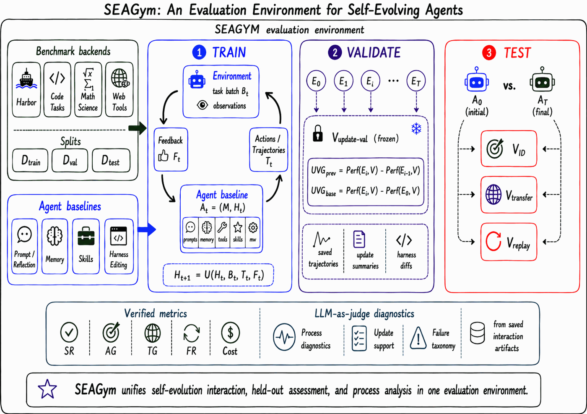
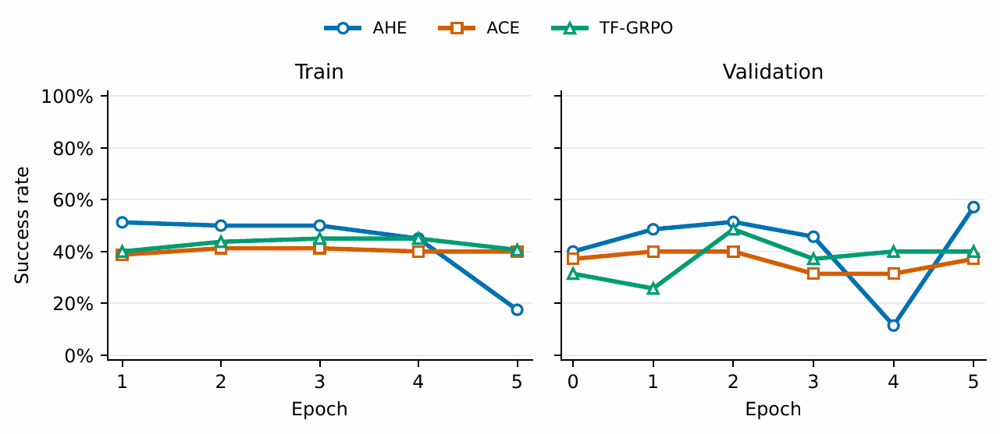
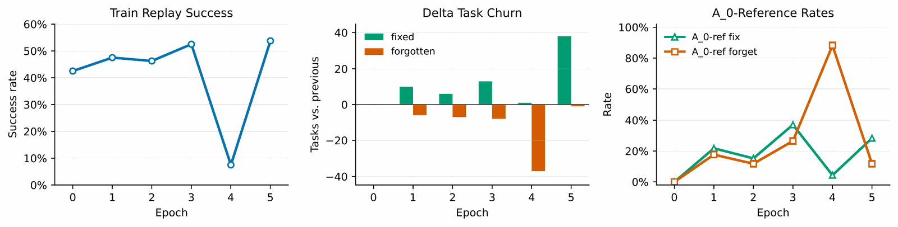
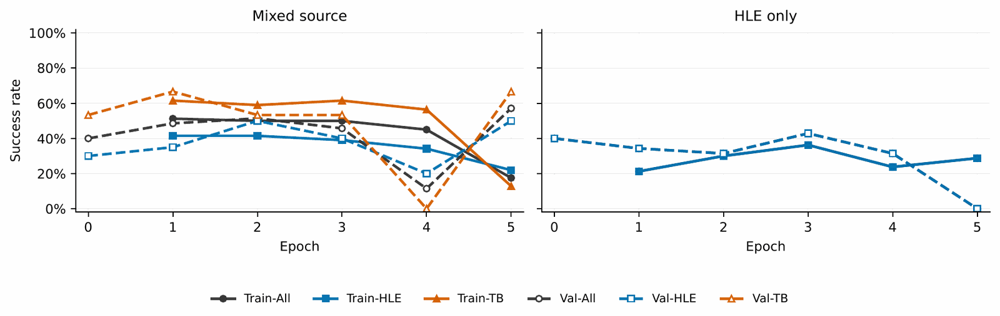
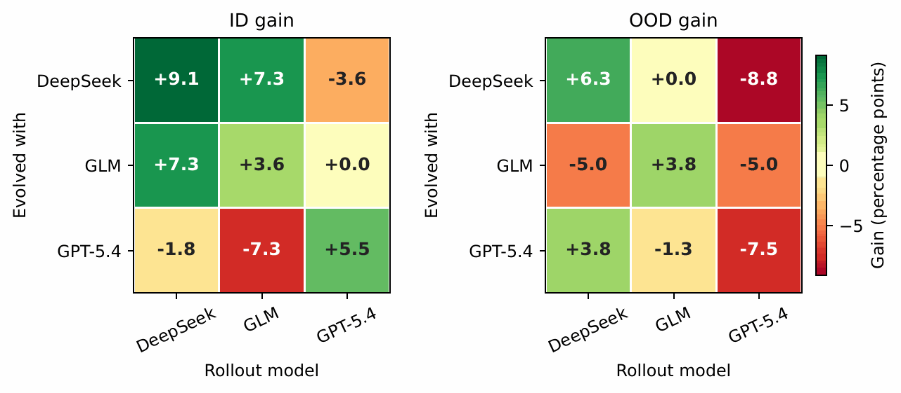

# SEAGym: An Evaluation Environment for Self-Evolving LLM Agents 论文解读

## 论文基本信息

| 字段 | 内容 |
| --- | --- |
| 论文 | SEAGym: An Evaluation Environment for Self-Evolving LLM Agents |
| 作者 | Congjie Zheng, Chuanyi Xue, Bin Liang, Jun Yang, Changshui Zhang |
| 机构 | Department of Automation, Tsinghua University; Beijing National Research Center for Information Science and Technology (BNRist), Tsinghua University |
| 发布时间 | 2026-06-16 |
| Venue | arXiv |
| 论文链接 | https://arxiv.org/abs/2606.17546 |
| 代码链接 | 论文未说明/未找到 |

## TL;DR

SEAGym 关注的是一个很容易被单点 benchmark 掩盖的问题：自进化 LLM agent 不是只在“变强”，它是在更新 agent harness，也就是围绕 base model 的 prompts、memory、tools、middleware、runtime state 和 model-tool interaction loop。这样的更新可能复用经验，也可能过拟合最近任务、引入更高成本、破坏旧行为，甚至让一个中间快照很强、后续快照又崩掉。

论文提出的 SEAGym 是一个评测环境，而不是一个新的自进化算法。它把 Harbor-compatible benchmarks 转成动态自进化任务源，提供 train batches、frozen update-validation、held-out ID/OOD transfer、replay diagnostics、snapshot records 和 cost records。核心判断是：要评价 self-evolving agent，不能只看最终分数，而要看“什么证据驱动了更新、哪些快照提升或回退、提升是否转移到 held-out 任务、旧能力是否被忘掉、成本是否可接受”。

实验上，论文在 Terminal-Bench 2.0 和 HLE 上比较 ACE、TF-GRPO 和 AHE。AHE 是唯一同时提升 validation、ID 和 OOD 的方法：validation 从 40.0 到 57.1，ID 从 40.0 到 49.1，OOD 从 22.5 到 28.8；但 replay 诊断也显示它会经历严重中间崩溃，例如 epoch 4 后 train replay 从初始 34/80 掉到 6/80，最终恢复到 43/80。这正是 SEAGym 想暴露的过程信号。

## 论文脑图

```markmap
# SEAGym

## 问题

### 自进化 agent 更新的是 harness

### 单个最终分数看不出泛化或遗忘

### validation gain 可能不转移

### 有用中间快照可能后续崩溃

## 方法

### RL-style environment formulation

### agent snapshot = base model + mutable harness

### train batches

### frozen update-validation

### ID / OOD transfer

### replay diagnostics

### cost and saved records

## 实验

### Terminal-Bench 2.0

### HLE Math/Physics and OOD CS/AI Engineering

### ACE vs TF-GRPO vs AHE

### batch size

### source diversity

### cross-model transfer

## 结论

### AHE broad gains but reliability risk

### ACE resembles skill memory optimization

### TF-GRPO validation gains may not OOD transfer

## 局限

### 只实例化 Terminal-Bench 和 HLE

### 主要研究 model-external harness evolution

### 多视角评测成本较高

## 复现要点

### Harbor-compatible task source

### snapshot records

### frozen validation views

### replay and cost metrics
```

## 研究背景与问题定义

论文把 self-evolving agent 定义为：LLM-based agent 根据任务经验更新持久化 harness state，并在后续任务复用这个更新状态。这里的 harness 不是模型权重，而是 base model 周围的结构化执行层，包括 prompt、context management、memory、tool interface、orchestration logic、middleware、runtime environment、feedback/verification mechanism 等。

这一定义非常关键。很多 agent 的“进化”并不是 fine-tune 了模型，而是修改了外部执行系统：记住某类任务的经验、更新工具使用规则、增加检查步骤、改写 middleware、改变何时停止或何时重试。它们很像一个会改自己操作手册和执行环境的系统。

传统 agent benchmark 往往把每个 task 当成独立 episode，agent state 被重置，最终只报告一个固定 agent 的任务分数。这样的协议不适合 self-evolving agent，因为它看不见状态持久化，也看不见更新过程中的三类风险：

1. 更新是否只适配最近见过的 train tasks？
2. 中间快照是否提升后又回退？
3. 新 harness 是否忘掉旧任务，或以更高 token/tool/wall-clock 成本换来局部提升？

SEAGym 的问题定义是：给定一类会更新自身 harness 的 agent，如何把静态 benchmark 变成可观察、可复盘、可比较的 self-evolution evaluation environment？

## 核心方法

### Agent snapshot：固定模型 + 可变 harness

论文把 self-evolution run 写成 MDP-style evaluation process：

$$
\mathcal{M}=(\mathcal{S},\mathcal{A},P,R,\rho)
$$

其中 state $s_t$ 包含当前 agent snapshot、schedule position 和可用任务上下文。agent snapshot 被写成：

$$
A_t=(M,H_t)
$$

$M$ 是固定 base model 和不可变 runtime components，$H_t$ 是可变 harness state。每一步环境采样任务 batch $B_t$，agent 运行任务得到 trajectories $\mathcal{T}_t$ 和 feedback $F_t$，再用自己的更新规则更新 harness：

$$
H_{t+1}=U(H_t,B_t,\mathcal{T}_t,F_t)
$$

这套形式化的妙处是：SEAGym 不规定 agent 怎么更新。ACE 可以更新 skillbook，TF-GRPO 可以用 grouped rollout evidence，AHE 可以改 prompts、tool constraints、middleware 和 runtime behavior。评测环境只规定任务采样、反馈、schedule、快照和评测视角。



原文 Figure 1 展示了 SEAGym 的整体流程：环境采样 train batches，运行 task episodes，记录 trajectories 和 verifier feedback，让 self-evolving agent 更新自身状态，并在评测点保存 frozen snapshots。后续的 update-validation、held-out tests、replay diagnostics 和 cost metrics 都围绕这些快照展开。

### Schedule：把更新频率和任务复用显式化

SEAGym 不把 self-evolution 固定成一种流程。论文指出，不同方法的自然更新单位不同：有的每个任务后更新，有的聚合多个 trajectories 后更新，有的会反复访问同一个 source pool。若 benchmark 硬编码一种 schedule，就会把“方法能力”和“暴露顺序/更新频率”混在一起。

因此 SEAGym 把 state persistence、task reuse、batch size、update repeats、assessment timing 作为 schedule parameters。这样可以研究：

- 提升来自 update rule，还是来自更频繁地看任务？
- batch 变大是否真的更好？
- 多轮重复训练会累积能力，还是累积 runtime regression？
- 单任务适应、在线迁移、epoch-based batch learning 是否能放在同一环境里比较？

### Data splits 和 evaluation views 分离

论文把 base splits 和 evaluation views 分开：

| 角色 | Pool / view | 回答的问题 |
| --- | --- | --- |
| Update evidence | $B_t\subset D_{\text{train}}$ | 哪些轨迹和可见反馈驱动下一次 harness 更新？ |
| Process assessment | $V_{\text{update-val}}\subset D_{\text{val}}$ | frozen intermediate snapshot 是否在未用于更新的 validation 任务上变好？ |
| ID transfer | $V_{\text{ID}}\subset D_{\text{test}}$ | 更新是否迁移到 source distribution 的未见任务？ |
| OOD transfer | $V_{\text{OOD}}\subset D_{\text{test}}$ | 更新是否迁移到 shifted / target-domain 任务？ |
| Replay / retention | $V_{\text{replay}}$ | 新 harness 是否保留或恢复旧行为？ |

这个设计避免了两个常见误判。第一，如果 validation examples 或 private verifier artifacts 被混进 update evidence，分数提升可能只是直接适配评测视角。第二，如果只看最终 test，评测会错过中间快照的提升、崩溃、恢复和成本变化。

### Metrics：不仅算分数，还算 gain、forgetting 和 cost

基础分数是 verifier score 的平均：

$$
\text{Perf}(A,D)=\frac{1}{|D|}\sum_{x\in D} r(A,x)
$$

成功率是满分任务比例：

$$
\text{SR}(A,D)=\frac{1}{|D|}\sum_{x\in D}\mathbb{I}[r(A,x)=1]
$$

SEAGym 进一步报告 update-validation gain：

$$
\text{UVG}^{\text{prev}}_i=\text{Perf}(E_i,V)-\text{Perf}(E_{i-1},V)
$$

$$
\text{UVG}^{\text{base}}_i=\text{Perf}(E_i,V)-\text{Perf}(E_0,V)
$$

以及最终 ID/OOD gain 和 replay forgetting：

$$
\text{IDG}=\text{Perf}(A_T,D_I)-\text{Perf}(A_0,D_I)
$$

$$
\text{OODG}=\text{Perf}(A_T,D_O)-\text{Perf}(A_0,D_O)
$$

$$
\text{FR}=\max(0,\text{Perf}(A_0,D_R)-\text{Perf}(A_T,D_R))
$$

此外，SEAGym 还保存 token usage、tool calls、wall-clock time 和可用时的 cost reduction。重要的是，这些指标从 saved records 里计算，方便后续复查，而不是只留下一个 leaderboard 数字。

## 实验设置与主要结果

### 实验协议

论文在 Terminal-Bench 2.0 和 HLE 上实例化 SEAGym。主实验采用 epoch-based batch setting：

| 项目 | 设置 |
| --- | --- |
| Source train tasks | 80，来自 Terminal-Bench 2.0 和 HLE text-only Math/Physics |
| Source validation tasks | 35 |
| Source test tasks | 55 |
| OOD transfer tasks | 80，来自 HLE CS/AI 和 Engineering |
| Main epochs | 5 |
| Default train batch size | 20 |
| Main rollout backend | DeepSeek-V4-Flash |
| Main baselines | ACE, TF-GRPO, AHE |
| Ablations | AHE batch size, source diversity, cross-model transfer |

论文里的 $V_i$、ID$_i$、OOD$_i$ 分别表示 snapshot $i$ 在 update-validation、in-distribution transfer 和 OOD transfer view 上的 success rate；$0$ 是初始快照，$T$ 是最终快照，$\star$ 是 best-validation snapshot。

### Baseline：AHE 同时提升 validation、ID 和 OOD



原文 Figure 2 给出了 AHE、ACE、TF-GRPO 的学习曲线。曲线本身已经能看出不同方法的更新动态并不一致：有的方法 validation 提升明显，但未必代表 ID/OOD 都稳定。

主表如下：

| Agent | $V_0$ | $V_\star$ | UVG | ID$_0$ | ID$_\star$ | IDG | OOD$_0$ | OOD$_\star$ | OODG | Rollout tok./task | Update tok./update |
| --- | ---: | ---: | ---: | ---: | ---: | ---: | ---: | ---: | ---: | ---: | ---: |
| AHE | 40.0 | 57.1 | +17.1 | 40.0 | 49.1 | +9.1 | 22.5 | 28.8 | +6.3 | 1.46M | 3.91M |
| ACE | 37.1 | 40.0 | +2.9 | 30.9 | 34.5 | +3.6 | 22.5 | 25.0 | +2.5 | 1.93M | -- |
| TF-GRPO | 31.4 | 48.6 | +17.1 | 30.9 | 34.5 | +3.6 | 26.3 | 23.8 | -2.5 | 2.33M | 1.60M |

论文的解释很清楚：AHE 编辑的是 agent harness 本身，包括 prompts、tool-use constraints、middleware 和 runtime behavior，因此能影响证据搜索、答案验证、tool error recovery 和 stopping policy。它的可编辑范围更大，所以 transfer 最好，但可靠性负担也更大。

ACE 更像 skill/strategy-memory optimization，能积累可复用任务处理知识，但不直接改 execution path 或 tool/middleware contract，因此对 runtime behavior 或环境交互类失败的杠杆较小。

TF-GRPO 能用 grouped rollout evidence 快速加强 source distribution 上的行为，所以 validation gain 大；但 OOD 从 26.3 掉到 23.8，且 rollout cost 最高，说明这种适配不一定稳定迁移到 shifted target tasks。

### Replay：最终变强不代表过程稳定

SEAGym 最有价值的实验是 replay diagnostics。论文用 AHE 在初始化、每个 epoch 后和训练结束时 replay source train set。



原文 Figure 4 显示了 80 个 source train tasks 上的 replay success rate、pairwise delta task churn、以及相对初始 agent 的 fix/forget rates。关键发现是：最终 agent 解出 43/80 个 train-replay tasks，高于初始的 34/80，但轨迹并不单调。epoch 4 后 replay performance 掉到 6/80，并产生大量 rollout errors，最终又恢复。

这说明只看 initial-vs-final 会错过一段严重 harness regression。论文进一步指出，最终相对 $A_0$ 修复了 13 个初始失败任务，同时遗忘 4 个初始成功任务，净增 9 个 train-replay tasks。早期更新加入了更积极的 evidence gathering、更严格 answer checks、tool-error recovery 和 completion guards；但新 middleware constraints 和 execution paths 也会打坏原本成功的任务。epoch 4 的主要问题是 message-construction regression in middleware/runtime contract，最后一个 epoch 修复了这个执行路径。

### Batch size：更多任务或更频繁更新都不自动更好

AHE batch size sweep 的结果很反直觉，但很适合 SEAGym 的论点：

| Batch | Validation | ID test | Update tok. | Updates |
| ---: | --- | --- | ---: | ---: |
| 10 | 37.1 -> 22.9 (-14.3) | 38.2 -> 23.6 (-14.5) | 3.13M | 39/40 |
| 20 | 40.0 -> 57.1 (+17.1) | 40.0 -> 49.1 (+9.1) | 3.91M | 20/20 |
| 40 | 37.1 -> 40.0 (+2.9) | 41.8 -> 43.6 (+1.8) | 3.36M | 10/10 |
| 80 | 42.9 -> 25.7 (-17.1) | 41.8 -> 25.5 (-16.4) | 3.57M | 5/5 |

batch 20 是唯一有大幅 validation 和 ID 正增益的设置。batch 80 中，单次 update 要看太多 trajectories，可能稀释 per-task attention，并增加宽泛、脆弱 middleware changes 的风险。batch 10 则每次看太少 evidence，并且更新次数翻倍，更容易累积 runtime regression。

### Source diversity：单源可以有好中间态，但 final 会崩

论文比较 mixed-source AHE 和同等 train size 的 HLE-only run。最终快照：

| Source | $V_T$ | ID$_T$ | IDG$_T$ | OOD$_T$ | OODG$_T$ |
| --- | ---: | ---: | ---: | ---: | ---: |
| Terminal-Bench + HLE | 57.1 | 49.1 | +9.1 | 28.8 | +6.3 |
| HLE only | 0.0 | 0.0 | -22.0 | 0.0 | -21.2 |

但如果选 best intermediate snapshot，HLE-only 又不是完全没用：

| Source | Epoch$_\star$ | ID$_\star$ | IDG$_\star$ | OOD$_\star$ | OODG$_\star$ |
| --- | --- | ---: | ---: | ---: | ---: |
| Terminal-Bench + HLE | 5 (final) | 49.1 | +9.1 | 28.8 | +6.3 |
| HLE only | 3 | 47.3 | +7.3 | 25.0 | +3.8 |



这组结果说明：单一 benchmark 可以把 harness 推向 benchmark-specific local optima，中间可能有用，后面可能崩。mixed-source 也会经过坏中间态，但它的优势是 recovery：Terminal-Bench 暴露 tools、environment、execution failures，HLE 暴露 reasoning failures，后续更新有更多样的证据来修复 broken harness。

### Cross-model transfer：ID gain 不等于 OOD gain



原文 Figure 5 把 AHE evolved harness 在不同 rollout model 间交换评测。结果显示 same-backend ID gains 都是正的，范围 +3.6 到 +9.1 percentage points；但 cross-backend 不稳定且不对称。

例如，DeepSeek-evolved harness 能让 GLM ID 提升 +7.3 points，却让 GPT-5.4 ID 下降 -3.6 points；GPT-5.4-evolved harness 能让 GPT-5.4 ID 提升 +5.5 points，却让 GLM ID 下降 -7.3 points。论文通过 update artifacts 解释：DeepSeek trajectories 促使 AHE 修改 verification、tool-recovery、artifact-cleanup、message-contract paths；GLM trajectories 更强调 text-only reasoning 和 research without output；GPT-5.4 trajectories 更强调 artifact constraints 和 validation sufficiency。

更重要的是，ID gain 不保证 OOD gain。GPT-5.4-evolved AHE 提升 GPT-5.4 ID +5.5 points，但 GPT-5.4 OOD 下降 -7.5 points；多数 cross-backend OOD gains 是中性或负的。SEAGym 的贡献就是把这些差异拆开，而不是合成一个漂亮但含混的最终分数。

## 当前工作 vs Related Work

| 方法 | 核心思路 | 主要假设 | 证据/表现 | 局限或代价 |
| --- | --- | --- | --- | --- |
| SEAGym | 把静态 Harbor-compatible benchmarks 转为 self-evolution environment，记录 train/update-validation/ID/OOD/replay/cost 多视角 | 自进化 agent 的关键对象是 persistent harness state，评测必须观察快照轨迹 | Terminal-Bench 2.0 + HLE 上揭示 AHE/ACE/TF-GRPO 的 transfer、forgetting、cost 和 backend 差异 | 当前实例只覆盖 Terminal-Bench 2.0/HLE，且多视角评测成本高 |
| SEA-Eval | 构造 sequential task streams 评估 agent evolution | 自进化可通过任务流中的持续表现来衡量 | 论文将其列为 sequential/lifelong evaluation 代表 | 对 single-task 或 epoch-level evolution、细粒度 forgetting/regression 覆盖不足 |
| LifelongAgentBench | 构建 skill-grounded lifelong-learning tasks，覆盖数据库、OS、知识图谱等交互环境 | lifelong task sequence 能评估技能积累和迁移 | 论文将其作为 lifelong agent learning benchmark | 与 SEAGym 的互补点在于，SEAGym 更强调把现有 benchmarks 转为 train/eval/replay 多视角环境 |
| ACE / TF-GRPO / AHE | 作为被评测的 self-evolving baselines，分别偏 skill/strategy memory、grouped rollout evidence、harness editing | 不同 self-evolution 更新对象需要同一协议比较 | AHE validation/ID/OOD 全提升；TF-GRPO validation 大涨但 OOD 下降；ACE 小幅提升 | 单独报告各自最终分数难以解释泛化、遗忘、成本和过程崩溃 |

## 启发、局限与可复现要点

- 启发：self-evolving agent 的评测重点不应是“最后赢了多少”，而是“更新改了什么、在哪些视角上转移、在哪些旧任务上回退、付出了多少成本”。这对 agent harness 工程非常实用。
- 启发：AHE 这类 harness-level update 有更大杠杆，但也更危险。它可以修复 tools、middleware、validation 和 stopping behavior，也可能因为 message contract 或 runtime path 改坏而整体崩溃。
- 局限：论文当前实例主要覆盖 Terminal-Bench 2.0 和 HLE，尚未扩展到 web/desktop interaction、长期软件工程、多 agent 协作、数据分析 workflow 或连续在线任务流。
- 局限：实验研究的是 model-external harness evolution；虽然 SEAGym 可扩展到 model-weight update、online RL fine-tuning 或 hybrid systems，但本文尚未系统比较这些路线。
- 局限：多视角设计天然有成本，尤其是保存并重评多个快照、ID/OOD/replay views。后续需要更高效的 snapshot selection 和 budget-aware evaluation。
- 复现要点：需要 Harbor-compatible task source，清晰的 train/val/test/OOD/replay split，能冻结并恢复 agent snapshot 的机制，以及能记录 verifier score、trajectory、update summary、token/tool/wall-clock cost 的日志系统。
- 可能的下一步实验：把 SEAGym 接到 WebArena、OSWorld、SWE-bench 或数据分析类 agent benchmarks；比较同一 agent 在 harness-only update、parameter update 和 hybrid update 下的 cost/stability/transfer。

## 再读一遍路线

二刷可以按这个顺序来：

1. 先读 Introduction 的 harness/self-evolving agent 定义，明确论文不是在评估模型权重学习，而是在评估 persistent harness update。
2. 再读 Figure 1 和 §3，弄清 snapshot、schedule、evaluation views、metrics 的边界。
3. 接着看 Table 1 baseline results，重点比较 AHE、ACE、TF-GRPO 的 validation/ID/OOD/cost 差异。
4. 然后读 replay diagnostics，一定要关注 34/80 -> 6/80 -> 43/80 这条非单调轨迹。
5. 最后看 batch size、source diversity 和 cross-model transfer，它们共同说明：自进化是否可靠，强烈依赖 update schedule、source diversity 和 rollout backend。

# 深度 Q&A

## Q1：为什么 SEAGym 要强调 agent harness，而不是直接说 agent policy？

因为很多 LLM agent 的自进化并不改模型权重，也不一定有传统 RL policy 参数。它们更常见的是改 prompt、memory、tool-use routine、middleware、runtime config、verification logic。这些外部执行层会持久影响后续任务，所以论文用 harness state $H_t$ 来统一这些可变组件。

## Q2：SEAGym 和普通 benchmark 最大区别是什么？

普通 benchmark 多数评估固定 agent 的独立 episode；SEAGym 评估的是一个会更新自己的过程。它不仅问最终 agent 得多少分，还问每次更新用到了什么 evidence、快照何时提升或回退、提升是否迁移到 ID/OOD held-out tasks、旧行为是否被 replay 检查出来忘掉，以及更新和 rollout 成本是多少。

## Q3：为什么 frozen update-validation 很重要？

如果 validation 任务参与了 harness 更新，那么 validation 提升可能只是“看过评测题”。SEAGym 把 update-validation 作为 frozen assessment：train batches 提供 update evidence，validation 只评估中间快照。这让过程曲线更像真正的泛化监控，而不是训练集分数。

## Q4：AHE 为什么表现最好但也最危险？

AHE 能改 harness 本身，包括 prompts、tool constraints、middleware 和 runtime behavior，因此它可以修复更底层的执行问题，比如验证不足、tool error recovery、artifact cleanup、message contract。但同样因为它能改这些底层路径，一个错误更新也可能影响许多无关任务，论文中的 epoch 4 replay 崩溃就是例子。

## Q5：TF-GRPO validation gain 很大，为什么论文仍然谨慎？

TF-GRPO 的 validation 从 31.4 到 48.6，UVG 和 AHE 一样是 +17.1，但 ID 只提升 +3.6，OOD 反而 -2.5，并且 rollout token/task 最高。这个结果说明 source validation gain 不等于可迁移的 self-evolution，尤其不能说明 OOD 可靠。

## Q6：为什么 batch size 20 最好，batch 10 和 80 都会退化？

batch 10 每次更新看到的 evidence 太少，更新次数又多，容易累积高方差 harness changes。batch 80 每次更新看到太多 trajectories，单次 update 的分析能力被稀释，容易做宽泛但脆弱的 middleware 修改。batch 20 在这组实验中更平衡 evidence diversity、per-task attention、update frequency 和 harness stability。

## Q7：source diversity 的结论是什么？

HLE-only run 曾经产生有用中间快照，但最终 validation、ID、OOD 全部崩到 0。mixed-source run 也有坏中间态，但最终能恢复并保持正增益。论文的解释是：Terminal-Bench 暴露 tool/environment/execution failures，HLE 暴露 reasoning failures，多源 evidence 给 harness 后续自我修复提供了更丰富的故障面。

## Q8：cross-model transfer 为什么会不对称？

因为不同 rollout backend 暴露的失败模式不同，AHE 会针对这些失败模式修改 harness。DeepSeek 轨迹让 AHE 更多改 verification、tool recovery、artifact cleanup 和 message contract；GLM 轨迹暴露 text-only reasoning 和 research-without-output；GPT-5.4 轨迹强调 artifact constraints 和 validation sufficiency。换 backend 后，evaluation trajectories 的 failure surface 变了，原 harness edit 可能不再匹配。

## Q9：SEAGym 的主要成本是什么？

成本来自多视角重评：要保存多个 snapshots，并在 update-validation、ID、OOD、replay views 上评估，还要记录 token/tool/wall-clock/update artifacts。论文也承认这是 cost/coverage tradeoff，后续需要研究 adaptive replay、budget-aware evaluation 和更高效的 snapshot selection。

## Q10：这篇论文对做 agent 系统有什么直接启发？

如果你在做会写 memory、改 prompt、调 middleware 或自我修复工具链的 agent，不要只看最终任务分数。至少要记录版本化 harness、held-out validation、回放旧任务、成本和失败类型。否则一个看似“学会了”的更新，可能只是过拟合最近任务，或者悄悄打坏了旧能力。
