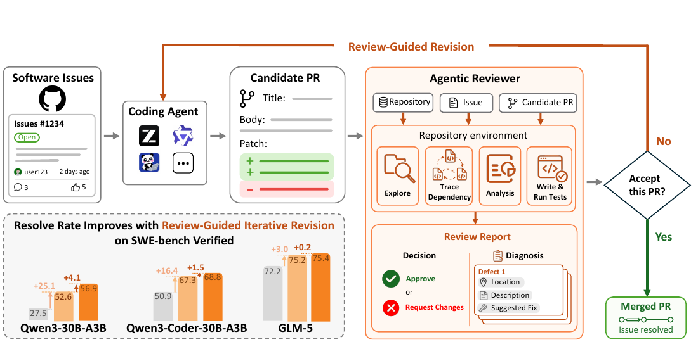
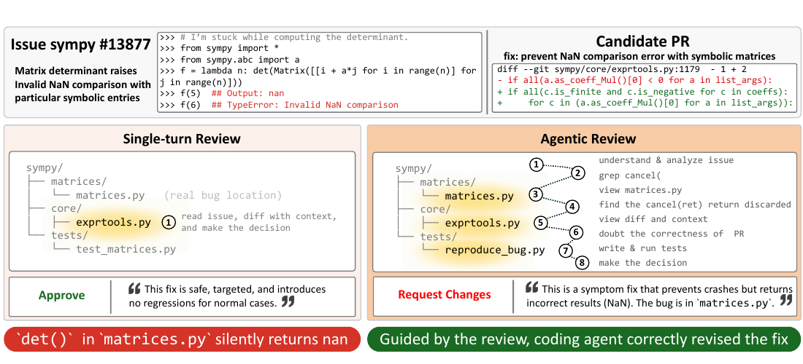
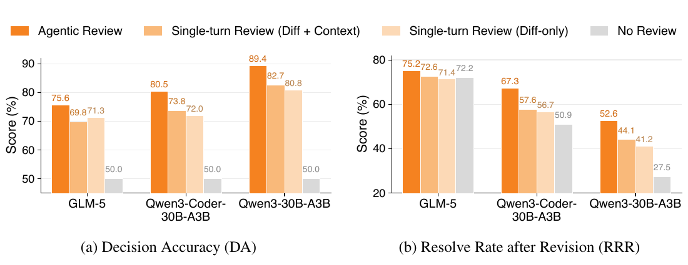
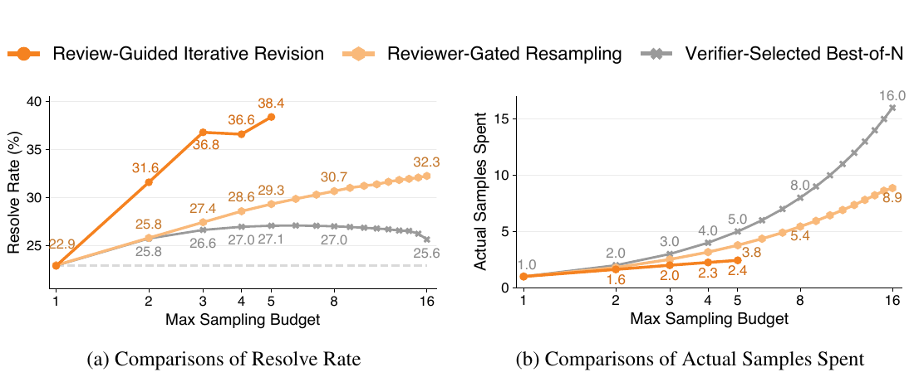

# SWE-Review: Closing the Loop on Issue Resolution with Agentic Code Review 论文解读

## 论文基本信息

| 字段 | 内容 |
| --- | --- |
| 论文 | SWE-Review: Closing the Loop on Issue Resolution with Agentic Code Review |
| 作者 | Ruoyu Wang, Jierun Chen, Shaowei Wang, Chaofan Tao, Sidi Yang, Yuxin Jiang, Kim-Hui Yap, Lifeng Shang, Xiaohui Li, Haoli Bai |
| 机构 | Nanyang Technological University (NTU); Huawei Technologies; The University of Hong Kong (HKU) |
| 发布时间 | 2026-07-07 |
| Venue | arXiv |
| 论文链接 | https://arxiv.org/abs/2607.06065 |
| 项目主页 | https://swe-lego.github.io/SWE-Review/ |
| 代码链接 | https://github.com/SWE-Lego/SWE-Review |
| 数据与模型 | https://huggingface.co/collections/SWE-Lego/swe-review |

## TL;DR

今天的 coding agent 通常在生成一个 PR 后就结束了：补丁是否真正解决问题、是否只压住症状、失败后应怎样修改，都缺少系统化反馈。SWE-Review 把代码审查变成一个可与仓库交互的 agent 任务。Reviewer 不只读 diff，而是主动搜索文件、追踪依赖、运行命令和测试，最后输出 `approve/request_changes` 决策以及包含缺陷位置、原因和修改建议的结构化诊断，再把诊断反馈给 coding agent 继续修订。

论文同时补齐了评测和训练数据：SWE-Review-Bench 包含来自 500 个 SWE-bench Verified issue 的 1,384 个候选 PR，并用 CR、DA、RRR 分别衡量报告是否完整、决策是否正确以及反馈能否真正帮助修订；SWE-Review-Traj 则从 14,156 条教师审查轨迹中保留 8,914 条决策正确轨迹，用于蒸馏开放 reviewer。

最重要的结论不是“多看一些上下文会更好”，而是“根据当前 PR 自适应地寻找正确证据”更好。Claude Opus 4.6 作为 reviewer 时，agentic review 在三个候选 PR 分布上都优于固定上下文单轮审查；在最弱的 Qwen3-30B-A3B 候选上，RRR 从无审查的 27.5% 提升到 52.6%。把结构化诊断用于迭代修订后，测试时扩展在最多 5 次尝试、平均仅 2.44 次样本下把 resolve rate 从 22.9% 提升到 38.4%。

## 论文脑图

```markmap
# SWE-Review

## 问题

### 一次性 PR 生成是开环过程

### 固定上下文审查难以发现跨模块根因

### 缺少可执行评测、开放训练数据与端到端修订指标

## 方法

### Generate-Review-Revise 闭环

### Reviewer 主动探索仓库并运行检查

### 二元决策 + 结构化诊断

### SWE-Review-Bench

### SWE-Review-Traj

## 实验

### Agentic vs 单轮 Diff-only / Diff+Context

### Reviewer SFT 蒸馏

### Review 与 issue-resolution 混合训练

### Review-guided test-time scaling

## 结论

### 自适应证据收集优于预先固定上下文

### 诊断文本比单一分数更适合驱动修订

### 审查轨迹可迁移到补丁生成能力

## 局限

### 只覆盖 SWE 风格 issue-resolution PR

### 未评测安全、可维护性与项目规范等非功能属性

### 结论受任务、模型、prompt 与 scaffold 选择限制

## 复现要点

### 500 个 SWE-bench Verified issue

### 1,384 个候选 PR 与三档生成器质量

### CR / DA / RRR 三指标

### 可执行环境和隐藏测试验证
```

## 研究背景与问题定义

### 为什么“生成 PR”还不是“解决 issue”

现有 coding agent 的典型流程是：读取 issue，探索仓库，生成 patch，提交 PR。问题在于 PR 一旦产出，流程往往就停止了。这与真实软件工程不一致：人类开发中，code review 不只是合并前的形式检查，而是判断改动是否真正解决问题、是否引入回归，以及在失败时给出修改方向的关键反馈环。

对 AI 生成 PR 而言，这个缺口更明显。一个 diff 可能：

- 在局部压住异常，却没有修复上游根因；
- 修改了错误位置，但在表面 case 上碰巧通过；
- 依赖未展示文件中的行为或项目约定；
- 修复目标测试，却破坏其他调用路径。

固定 diff 或预先检索少量上下文的单轮审查，必须在“知道要找什么”之前就决定上下文。SWE-Review 的核心假设是：审查需要像 issue-resolution 一样成为 repository-grounded agent task，由 reviewer 根据证据缺口动态决定下一步检查什么。

### 输入、输出和评测目标

每个审查实例给 reviewer 三类输入（§3.1）：

1. 指定 commit 的完整仓库环境；
2. 自然语言 issue；
3. 候选 PR 的 diff、标题和正文。

Reviewer 看不到 golden patch 和隐藏测试结果，但可以浏览文件、搜索代码、检查依赖和执行命令。最终报告包含两个字段：

- **Decision**：`approve` 或 `request_changes`；
- **Diagnosis**：指出具体缺陷、相关代码位置和可操作的修复建议。

论文定义三项互补指标：

| 指标 | 含义 | 它回答的问题 |
| --- | --- | --- |
| CR（Completion Rate） | 是否生成可解析的最终审查报告 | Reviewer 能否稳定完成任务？ |
| DA（Decision Accuracy） | approve/request-changes 是否与补丁真实 resolve 状态一致 | Reviewer 判断得对不对？ |
| RRR（Resolve Rate after Revision） | 通过的补丁保持不变；被拒补丁带反馈交给原生成器修订后，最终 resolve rate | 诊断是否真的能帮助修复？ |

DA 和 RRR 都依赖可执行测试验证。相比把生成评论与人类评论做文本相似度，这种定义直接测量审查在 issue-resolution 流水线中的功能价值。

## 核心方法

### 1. Generate-Review-Revise 闭环



原文 Figure 1 给出了完整闭环：coding agent 从 issue 生成候选 PR；reviewer 在可执行仓库中探索、追踪依赖、分析并运行测试；通过的 PR 被接受，拒绝的 PR 带着结构化诊断回到 coding agent。图中的三组柱状结果也说明，闭环可跨不同质量的 PR 生成器持续提高 resolve rate。

这套设计把 reviewer 从“评论生成器”升级成闭环控制器。二元决策决定是否停止，结构化诊断决定下一轮如何行动；前者类似 gate，后者则携带可积累的修订方向。

### 2. 先重建问题，再检查候选 PR

SWE-Review-Traj 的教师 reviewer 使用 GLM-5 和 OpenHands-SDK。审查 prompt 要求 reviewer **先独立理解 issue、追踪根因，再阅读候选 PR**（§4.1）。这是一项很重要的抗锚定设计：如果先看补丁，reviewer 很容易沿着提交者选择的位置解释问题，从而把“候选修复的叙事”误当成“真实根因”。

其典型流程可以概括为：

1. 从 issue 的现象和复现条件出发；
2. 搜索相关符号、调用链和相似实现；
3. 运行轻量复现或目标测试；
4. 形成独立的根因假设；
5. 再将候选 PR 与根因逐项对照；
6. 输出 decision 和 diagnosis。

### 3. 为什么主动探索优于固定上下文



原文 Figure 2 的 `sympy-13877` 是最直观的例子。候选 PR 在 `exprtools.py` 增加 NaN guard，确实阻止了异常；只读 diff 和邻近上下文的 reviewer 因而批准它。但该补丁仍让 `det()` 返回错误的 `nan`，真正根因在上游 `matrices.py`：`cancel(ret)` 的返回值被丢弃。

Agentic reviewer 搜索 `cancel(`、查看跨模块调用、写复现测试并执行，最终拒绝“症状修复”，指出一行上游修改方向。这里的增益并非来自简单扩大 context window，而是 reviewer 在交互过程中根据新证据调整搜索路径。

### 4. SWE-Review-Bench：把候选质量分布纳入评测

论文从同一组 500 个 SWE-bench Verified issue 出发，使用统一 OpenHands-SDK scaffold 和三种不同能力的模型生成 PR。过滤空 patch 后得到 1,384 个候选：

| PR 生成器 | 候选数 | 初始 Resolve Rate | 质量角色 |
| --- | ---: | ---: | --- |
| GLM-5 | 500 | 72.2% | 高质量分布 |
| Qwen3-Coder-30B-A3B | 462 | 50.9% | 中等质量分布 |
| Qwen3-30B-A3B | 422 | 27.5% | 低质量分布 |

这种分层很关键：reviewer 面对的 base rate 会改变最佳行为。强生成器的大多数 PR 可能正确，过度拒绝会伤害 RRR；弱生成器的错误更多，reviewer 是否能定位局部修补和非局部根因就更重要。

### 5. SWE-Review-Traj：从正确决策到可执行诊断

训练数据来自 SWE-rebench 约 6,000 个 issue，并排除 SWE-Review-Bench 中出现过的仓库以降低泄漏风险。三个生成器产出 14,156 个非空且不过大的候选 PR；GLM-5 为每个 PR 生成一条完整 agentic review trajectory。以可执行结果过滤后，保留 8,914 条决策正确轨迹。

但“拒绝得对”不代表“诊断得对”。论文又做了两类验证（§4.1）：

- **语义验证**：Claude Opus 4.6 和 GPT-5.4 从事实准确性、建议正确性、仓库证据 grounding 三方面按 1–5 分评审，overall mean 分别为 3.06 和 3.09，Cohen's $\kappa=0.72$；
- **功能验证**：在 100 个正确拒绝样本上，无反馈修订 RRR 为 3%，只有 `request_changes` 决策为 8%，加入教师诊断升至 21%，oracle review 上界为 32%。

这个消融说明真正可复用的信号在 diagnosis，而不只是 approve/reject 标签。

## 实验设置与主要结果

### Agentic review 全面优于单轮审查



原文 Figure 3 固定 reviewer 为 Claude Opus 4.6，对比 agentic、diff-only 和 diff+context 三种模式。Agentic review 在三档候选质量上都获得最高 DA 与 RRR；最显著的差距出现在低质量 PR 上，说明主动证据收集尤其适合不完整、局部化或跨模块错误更多的候选。

| PR 生成器 | 审查方式 | DA | RRR |
| --- | --- | ---: | ---: |
| GLM-5 | Agentic | 75.6 | 75.2 |
| GLM-5 | 最佳单轮 | 71.3 | 72.6 |
| Qwen3-Coder-30B-A3B | Agentic | 80.5 | 67.3 |
| Qwen3-Coder-30B-A3B | 最佳单轮 | 73.8 | 57.6 |
| Qwen3-30B-A3B | Agentic | 89.4 | 52.6 |
| Qwen3-30B-A3B | 最佳单轮 | 82.7 | 44.1 |

在最弱生成器上，agentic review 相比最佳单轮配置将 DA 提高 6.7 个百分点、RRR 提高 8.5 个百分点；相比无审查的 27.5%，最终 RRR 达到 52.6%。Figure 4 进一步按难度三等分：难度越高，agentic 与单轮审查的差距越大，hard split 上 RRR 为 52.2% vs. 40.8%。

### 闭环可连续改善，而非只做一次返工

对三种生成器运行多轮 generate-review-revise 后，resolve rate 持续上升：

| 生成器 | 初始 RR | 闭环最终 RR | 提升 |
| --- | ---: | ---: | ---: |
| Qwen3-30B-A3B | 27.5% | 56.9% | +29.4 pp |
| Qwen3-Coder-30B-A3B | 50.9% | 68.8% | +17.9 pp |
| GLM-5 | 72.2% | 75.4% | +3.2 pp |

增益随生成器基线变强而减小，也提醒我们：reviewer 不是无条件提高结果。当候选本来已经很强时，错误拒绝和错误建议会抵消收益，reviewer 能力必须与生成器质量匹配。

### 蒸馏 reviewer：小模型首先学会“完成审查”

在 SWE-Review-Traj 上 SFT Qwen3-8B 和 Qwen3-30B-A3B 后，小模型的结构化输出稳定性与决策能力显著提升。Qwen3-8B base 的 CR 只有约 4%；SWE-Review-8B 在三档 PR split 上达到 71.1%–84.2%，DA 提升约 18–21 个百分点。

不过蒸馏模型并非总能提高 RRR。SWE-Review-8B 审查 GLM-5 候选时，RRR 从 72.2% 降至 71.6%；更强的 Claude Opus 4.6 才在该 split 上带来明确正增益。这说明“会输出审查格式”不等于“足以审查比自己更强的生成器”。

### 审查轨迹也能提升补丁生成

作者把等量 issue-resolution trajectory 与 review trajectory 混合训练 Qwen3-8B，结果不仅 reviewer 指标提高，直接生成补丁的 RR 也提高：

| 训练数据 | RR | CR | DA | 自审查后 RRR |
| --- | ---: | ---: | ---: | ---: |
| Issue-resolution 1k | 27.6 | 9.4 | 50.0 | 27.6 |
| Issue-resolution 1k + Review 1k | 28.4 | 67.6 | 67.4 | 34.6 |
| Issue-resolution 2k | 31.2 | 13.4 | 51.7 | 31.2 |
| Issue-resolution 2k + Review 2k | 36.8 | 85.4 | 69.5 | 41.8 |
| Issue-resolution 3k | 34.0 | 33.5 | 51.6 | 34.0 |
| Issue-resolution 3k + Review 3k | 37.8 | 87.4 | 72.3 | 41.2 |

2k 规模上的直接 RR 提升最大，为 +5.6 pp；同一模型生成、审查、修订后的 RRR 从 31.2% 提升到 41.8%，增益 +10.6 pp。这支持一个很有启发性的解释：review 和 repair 共享 repository reasoning 能力，审查轨迹不只是分类数据，而是在教模型怎样重建问题、寻找反例和识别错误修复。

### 结构化诊断带来更高效的 Test-Time Scaling



原文 Figure 5 对比三种测试时策略：Verifier best-of-N 对独立候选打分；Reviewer-gated resampling 反复独立采样，遇到 approve 就停止；Review-guided iterative revision 则把每次拒绝的诊断用于定向修改当前 PR。最后一种方法同时拥有 early stopping 和跨轮累积信息。

| 方法 | 最大预算 | 平均样本数 | Resolve Rate |
| --- | ---: | ---: | ---: |
| 单样本基线 | 1 | 1.00 | 22.9% |
| Verifier best-of-N | 16 | 16.00 | 25.6% |
| Reviewer-gated resampling | 16 | 8.86 | 32.3% |
| Review-guided iterative revision | 5 | 2.44 | 38.4% |

Appendix B 的 token 口径进一步给出：review-guided iterative 的效率为 2.28 pp/Mtok，reviewer-gated resampling 为 0.35 pp/Mtok，约相差 6.5 倍。这里最值得记住的是：**测试时扩展不一定要靠更多独立采样；能把失败诊断转化为下一步行动，往往比从头再来更有效。**

## 当前工作 vs Related Work

| 方法 | 核心思路 | 主要假设 | 证据/表现 | 局限或代价 |
| --- | --- | --- | --- | --- |
| SWE-Review（本文） | Reviewer 在仓库中主动收集证据，输出决策和结构化诊断，并驱动修订 | 可执行环境和工具交互能找到 diff 外的关键证据 | 三档 PR 分布上 DA/RRR 均优于单轮审查；迭代修订达 38.4% RR | 审查 token 成本高；效果依赖 reviewer 相对能力 |
| Single-turn Diff-only / Diff+Context | 一次性读取 diff 或预检索上下文后生成决策与评论 | 预先固定的上下文包含足够证据 | 加上下文通常优于 diff-only，但在困难、非局部任务上落后 | 无法根据中间发现改变证据搜索路径 |
| SWE-Lego-Verifier-8B | 给多个独立候选打分并执行 best-of-N | 标量分数能稳定排序候选补丁 | $N=16$ 时 RR 25.6% | 无诊断、无 early stopping；预算线性增长 |
| OpenHands Critic | 学习 scalar score 对候选排序 | 单一 reward 可代表补丁正确性 | Appendix A 中在部分设置仅略高于或低于 Random | 跨 agent 分布可能误排序，不能指导修订 |
| Oracle review | 访问 golden patch 和测试结果生成高质量诊断 | 参考答案可作为诊断质量上界 | 功能验证中 RRR 32%，高于教师 review 的 21% | 不可部署，只能作为内部上界 |

SWE-Review 与传统 automated code review 的分水岭，是它不把目标定义为“生成像人类的评论”，而是定义为“让 issue 最终被解决”。这把评价重心从文本相似度转向 decision correctness 和 downstream utility，也让 review、revision、test-time scaling 可以在同一闭环中比较。

## 启发、局限与可复现要点

- **启发 1：诊断是一种可传递的中间状态。** 二元 decision 只能停止或继续，结构化 diagnosis 才能把一轮探索获得的证据传给下一轮，减少重复搜索。
- **启发 2：Reviewer 应先形成独立问题模型。** “先找根因、后读补丁”的顺序可以降低对候选 PR 的锚定，对症状修复尤其重要。
- **启发 3：Generator 与 reviewer 的相对能力需要匹配。** 弱 reviewer 审查强 generator 可能降低最终 RRR，部署时应按候选质量校准拒绝阈值或升级 reviewer。
- **启发 4：Review trajectory 可能是通用的 repository reasoning 数据。** 混合训练同时提升生成和审查，值得与单纯成功轨迹、失败修复轨迹做更细粒度对照。
- **局限 1：任务范围窄。** 论文只研究 SWE-style issue-resolution PR，未覆盖 feature implementation、refactoring、documentation、migration 和 architecture change。
- **局限 2：指标偏功能正确性。** DA/RRR 不衡量代码风格、可读性、可维护性、安全、性能、文档质量和项目特定约定。
- **局限 3：外部有效性有限。** 相对结果依赖所选可执行任务、仓库、模型家族、prompt 和 OpenHands-SDK scaffold。
- **局限 4：诊断数据仍有噪声。** 决策正确轨迹不保证根因和修复建议正确；教师诊断与 oracle 之间仍有明显差距。
- **复现要点：** 固定仓库 commit 与执行环境；保留 issue、PR metadata 和 diff；确保 reviewer 不访问 golden patch 与隐藏测试；按原协议执行 approve 保留、request-changes 单次修订；分别统计 CR、DA 和 RRR。
- **训练复现：** 论文使用 Python 3.12、PyTorch 2.6+、Transformers 4.55.0、DeepSpeed 0.16+、LLaMA-Factory 5.2.0 以内版本和 Flash Attention 2，采用 DeepSpeed ZeRO Stage 3、无 CPU offload 的全参数分布式训练（Appendix C）。
- **可能的下一步实验：** 在同一 token 预算下比较独立 generator/reviewer 与单模型 self-review；加入 security、performance、maintainability 的多目标决策；对 reviewer 做强弱校准与 abstain；按 root-cause distance、跨文件数量和测试覆盖变化拆分收益。

## 再读一遍路线

1. 先看 Figure 1，建立“生成—审查—修订”的控制流，以及 decision 与 diagnosis 的不同作用。
2. 再看 Figure 2 的 `sympy-13877`，理解 agentic review 为什么不是“塞更多上下文”，而是自适应证据搜索。
3. 阅读 §3.1 的 CR、DA、RRR 定义，尤其注意 RRR 如何把 review 文本转成可执行下游指标。
4. 对照 Figure 3、Figure 4，检查收益如何随 PR 生成器质量与任务难度变化。
5. 阅读 §4.1 和 Table 1，区分“决策正确”“语义诊断正确”“诊断能帮助修订”三种质量。
6. 阅读 Table 2、Table 3，观察小 reviewer 的能力边界，以及 review trajectory 向 issue resolution 的迁移。
7. 最后看 Figure 5 与 Appendix B Table 14，核对 resolve rate、实际采样数、token efficiency 三种成本口径。
8. 若要复现，继续看 Appendix C 的训练细节、Appendix E 的完整 prompts，以及 Appendix D 的 21 步案例轨迹。

# 深度 Q&A

## Q1：SWE-Review 与普通 LLM code review 最本质的区别是什么？

普通方案通常把 review 当作一次文本生成：输入 diff 或固定上下文，输出评论。SWE-Review 把它定义为一个 repository-grounded agent task。Reviewer 可以用工具主动寻找证据，并且输出不止评论，还有可执行控制信号：decision 决定是否结束，diagnosis 驱动下一轮修订。它的最终指标也不是评论像不像参考答案，而是判断是否正确、反馈能否提高补丁 resolve rate。

## Q2：为什么 Diff+Context 仍然不够？

因为固定上下文是在 reviewer 知道具体证据缺口之前选出的。跨模块错误、症状修复、项目约定和隐式依赖常常不在修改文件附近。Diff+Context 可以降低信息不足，但无法解决“应该查哪条调用链、运行哪个复现、比较哪个相似实现”的决策问题。Figure 2 表明，真正关键的是交互式地根据新证据调整搜索路径。

## Q3：DA 很高是否意味着 reviewer 一定有用？

不一定。DA 只衡量 approve/request-changes 是否正确，不衡量拒绝后的解释能否帮助修复。一个 reviewer 可能正确识别 PR 有问题，却指出错误根因；这时 DA 高但 RRR 不一定提高。因此论文同时报告 RRR，并用 no review、decision only、teacher diagnosis、oracle diagnosis 做功能消融。

## Q4：为什么不直接运行完整测试，而要用 reviewer？

在 SWE-bench 评测中，隐藏测试可以判定补丁最终是否 resolve，但真实部署时完整 oracle tests 往往不存在、不可见、成本高或覆盖不全。Reviewer 的角色是利用公开 issue、仓库和可运行检查形成近似判断，并为失败生成修订方向。论文也明确让 reviewer 看不到 golden patch 与隐藏测试，避免把不可部署信息泄漏进系统。

## Q5：弱 reviewer 会不会把正确 PR 改坏？

会。Table 2 中 SWE-Review-8B 审查 GLM-5 候选时，RRR 从无审查的 72.2% 降至 71.6%。高质量候选分布里，错误拒绝的代价更突出。工程上应考虑 reviewer 与 generator 的相对能力、按 base rate 校准 approve 阈值、允许 abstain，或只在不确定和高风险改动上升级到更强 reviewer。

## Q6：审查轨迹为什么能提升补丁生成能力？

一个合理解释是二者共享“仓库推理”步骤：理解 issue、追踪根因、寻找反例、比较候选实现、验证行为。成功生成轨迹主要展示怎样做对；review 轨迹则密集展示怎样识别“看似合理但实际错误”的补丁。Table 3 的混合训练结果支持这种迁移，但论文还不能完全区分收益来自更多 token、更多负例，还是审查特有的结构。

## Q7：为什么 review-guided iterative revision 比 reviewer-gated resampling 更高效？

两者都可以用 approve 提前停止，但 resampling 每次从头独立生成，上一轮发现的根因和失败证据没有被利用。Iterative revision 把 diagnosis 传给下一轮，使后续尝试在当前 PR 上定向修改。于是它在最多 5 轮、平均 2.44 个样本下达到 38.4%，超过 resampling 在预算 16、平均 8.86 个样本下的 32.3%。

## Q8：SWE-Review-Traj 的 8,914 条数据都是高质量诊断吗？

不是。它们首先是“决策正确”轨迹，而非全部“诊断完全正确”轨迹。双 judge 的 overall mean 约 3.1/5，suggestion correctness 约 2.8/5，说明数据有实质信息但远非 oracle。作者尝试只保留两位 judge 都至少打 3 分的 6,789 条轨迹，却没有看到比单纯 decision-correct filtering 更清晰的训练收益。

## Q9：这套方案落地到真实 CI/CD 的主要成本是什么？

成本来自多轮仓库探索、命令执行和长上下文推理。Appendix B 显示 review token 消耗相对稳定地受“理解 issue 和仓库复杂度”驱动，而不完全随候选质量下降；在弱生成器 split 上，review 甚至占闭环 token 的约 66%。落地时应设计预算上限、轻重 reviewer 分层、测试缓存、证据复用、按风险触发和早停机制。

## Q10：论文结论能否直接推广到安全审查、性能审查或架构审查？

不能直接推广。当前 DA/RRR 只围绕目标 issue 是否被功能性解决，论文明确没有衡量安全、性能、可维护性、文档和项目规范。Agentic evidence gathering 的思路可能适用，但必须重新定义 oracle、工具、决策标签和下游效用，例如加入静态分析、benchmark、威胁模型或维护者偏好。

## Q11：这篇论文最值得延伸的研究问题是什么？

一是让 reviewer 在证据不足时显式 abstain，而不是强制二元决策；二是研究多 reviewer 的争议解决与能力路由；三是在固定总 token/时间预算下联合优化生成、审查和修订的资源分配；四是构建覆盖非功能属性和更多 PR 类型的 benchmark；五是把 diagnosis 压缩成可复用的 repository memory，避免每轮重复理解同一代码库。
