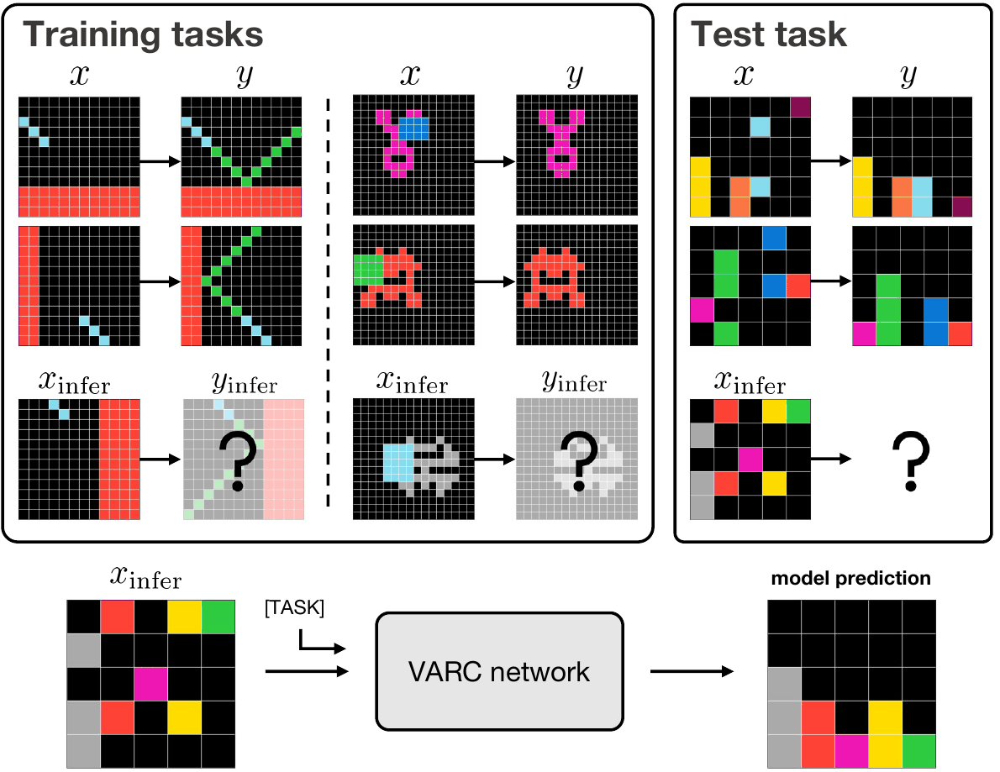
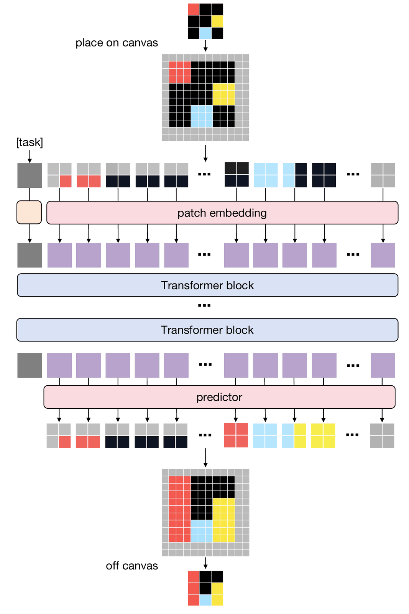
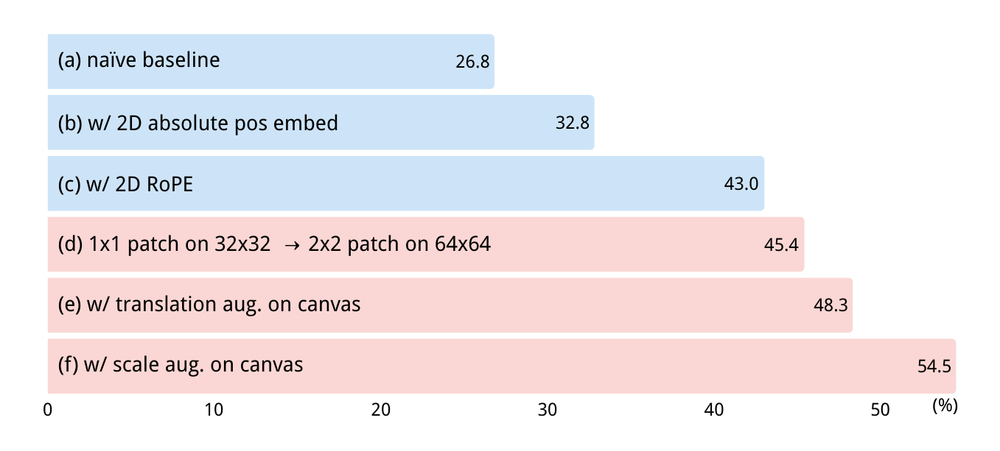
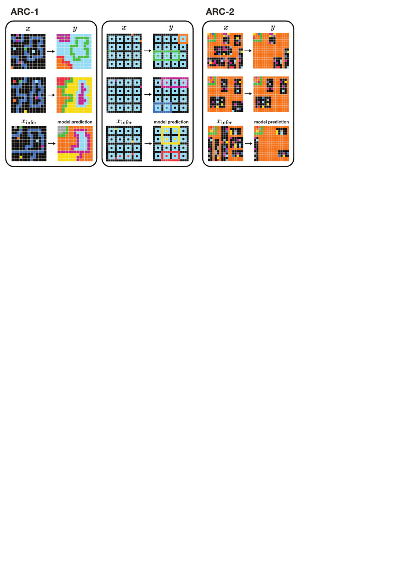

# ARC Is a Vision Problem!

VARC 把 ARC 重新定义为视觉推理任务，说明合适的视觉归纳偏置比单纯语言推理更关键，并在 ARC-1 上显著提升。

## 论文信息

| 字段 | 内容 |
| --- | --- |
| 作者 | Keya Hu, Ali Cy, Linlu Qiu, Xiaoman Delores Ding, Runqian Wang, Yeyin Eva Zhu, Jacob Andreas, Kaiming He |
| 机构 | MIT |
| 日期 | 2025-11-18 初版 |
| 代码 | https://github.com/lillian039/VARC |
| 链接 | https://arxiv.org/abs/2511.14761 |

## 一句话结论

ARC 不只是抽象推理 benchmark，也是在考验模型是否拥有适合二维网格的视觉归纳偏置。

## 背景与问题

ARC 任务长期被当成通用智能或程序合成测试，但输入是彩色网格，规则高度依赖连通区域、对称性、平移、裁剪和颜色重映射。若把网格序列化成文本，模型会丢掉许多自然视觉结构。VARC 的出发点是：先把它当视觉问题，再谈推理。

## 方法拆解

VARC 使用视觉表征处理 ARC 网格，并引入更贴近图像的 canvas-based 输出形式与 multi-view 推理。相比把格子转成 token 串，视觉路径保留空间邻接和对象形状；multi-view 则通过不同视角增加候选解的鲁棒性。



ARC 的输入输出本质是网格图像，许多规律体现为空间变换、颜色映射与形状组合。



VARC 以视觉编码为核心，将网格直接作为视觉对象处理，再结合程序化搜索或输出解码。



论文分解了视觉先验、canvas-based 表示和 multi-view 策略对准确率的贡献。



案例展示了模型如何从少量输入输出对中恢复抽象规则。

## 实验复盘

论文报告 ARC-1 达到 60.4。视觉先验带来 +27.7，canvas-based 设计带来 +11.5；ViT-18M 已能达到 54.5。单视角 pass@1 为 35.9，多视角 pass@1 提升到 49.8，pass@2 达到 54.5。

## 和相关工作的区别

相较纯 LLM 解 ARC，VARC 更强调视觉结构；相较程序合成方法，它不完全依赖显式搜索，而是让模型先形成视觉规则假设。

## 局限与启发

ARC 仍是小网格、强人工规则的数据集，不能直接等价于开放世界视觉推理。启发是：多模态 AIGC 的“推理”很多时候先取决于表示是否保留了任务结构。

## 读论文脑图

```markmap
- ARC Is a Vision Problem!
  - 问题
    - 文本化网格损失空间结构
  - 方法
    - 视觉编码 + canvas 输出 + multi-view
  - 实验
    - ARC-1 60.4，视觉先验贡献最大
  - 启发
    - 抽象推理需要任务匹配的感知归纳偏置
```

# 深度 Q&A

## Q1: 为什么说 ARC 是视觉问题？

因为规则常常直接体现在二维空间关系里，例如连通块、旋转、镜像、边界、颜色替换。文本序列化会把这些关系变成远距离 token 依赖。

## Q2: VARC 的关键不是更大模型吗？

不是。论文中 ViT-18M 已有很强表现，说明结构偏置比单纯扩大参数更重要。

## Q3: canvas-based 输出为什么有效？

它让模型直接在二维画布上预测结果，而不是生成一串坐标或文本。输出形式与任务结构一致，学习难度更低。

## Q4: multi-view 带来什么？

不同视角能暴露不同的空间规律，也能减少模型对某个排列或坐标系的过拟合。

## Q5: 这对 VLM 有什么启发？

VLM 不应把所有视觉问题都压成语言解释。某些任务需要保留像素、网格或对象级结构，并在这些结构上推理。

## Q6: 论文和程序合成路线冲突吗？

不冲突。VARC 可以看作更好的感知前端，程序搜索可以作为后端补强。

## Q7: 最大局限是什么？

ARC 的分布很窄，规则也高度离散。真实视觉任务的噪声、遮挡和连续变化会更复杂。

## Q8: 为什么归入 AIGC？

它研究模型如何根据示例生成目标网格，核心仍是条件生成，只是生成对象是抽象视觉画布。

## Q9: 这篇论文最适合和哪类工作一起读？

适合和 diffusion / flow matching / consistency model / autoregressive generation 相关工作一起读。它的位置不是单点技巧，而是在采样步数、训练目标、表示空间和系统约束之间重新分配复杂度。

## Q10: 我复现时应该优先看哪些细节？

优先看数据预处理、token 或 latent 表示、训练步数、模型规模、采样步数、guidance 设置和评测协议。生成模型论文里，很多看似小的实现选择都会改变 FID、PPL、BLEU 或可视化质量。

## Q11: 这篇论文给 AIGC 系统设计的启发是什么？

它提醒我们不要只追求更大的模型，也要关心生成过程本身是否适合部署。一步或少步生成、可逆映射、视觉归纳偏置、离散语言流等方向，都在把 AIGC 从“能生成”推向“低延迟、可控、可组合”。
