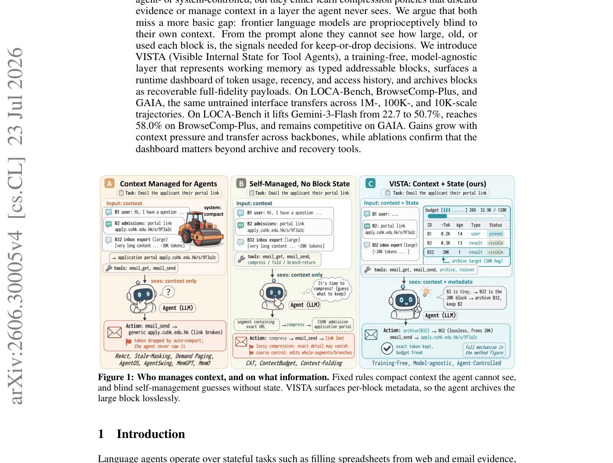
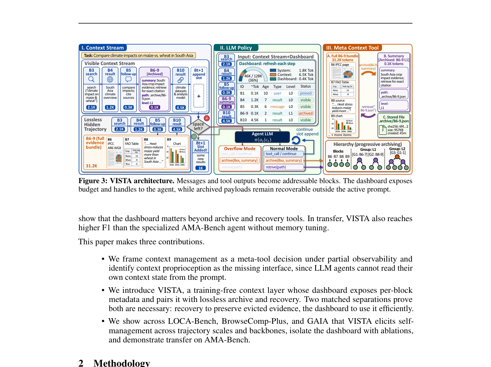
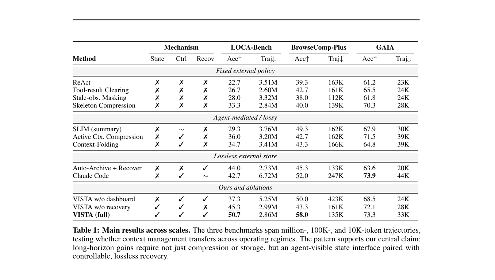
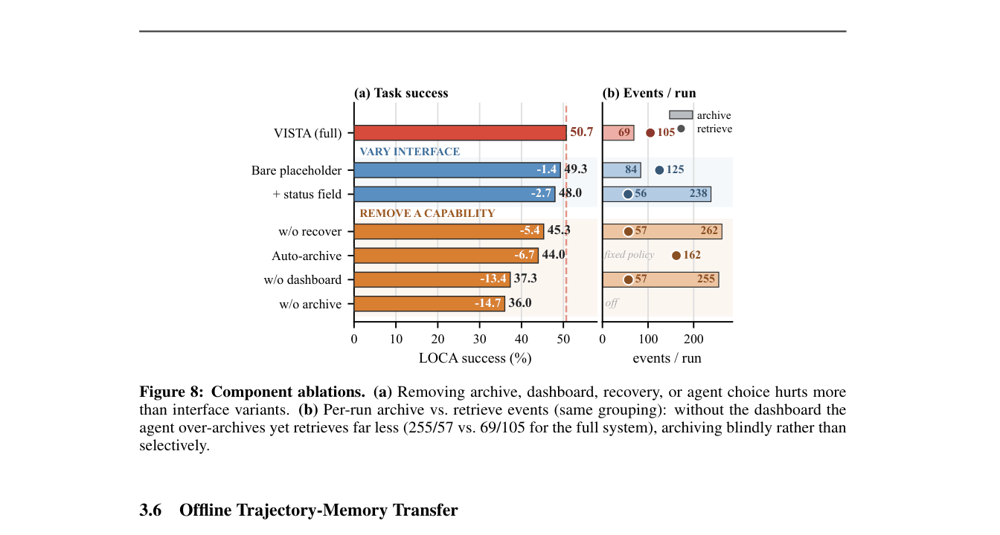
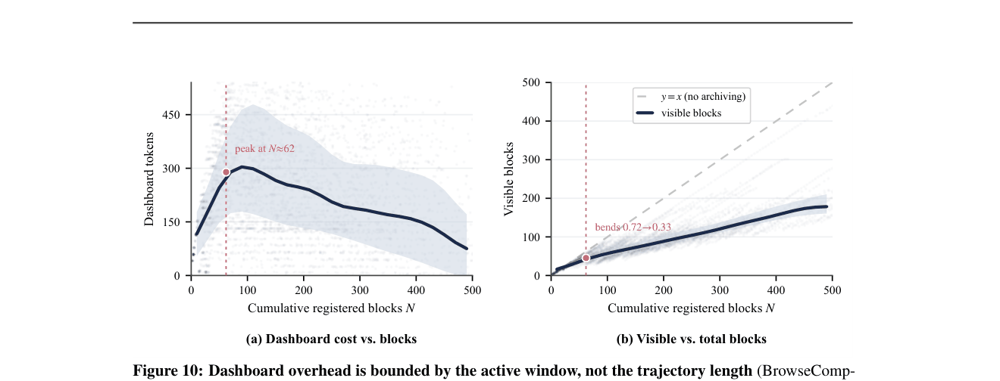

# LLM Agents Are Latent Context Managers: Eliciting Self-Managed Context via State Proprioception 论文解读

## 论文基本信息

| 字段 | 内容 |
| --- | --- |
| 论文 | LLM Agents Are Latent Context Managers: Eliciting Self-Managed Context via State Proprioception |
| 作者 | Binyan Xu, Haitao Li, Kehuan Zhang |
| 机构 | The Chinese University of Hong Kong; LIGHTSPEED; Tencent |
| 发布时间 | 2026-06-29；arXiv v4 修订于 2026-07-23 |
| Venue | arXiv |
| 论文链接 | https://arxiv.org/abs/2606.30005 |
| 项目链接 | https://vista-agent.github.io/ |
| 代码链接 | https://github.com/binyxu/VISTA/ |

## TL;DR

这篇论文讨论的是长程 tool agent 的一个很实际的瓶颈：上下文窗口越跑越满，早期工具证据、用户约束、失败尝试、文件路径和精确 URL 可能在后面仍然关键，但普通 ReAct harness 只会追加历史，溢出后再截断、清空、mask 或压缩。作者把问题重新表述为 context proprioception：模型能读 prompt，却看不见自己的上下文状态，比如每个 block 有多大、多旧、最近有没有被访问、当前预算还剩多少。

VISTA 的做法很 harness：不训练模型，也不改 backbone，而是在 agent runtime 里把工作记忆拆成 typed, addressable blocks，给模型渲染一个 dashboard，再提供 `archive(S, summary)` 和 `read(handle)` 这类上下文工具。关键点是 archive 是无损的：visible prompt 里只保留 handle 和短摘要，完整 payload 存在外部，可按需恢复。这样模型不再盲猜“该压缩谁”，而是能根据 block 级状态决定保留、归档和读取。

实验覆盖三个尺度：LOCA-Bench 的百万 token 轨迹、BrowseComp-Plus 的 100K 级深度检索、GAIA 的 10K 级任务。主结果里，VISTA 在 LOCA-Bench 从 ReAct 的 22.7% 提到 50.7%，超过 Claude Code 的 42.7%，同时轨迹 token 低于 Claude Code；BrowseComp-Plus 达到 58.0%，高于最强 baseline 52.0%；GAIA 上 73.3%，接近 Claude Code 的 73.9%。消融显示，只有 archive/recover 工具不够，去掉 dashboard 后 agent 会过度归档但很少恢复，说明“可见状态”本身是关键能力。

## 论文脑图

```markmap
- VISTA
  - 问题
    - 长程 tool agent 的上下文不断增长
    - 截断、清空、压缩会丢失精确证据
    - LLM 看不到 block 大小、年龄、访问历史和预算
  - 方法
    - Context stream: typed addressable blocks
    - Dashboard: token usage, recency, access history, budget
    - Archive: 无损外部化 bulky blocks
    - Recover: 按 handle 恢复 exact payload
  - 理论
    - Proposition 1: 无 recovery 时预算压力下必然丢证据
    - Theorem 1: 无 proprioception 时 recovery 工具也会低效
  - 实验
    - LOCA-Bench: 50.7 vs ReAct 22.7
    - BrowseComp-Plus: 58.0 vs best baseline 52.0
    - GAIA: 73.3 接近 Claude Code 73.9
  - 结论
    - 很多 context management 能力可能已潜伏在强模型中
    - harness 暴露正确状态即可 elicitation
  - 局限
    - 主要验证在 block 化 tool trajectory 上
    - dashboard 与工具协议仍需工程集成
  - 复现要点
    - 固定 agent loop、工具、预算和评分
    - 区分 visible blocks、archived payloads、blocked payloads
```

## 研究背景与问题定义

论文的出发点非常贴近 agent harness 工程。一个长程 tool agent 在执行任务时，会积累工具输出、网页证据、邮件内容、文件列表、执行日志和中间假设。传统 ReAct 风格把这些内容串成 append-only history，下一轮直接喂给模型；当历史超过预算时，runtime 再做 truncate、clear、mask 或 summarize。问题是这些操作混淆了三个概念：什么还在 prompt 里可见、什么被完整保留、什么以后还能恢复。

作者认为现有路线有两类缺口。第一类是 runtime 替 agent 管理上下文，例如 stale-observation masking、demand paging 或 OS-style evict；这些系统可能知道 size、age、usage，但模型本身看不到这些状态。第二类是让 agent 或学习策略参与压缩，例如 Context as a Tool、Active Context Compression、Context-Folding；这能让 agent 有控制权，但常常通过摘要或删除丢掉证据，而且策略绑定训练设置。

VISTA 的问题定义是：context management 是 agent 对自己 working memory 的 meta-tool decision。模型需要决定哪些 block 留在 prompt，哪些外部化，哪些需要恢复；但如果 prompt 里没有 block 大小、年龄、访问历史和剩余预算，这个决策就是部分可观测的。



Figure 1 对比了三种范式：固定规则替 agent 管理、agent 自己盲目压缩、以及 VISTA 让 agent 同时看到 context 和 state。图里的例子很典型：一个很小但关键的申请链接必须保留，一个巨大的 inbox export 适合归档；没有 dashboard 时，模型无法可靠地区分“20K token 大块”和“小而关键的 URL”。

## 核心方法

### Workspace: visible, archived, blocked

VISTA 不让模型直接操作原始 transcript，而是维护一个 workspace `Wt = (Vt, At, Pt)`：`Vt` 是 visible blocks，进入下一轮 prompt；`At` 是 archived payloads，存完整字节但只在 prompt 里显示 handle；`Pt` 是 blocked large results，表示过大、不能直接塞进 prompt 的工具结果。下一轮输入是 visible stream、archive handles、blocked notices 和 dashboard 的组合，并由 harness 保证不超过预算。

这个设计的关键 invariant 有三个。第一，每个可操作单元都有稳定 block ID 或 handle。第二，archived payload 默认可恢复，除非 agent 显式删除。第三，dashboard 报告的 token 估计和 harness preflight 使用的是同一套估计，因此模型看到的预算状态就是 runtime 真正会执行的状态。

### Dashboard: context proprioception channel

dashboard 是论文最核心的接口。它不是检索 oracle，也不提供隐藏任务证据，只是暴露 runtime 已经知道、但 prompt 文本本身不可见的状态：block ID、token 估计、年龄、类型、可见/归档状态、访问历史、剩余预算。作者把这叫 proprioceptive view，也就是 agent 对自己工作记忆的“本体感觉”。

在 normal mode 下，模型可以继续调用环境工具，也可以 archive、read 或 delete context blocks；在 overflow mode 下，普通任务工具会被禁用，直到模型通过 context tool 腾出空间。这样 context management 不再是后处理 controller，而是和普通工具调用处在同一个 action space。

### Archive/recover: 摘要只做导航，不替代证据

`archive(S, ρ)` 会把一组 blocks 替换成短摘要和 handle，同时把原始 payload 存到外部 archive。`read(h)` 的契约是恢复 exact payload，而不是返回摘要。论文强调摘要只负责导航，不能成为证据的唯一表示；如果最终需要精确 URL、表格行、引用文本或文件片段，agent 应该按 handle 恢复。

VISTA 还支持层级归档。多个原始 blocks 可以先合成一个 L1 bundle，后续再把 group 归档成更粗粒度 handle。恢复时反向展开，也可以只读 bounded chunk 或重新用更窄参数调用原始工具，避免把长 transcript 整段塞回 prompt。



Figure 3 展示了完整 loop：左边是 context stream，中间是 LLM policy 接收 context + dashboard，右边是 meta context tool。它说明 VISTA 的创新不是“有一个外部存储”这么简单，而是把外部存储变成 agent 可感知、可选择、可恢复的工作记忆结构。

### 理论论证: recovery 和 proprioception 都必要

论文用两个理论结果解释为什么两个组件缺一不可。Proposition 1 讨论 recovery 必要性：如果历史里有 `N` 个独立证据 block，总信息量超过预算，而最后随机询问某个 block 的精确内容，那么任何 non-recovering 方法只能靠压缩后的 prompt 表示回答，正确率上界约为 `B / (Nk) + 1/k`；VISTA 只要 handles 和目标 block 能放进预算，就能通过恢复 exact payload 达到正确。

Theorem 1 讨论 proprioception 必要性：即使给了无损 archive/recover，如果模型不知道哪个 block 是大块、哪个是 load-bearing 小证据，它也会低效归档。论文把这建模成在 `n` 个 blocks 中定位一个 bulky block，dashboard-free 只能从内容粗略猜大小，信息率随 `log κ` 而不是 `log n` 增长；当工作区变大时，盲目 offload 会产生大量不必要 recovery round-trips。这个理论和消融里的“无 dashboard 会 255 次 archive 但只有 57 次 retrieve”相互呼应。

## 实验设置与主要结果

论文评测了三类在线任务尺度。LOCA-Bench 是主要压力测试，使用公开 75-configuration suite，轨迹可到百万 token；BrowseComp-Plus 是 100K 级 deep research retrieval transfer，考察早期检索证据能否保留到最终综合；GAIA 使用 165-question validation subset，轨迹更短，更像一般 assistant setting。主实验固定 agent loop、task tools、backbone、context budget、prompt assembly 和 scoring，只改变 context-management 策略。VISTA 主 run 用 Gemini-3-Flash，LOCA-Bench 预算为 128K。



Table 1 是最重要的结果表。LOCA-Bench 上，VISTA 50.7%，ReAct 22.7%，Claude Code 42.7%；BrowseComp-Plus 上，VISTA 58.0%，最强 baseline Claude Code 52.0%；GAIA 上，VISTA 73.3%，接近 Claude Code 73.9%。这张表还把机制拆成 State、Ctrl、Recov 三列，说明只有“agent-visible state + agent control + lossless recovery”同时具备时，跨尺度表现才稳定。

### 压力越大，VISTA 越有优势

在 LOCA-Bench context-growth sweep 中，低压力时方法差距不大；到 128K 时，VISTA 是 50.7%，ReAct 是 22.7%，且 VISTA 平均 token 成本 2.86M 低于 ReAct 的 3.51M，也远低于 Claude Code 的 6.72M。BrowseComp-Plus 的 window sweep 也显示中等窗口最有利：窗口太小 dashboard overhead 显得贵，窗口很大 ReAct 也能保留关键证据，差距会缩小。

### backbone robust: 不是只对一个模型有效

论文在 Claude-Sonnet-4.5、DeepSeek-V4-Pro、GLM-5、Gemini-3-Flash 四个 backbone 上测试同一个未训练 VISTA layer。Figure 7 显示四个模型上 VISTA 都优于 ReAct、SLIM、Active Context Compression 和 Claude Code，支持作者的 elicitation 观点：强模型可能已有一定 context management 能力，只是需要 harness 暴露正确状态。

### 组件消融: dashboard 不是装饰



Figure 8 是机制证据。完整 VISTA 是 50.7%；去掉 recovery 降到 45.3%；auto-archive + recover 是 44.0%；去掉 dashboard 降到 37.3%；去掉 archive 降到 36.0%。更有意思的是事件统计：完整系统平均 69 次 archive、105 次 retrieve；无 dashboard 时变成 255 次 archive、57 次 retrieve。也就是说，无状态可见性时，模型不是不会用工具，而是用得盲目：过度外部化，却没有按需恢复。

### dashboard overhead 是有界的



Figure 10 回应了一个工程担忧：dashboard 会不会随着完整 trajectory 线性增长？论文在 BrowseComp-Plus 上测得，net dashboard tokens 在累计 blocks 约 62 左右达到峰值，之后反而下降；原因是 dashboard 只渲染 visible working set，而不是完整历史。随着归档保持住 visible blocks 的规模，dashboard footprint 受 active window 约束，而不是受总轨迹长度约束。

## 当前工作 vs Related Work

| 方法 | 核心思路 | 主要假设 | 证据/表现 | 局限或代价 |
| --- | --- | --- | --- | --- |
| VISTA | 把 context stream block 化，暴露 dashboard，并提供无损 archive/recover | capable model 已有潜在自管理能力，缺的是可见 runtime state | LOCA-Bench 50.7%，BrowseComp-Plus 58.0%，四个 backbone 均提升 | 需要 harness 集成 block ledger、archive store 和 context tools |
| ReAct / stale masking / tool-result clearing | append-only history 或固定规则清理旧 observation | runtime 可以替 agent 决定什么不重要 | ReAct 在 LOCA-Bench 22.7%，clearing 26.7%，stale masking 28.0% | agent 看不到状态，固定规则不理解未来证据需求 |
| SLIM / Active Context Compression / Context-Folding | 让 agent 或 controller 通过摘要、压缩、folding 管理上下文 | 压缩后的表示足以保留任务所需信息 | LOCA-Bench 上分别 29.3%、36.0%、34.7% | 多数是 lossy 或 coarse control，精确 URL/表格行可能丢失 |
| Auto-Archive + Recover | 无损外部存储和恢复，但归档由固定策略决定 | 只要能恢复，agent 不一定需要看到 block state | LOCA-Bench 44.0%，高于多数 lossy 方法 | 缺少 agent-visible dashboard，无法精细选择归档对象 |
| Claude Code | 生产级 agent，可能使用文件系统和内部管理策略 | 强工程系统可缓解长程上下文压力 | LOCA-Bench 42.7%，GAIA 73.9% | LOCA-Bench token/steps 成本高于 VISTA，内部状态不一定暴露给模型 |
| MemGPT / Mem0 / retrieval memory | 把历史经验放进长期记忆或检索系统 | 需要时可从外部 memory 找回相关信息 | 适合长期记忆与经验复用 | 通常不提供 active prompt 的 per-block 状态图 |

## 启发、局限与可复现要点

- 启发：agent harness 不只是包一层工具协议，它决定模型能不能感知自己的运行状态。VISTA 的价值在于把“上下文窗口”从隐式字符串变成可操作 workspace。
- 启发：无损 externalization 比摘要更适合工具证据。摘要可以帮助导航，但不能替代精确 URL、ID、代码片段、表格行和引用。
- 启发：post-training 和 harness interface 是互补关系。论文的 GRPO 实验显示 RL 可以进一步优化策略，但 zero-shot dashboard 已经能带来明显收益。
- 局限：主要实验证据来自 block 化 tool trajectory，开放网页、多文件代码仓库、GUI 操作或多 agent 协作中的 block 边界仍需要重新设计。
- 局限：dashboard 是 factual ledger，但它仍消耗 token，并引入更多工具动作。窗口很小或任务很短时，开销可能抵消收益。
- 局限：archive payload 是“模型当时看到的 transcript”，不是原始世界状态的完整备份。如果源工具分页或截断，VISTA 只能保留那次结果，后续仍需 agent 主动重查。
- 复现要点：需要固定模型、task tools、预算、prompt assembly 和 scoring，只改变 context policy，才能公平比较。
- 复现要点：至少实现 stable block ID、token estimator、visible/archive/blocked 三态、archive handle、recover/read 工具、overflow mode。
- 可能的下一步实验：把 VISTA 接到代码 agent、浏览器 agent、数据分析 agent 中，比较对 flaky tool outputs、长日志和多文件 patch 的帮助。
- 可能的下一步实验：让 dashboard 更结构化，例如按任务子目标、文件、网页域名或证据类型聚类，而不是只按时间流显示。

## 再读一遍路线

第一遍先读 Figure 1、Figure 3 和 Table 1。Figure 1 告诉你作者为什么说 agent 缺 proprioception；Figure 3 是系统架构；Table 1 是跨 benchmark 的主证据。

第二遍读 §2.1 到 §2.4，把 workspace、context stream、dashboard、archive/recover loop 串起来。这里要特别注意：VISTA 不是 memory retrieval oracle，而是 harness 暴露 runtime state。

第三遍读 §2.5 的 Proposition 1 和 Theorem 1，再回看 Figure 8。理论部分分别解释 recovery 和 dashboard 为什么各自必要；Figure 8 的 archive/retrieve 事件统计是最直观的实证呼应。

最后读 §4 的 perception gap 和 dashboard overhead。Table 4 说明模型确实无法从 prompt 自己估 token state；Figure 10 则说明 dashboard 不一定随完整轨迹线性增长。

# 深度 Q&A

## Q1: 这篇论文为什么把问题叫做 context proprioception？

proprioception 原本指身体对自身状态的感知。作者借这个词表达：LLM agent 能看到 prompt 内容，却看不到 prompt 作为工作记忆的运行状态，例如每块内容有多大、多久没用、是否可恢复、预算是否接近上限。没有这些状态，agent 就像闭着眼睛整理桌面。

## Q2: VISTA 和普通 memory/retrieval system 的根本区别是什么？

普通 memory 系统通常关注“把历史放到哪里、怎么找回来”；VISTA 关注的是“当前 prompt 里有哪些 block，它们多大、多旧、是否应该留在 visible context”。它管理的是 active working memory，而不只是长期记忆库。

## Q3: 为什么不能只用摘要压缩？

很多 tool agent 任务依赖精确证据：URL、邮件地址、文件路径、命令输出、表格单元格、引用句子。摘要可以保留语义大意，却可能丢掉最终动作需要的 exact value。VISTA 因此把摘要降级为导航提示，完整 payload 仍可恢复。

## Q4: dashboard 会不会泄露额外答案信息？

论文的定义里 dashboard 只暴露 runtime context state，不添加隐藏任务证据。它告诉模型 block 的 ID、大小、年龄、状态和预算，但不会告诉哪个网页包含答案。这个区别很重要，否则实验就会变成额外 oracle。

## Q5: 为什么无 dashboard 时 archive/recover 工具仍然不够？

因为工具可用不等于决策可观测。无 dashboard 时，模型很难定位哪个 block 是 bulky hog，哪个小 block 又是关键证据。消融显示它会 255 次 archive 但只有 57 次 retrieve，说明它在盲目外部化，而不是选择性管理。

## Q6: VISTA 的提升是否可能只是因为花了更多 token？

LOCA-Bench 的主结果不支持这个解释。VISTA 使用 2.86M tokens，ReAct 是 3.51M，Claude Code 是 6.72M；VISTA 的准确率却更高。BrowseComp-Plus 中 VISTA 可能因多轮恢复产生更多累计 API token，但论文也报告它能降低 active context 压力。

## Q7: 为什么 GAIA 上提升不如 LOCA-Bench 大？

GAIA 轨迹更短，平均压力更小。VISTA 最擅长处理的是长程轨迹中“早期证据以后还要用，但上下文被大块工具输出挤爆”的情况；短任务里，普通长上下文或强 baseline 已经能保留较多信息，所以收益主要表现为不拖后腿。

## Q8: 这篇论文对 agent harness 设计有什么直接启发？

应该把上下文拆成稳定 block，并把 runtime 的预算状态暴露给模型。不要只在系统层静默截断，也不要让模型凭感觉压缩。一个好 harness 应该让 agent 知道自己有哪些记忆、每块成本是多少、哪些可以无损恢复。

## Q9: VISTA 是否需要训练？

主系统不需要训练，论文称它 training-free、model-agnostic。作者也做了 GRPO 相关实验，说明 dashboard 可以作为 RL 的更好基底，但核心结果来自未训练接口。

## Q10: VISTA 对代码 agent 是否有帮助？

很可能有帮助，因为代码 agent 常见长日志、文件片段、测试输出和 patch 历史，很多信息既大又暂时不用，但以后可能需要恢复。不过代码任务的 block 边界、文件版本、diff handle 和恢复粒度需要专门设计，不能直接照搬邮件/网页轨迹。

## Q11: 这篇论文最大的潜在缺陷是什么？

它强依赖 harness 能准确切 block、估 token、保存 payload、渲染 dashboard，并让模型可靠调用 context tools。真实产品环境里，工具输出格式复杂、权限状态多、payload 可能包含敏感信息，这些都会提高系统集成成本。

## Q12: 后续最值得做的实验是什么？

我最想看两个方向。第一，把 VISTA 接入真实代码修改 benchmark，比较长日志和多文件上下文下的修复率。第二，把 dashboard 从表格扩展成任务图谱，让模型不只看到 block 大小，还能看到 block 与目标、文件、证据链之间的关系。
