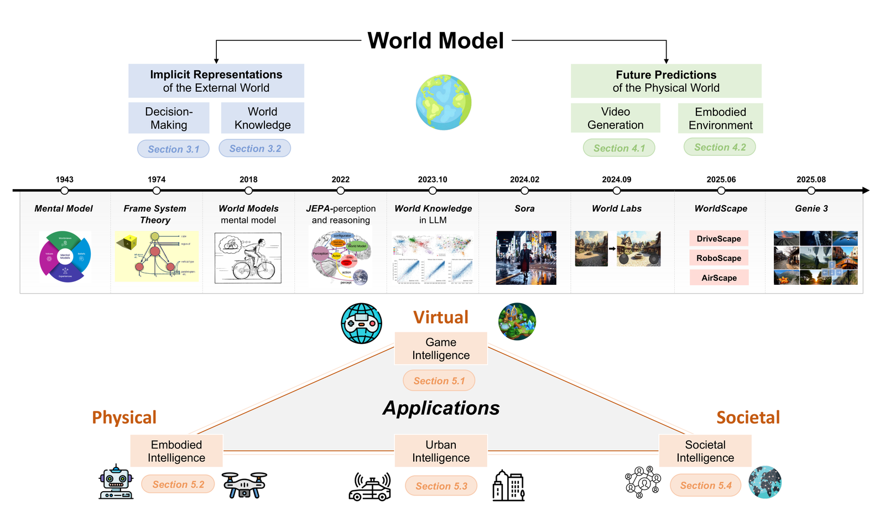
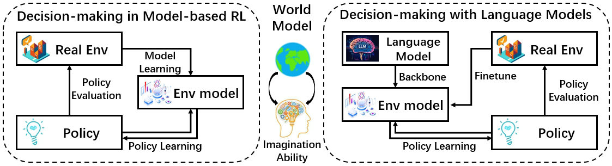
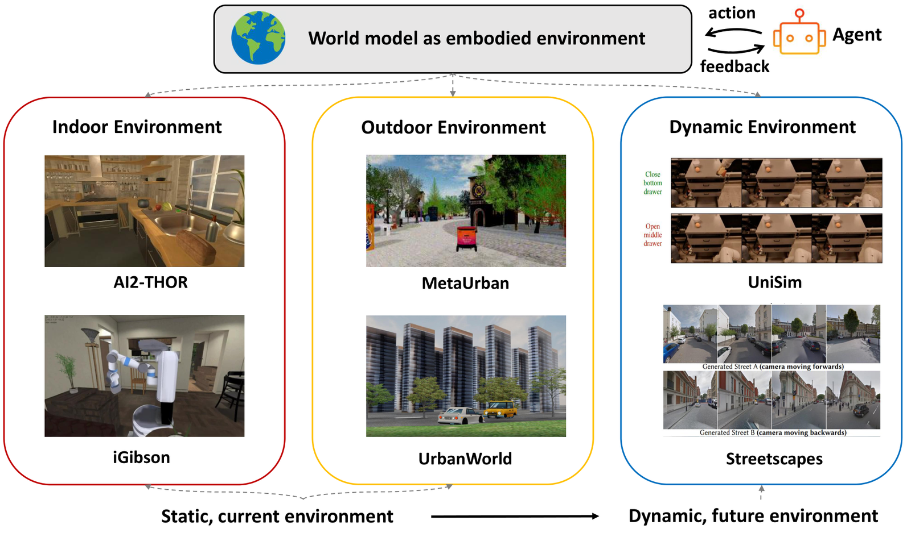
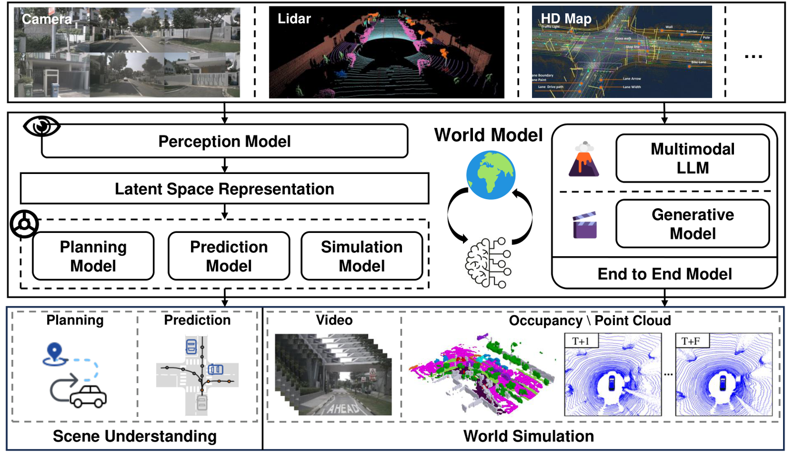

# Understanding World or Predicting Future? A Comprehensive Survey of World Models 论文解读

## 论文基本信息

| 字段 | 内容 |
| --- | --- |
| 论文 | Understanding World or Predicting Future? A Comprehensive Survey of World Models |
| 作者 | Jingtao Ding, Yunke Zhang, Yu Shang, Jie Feng, Yuheng Zhang, Zefang Zong, Yuan Yuan, Hongyuan Su, Nian Li, Jinghua Piao, Yucheng Deng, Nicholas Sukiennik, Chen Gao, Fengli Xu, Yong Li |
| 机构 | Tsinghua University |
| 发布时间 | 2024-11-21；arXiv v4 修订于 2025-12-10 |
| Venue | ACM Computing Surveys / arXiv |
| 论文链接 | https://arxiv.org/abs/2411.14499 |
| 代码链接 | https://github.com/tsinghua-fib-lab/World-Model |

## TL;DR

这是一篇 world model 综述，核心不是提出一个新模型，而是给这个快速膨胀的领域搭一个坐标系：world model 一方面是“理解当前世界”的内部表征，另一方面是“预测未来世界”的生成/模拟器。前者连接 model-based RL、LLM/MLLM 世界知识、决策规划；后者连接视频生成、交互式 3D/具身环境和面向智能体训练的模拟世界。

论文的主张很清楚：Sora、Genie、Dreamer、JEPA、LLM agents、自动驾驶模拟器、机器人 embodied environments、social simulacra 都可以被放进同一个框架里，但它们各自强调的能力不同。有些重在 latent representation，有些重在 future rollout，有些重在把模拟环境作为训练数据引擎、评估器或 agent brain。

这篇综述最值得带走的不是某个排行榜数字，而是一个阅读 world model 文献的 checklist：它到底在建内部表征，还是在预测未来？它是视觉/语言/动作/3D 哪些模态？它能否交互、长期一致、遵守物理规律、支持决策闭环？它服务的是游戏、自动驾驶、机器人、城市系统，还是社会模拟？

## 论文脑图

```markmap
# World Model Survey

## 问题

### world model 定义分裂

### Sora/视频生成是否等于 world model

### 不同应用对理解和预测能力要求不同

## 方法

### 两条主线

#### implicit representations

#### future predictions

### 三层组织

#### 技术源流

#### 能力分类

#### 应用域映射

## 实验

### 综述型论文

### 无统一实验主表

### 通过 6 figures 和 8 tables 汇总代表工作

## 结论

### world model 同时需要理解世界和预测未来

### 视频生成只是其中一条路径

### 具身和社会维度会成为下一阶段关键应用

## 局限

### 物理规则与反事实模拟仍弱

### benchmark 尚未统一

### simulation efficiency 和安全治理不足

## 复现要点

### 跟踪代码仓库论文列表

### 按能力而非模型名整理文献

### 区分 cloud environment 与 edge-side agent brain
```

## 研究背景与问题定义

world model 这个词在 2024 年之后被 Sora、GPT-4、视频生成、具身智能和智能体讨论一起推到了台前，但不同社区对它的期待并不一致。强化学习里，world model 往往是环境转移模型，用来在模型内部想象未来状态；LeCun 的 JEPA 语境里，它更像用自监督学习得到的 latent predictive model；LLM 社区会讨论模型是否学到了地理、物理、社会、人类意图等世界知识；视频生成社区则把“能生成遵守物理与时序一致的视频”视为模拟世界的证据。

这篇综述的切入点是把争论拆成两个功能：

- **Understanding the world**：构建内部表示，理解外部世界机制，为决策、规划、推理服务。
- **Predicting the future**：生成或模拟未来状态，让模型能 rollout、交互、评估策略或产生训练数据。



原文 Figure 2 给出了整篇综述的总框架：world model 被组织成“外部世界的隐式表征”和“物理世界的未来预测”两条技术线，再映射到游戏智能、具身智能、城市智能和社会智能等应用域。这个图也是二刷论文时最应该先看的导航图。

## 核心方法

### 1. 第一条主线：外部世界的隐式表征

隐式表征这条线关注的是：模型如何把现实环境压缩成可用于决策的内部状态。论文把它分成两个入口。

第一个入口是 **decision-making / model-based RL**。在 MDP 视角中，world model 主要是 transition dynamics $M$ 和 reward function $R$，核心任务是学习 $M_\theta(s, a)$ 来预测下一状态，随后用于 planning、policy optimization 或 imagined rollouts。Dreamer 系列、MBRL、RSSM 等都在这条脉络中。

第二个入口是 **world knowledge learned by models**。LLM/MLLM 可能从文本、图像、视频和多模态数据中学习到空间、时间、物理、地理、人类社会和 Theory of Mind 相关知识。论文用 Table 1 汇总了 common sense、global physical world、local physical world、human society 等类别下的代表工作和 benchmark。



原文 Figure 3 展示了 world model 在决策中的两种使用方式：一种是经典 model-based RL 的环境模型，另一种是把 LLM/MLLM 作为更通用的世界知识与规划模块。这个图支撑了论文的关键判断：world model 不只是视频生成，也可以是 latent dynamics、语言世界知识和可组合的规划模块。

### 2. 第二条主线：物理世界的未来预测

未来预测这条线关注的是：模型能不能生成一个可持续演化、可交互、具备物理与时空一致性的未来世界。论文把这里分成两类。

第一类是 **world model as video generation**。Sora、OpenSora、CogVideoX、Wan、Cosmos、Genie 等模型把文本、图像、动作或历史观测映射成未来视频。论文强调，视频 world model 需要比传统视频生成更强的四种能力：长期预测、多模态整合、交互性、跨环境泛化。Table 2 进一步把代表模型整理到 long-term、multimodal、interactive、consistency、diverse environments 等类别。

第二类是 **world model as embodied environment**。这类模型不只生成视频，而是构造能供智能体行动、观察和反馈的环境。论文将 embodied environment 分成 indoor、outdoor、dynamic 三类：AI2-THOR、Habitat、iGibson、ProcTHOR 等偏静态/结构化环境；UrbanWorld、MetaUrban 等扩展到城市和户外；UniSim、Pandora、Aether、Roboscape、Deepverse 等则走向 action-conditioned dynamic environments。



原文 Figure 5 说明了 embodied environment 的演化方向：从构建静态当前环境，逐步走向能够预测动态未来环境。对机器人和 embodied agent 来说，这个转变很关键，因为模型不再只是“场景库”，而是可以作为可交互的训练与评估环境。

### 3. 应用域映射：世界模型到底服务谁？

论文把应用分成四大块：

- **Game intelligence**：游戏是 world model 的理想试验场，因为规则明确、反馈清晰、交互频繁。GameNGen、GameGen-X、Matrix-Game、WHAM、GameFactory 等工作强调实时交互、状态一致性和跨环境泛化。
- **Embodied intelligence / robotics**：world model 可用于学习内部表征、预测未来观测、合成机器人数据、评估 policy，甚至通过 imagined future 指导行动。
- **Urban intelligence**：自动驾驶、城市物流和城市分析需要感知当前交通/地理状态，并预测车辆、行人、天气、道路和城市动态。
- **Societal intelligence**：LLM agents 和 social simulacra 可以把社会系统作为显式世界模型，也可以让 agent 通过记忆、信念和反思形成隐式世界模型。



原文 Figure 6 以自动驾驶为例展示 world model 的落地方式：一边是感知、预测、规划、控制中的 latent scene understanding，另一边是可以生成未来驾驶场景的 simulator。它很好地说明了论文的二分法如何映射到具体应用。

### 4. 功能视角：云端环境 vs 端侧大脑

论文在 §5.5 中给出一个很实用的功能划分：

- **Cloud-based environments**：通常表现为大规模视频/环境生成系统，可作为数据引擎、RL 环境、policy evaluator，适合训练和评估。
- **Edge-side agent brains**：不一定生成像素级视频，而是在 latent space 中压缩世界状态，支持实时 planning、MPC 或行动选择，适合部署在 agent 侧。

这个划分很有工程意义：不是所有 world model 都要成为 Sora，也不是所有智能体都需要端侧视频生成。很多时候，低维 latent dynamics 或可验证的状态预测更适合控制闭环。

## 实验设置与主要结果

这是一篇综述，不是提出新算法的实验论文，因此没有统一的数据集、metric 或主结果表。它的“证据”主要来自系统分类、代表工作汇总和 open problems 归纳。原文说明这是 ACM CSUR 原论文的 extended version，共 49 页、6 张图、8 张表。

论文中最重要的汇总表包括：

| 表格 | 内容 | 解读价值 |
| --- | --- | --- |
| Table 1 | 模型学到的 world knowledge：常识、全球物理世界、局部物理世界、人类社会 | 说明 LLM/MLLM 的世界知识不只是语言常识，还包括地理、空间、物理和社会推理 |
| Table 2 | 视频生成 world model：长期、多模态、交互、一致性、多环境 | 给视频生成文献建立能力分类，而不是只看画质 |
| embodied environment table | indoor/outdoor/dynamic environments 的模态、场景数、physics、3D assets | 说明从静态环境到动态生成环境的演化 |
| autonomous driving tables | 场景理解、world simulation、城市物流和城市分析代表工作 | 映射 world model 在城市系统中的理解/预测双线 |
| benchmark table | WorldSimBench、WorldScore、VBench、Physics-IQ、T2VPhysBench、EWMBench 等 | 指出评估正在从“像不像视频”转向物理、空间、动作一致性和 embodied decision making |

主要结论可以压缩成四点：

1. world model 领域正在从单一 model-based RL 概念扩展到 LLM、MLLM、视频生成、3D/4D 环境和 agent simulation。
2. “理解世界”和“预测未来”不是互斥路线，而是互补能力；真正可用的 world model 往往需要两者结合。
3. 视频生成模型是当前最显眼的 world model 路径，但它们仍经常缺少反事实推理、物理规则和闭环交互能力。
4. 下一阶段的关键瓶颈在 benchmark、物理规则、社会维度、具身 sim-to-real、效率和安全治理。

## 当前工作 vs Related Work

| 方法 | 核心思路 | 主要假设 | 证据/表现 | 局限或代价 |
| --- | --- | --- | --- | --- |
| 本文综述 | 用“理解世界 / 预测未来”统一 world model 文献，并映射到游戏、机器人、城市、社会应用 | world model 的核心功能可以由 internal representation 与 future prediction 两轴覆盖 | 49 页 extended survey，6 figures，8 tables，覆盖 LLM、视频、具身、社会模拟等方向 | 综述跨度很大，单个子领域细节不可避免较压缩 |
| Ha & Schmidhuber / Dreamer / MBRL | 学习环境 dynamics，在 latent space 中 rollout 未来并优化 policy | agent 可通过内部环境模型降低真实交互成本 | Dreamer 系列展示了 learned latent dynamics 在控制任务中的可扩展性 | 多数设置仍依赖较明确的状态/动作/reward 定义 |
| JEPA / V-JEPA | 在 latent embedding 中预测缺失或未来表征，而不是像素重建 | 抽象表征比像素预测更接近智能体可用的世界模型 | V-JEPA/V-JEPA2 展示 video self-supervised representation 的潜力 | 与真实决策闭环、长期 counterfactual simulation 的连接仍需加强 |
| Sora/Cosmos/Genie 类视频 world model | 直接生成未来视觉序列，强调时空一致性和可交互模拟 | 高质量视频生成可能隐式学到世界动力学 | 长视频、交互式游戏/导航、物理视频生成快速进展 | 仍可能只是 case-based generalization，物理定律和因果反事实不稳 |
| LLM social simulacra | 用 LLM agents 构造社会系统模拟或让 agent 形成内部信念 | 语言模型能提供人类行为、制度和社会互动先验 | Generative Agents、AgentSociety、EconAgent 等展示了 stylized facts 和预测潜力 | 可验证性、可扩展评估、偏见与安全问题明显 |

## 启发、局限与可复现要点

- 启发：读 world model 论文时先问“它在理解世界，还是预测未来”，能快速厘清它的贡献位置。
- 启发：world model 不必等同于视频生成；对端侧智能体来说，latent dynamics 和可验证状态预测可能比高保真视频更重要。
- 启发：未来的评估要从 visual realism 转向 action-level consistency、physical law adherence、spatial reasoning、policy lift 和 sim-to-real gap。
- 启发：社会模拟是 world model 的重要扩展，它要求模型理解人类行为、制度、群体互动和长期社会动态。
- 局限：论文是大综述，覆盖面广但没有统一 benchmark 实验，也没有对所有代表方法做横向复现实验。
- 局限：物理规则和反事实模拟仍是开放问题，当前视频模型在重力、流体、热学、磁学等方面仍会出现系统性失败。
- 局限：社会维度的评估还大量依赖主观判断，缺少可扩展、可复现的 realism metrics。
- 局限：高质量 world simulation 的推理成本很高，自动回归 Transformer 和大规模视频扩散都面临 FPS、延迟和算力瓶颈。
- 复现要点：从作者维护的 GitHub 列表跟踪代表工作和代码，不要只依赖论文 PDF 的静态引用。
- 复现要点：如果要做领域综述复现，建议按“能力维度 x 应用域”建表，而不是按模型发布时间线简单罗列。
- 可能的下一步实验：选取几个视频 world model，在统一 action-conditioned benchmark 上同时测 controllability、physics、temporal consistency 和 downstream policy improvement。

## 再读一遍路线

1. 先看 Abstract、Introduction 和 Figure 2，抓住“理解世界 vs 预测未来”的主框架。
2. 接着读 §2.3 Categorization，确认作者如何定义 implicit representation、future prediction 和 applications。
3. 再读 §3，重点看 MBRL 与 LLM world knowledge 如何被纳入同一条 implicit representation 线。
4. 然后读 §4 和 Table 2，看视频生成如何从长视频、多模态、一致性走向交互式世界模拟。
5. 最后读 §6 Open Problems：物理规则、社会维度、benchmark、具身 sim-to-real、效率、安全，是这篇综述最有启发的下一步清单。

# 深度 Q&A

**Q1：这篇综述为什么把标题写成 “Understanding World or Predicting Future”？**

A：因为 world model 社区对定义有两种主要理解：一种强调模型是否形成了对外部世界机制的内部表征，另一种强调模型是否能模拟未来状态。论文认为这两者都属于 world model 的核心功能，不应该只押注其中一边。

**Q2：Sora 这样的文生视频模型算 world model 吗？**

A：论文的态度是“可以看作预测未来方向的重要候选，但还不能简单等同于完整 world model”。原因是视频真实感不等于因果、反事实、动作条件和物理规则都可靠。Sora 类模型展示了强模拟潜力，但仍需要更严格的物理和交互评估。

**Q3：world model 和 model-based RL 里的 dynamics model 是什么关系？**

A：model-based RL 是 world model 的经典源头之一，其中 world model 通常就是环境 transition dynamics，有时还包括 reward function。新一代 world model 把这个概念扩展到语言、视觉、视频、3D 环境和社会系统，但“可在内部模拟未来以辅助决策”的思想是一脉相承的。

**Q4：为什么论文把 LLM world knowledge 放进 world model？**

A：因为 LLM 可能学到空间、时间、地理、社会、人类行为和常识知识，这些知识能支持规划、推理和任务决策。它不是像视频模型那样显式生成未来画面，但可以作为 agent 的内部世界表征或规划模块。

**Q5：视频 world model 需要哪些能力才不只是普通视频生成？**

A：论文强调长期预测、多模态整合、交互性和多环境泛化。也就是说，它不仅要生成好看的短片，还要能在更长时间内保持一致，接受动作/语言/图像等条件，响应用户或 agent 的行动，并迁移到不同场景。

**Q6：具身环境方向的核心变化是什么？**

A：从静态、预先构建的 indoor/outdoor simulator，走向 action-conditioned、first-person、动态生成的 embodied environments。后者更接近“agent 做一个动作，世界给出合理反馈”的训练环境。

**Q7：这篇综述对机器人有什么实际启发？**

A：机器人 world model 可以扮演三种角色：生成合成数据增强 VLA/VLN 训练；想象未来观测以指导 action generation；作为 policy evaluator 或 simulation environment 来降低真实机器人试错成本。

**Q8：world model 最难评估的地方在哪里？**

A：没有单一 canonical task。视频生成看画质不够，机器人要看 policy lift 和 sim-to-real，自动驾驶要看动作一致性和安全 corner cases，社会模拟还要看行为真实性和群体统计规律。论文因此强调 benchmark 标准化是开放问题。

**Q9：物理规则为什么仍然是瓶颈？**

A：纯数据驱动视频模型可以在分布内生成很逼真的样本，但面对组合式、反事实或 OOD 物理场景时容易失败。论文提到未来方向包括显式物理模拟、physics-informed diffusion、PDE residual loss、物理 benchmark 等。

**Q10：cloud-based environment 和 edge-side agent brain 有什么区别？**

A：cloud-based environment 更像大规模生成式模拟器，用来产数据、训练、评估和 RL 交互；edge-side agent brain 更像部署在智能体侧的轻量内部模型，用 latent state 做实时预测、规划和控制，不一定生成高保真视频。

**Q11：这篇综述有什么不足？**

A：它覆盖面极大，但代价是单个子方向深度有限；同时作为综述，它没有亲自跑统一横评。对读者来说，它更适合作为领域地图和文献索引，而不是某个 benchmark 的最终结论。

**Q12：如果我要基于这篇综述选题，最值得切入哪里？**

A：三个方向很有价值：第一，面向 action-conditioned world simulation 的统一评估；第二，把物理约束和生成模型结合，提升反事实泛化；第三，让 social simulacra 从“看起来像人”走向可验证、可校准、可用于政策或复杂系统分析。
